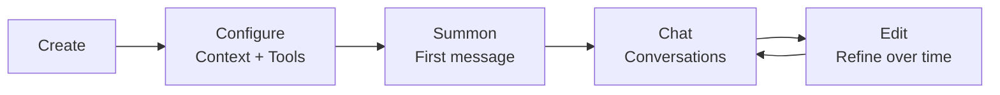

# Agents Explained

> What agents are, how they work, and the difference between open and predefined.

## Overview

An agent in GoClaw is an LLM with a personality, tools, and memory. You configure what it knows (context files), what it can do (tools), and which LLM powers it (provider + model). Each agent runs in its own loop, handling conversations independently.

## What Makes an Agent

An agent combines four things:

1. **LLM** — The language model that generates responses (provider + model)
2. **Context Files** — Markdown files that define personality, knowledge, and rules
3. **Tools** — What the agent can do (search, code, browse, etc.)
4. **Memory** — Long-term facts persisted across conversations

## Agent Types

GoClaw has two agent types with different sharing models:

### Open Agents

Each user gets their own complete set of context files. The agent adapts to each user individually.

- All 7 context files are per-user
- Users can fully customize the agent's personality
- Best for: personal assistants, individual workflows

### Predefined Agents

The agent has a shared personality, but each user gets personal profile files. Think of it as a company chatbot that knows who you are.

- 4 context files shared across all users (AGENTS, SOUL, IDENTITY, TOOLS)
- 2 files per-user (USER.md, BOOTSTRAP.md)
- Best for: team bots, shared assistants, customer support

| Aspect | Open | Predefined |
|--------|------|-----------|
| Agent-level files | None | 4 (shared: AGENTS, SOUL, IDENTITY, TOOLS) |
| Per-user files | All 6 | 2 (USER.md, BOOTSTRAP.md) |
| Customization | Full per-user | Shared personality, personal profile |
| Use case | Personal assistant | Team/company bot |

## Context Files

Every agent has up to 6 context files that shape its behavior:

| File | Purpose | Example Content |
|------|---------|----------------|
| `AGENTS.md` | Operating instructions, memory rules, safety guidelines | "Always save important facts to memory..." |
| `SOUL.md` | Personality and tone | "You are a friendly coding mentor..." |
| `IDENTITY.md` | Name, avatar, greeting | "Name: CodeBot, Emoji: 🤖" |
| `TOOLS.md` | Tool usage guidance | "Use web_search for current events..." |
| `USER.md` | User profile, timezone, preferences | "Timezone: Asia/Saigon, Language: Vietnamese" |
| `BOOTSTRAP.md` | First-run ritual (auto-deleted after completion) | "Introduce yourself and learn about the user..." |

Plus `MEMORY.md` — persistent notes auto-updated by the agent (routed to the memory system).

Context files are Markdown. Edit them via the web dashboard, API, or let the agent modify them during conversations.

### Truncation

Large context files are automatically truncated to fit the LLM's context window:
- Per-file limit: 20,000 characters
- Total budget: 24,000 characters
- Truncation keeps 70% from the start and 20% from the end

## Agent Lifecycle



1. **Create** — Define agent name, provider, model via dashboard or API
2. **Configure** — Write context files, set tool permissions
3. **Summon** — Send the first message; bootstrap files are seeded automatically
4. **Chat** — Ongoing conversations with memory and tool use
5. **Edit** — Refine context files, adjust settings as needed

## Agent Access Control

When a user tries to access an agent, GoClaw checks in order:

1. Does the agent exist?
2. Is it the default agent? → Allow (everyone can use the default)
3. Is the user the owner? → Allow with owner role
4. Does the user have a share record? → Allow with shared role

Roles: `admin` (full control), `operator` (use + edit), `viewer` (read-only)

## Agent Routing

The `bindings` config maps channels to agents:

```jsonc
{
  "bindings": {
    "telegram": {
      "direct": {
        "386246614": "code-helper"  // This user talks to code-helper
      },
      "group": {
        "-100123456": "team-bot"    // This group uses team-bot
      }
    }
  }
}
```

Unbound conversations go to the default agent.

## Common Issues

| Problem | Solution |
|---------|----------|
| Agent ignores instructions | Check SOUL.md and RULES.md content; ensure context files aren't truncated |
| "Agent not found" error | Verify agent exists in dashboard; check `agents.list` in config |
| Context files not updating | For predefined agents, shared files update for all users; per-user files need per-user edits |

## What's Next

- [Sessions and History](sessions-and-history.md) — How conversations persist
- [Tools Overview](tools-overview.md) — What tools agents can use
- [Memory System](memory-system.md) — Long-term memory and search
