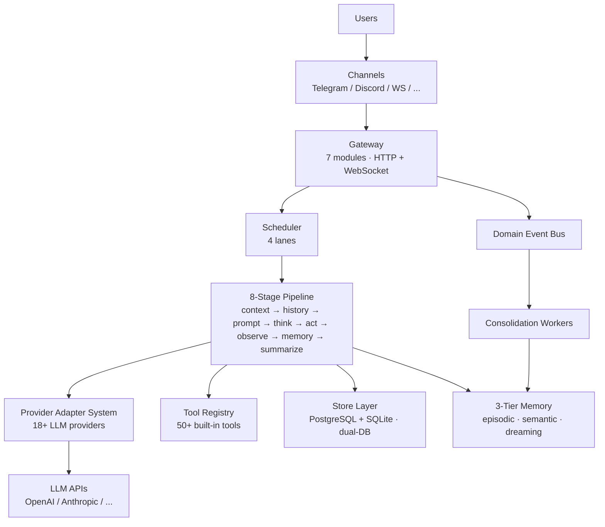

# How GoClaw Works

> The architecture behind GoClaw's AI agent gateway.

## Overview

GoClaw is a gateway that sits between your users and LLM providers. It manages the full lifecycle of AI conversations: receiving messages, routing them to agents, calling LLMs, executing tools, and delivering responses back through messaging channels.

## Architecture Diagram



## The 8-Stage Pipeline

In v3, every agent run goes through a **pluggable 8-stage pipeline**. The legacy two-mode gate has been removed — all agents always use this pipeline.

```
Setup (runs once)
└─ ContextStage — inject agent/user/workspace context

Iteration loop (up to 20 × per turn)
├─ ThinkStage   — build system prompt, filter tools, call LLM
├─ PruneStage   — soft/hard trim context, trigger memory flush if needed
├─ ToolStage    — execute tool calls (parallel where possible)
├─ ObserveStage — process tool results, append to message buffer
└─ CheckpointStage — track iterations, check exit conditions

Finalize (runs once, survives cancellation)
└─ FinalizeStage — sanitize output, flush messages, update session metadata
```

### Stage Details

| Stage | Phase | What it does |
|-------|-------|-------------|
| **ContextStage** | Setup | Injects agent/user/workspace context; resolves per-user files |
| **ThinkStage** | Iteration | Builds system prompt (15+ sections), calls LLM, emits streaming chunks |
| **PruneStage** | Iteration | Trims context when ≥ 30% full (soft) or ≥ 50% full (hard); triggers memory flush |
| **ToolStage** | Iteration | Executes tool calls — parallel goroutines for multiple calls |
| **ObserveStage** | Iteration | Processes tool results; handles `NO_REPLY` silent completion |
| **CheckpointStage** | Iteration | Increments counter; breaks loop on max-iter or context cancellation |
| **FinalizeStage** | Finalize | Runs 7-step output sanitization; atomically flushes messages; updates session metadata |

## Message Flow

Here's what happens when a user sends a message:

1. **Receive** — Message arrives via channel (Telegram, WebSocket, etc.)
2. **Validate** — Input guard checks for injection patterns; message truncated at 32 KB
3. **Route** — Scheduler assigns the message to an agent based on channel bindings
4. **Queue** — Per-session queue manages concurrency (1 per DM session by default; up to 3 for groups)
5. **Build Context** — ContextStage injects identity, workspace, per-user files
6. **Pipeline Loop** — 8-stage pipeline runs up to 20 iterations per turn
7. **Sanitize** — FinalizeStage cleans output (removes thinking tags, garbled XML, duplicates)
8. **Deliver** — Response sent back through the originating channel

## Scheduler Lanes

GoClaw uses a lane-based scheduler to manage concurrency:

| Lane | Concurrency | Purpose |
|------|:-----------:|---------|
| `main` | 30 | Channel messages and WebSocket requests |
| `subagent` | 50 | Spawned subagent tasks |
| `team` | 100 | Agent-to-agent delegation |
| `cron` | 30 | Scheduled cron jobs |

Each lane has its own semaphore. This prevents cron jobs from starving user messages, and keeps delegation from overwhelming the system.

> Concurrency limits are configurable via env vars: `GOCLAW_LANE_MAIN`, `GOCLAW_LANE_SUBAGENT`, `GOCLAW_LANE_TEAM`, `GOCLAW_LANE_CRON`.

## Components

| Component | What It Does |
|-----------|-------------|
| **Gateway** | HTTP + WebSocket server; decomposed into 7 modules (deps, http_wiring, events, lifecycle, tools_wiring, methods, router) |
| **Domain Event Bus** | Typed event publishing with worker pool, dedup, and retry — drives consolidation workers |
| **Provider Adapter System** | Manages 18+ LLM providers; Anthropic native, OpenAI-compatible, ACP (JSON-RPC 2.0 stdio — Claude Code, Codex, Gemini CLI) |
| **Hooks Dispatcher** | Wired into `PipelineDeps.HookDispatcher`; 7 lifecycle events (sync/async), SSRF-hardened HTTP + Command handlers, audit logging, circuit breaker |
| **Audio / TTS Manager** | `internal/audio/` unified manager: ElevenLabs (streaming), OpenAI, Edge, MiniMax TTS providers; voice LRU cache (1 000 tenants, 1 h TTL); per-agent voice/model via `other_config` JSONB |
| **Tool Registry** | 50+ built-in tools with policy-based access control (extensible via MCP and custom tools) |
| **Store Layer** | Dual-DB: PostgreSQL (`pgx/v5`) for production + SQLite (`modernc.org/sqlite`) for desktop; shared base/ dialect |
| **3-Tier Memory** | Episodic (recent facts) → Semantic (abstracted summaries) → Dreaming (novel synthesis); driven by consolidation workers |
| **Orchestration Module** | `BatchQueue[T]` generic for result aggregation; ChildResult capture; media conversion helpers |
| **Consolidation Workers** | Episodic, semantic, dreaming, dedup workers consume events from DomainEventBus |
| **Channel Managers** | Telegram, Discord, WhatsApp (native via Baileys bridge), Zalo, Feishu adapters |
| **Scheduler** | 4-lane concurrency with per-session queues |

## v3 System Overview

GoClaw v3 ships five new systems — each has its own dedicated page:

| System | What it adds |
|--------|-------------|
| [Knowledge Vault](/knowledge-vault) | Wikilinks semantic mesh, BM25 + vector hybrid search, L0 auto-injection into prompts |
| [3-Tier Memory](../core-concepts/memory-system.md) | Episodic → Semantic → Dreaming consolidation pipeline driven by DomainEventBus |
| [Agent Evolution](/agent-evolution) | Tracks tool/retrieval patterns; auto-suggests and applies prompt/tool adaptations |
| [Mode Prompt System](/model-steering) | Switchable prompt modes (PromptFull vs PromptMinimal) with per-agent overrides |
| [Multi-Tenant v3](/multi-tenancy) | Compound user ID scoping across all 22+ store interfaces; vault grants; skill grants |

## Common Issues

| Problem | Solution |
|---------|----------|
| Agent not responding | Check scheduler lane concurrency; verify provider API key |
| Slow responses | Large context window + many tools = slower LLM calls; reduce tool count or context |
| Tool calls failing | Check `tools.exec_approval` level; review deny patterns for shell commands |

## What's Next

- [Agents Explained](/agents-explained) — Deep dive into agent types and context files
- [Tools Overview](/tools-overview) — The full tool catalog
- [Sessions and History](../core-concepts/sessions-and-history.md) — How conversations persist

<!-- goclaw-source: 050aafc9 | updated: 2026-04-17 -->
