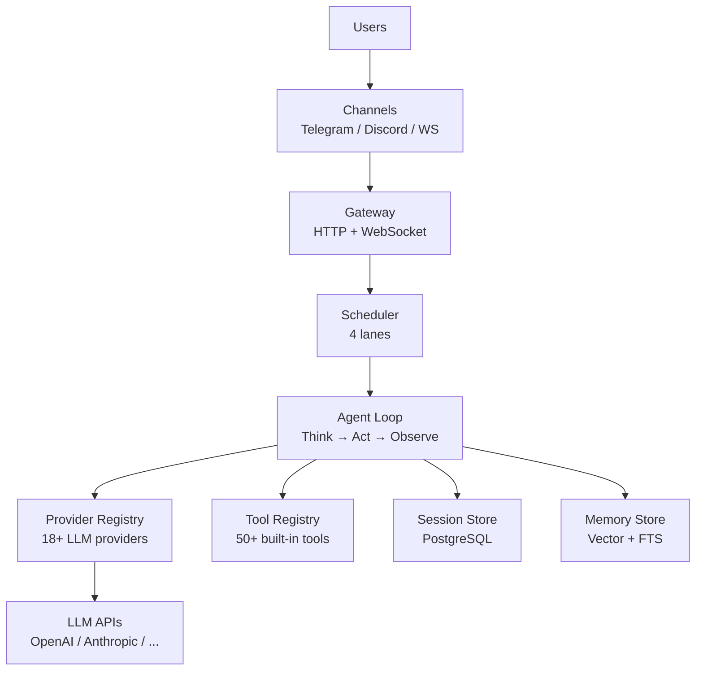
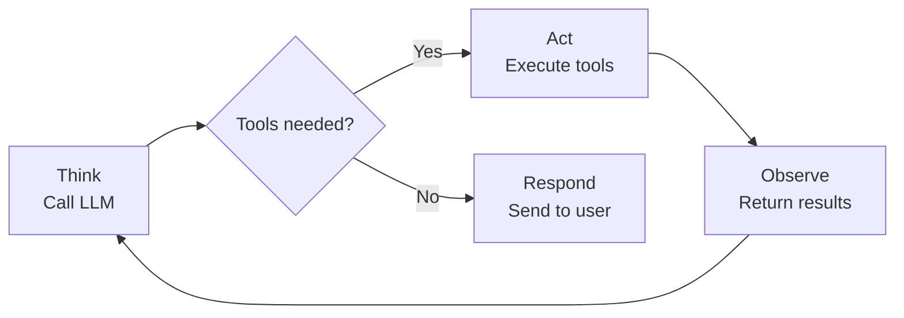

# How GoClaw Works

> The architecture behind GoClaw's AI agent gateway.

## Overview

GoClaw is a gateway that sits between your users and LLM providers. It manages the full lifecycle of AI conversations: receiving messages, routing them to agents, calling LLMs, executing tools, and delivering responses back through messaging channels.

## Architecture Diagram

## The Agent Loop

Every conversation turn goes through the **Think → Act → Observe** cycle:

### 1. Think

The agent assembles a system prompt (20+ sections including identity, tools, memory, context files) and sends the conversation to an LLM provider. The LLM decides what to do next.

### 2. Act

If the LLM wants to use a tool (search the web, read a file, run code), GoClaw executes it. Multiple tool calls run in parallel when possible.

### 3. Observe

The tool results go back to the LLM. It can call more tools or generate a final response. This loop repeats up to 20 iterations per turn.

GoClaw detects tool loop patterns: a **warning** is raised after 3 identical consecutive calls, and the loop is **force-stopped** after 5 identical no-progress calls. Note: `exec`/`bash` tools and MCP bridge tools (`mcp_*` prefix) are treated as **neutral** — they neither reset nor increment the read-only streak, since their side effects are ambiguous.

## Message Flow

Here's what happens when a user sends a message:

1. **Receive** — Message arrives via channel (Telegram, WebSocket, etc.)
2. **Validate** — Input guard checks for injection patterns; message truncated at 32KB
3. **Route** — Scheduler assigns the message to an agent based on channel bindings
4. **Queue** — Per-session queue manages concurrency (1 per session, serial processing by default)
5. **Build Context** — System prompt assembled: identity + tools + memory + history
6. **LLM Loop** — Think → Act → Observe cycle (max 20 iterations)
7. **Sanitize** — Response cleaned (remove thinking tags, garbled XML, duplicates)
8. **Deliver** — Response sent back through the originating channel

## Scheduler Lanes

GoClaw uses a lane-based scheduler to manage concurrency:

| Lane | Concurrency | Purpose |
|------|:-----------:|---------|
| `main` | 30 | Channel messages and WebSocket requests |
| `subagent` | 50 | Spawned subagent tasks |
| `team` | 100 | Agent-to-agent delegation |
| `cron` | 30 | Scheduled cron jobs |

Each lane has its own semaphore. This prevents cron jobs from starving user messages, and keeps delegation from overwhelming the system.

> Concurrency limits are configurable via env vars: `GOCLAW_LANE_MAIN`, `GOCLAW_LANE_SUBAGENT`, `GOCLAW_LANE_TEAM`, `GOCLAW_LANE_CRON`.

## Components

| Component | What It Does |
|-----------|-------------|
| **Gateway** | HTTP + WebSocket server on port 18790 |
| **Provider Registry** | Manages 18+ LLM provider connections and credentials |
| **Tool Registry** | 50+ built-in tools with policy-based access control (extensible via MCP and custom tools) |
| **Session Store** | Write-behind cache + PostgreSQL persistence |
| **Memory Store** | Hybrid search with pgvector + tsvector |
| **Channel Managers** | Telegram, Discord, WhatsApp, Zalo, Feishu adapters |
| **Scheduler** | 4-lane concurrency with per-session queues |
| **Bootstrap** | Template system for context files (SOUL, IDENTITY, TOOLS, etc.) |

## Common Issues

| Problem | Solution |
|---------|----------|
| Agent not responding | Check scheduler lane concurrency; verify provider API key |
| Slow responses | Large context window + many tools = slower LLM calls; reduce tool count or context |
| Tool calls failing | Check `tools.exec_approval` level; review deny patterns for shell commands |

## What's Next

- [Agents Explained](#agents-explained) — Deep dive into agent types and context files
- [Tools Overview](#tools-overview) — The full tool catalog
- [Sessions and History](#sessions-and-history) — How conversations persist

<!-- goclaw-source: 9168e4b4 | updated: 2026-03-26 -->
