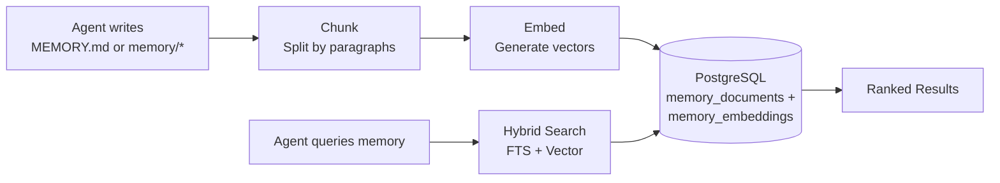

# Memory System

> How agents remember facts across conversations using hybrid search.

## Overview

GoClaw gives agents long-term memory that persists across sessions. When an agent learns something important — your name, preferences, project details — it stores that as a memory document. Later, the agent retrieves relevant memories using a combination of full-text search and vector similarity.

## How It Works

### Writing Memory

When an agent writes to `MEMORY.md` or files in `memory/*`, GoClaw:

1. **Intercepts** the file write (routed to DB, not filesystem)
2. **Chunks** the text by paragraph boundaries (max 1,000 chars per chunk)
3. **Embeds** each chunk using the configured embedding provider
4. **Stores** both the text (with tsvector for FTS) and the embedding vector

> Only `.md` files are chunked and embedded. Non-markdown files (e.g., `.json`, `.txt`) are stored in the DB but are **not indexed or searchable** via `memory_search`.

### Searching Memory

When an agent calls `memory_search`, GoClaw runs a hybrid search combining FTS and vector similarity:

| Method | Weight | How It Works |
|--------|:------:|-------------|
| Full-text search (FTS) | 0.3 | PostgreSQL `tsvector` + `plainto_tsquery('simple')` — good for exact terms |
| Vector similarity | 0.7 | `pgvector` cosine distance — good for semantic meaning |

**Weighted merge algorithm**: FTS scores are normalized to 0..1 range (vector scores are already 0..1), then combined as `(FTS × 0.3) + (vector × 0.7)`. When only one channel returns results, its scores are used directly (effective weight normalized to 1.0).

Results are then ranked:

1. Per-user boost: results scoped to the current user get a 1.2× multiplier
2. Deduplication: if both user-scoped and global results match, user copy wins
3. Final sort by weighted score

**Embedding cache**: The `embedding_cache` table is wired into the `IndexDocument` hot path. Repeated re-indexing of unchanged content reuses cached embeddings instead of calling the embedding provider, reducing latency and API cost.

**Fallback behavior**: if per-user search returns no results, GoClaw falls back to the global memory pool. This applies to both `MEMORY.md` and `memory/*.md` files.

### Knowledge Graph Search

`knowledge_graph_search` complements `memory_search` for relationship and entity queries. While `memory_search` retrieves factual text chunks, `knowledge_graph_search` traverses entity relationships — useful for questions like "what projects is Alice working on?" or "which tools does this agent use?"

## Memory vs Sessions

| Aspect | Memory | Sessions |
|--------|--------|----------|
| Lifespan | Permanent (until deleted) | Per-conversation |
| Content | Facts, preferences, knowledge | Message history |
| Search | Hybrid (FTS + vector) | Sequential access |
| Scope | Per-user per-agent | Per-session key |

Memory is for things worth remembering forever. Sessions are for conversation flow.

## Auto Memory Flush

During [auto-compaction](/sessions-and-history), GoClaw extracts important facts from the conversation and saves them to memory before summarizing the history.

- **Trigger**: >50 messages OR >85% context window (either condition triggers compaction)
- **Process**: Synchronous flush, max 5 iterations, 90-second timeout
- **What's saved**: Key facts, user preferences, decisions, action items
- **Order**: Memory flush runs **before** history compaction — facts are persisted first, then history is summarized and truncated

Memory flush only triggers as part of auto-compaction — not independently. The flush runs synchronously inside the compaction lock and appends extracted facts to `memory/YYYY-MM-DD.md`. This means agents gradually build up knowledge about each user without explicit "remember this" commands.

### Extractive Memory Fallback

If the LLM-based flush fails (timeout, provider error, bad output), GoClaw falls back to **extractive memory**: a keyword-based pass over the conversation that extracts key facts without an LLM call. This ensures memories are saved even when the LLM is unavailable, at the cost of lower quality extraction.

## Memory File Variants

GoClaw recognizes four memory file types:

| File | Role | Notes |
|---|---|---|
| `MEMORY.md` | Curated memory (Markdown) | Primary file; auto-included in system prompt |
| `memory.md` | Fallback for `MEMORY.md` | Checked if `MEMORY.md` is absent |
| `MEMORY.json` | Machine-readable index | Deprecated — no longer recommended |
| Inline (`memory/*.md`) | Date-stamped files from auto-flush | Indexed and searchable; e.g. `memory/2026-03-23.md` |

All `.md` variants are chunked, embedded, and searchable via `memory_search`. `MEMORY.json` is stored but not indexed.

## Requirements

Memory requires:

- **PostgreSQL 15+** with the `pgvector` extension
- An **embedding provider** configured (OpenAI, Anthropic, or compatible)
- `memory: true` in agent config (enabled by default)

Set `memory: false` in an agent's config to disable memory entirely for that agent — no reads, no writes, no auto-flush.

## Team Memory Sharing

When agents work as a [team](#agent-teams), team members can **read the leader's memory** as a fallback:

- **`memory_search`**: Searches the member's own memory first. If no results, automatically falls back to the leader's memory and merges results.
- **`memory_get`**: Reads from the member's own memory first. If the file isn't found, falls back to the leader's memory.
- **Writes are blocked**: Team members cannot save or modify memory files — only the team leader can write memory. Members attempting to write receive: *"memory is read-only for team members"*.

This allows knowledge sharing within a team without duplication. The leader accumulates shared knowledge, and all members benefit from it automatically.

## Common Issues

| Problem | Solution |
|---------|----------|
| Memory search returns nothing | Check that pgvector extension is installed; verify embedding provider is configured |
| Agent forgets things | Ensure `memory: true` in config; check if auto-compaction is running |
| Irrelevant memories surfacing | Memory accumulates over time; consider clearing old memories via the API |

## What's Next

- [Multi-Tenancy](/multi-tenancy) — Per-user memory isolation
- [Sessions and History](/sessions-and-history) — How conversation history works
- [Agents Explained](/agents-explained) — Agent types and context files

<!-- goclaw-source: 6551c2d1 | updated: 2026-03-27 -->
