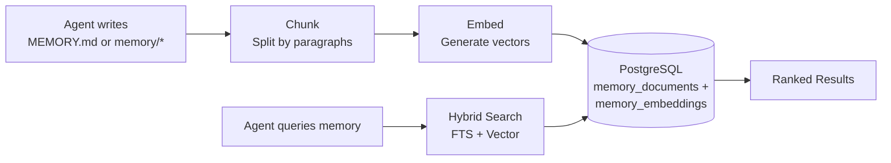

# Memory System

> How agents remember facts across conversations using hybrid search.

## Overview

GoClaw gives agents long-term memory that persists across sessions. When an agent learns something important — your name, preferences, project details — it stores that as a memory document. Later, the agent retrieves relevant memories using a combination of full-text search and vector similarity.

## How It Works

### Writing Memory

When an agent writes to `MEMORY.md` or files in `memory/*`, GoClaw:

1. **Intercepts** the file write (routed to DB, not filesystem)
2. **Chunks** the text by paragraph boundaries (max 1,000 chars per chunk)
3. **Embeds** each chunk using the configured embedding provider
4. **Stores** both the text (with tsvector for FTS) and the embedding vector

> Only `.md` files are chunked and embedded. Non-markdown files (e.g., `.json`, `.txt`) are stored in the DB but are **not indexed or searchable** via `memory_search`.

### Searching Memory

When an agent calls `memory_search`, GoClaw runs a hybrid search:

| Method | Weight | How It Works |
|--------|:------:|-------------|
| Full-text search (FTS) | 0.3 | PostgreSQL `tsvector` matching — good for exact terms |
| Vector similarity | 0.7 | `pgvector` cosine distance — good for semantic meaning |

Results are combined and scored:

1. FTS score × 0.3 + Vector score × 0.7
2. Per-user boost: results scoped to the current user get a 1.2× multiplier
3. Deduplication: if both user-scoped and global results match, user copy wins
4. Normalize: divide all scores by the highest score

**Fallback behavior**: if per-user search returns no results, GoClaw falls back to the global memory pool. This applies to both `MEMORY.md` and `memory/*.md` files.

### Knowledge Graph Search

`knowledge_graph_search` complements `memory_search` for relationship and entity queries. While `memory_search` retrieves factual text chunks, `knowledge_graph_search` traverses entity relationships — useful for questions like "what projects is Alice working on?" or "which tools does this agent use?"

## Memory vs Sessions

| Aspect | Memory | Sessions |
|--------|--------|----------|
| Lifespan | Permanent (until deleted) | Per-conversation |
| Content | Facts, preferences, knowledge | Message history |
| Search | Hybrid (FTS + vector) | Sequential access |
| Scope | Per-user per-agent | Per-session key |

Memory is for things worth remembering forever. Sessions are for conversation flow.

## Auto Memory Flush

During [auto-compaction](sessions-and-history.md), GoClaw extracts important facts from the conversation and saves them to memory before summarizing the history.

- **Trigger**: >50 messages OR >75% context window (either condition triggers compaction)
- **Process**: Synchronous flush, max 5 iterations, 90-second timeout
- **What's saved**: Key facts, user preferences, decisions, action items

Memory flush only triggers as part of auto-compaction — not independently. The flush runs synchronously inside the compaction lock and appends extracted facts to `memory/YYYY-MM-DD.md`.

This means agents gradually build up knowledge about each user without explicit "remember this" commands.

## MEMORY.md

Agents can also read/write `MEMORY.md` directly — a structured file of key facts. This file is:

- Automatically included in the system prompt
- Per-user for open agents, per-user for predefined agents
- Routed to the database (not the filesystem)

## Requirements

Memory requires:

- **PostgreSQL 15+** with the `pgvector` extension
- An **embedding provider** configured (OpenAI, Anthropic, or compatible)
- `memory: true` in agent config (enabled by default)

Set `memory: false` in an agent's config to disable memory entirely for that agent — no reads, no writes, no auto-flush.

## Common Issues

| Problem | Solution |
|---------|----------|
| Memory search returns nothing | Check that pgvector extension is installed; verify embedding provider is configured |
| Agent forgets things | Ensure `memory: true` in config; check if auto-compaction is running |
| Irrelevant memories surfacing | Memory accumulates over time; consider clearing old memories via the API |

## What's Next

- [Multi-Tenancy](multi-tenancy.md) — Per-user memory isolation
- [Sessions and History](sessions-and-history.md) — How conversation history works
- [Agents Explained](agents-explained.md) — Agent types and context files
