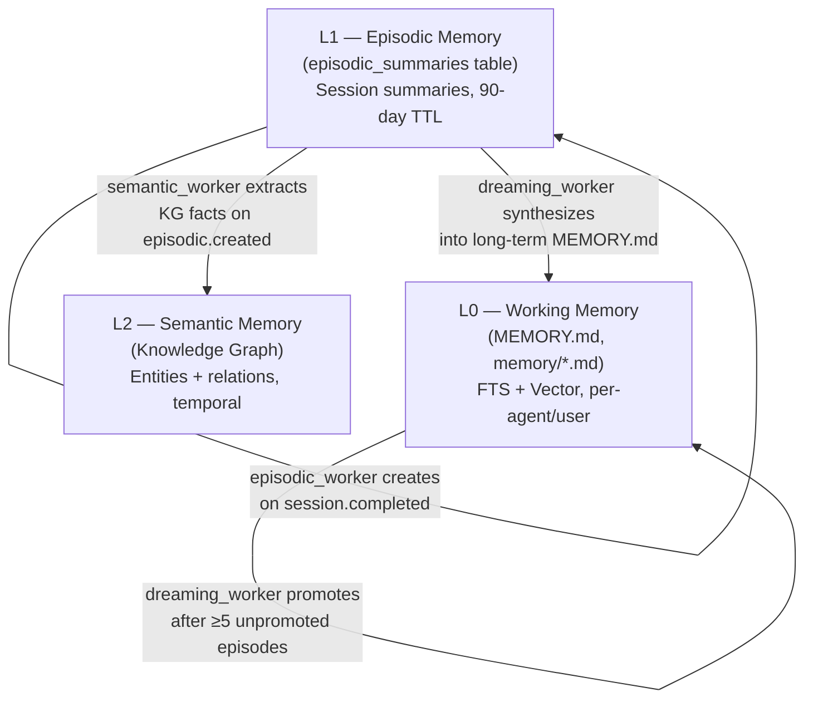
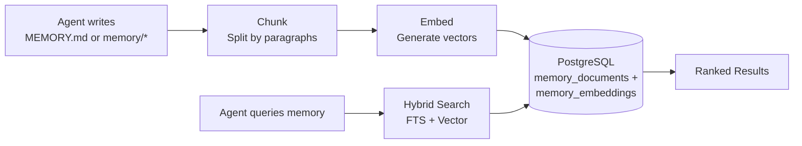
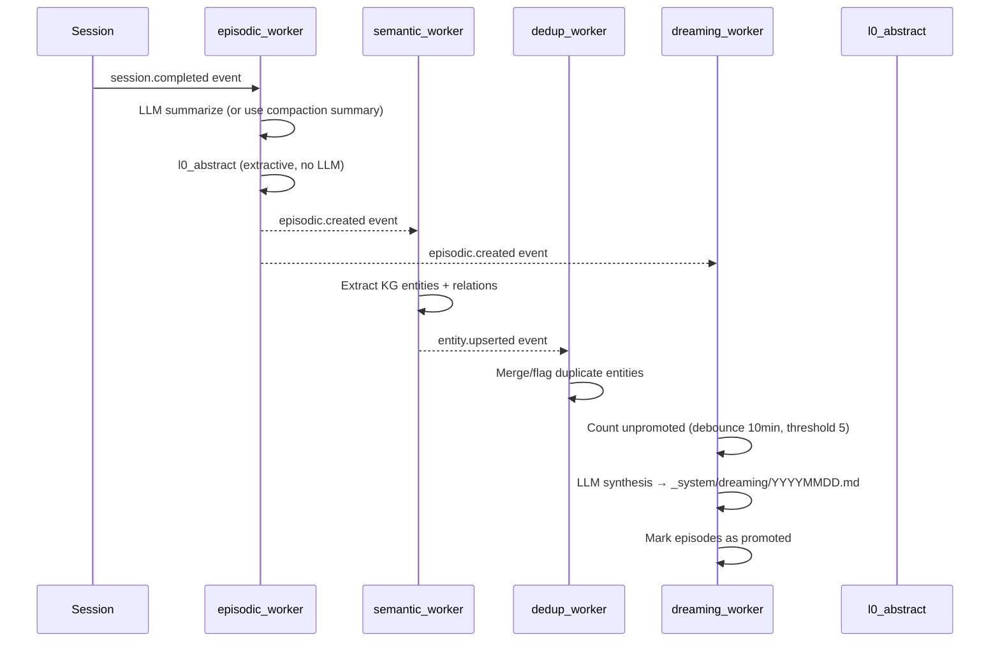

# Memory System

> How agents remember facts across conversations using a 3-tier architecture with automatic consolidation.

## Overview

GoClaw v3 gives agents long-term memory that persists across sessions. Memory is organized into three tiers — working memory, episodic memory, and semantic memory — each serving a distinct purpose in the recall lifecycle. A background consolidation pipeline automatically promotes memories across tiers without any agent action required.

## 3-Tier Memory Architecture

| Tier | Storage | Content | Lifespan | Search |
|------|---------|---------|---------|--------|
| **L0 Working** | `memory_documents` + `memory_embeddings` | Agent-curated facts, auto-flush notes, dreaming output | Permanent until deleted | FTS + vector hybrid |
| **L1 Episodic** | `episodic_summaries` | Session summaries, key topics, L0 abstracts | 90 days (configurable) | FTS + HNSW vector |
| **L2 Semantic** | Knowledge Graph tables | Entities, relations, temporal validity windows | Permanent | Graph traversal |

### Tier Boundaries and Promotion Rules

- **Session → L1**: When a session completes, `episodic_worker` summarizes it into an `episodic_summaries` row. Uses the compaction summary if available; otherwise calls the LLM with the session messages (30-second timeout, max 1,024 tokens).
- **L1 → L2**: After each episodic summary is created, `semantic_worker` extracts KG entities and relations from the summary text and ingests them into the knowledge graph with temporal validity (`valid_from` = now).
- **L1 → L0**: When ≥5 unpromoted episodic entries accumulate for an agent/user pair, `dreaming_worker` synthesizes them into a long-term Markdown document written to `_system/dreaming/YYYYMMDD-consolidated.md` and marks the episodes as promoted.

## How It Works

### Writing Memory (L0)

When an agent writes to `MEMORY.md` or files in `memory/*`, GoClaw:

1. **Intercepts** the file write (routed to DB, not filesystem)
2. **Chunks** the text by paragraph boundaries (max 1,000 chars per chunk)
3. **Embeds** each chunk using the configured embedding provider
4. **Stores** both the text (with tsvector for FTS) and the embedding vector

> Only `.md` files are chunked and embedded. Non-markdown files (e.g., `.json`, `.txt`) are stored in the DB but are **not indexed or searchable** via `memory_search`.

### Searching Memory

When an agent calls `memory_search`, GoClaw runs a hybrid search combining FTS and vector similarity:

| Method | Weight | How It Works |
|--------|:------:|-------------|
| Full-text search (FTS) | 0.3 | PostgreSQL `tsvector` + `plainto_tsquery('simple')` — good for exact terms |
| Vector similarity | 0.7 | `pgvector` cosine distance — good for semantic meaning |

**Weighted merge algorithm**: FTS scores are normalized to 0..1 range (vector scores are already 0..1), then combined as `(FTS × 0.3) + (vector × 0.7)`. When only one channel returns results, its scores are used directly (effective weight normalized to 1.0).

Results are then ranked:

1. Per-user boost: results scoped to the current user get a 1.2× multiplier
2. Deduplication: if both user-scoped and global results match, user copy wins
3. Final sort by weighted score

**Embedding cache**: The `embedding_cache` table is wired into the `IndexDocument` hot path. Repeated re-indexing of unchanged content reuses cached embeddings instead of calling the embedding provider, reducing latency and API cost.

**Fallback behavior**: if per-user search returns no results, GoClaw falls back to the global memory pool. This applies to both `MEMORY.md` and `memory/*.md` files.

### Knowledge Graph Search

`knowledge_graph_search` complements `memory_search` for relationship and entity queries. While `memory_search` retrieves factual text chunks, `knowledge_graph_search` traverses entity relationships — useful for questions like "what projects is Alice working on?" or "which tools does this agent use?"

## Consolidation Workers

The consolidation pipeline runs entirely in the background, event-driven via the internal event bus. Workers are registered once at startup via `consolidation.Register()` and subscribe to domain events.

### `episodic_worker`

**Trigger**: `session.completed` event
**Action**: Creates an `episodic_summaries` row for each completed session.

- Checks `source_id` (`sessionKey:compactionCount`) to prevent duplicate summaries.
- Uses the compaction summary if present; otherwise reads session messages and calls the LLM with a 30-second timeout.
- Generates an **L0 abstract** — a 1-sentence extractive summary (~200 runes) for fast context injection, with no LLM call.
- Extracts `key_topics` as capitalized proper noun phrases for FTS boosting.
- Sets `expires_at` to 90 days from creation (configurable via `episodic_ttl_days`).
- Publishes `episodic.created` for downstream workers.

### `semantic_worker`

**Trigger**: `episodic.created` event
**Action**: Extracts knowledge graph entities and relations from the episodic summary text.

- Calls the `EntityExtractor` (KG extraction, not a raw LLM call).
- Stamps extracted entities with `valid_from = now()` and scopes them to `agent_id` + `user_id`.
- Ingests into the KG store via `IngestExtraction`.
- Publishes `entity.upserted` for the dedup worker.
- Failures are non-fatal — extraction errors are logged as warnings and do not block the pipeline.

### `dedup_worker`

**Trigger**: `entity.upserted` event
**Action**: Detects and merges duplicate KG entities after each extraction batch.

- Calls `kgStore.DedupAfterExtraction` with the newly upserted entity IDs.
- Merges semantically equivalent entities and flags ambiguous ones.
- Terminal worker — no downstream events.
- Failures are non-fatal.

### `dreaming_worker`

**Trigger**: `episodic.created` event
**Action**: Consolidates unpromoted episodic summaries into long-term L0 memory.

- **Debounce**: skips if already ran within the last 10 minutes for the same agent/user pair.
- **Threshold**: requires ≥5 unpromoted episodic entries before running (configurable).
- Fetches up to 10 unpromoted entries and calls the LLM to synthesize long-term facts (max 4,096 tokens).
- Synthesis prompt extracts: user preferences, project facts, recurring patterns, key decisions.
- Writes output to `_system/dreaming/YYYYMMDD-consolidated.md` in L0 memory and indexes it for search.
- Marks all processed entries as `promoted_at = now()`.

### `l0_abstract`

Not a standalone worker — a utility called by `episodic_worker` to produce a brief L0 abstract from a full summary. Uses an extractive sentence-splitting approach (no LLM call, no latency). The abstract is stored in the `l0_abstract` column of `episodic_summaries` and used by the auto-injector.

**Periodic pruning**: A goroutine runs every 6 hours to delete episodic summaries past their `expires_at` date.

## Auto-Injector

The **auto-injector** automatically surfaces relevant memories into the agent's system prompt at the start of each turn, before the LLM call.

- **Interface**: `AutoInjector.Inject(ctx, InjectParams)` — called once per turn in the context build stage.
- **How it works**: Checks the user's message against the memory index. Returns a formatted section for the system prompt (empty string if nothing is relevant). Budget: max ~200 tokens of L0 abstracts.
- **Default parameters** (overridable per agent in `agents.settings` JSONB):

| Parameter | Default | Description |
|-----------|---------|-------------|
| `auto_inject_enabled` | `true` | Enable/disable auto-injection |
| `auto_inject_threshold` | `0.3` | Minimum relevance score (0–1) for a memory to be injected |
| `auto_inject_max_tokens` | `200` | Token budget for injected memory section |
| `episodic_ttl_days` | `90` | Days before episodic summaries expire |
| `consolidation_enabled` | `true` | Enable/disable consolidation pipeline |

The injector returns an `InjectResult` with observability fields: `MatchCount`, `Injected`, and `TopScore`.

## Trivial Filter

The **trivial filter** prevents low-value messages from triggering memory injection, reducing unnecessary database lookups.

`isTrivialMessage(msg)` returns `true` when the message contains fewer than 3 meaningful words after removing stopwords (greetings like "hi", "ok", "thanks", acknowledgments, single-word responses). Trivial messages skip the auto-injector entirely.

## Memory vs Sessions

| Aspect | Memory | Sessions |
|--------|--------|----------|
| Lifespan | Permanent (until deleted) | Per-conversation |
| Content | Facts, preferences, knowledge | Message history |
| Search | Hybrid (FTS + vector) | Sequential access |
| Scope | Per-user per-agent | Per-session key |

Memory is for things worth remembering forever. Sessions are for conversation flow.

## Auto Memory Flush

During [auto-compaction](/sessions-and-history), GoClaw extracts important facts from the conversation and saves them to memory before summarizing the history.

- **Trigger**: >50 messages OR >85% context window (either condition triggers compaction)
- **Process**: Synchronous flush, max 5 iterations, 90-second timeout
- **What's saved**: Key facts, user preferences, decisions, action items
- **Order**: Memory flush runs **before** history compaction — facts are persisted first, then history is summarized and truncated

Memory flush only triggers as part of auto-compaction — not independently. The flush runs synchronously inside the compaction lock and appends extracted facts to `memory/YYYY-MM-DD.md`. This means agents gradually build up knowledge about each user without explicit "remember this" commands.

### Extractive Memory Fallback

If the LLM-based flush fails (timeout, provider error, bad output), GoClaw falls back to **extractive memory**: a keyword-based pass over the conversation that extracts key facts without an LLM call. This ensures memories are saved even when the LLM is unavailable, at the cost of lower quality extraction.

## Memory File Variants

GoClaw recognizes four memory file types:

| File | Role | Notes |
|---|---|---|
| `MEMORY.md` | Curated memory (Markdown) | Primary file; auto-included in system prompt |
| `memory.md` | Fallback for `MEMORY.md` | Checked if `MEMORY.md` is absent |
| `MEMORY.json` | Machine-readable index | Deprecated — no longer recommended |
| Inline (`memory/*.md`) | Date-stamped files from auto-flush | Indexed and searchable; e.g. `memory/2026-03-23.md` |

All `.md` variants are chunked, embedded, and searchable via `memory_search`. `MEMORY.json` is stored but not indexed.

## Requirements

Memory requires:

- **PostgreSQL 15+** with the `pgvector` extension
- An **embedding provider** configured (OpenAI, Anthropic, or compatible)
- `memory: true` in agent config (enabled by default)

Set `memory: false` in an agent's config to disable memory entirely for that agent — no reads, no writes, no auto-flush.

## Team Memory Sharing

When agents work as a [team](#agent-teams), team members can **read the leader's memory** as a fallback:

- **`memory_search`**: Searches the member's own memory first. If no results, automatically falls back to the leader's memory and merges results.
- **`memory_get`**: Reads from the member's own memory first. If the file isn't found, falls back to the leader's memory.
- **Writes are blocked**: Team members cannot save or modify memory files — only the team leader can write memory. Members attempting to write receive: *"memory is read-only for team members"*.

This allows knowledge sharing within a team without duplication. The leader accumulates shared knowledge, and all members benefit from it automatically.

## Common Issues

| Problem | Solution |
|---------|----------|
| Memory search returns nothing | Check that pgvector extension is installed; verify embedding provider is configured |
| Agent forgets things | Ensure `memory: true` in config; check if auto-compaction is running |
| Irrelevant memories surfacing | Memory accumulates over time; consider clearing old memories via the API |
| Episodic summaries not created | Verify consolidation workers are registered at startup; check event bus is running |
| Dreaming worker never promotes | Check that ≥5 sessions have completed for the agent/user pair; review debounce logs |

## What's Next

- [Multi-Tenancy](/multi-tenancy) — Per-user memory isolation
- [Sessions and History](/sessions-and-history) — How conversation history works
- [Context Pruning](/context-pruning) — How pruning integrates with the consolidation pipeline
- [Agents Explained](/agents-explained) — Agent types and context files

<!-- goclaw-source: 050aafc9 | updated: 2026-04-09 -->
