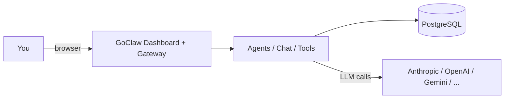
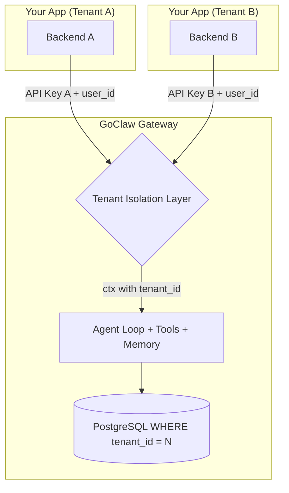
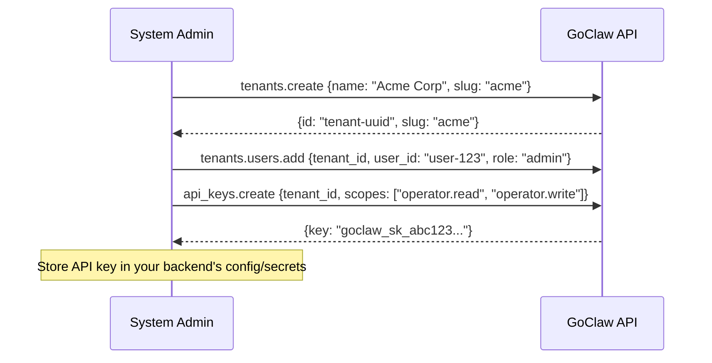

# Multi-Tenancy

> How GoClaw isolates data — from a single user to a full SaaS platform with many customers.

## Overview

GoClaw supports two deployment modes: **personal** (single-tenant, one user or small team) and **SaaS** (multi-tenant, many isolated customers). Both modes use the same binary — you choose the mode by how you configure and connect to GoClaw. In either mode, every piece of data is scoped so users never see each other's agents, sessions, or memory.

---

## Deployment Modes

### Personal Mode (Single-Tenant)

Use GoClaw as a standalone AI backend with its built-in web dashboard. No separate frontend or backend required.



**How it works:**
- Log in with the gateway token via the built-in web dashboard
- Create agents, configure LLM providers, chat — all from the dashboard
- Connect chat channels (Telegram, Discord, etc.) for messaging
- All data lives under the default "master" tenant — no tenant config needed

**Setup:**

```bash
# Build and onboard
go build -o goclaw . && ./goclaw onboard

# Start the gateway
source .env.local && ./goclaw

# Open dashboard at http://localhost:3777
# Log in with your gateway token + user ID "system"
```

**Identity propagation:** GoClaw doesn't authenticate users itself. Your app passes the user ID in the `X-GoClaw-User-Id` header — GoClaw scopes all data to that ID. Each user gets isolated sessions, memory, context files, and workspace:

```bash
curl -X POST http://localhost:3777/v1/chat/completions \
  -H "Authorization: Bearer YOUR_GATEWAY_TOKEN" \
  -H "X-GoClaw-User-Id: user-123" \
  -H "Content-Type: application/json" \
  -d '{"model": "agent:my-agent", "messages": [{"role": "user", "content": "Hello"}]}'
```

**When to use:** Personal AI assistant, small team, self-hosted tools, development and testing.

---

### SaaS Mode (Multi-Tenant)

Integrate GoClaw as the AI engine behind your SaaS application. Your app handles auth, billing, and UI. GoClaw handles AI. Each tenant is fully isolated — agents, sessions, memory, teams, LLM providers, MCP servers, and files.



**How it works:**
- Each tenant's backend connects using a **tenant-bound API key** — GoClaw auto-scopes all data
- The **Tenant Isolation Layer** resolves `tenant_id` from credentials and injects it into Go context
- Every SQL query enforces `WHERE tenant_id = $N` — fail-closed, no cross-tenant leakage

**When to use:** SaaS products with AI features, multi-client platforms, white-label AI solutions.

---

## Tenant Setup

Setting up a new tenant takes three steps: create the tenant, add users, then create an API key for your backend.



Each tenant gets isolated: agents, sessions, teams, memory, LLM providers, MCP servers, and skills. A tenant-bound API key automatically scopes every request — no extra headers needed beyond `X-GoClaw-User-Id`.

**Scaling up from personal mode:** When you need multiple isolated environments (clients, departments, projects), create additional tenants. Multi-tenant features activate automatically — no migration needed.

---

## Tenant Resolution

GoClaw determines the tenant from the credentials used to connect:

| Credential | Tenant Resolution | Use Case |
|------------|-------------------|----------|
| **Gateway token** + owner user ID | All tenants (cross-tenant) | System administration |
| **Gateway token** + non-owner user ID | User's tenant membership | Dashboard users |
| **API key** (tenant-bound) | Auto from key's `tenant_id` | Normal SaaS integration |
| **API key** (system-level) + `X-GoClaw-Tenant-Id` | Header value (UUID or slug) | Cross-tenant admin tools |
| **Browser pairing** | Paired tenant | Dashboard operators |
| **No credentials** | Master tenant | Dev / single-user mode |

**Owner IDs:** Configured via `GOCLAW_OWNER_IDS` (comma-separated). Only owners get cross-tenant access with the gateway token. Default: `system`.

**Recommended for SaaS:** Use tenant-bound API keys. The tenant is resolved automatically — your backend doesn't need to send a tenant header.

---

## HTTP API Headers

All HTTP endpoints accept these standard headers:

| Header | Required | Description |
|--------|:---:|-------------|
| `Authorization` | Yes | `Bearer <api-key-or-gateway-token>` |
| `X-GoClaw-User-Id` | Yes | Your app's user ID (max 255 chars). Scopes sessions and per-user data |
| `X-GoClaw-Tenant-Id` | No | Tenant UUID or slug. Only needed for system-level keys |
| `X-GoClaw-Agent-Id` | No | Target agent ID (alternative to `model` field) |
| `Accept-Language` | No | Locale for error messages: `en`, `vi`, `zh` |

### Chat (OpenAI-compatible)

```bash
curl -X POST https://goclaw.example.com/v1/chat/completions \
  -H "Authorization: Bearer goclaw_sk_abc123..." \
  -H "X-GoClaw-User-Id: user-456" \
  -H "Content-Type: application/json" \
  -d '{
    "model": "agent:my-agent",
    "messages": [{"role": "user", "content": "Hello"}]
  }'
```

The API key is bound to tenant "Acme Corp" — the response only includes data from that tenant.

### System admin (cross-tenant)

```bash
# List agents for a specific tenant (requires gateway token + owner user ID)
curl https://goclaw.example.com/v1/agents \
  -H "Authorization: Bearer $GATEWAY_TOKEN" \
  -H "X-GoClaw-Tenant-Id: acme" \
  -H "X-GoClaw-User-Id: system"
```

---

## Connection Types

All connections pass through the Tenant Isolation Layer before reaching the agent engine:

| Connection | Auth Method | Tenant Resolution | Isolation |
|------------|-------------|-------------------|-----------|
| **HTTP API** | `Bearer` token | Auto from API key's `tenant_id` | Per-request |
| **WebSocket** | Token on `connect` | Auto from API key's `tenant_id` | Per-session |
| **Chat Channels** | None (webhook/WS) | Baked into channel instance DB config | Per-instance |
| **Dashboard** | Gateway token or browser pairing | User's tenant membership | Per-session |

**Chat channels** (Telegram, Discord, Zalo, Slack, WhatsApp, Feishu) connect directly to GoClaw. Tenant isolation is baked into the channel instance at registration time — no API key needed per message.

---

## API Key Scopes

API keys use scopes to control access level:

| Scope | Role | Permissions |
|-------|------|-------------|
| `operator.admin` | admin | Full access — agents, config, API keys, tenants |
| `operator.read` | viewer | Read-only — list agents, sessions, configs |
| `operator.write` | operator | Read + write — chat, create sessions, manage agents |
| `operator.approvals` | operator | Approve/reject execution requests |
| `operator.provision` | operator | Create tenants and manage tenant users |
| `operator.pairing` | operator | Manage device pairing |

A key with `["operator.read", "operator.write"]` gets `operator` role. A key with `["operator.admin"]` gets `admin` role.

---

## Per-Tenant Overrides

Tenants can customize their environment without affecting other tenants:

| Feature | Scope | How |
|---------|-------|-----|
| **LLM Providers** | Per-tenant | Each tenant registers own API keys and models |
| **Builtin Tools** | Per-tenant | Enable/disable via `builtin_tool_tenant_configs` |
| **Skills** | Per-tenant | Enable/disable via `skill_tenant_configs` |
| **MCP Servers** | Per-tenant + per-user | Server-level shared, user-level credential overrides |

**MCP credential tiers:**
- **Server-level** (shared): configured in the MCP server form, used by all users in the tenant
- **User-level** (override): configured via "My Credentials" — per-user API keys merged at runtime (user wins on key collision)

When `require_user_credentials` is enabled on an MCP server, users without personal credentials cannot use that server.

---

## Security Model

| Concern | How GoClaw Handles It |
|---------|-----------------------|
| API key exposure | Keys stay in your backend — never sent to the browser |
| Cross-tenant data access | All SQL queries include `WHERE tenant_id = $N` (fail-closed) |
| Event leakage | Server-side 3-mode filter: unscoped admin, scoped admin, regular user |
| Missing tenant context | Fail-closed: returns error, never returns unfiltered data |
| API key storage | Keys hashed with SHA-256 at rest; only prefix shown in UI |
| Tenant impersonation | Tenant resolved from API key binding, not client headers |
| Privilege escalation | Role derived from key scopes, not client claims |
| Gateway token abuse | Only configured owner IDs get cross-tenant; others are tenant-scoped |
| Tenant access revocation | Proactive WS event + `TENANT_ACCESS_REVOKED` error forces immediate UI logout |
| File URL security | HMAC-signed file tokens (`?ft=`) — gateway token never appears in URLs |

---

## What Gets Isolated

In personal mode, every piece of data is scoped by `user_id`:

| Data | Table | Isolation |
|------|-------|-----------|
| Context files | `user_context_files` | Per-user per-agent |
| Agent profiles | `user_agent_profiles` | Per-user per-agent |
| Agent overrides | `user_agent_overrides` | Per-user provider/model |
| Sessions | `sessions` | Per-user per-agent per-channel |
| Memory | `memory_documents` | Per-user per-agent |
| Traces | `traces` | Per-user filterable |
| MCP grants | `mcp_user_grants` | Per-user MCP server access |

In SaaS mode, the above user-level isolation applies within each tenant, and **40+ tables** carry a `tenant_id` with NOT NULL constraint to enforce tenant boundaries. `api_keys.tenant_id` is nullable — NULL means a system-level cross-tenant key.

**Master tenant** (UUID `0193a5b0-7000-7000-8000-000000000001`): All legacy and default data. Single-tenant deployments use this exclusively.

---

## Environment Variables

| Variable | Default | Description |
|----------|---------|-------------|
| `GOCLAW_OWNER_IDS` | `system` | Comma-separated user IDs with cross-tenant access |
| `GOCLAW_LOG_LEVEL` | `info` | Log level: `debug`, `info`, `warn`, `error` |
| `GOCLAW_CONFIG` | `config.json5` | Path to gateway config file |

---

## Common Issues

| Problem | Solution |
|---------|----------|
| Users seeing each other's data | Verify `X-GoClaw-User-Id` is set correctly per request |
| No user isolation | Ensure you're sending the user ID header; without it, all requests share a session |
| Agent not accessible | Check `agent_shares` table; user needs an explicit share for non-default agents |
| Wrong tenant data returned | Use tenant-bound API keys — don't rely on the `X-GoClaw-Tenant-Id` header unless using a system-level key |
| Cross-tenant access denied | Check that the user ID is in `GOCLAW_OWNER_IDS` for admin operations |

---

## What's Next

- [How GoClaw Works](how-goclaw-works.md) — Architecture overview
- [Sessions and History](sessions-and-history.md) — Per-user session management
- [Agents Explained](agents-explained.md) — Agent types and access control
- [API Keys](../getting-started/api-keys.md) — Creating and managing API keys

<!-- goclaw-source: latest | updated: 2026-03-23 -->
