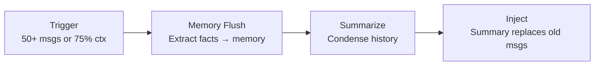

# Sessions and History

> How GoClaw tracks conversations and manages message history.

## Overview

A session is a conversation thread between a user and an agent on a specific channel. GoClaw stores message history in PostgreSQL, automatically compacts long conversations, and manages concurrency so agents don't trip over each other.

## Session Keys

Every session has a unique key that identifies the user, agent, channel, and chat type:

```
agent:{agentId}:{channel}:{kind}:{chatId}
```

| Type | Key Format | Example |
|------|-----------|---------|
| DM | `agent:default:telegram:direct:386246614` | Private chat |
| Group | `agent:default:telegram:group:-100123456` | Group chat |
| Topic | `agent:default:telegram:group:-100123456:topic:99` | Forum topic |
| Thread | `agent:default:telegram:direct:386246614:thread:5` | Threaded reply |
| Subagent | `agent:default:subagent:my-task` | Spawned subtask |
| Cron | `agent:default:cron:reminder-job` | Scheduled job |

This key format means the same user talking to the same agent on Telegram and Discord has two separate sessions with independent history.

## Message Storage

Messages are stored as JSONB in PostgreSQL with a write-behind cache:

1. **Read** — On first access, load from DB into memory cache
2. **Write** — Messages accumulate in memory during a turn
3. **Flush** — At the end of the turn, all messages write to DB atomically
4. **List** — Session listing always reads from DB (not cache)

This approach minimizes DB writes while ensuring durability.

## History Pipeline

Before sending history to the LLM, GoClaw runs a 3-stage pipeline:

### 1. Limit Turns

Keep only the last N user turns (and their associated assistant/tool messages). Older turns are dropped to stay within the context window.

### 2. Prune Context

Tool results can be large. GoClaw trims them in two passes:

| Condition | Action |
|-----------|--------|
| Token ratio ≥ 0.3 | **Soft trim**: Tool results >4,000 chars → keep first 1,500 + last 1,500 |
| Token ratio ≥ 0.5 | **Hard clear**: Replace entire tool result with `[Old tool result content cleared]` |

Protected messages (never pruned): last 3 assistant messages, first user message, system messages.

### 3. Sanitize

Repair broken tool_use/tool_result pairs that were split by truncation. The LLM expects matched pairs — orphaned tool calls cause errors.

## Auto-Compaction

Long conversations trigger automatic compaction:

**Triggers:**
- More than 50 messages in the session, OR
- History exceeds 75% of the agent's context window

**What happens:**



1. **Memory flush** (synchronous, 90s timeout) — Important facts are extracted and saved to the memory system
2. **Summarize** (background, 120s timeout) — Old messages are condensed into a summary
3. **Inject** — The summary replaces old messages; last 4 messages are kept verbatim

A per-session lock prevents concurrent compaction. If a second compaction triggers while one is running, it's skipped.

## Concurrency

| Chat Type | Max Concurrent | Notes |
|-----------|:-----------:|-------|
| DM | 1 | Single-threaded — messages queue up |
| Group | 3 | Parallel responses to different users |

When history exceeds 60% of the context window, group concurrency drops to 1 (adaptive throttle).

### Queue Modes

| Mode | Behavior |
|------|----------|
| `queue` | FIFO — messages processed in order |
| `followup` | New message merges with the queued one |
| `interrupt` | Cancel current task, process new message |

Queue capacity is 10 by default. When full, the oldest message is dropped.

### User Controls

- `/stop` — Cancel the oldest running task
- `/stopall` — Cancel all tasks and drain the queue

## Common Issues

| Problem | Solution |
|---------|----------|
| Agent "forgot" earlier messages | History was compacted; check memory for extracted facts |
| Slow responses in groups | Reduce group concurrency or context window size |
| Duplicate responses | Check queue mode; `queue` mode prevents this |

## What's Next

- [Memory System](memory-system.md) — How long-term memory works
- [Tools Overview](tools-overview.md) — Available tools for agents
- [Multi-Tenancy](multi-tenancy.md) — Per-user session isolation
