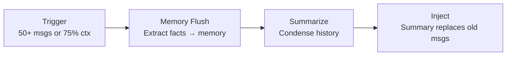

# Sessions and History

> How GoClaw tracks conversations and manages message history.

## Overview

A session is a conversation thread between a user and an agent on a specific channel. GoClaw stores message history in PostgreSQL, automatically compacts long conversations, and manages concurrency so agents don't trip over each other.

## Session Keys

Every session has a unique key that identifies the user, agent, channel, and chat type:

```
agent:{agentId}:{channel}:{kind}:{chatId}
```

| Type | Key Format | Example |
|------|-----------|---------|
| DM | `agent:default:telegram:direct:386246614` | Private chat |
| Group | `agent:default:telegram:group:-100123456` | Group chat |
| Topic | `agent:default:telegram:group:-100123456:topic:99` | Forum topic |
| Thread | `agent:default:telegram:direct:386246614:thread:5` | Threaded reply |
| Subagent | `agent:default:subagent:my-task` | Spawned subtask |
| Cron | `agent:default:cron:reminder-job` | Scheduled job |

This key format means the same user talking to the same agent on Telegram and Discord has two separate sessions with independent history.

> **Session Metadata:** Each session tracks additional fields alongside the key: `label` (display name), `channel`, `model`, `provider`, `spawned_by` (parent session ID for subagents), `spawn_depth`, `input_tokens`, `output_tokens`, `compaction_count`, and `context_window`. These fields are queryable for analytics and debugging purposes.

## Message Storage

Messages are stored as JSONB in PostgreSQL with a write-behind cache:

1. **Read** — On first access, load from DB into memory cache
2. **Write** — Messages accumulate in memory during a turn
3. **Flush** — At the end of the turn, all messages write to DB atomically
4. **List** — Session listing always reads from DB (not cache)

This approach minimizes DB writes while ensuring durability.

## History Pipeline

Before sending history to the LLM, GoClaw runs a 3-stage pipeline:

### 1. Limit Turns

Keep only the last N user turns (and their associated assistant/tool messages). Older turns are dropped to stay within the context window.

### 2. Prune Context

Tool results can be large. GoClaw trims them in two passes:

| Condition | Action |
|-----------|--------|
| Token ratio ≥ 0.3 | **Soft trim**: Tool results exceeding 4,000 chars → keep first 1,500 + last 1,500 |
| Token ratio ≥ 0.5 | **Hard clear**: Replace entire tool result with `[Old tool result content cleared]` |

Protected messages (never pruned): last 3 assistant messages. System message(s) and the first user message form a stable prefix that is never pruned.

### 3. Sanitize

Repair broken tool_use/tool_result pairs that were split by truncation. The LLM expects matched pairs — orphaned tool calls cause errors.

## V3 Pipeline Architecture

In v3 (enabled via `pipeline_enabled` feature flag), the agent loop is restructured into an **8-stage pipeline** that replaces the v2 monolithic `runLoop()`. The session flow maps to these stages:

| Stage | What happens |
|-------|-------------|
| **ContextStage** (once) | Inject context values, resolve per-user workspace, ensure per-user files |
| **ThinkStage** | Build system prompt, run history pipeline, filter tools (PolicyEngine), call LLM |
| **PruneStage** | Estimate token ratio; soft trim at ≥30%, hard clear at ≥50%; trigger memory flush if compaction threshold hit |
| **ToolStage** | Execute tool calls — single tool sequential, multiple tools parallel with result sorting |
| **ObserveStage** | Process tool results, handle `NO_REPLY`, append assistant message |
| **CheckpointStage** | Increment iteration counter; break on max iterations or cancellation |
| **FinalizeStage** (once) | Sanitize output, flush messages atomically, update session metadata, emit run event |

**Memory consolidation in v3**: The PruneStage triggers memory flush **synchronously during the iteration loop** (not only at end-of-session). This means long-running turns extract episodic facts before history is pruned, rather than waiting for the post-turn compaction phase. The same 75% context window threshold applies.

Both v2 and v3 expose identical external behavior; the pipeline difference is internal architecture.

## Auto-Compaction

Long conversations trigger automatic compaction:

**Triggers:**
- More than 50 messages in the session, OR
- History exceeds 75% of the agent's context window

**What happens:**



1. **Memory flush** (synchronous, 90s timeout) — Important facts are extracted and saved to the memory system
2. **Summarize** (background, 120s timeout) — Old messages are condensed into a summary
3. **Inject** — The summary replaces old messages; at least 4 messages (or 30% of total, whichever is greater) are kept verbatim

A per-session lock prevents concurrent compaction. If a second compaction triggers while one is running, it's skipped.

### Mid-Loop Compaction

GoClaw may also compact history **during a long agent turn** if the context exceeds the threshold mid-loop. The same 75% summarization logic applies. This is transparent to the agent — it continues running with the compacted history injected.

## Concurrency

| Chat Type | Max Concurrent | Notes |
|-----------|:-----------:|-------|
| DM | 1 | Single-threaded — messages queue up |
| Group | 1 (configurable) | Serial by default; can be increased via `ScheduleOpts.MaxConcurrent` |

Group sessions may reduce concurrency when context usage is high.

> **Configuring concurrency:** Both DM and Group default to serial processing (`MaxConcurrent: 1`). Higher values (e.g. 3) can be set for team members or agent links via `ScheduleOpts.MaxConcurrent`.

### Queue Modes

| Mode | Behavior |
|------|----------|
| `queue` | FIFO — messages processed in order |
| `followup` | New message merges with the queued one |
| `interrupt` | Cancel current task, process new message |

Queue capacity is 10 by default. When full, the oldest message is dropped (drop policy: `old`). The default debounce window is 800ms — rapid messages within this window are merged before processing.

### User Controls

- `/stop` — Cancel the oldest running task
- `/stopall` — Cancel all tasks and drain the queue

## Common Issues

| Problem | Solution |
|---------|----------|
| Agent "forgot" earlier messages | History was compacted; check memory for extracted facts |
| Slow responses in groups | Reduce group concurrency or context window size |
| Duplicate responses | Check queue mode; `queue` mode prevents this |

## What's Next

- [Memory System](../core-concepts/memory-system.md) — How long-term memory works
- [Tools Overview](/tools-overview) — Available tools for agents
- [Multi-Tenancy](/multi-tenancy) — Per-user session isolation

<!-- goclaw-source: 050aafc9 | updated: 2026-04-09 -->
