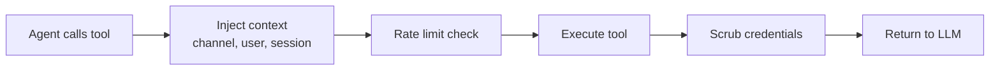

# Tools Overview

> The 33+ built-in tools agents can use, organized by category.

## Overview

Tools are how agents interact with the world beyond generating text. An agent can search the web, read files, run code, query memory, delegate to other agents, and more. GoClaw includes 33+ built-in tools (extensible via MCP and custom tools per agent) across 13 categories.

## Tool Categories

| Category | Tools | What They Do |
|----------|-------|-------------|
| **Filesystem** | read_file, write_file, edit, list_files | Read, write, and edit files in the agent workspace |
| **Runtime** | exec | Run shell commands |
| **Web** | web_search, web_fetch | Search the web (Brave/DuckDuckGo) and fetch pages |
| **Memory** | memory_search, memory_get, knowledge_graph_search | Query long-term memory (hybrid vector + FTS search) and knowledge graph |
| **Sessions** | sessions_list, sessions_history, sessions_send, session_status | Manage conversation sessions |
| **Delegation** | handoff, delegate_search, evaluate_loop | Delegate tasks to other agents |
| **Subagents** | spawn | Spawn subtasks as subagents |
| **Teams** | team_tasks, team_message | Collaborate with agent teams via task boards |
| **UI** | browser | Browse websites |
| **Automation** | cron | Schedule recurring jobs |
| **Messaging** | message | Send messages |
| **Media** | read_image, create_image, read_document, read_audio, read_video, create_video, create_audio, tts | Read and generate images, documents, audio, video, and text-to-speech |
| **Skills** | use_skill, skill_search, publish_skill | Discover, invoke, and publish skills |

> Additional tools like `mcp_tool_search` and channel-specific tools are registered dynamically.

## Tool Execution Flow

When an agent calls a tool:



1. **Context injection** — Channel, chat ID, user ID, and sandbox key are injected
2. **Rate limit** — Per-session rate limiter prevents abuse
3. **Execute** — The tool runs and produces output
4. **Scrub** — Credentials and sensitive data are removed from output
5. **Return** — Clean result goes back to the LLM for the next iteration

## Tool Profiles

Profiles control which tools an agent can access:

| Profile | Available Tools |
|---------|----------------|
| `full` | All tools |
| `coding` | Filesystem, runtime, sessions, memory, web, images, skills |
| `messaging` | Messaging, web, sessions, images, skills |
| `minimal` | session_status only |

Set the profile in agent config:

```jsonc
{
  "agents": {
    "defaults": {
      "tools_profile": "full"
    },
    "list": {
      "readonly-bot": {
        "tools_profile": "messaging"
      }
    }
  }
}
```

## Policy Engine

Beyond profiles, a 7-step policy engine gives fine-grained control:

1. Global profile (base set)
2. Provider-specific profile override
3. Global allow list (intersection)
4. Provider-specific allow override
5. Per-agent allow list
6. Per-agent per-provider allow
7. Group-level allow

After allow lists, **deny lists** remove tools, then **alsoAllow** adds them back (union).

### Example: Restrict an Agent

```jsonc
{
  "agents": {
    "list": {
      "safe-bot": {
        "tools_profile": "full",
        "tools_deny": ["exec", "write_file"],
        "tools_also_allow": ["read_file"]
      }
    }
  }
}
```

## Filesystem Interceptors

Two special interceptors route file operations to the database:

### Context File Interceptor

When an agent reads/writes context files (SOUL.md, IDENTITY.md, AGENTS.md, USER.md, USER_PREDEFINED.md, BOOTSTRAP.md), the operation is routed to the `user_context_files` table instead of the filesystem. TOOLS.md is explicitly excluded from routing. This enables per-user customization and multi-tenant isolation.

### Memory Interceptor

Writes to `MEMORY.md` or `memory/*` are routed to the `memory_documents` table, automatically chunked and embedded for search.

## Shell Safety

The `exec` tool enforces 15 deny groups — all enabled by default:

| Group | Blocked Patterns |
|-------|-----------------|
| `destructive_ops` | `rm -rf`, `del /f`, `mkfs`, `dd`, `shutdown`, fork bombs |
| `data_exfiltration` | `curl\|sh`, `wget\|sh`, DNS exfil, `/dev/tcp/`, curl POST/PUT, localhost access |
| `reverse_shell` | `nc`/`ncat`/`netcat`, `socat`, `openssl s_client`, `telnet`, python/perl/ruby/node sockets, `mkfifo` |
| `code_injection` | `eval $`, `base64 -d\|sh` |
| `privilege_escalation` | `sudo`, `su -`, `nsenter`, `unshare`, `mount`, `capsh`/`setcap` |
| `dangerous_paths` | `chmod` on `/`, `chown` on `/`, `chmod +x` on `/tmp` `/var/tmp` `/dev/shm` |
| `env_injection` | `LD_PRELOAD`, `DYLD_INSERT_LIBRARIES`, `LD_LIBRARY_PATH`, `GIT_EXTERNAL_DIFF`, `BASH_ENV` |
| `container_escape` | `docker.sock`, `/proc/sys/`, `/sys/` |
| `crypto_mining` | `xmrig`, `cpuminer`, `stratum+tcp://` |
| `filter_bypass` | `sed /e`, `sort --compress-program`, `git --upload-pack`, `rg --pre=`, `man --html=` |
| `network_recon` | `nmap`/`masscan`/`zmap`, `ssh/scp@`, `chisel`/`ngrok`/`cloudflared` tunneling |
| `package_install` | `pip install`, `npm install`, `apk add`, `yarn add`, `pnpm add` |
| `persistence` | `crontab`, writes to `.bashrc`/`.profile`/`.zshrc` |
| `process_control` | `kill -9`, `killall`, `pkill` |
| `env_dump` | `env`, `printenv`, `/proc/*/environ`, `echo $GOCLAW_*` secrets |

### Per-Agent Override

Admins can disable specific groups per agent:

```jsonc
{
  "agents": {
    "list": {
      "dev-bot": {
        "shell_deny_groups": {
          "package_install": false,
          "process_control": false
        }
      }
    }
  }
}
```

The `tools.exec_approval` setting adds an additional approval layer (`full`, `light`, or `none`).

## Custom Tools & MCP

Beyond built-in tools, you can extend agents with:

- **Custom Tools** — Define tools via the dashboard or API with input schemas and handlers
- **MCP Servers** — Connect Model Context Protocol servers for dynamic tool registration

See [Custom Tools](#custom-tools) and [MCP Integration](#mcp-integration) for details.

## Common Issues

| Problem | Solution |
|---------|----------|
| Agent can't use a tool | Check tools_profile and deny lists; verify tool exists for the profile |
| Shell command blocked | Review deny patterns; adjust `exec_approval` level |
| Tool results too large | GoClaw auto-trims results >4,000 chars; consider more specific queries |

## What's Next

- [Memory System](#memory-system) — How long-term memory and search work
- [Multi-Tenancy](#multi-tenancy) — Per-user tool access and isolation
- [Custom Tools](#custom-tools) — Build your own tools

<!-- goclaw-source: 120fc2d | updated: 2026-03-18 -->
