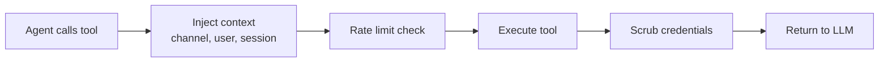

# Tools Overview

> The 50+ built-in tools agents can use, organized by category.

## Overview

Tools are how agents interact with the world beyond generating text. An agent can search the web, read files, run code, query memory, collaborate via agent teams, and more. GoClaw includes 50+ built-in tools (extensible via MCP and custom tools per agent) across 14 categories.

## Tool Categories

| Category | Tools | What They Do |
|----------|-------|-------------|
| **Filesystem** (`group:fs`) | read_file, write_file, edit, list_files, search, glob | Read, write, edit, and search files in the agent workspace |
| **Runtime** (`group:runtime`) | exec, credentialed_exec | Run shell commands; execute CLI tools with injected credentials |
| **Web** (`group:web`) | web_search, web_fetch | Search the web (Brave/DuckDuckGo) and fetch pages |
| **Memory** (`group:memory`) | memory_search, memory_get | Query long-term memory (hybrid vector + FTS search) |
| **Knowledge** (`group:knowledge`) | knowledge_graph_search, skill_search | Search knowledge graph entities and relationships; discover skills |
| **Sessions** (`group:sessions`) | sessions_list, sessions_history, sessions_send, session_status, spawn | Manage conversation sessions; spawn subagents |
| **Teams** (`group:teams`) | team_tasks, team_message | Collaborate with agent teams via shared task board and mailbox |
| **Automation** (`group:automation`) | cron, datetime | Schedule recurring jobs; get current date/time |
| **Messaging** (`group:messaging`) | message, create_forum_topic | Send messages; create Telegram forum topics |
| **Media Generation** (`group:media_gen`) | create_image, create_audio, create_video, tts | Generate images, audio, video, and text-to-speech |
| **Browser** | browser | Navigate web pages, take screenshots, interact with elements |
| **Media Reading** (`group:media_read`) | read_image, read_audio, read_document, read_video | Analyze images, transcribe audio, extract documents, analyze video |
| **Skills** (`group:skills`) | use_skill, publish_skill | Invoke and publish skills |
| **Workspace** | workspace_dir | Resolve workspace directory for team/user context |
| **AI** | openai_compat_call | Call OpenAI-compatible endpoints with custom request formats |

> Additional tools like `mcp_tool_search` and channel-specific tools are registered dynamically. Tool groups can be referenced with `group:` prefix in allow/deny lists (e.g., `group:fs`).

> **Delegation note**: The `delegate` tool has been removed. Delegation is now handled exclusively via agent teams: leads create tasks on the shared board (`team_tasks`) and delegate to member agents via `spawn`. See [Agent Teams](#agent-teams) for the current model.

## Tool Execution Flow

When an agent calls a tool:



1. **Context injection** — Channel, chat ID, user ID, and sandbox key are injected
2. **Rate limit** — Per-session rate limiter prevents abuse
3. **Execute** — The tool runs and produces output
4. **Scrub** — Credentials and sensitive data are removed from output
5. **Return** — Clean result goes back to the LLM for the next iteration

## Tool Profiles

Profiles control which tools an agent can access:

| Profile | Available Tools |
|---------|----------------|
| `full` | All registered tools (no restriction) |
| `coding` | `group:fs`, `group:runtime`, `group:sessions`, `group:memory`, `group:web`, `group:knowledge`, `group:media_gen`, `group:media_read`, `group:skills` |
| `messaging` | `group:messaging`, `group:web`, `group:sessions`, `group:media_read`, `skill_search` |
| `minimal` | `session_status` only |

Set the profile in agent config:

```jsonc
{
  "agents": {
    "defaults": {
      "tools_profile": "full"
    },
    "list": {
      "readonly-bot": {
        "tools_profile": "messaging"
      }
    }
  }
}
```

## Tool Aliases

GoClaw registers aliases so agents can reference tools by alternative names. This enables compatibility with Claude Code skills and legacy tool names:

| Alias | Maps to |
|-------|---------|
| `Read` | `read_file` |
| `Write` | `write_file` |
| `Edit` | `edit` |
| `Bash` | `exec` |
| `WebFetch` | `web_fetch` |
| `WebSearch` | `web_search` |
| `edit_file` | `edit` |

Aliases appear as one-line descriptions in the system prompt. They are not separate tools — calling an alias invokes the underlying tool.

## Policy Engine

Beyond profiles, a 7-step policy engine gives fine-grained control:

1. Global profile (base set)
2. Provider-specific profile override
3. Global allow list (intersection)
4. Provider-specific allow override
5. Per-agent allow list
6. Per-agent per-provider allow
7. Group-level allow

After allow lists, **deny lists** remove tools, then **alsoAllow** adds them back (union). Tool groups (`group:fs`, `group:runtime`, etc.) can be used in any allow/deny list.

### Example: Restrict an Agent

```jsonc
{
  "agents": {
    "list": {
      "safe-bot": {
        "tools_profile": "full",
        "tools_deny": ["exec", "write_file"],
        "tools_also_allow": ["read_file"]
      }
    }
  }
}
```

## Filesystem Interceptors

Two special interceptors route file operations to the database:

### Context File Interceptor

When an agent reads/writes context files (SOUL.md, IDENTITY.md, AGENTS.md, USER.md, USER_PREDEFINED.md, BOOTSTRAP.md, HEARTBEAT.md), the operation is routed to the `user_context_files` table instead of the filesystem. TOOLS.md is explicitly excluded from routing. This enables per-user customization and multi-tenant isolation.

### Memory Interceptor

Writes to `MEMORY.md`, `memory.md`, or `memory/*` are routed to the `memory_documents` table, automatically chunked and embedded for search.

## Shell Safety

### `credentialed_exec` — Secure CLI Credential Injection

The `credentialed_exec` tool runs CLI tools (gh, gcloud, aws, kubectl, terraform) with credentials auto-injected as environment variables directly into the child process — no shell, no credential leakage. Security layers: path verification (blocks `./gh` spoofing), shell operator blocking (`;`, `|`, `&&`), per-binary deny patterns (e.g., block `auth\s+`), and output scrubbing.

### `exec` — Shell Safety

The `exec` tool enforces 15 deny groups — all enabled by default:

| Group | Blocked Patterns |
|-------|-----------------|
| `destructive_ops` | `rm -rf`, `del /f`, `mkfs`, `dd`, `shutdown`, fork bombs |
| `data_exfiltration` | `curl\|sh`, `wget\|sh`, DNS exfil, `/dev/tcp/`, curl POST/PUT, localhost access |
| `reverse_shell` | `nc`/`ncat`/`netcat`, `socat`, `openssl s_client`, `telnet`, python/perl/ruby/node sockets, `mkfifo` |
| `code_injection` | `eval $`, `base64 -d\|sh` |
| `privilege_escalation` | `sudo`, `su -`, `nsenter`, `unshare`, `mount`, `capsh`/`setcap` |
| `dangerous_paths` | `chmod` on `/`, `chown` on `/`, `chmod +x` on `/tmp` `/var/tmp` `/dev/shm` |
| `env_injection` | `LD_PRELOAD`, `DYLD_INSERT_LIBRARIES`, `LD_LIBRARY_PATH`, `GIT_EXTERNAL_DIFF`, `BASH_ENV` |
| `container_escape` | `docker.sock`, `/proc/sys/`, `/sys/` |
| `crypto_mining` | `xmrig`, `cpuminer`, `stratum+tcp://` |
| `filter_bypass` | `sed /e`, `sort --compress-program`, `git --upload-pack`, `rg --pre=`, `man --html=` |
| `network_recon` | `nmap`/`masscan`/`zmap`, `ssh/scp@`, `chisel`/`ngrok`/`cloudflared` tunneling |
| `package_install` | `pip install`, `npm install`, `apk add`, `yarn add`, `pnpm add` |
| `persistence` | `crontab`, writes to `.bashrc`/`.profile`/`.zshrc` |
| `process_control` | `kill -9`, `killall`, `pkill` |
| `env_dump` | `env`, `printenv`, `/proc/*/environ`, `echo $GOCLAW_*` secrets |

### Per-Agent Override

Admins can disable specific groups per agent:

```jsonc
{
  "agents": {
    "list": {
      "dev-bot": {
        "shell_deny_groups": {
          "package_install": false,
          "process_control": false
        }
      }
    }
  }
}
```

The `tools.exec_approval` setting adds an additional approval layer (`full`, `light`, or `none`).

## Session Tool Security

Session tools (`sessions_list`, `sessions_history`, `sessions_send`) are hardened with fail-closed validation:

- **Phantom session prevention**: session lookups use read-only Get, never GetOrCreate, preventing accidental session creation
- **Ownership validation**: session keys must match the calling agent's prefix (`agent:{agentID}:*`)
- **Fail-closed design**: missing agentID or invalid ownership immediately returns an error — never falls through
- **Self-send blocking**: the `message` tool blocks agents from sending to their own current channel/chat, preventing duplicate media delivery

## Adaptive Tool Timing

GoClaw tracks execution time per tool in each session. If a tool call takes longer than 2× its historical maximum (with at least 3 prior samples), a slow-tool notification is emitted. The default threshold for tools without history is 120 seconds.

## Custom Tools & MCP

Beyond built-in tools, you can extend agents with:

- **Custom Tools** — Define tools via the dashboard or API with input schemas and handlers
- **MCP Servers** — Connect Model Context Protocol servers for dynamic tool registration

See [Custom Tools](/custom-tools) and [MCP Integration](/mcp-integration) for details.

## Common Issues

| Problem | Solution |
|---------|----------|
| Agent can't use a tool | Check tools_profile and deny lists; verify tool exists for the profile |
| Shell command blocked | Review deny patterns; adjust `exec_approval` level |
| Tool results too large | GoClaw auto-trims results >4,000 chars; consider more specific queries |

### Browser Automation

The `browser` tool lets agents control a headless browser (Chrome/Chromium). It must be enabled in config (`tools.browser.enabled: true`).

**Safety mechanisms:**

| Parameter | Default | Config Key | Description |
|-----------|---------|------------|-------------|
| Action timeout | 30 s | `tools.browser.action_timeout_ms` | Max time per browser action |
| Idle timeout | 10 min | `tools.browser.idle_timeout_ms` | Auto-close pages after idle (0 = disabled, negative = disabled) |
| Max pages | 5 | `tools.browser.max_pages` | Max open pages per tenant |

All parameters are optional — defaults apply when not configured.

## What's Next

- [Memory System](/memory-system) — How long-term memory and search work
- [Multi-Tenancy](/multi-tenancy) — Per-user tool access and isolation
- [Custom Tools](/custom-tools) — Build your own tools

<!-- goclaw-source: 4d31fe0 | updated: 2026-03-28 -->
