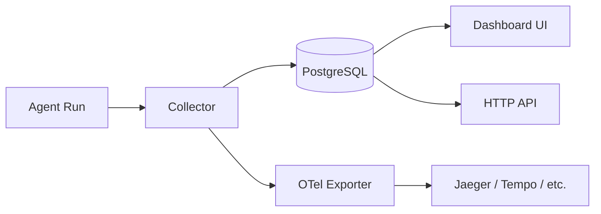

# Observability

> Monitor every LLM call, tool use, and agent run — from the built-in dashboard to Jaeger and beyond.

## Overview

GoClaw ships with built-in tracing that records every agent run as a **trace** and each LLM call or tool use as a **span**. Traces are stored in PostgreSQL and visible immediately in the dashboard. If you need to integrate with your existing observability stack (Grafana Tempo, Datadog, Honeycomb, Jaeger), you can export spans over OTLP by building with `-tags otel`.



## How Tracing Works

The `tracing.Collector` runs a background flush loop (every 5 seconds) that:

1. Drains a 1000-span in-memory buffer
2. Batch-inserts spans into PostgreSQL
3. Forwards spans to any attached `SpanExporter` (OTel, etc.)
4. Updates per-trace aggregate counters (total tokens, duration, status)

Traces and spans are linked by `trace_id`. Each agent run creates one trace; LLM calls and tool invocations inside that run become child spans.

**Span types recorded:**

| Span type | What it captures |
|-----------|-----------------|
| `llm_call` | Model, tokens in/out, finish reason, latency |
| `tool_call` | Tool name, call ID, duration, status |
| `agent_run` | Full run lifecycle, output preview |

## Viewing Traces

### Dashboard

Open the **Traces** section in the web UI (default: `http://localhost:18790`). You can filter by agent, date range, and status.

### Verbose Mode

By default, input messages are truncated to 500 characters in span previews. To store full LLM inputs (useful for debugging):

```bash
export GOCLAW_TRACE_VERBOSE=1
./goclaw
```

> Use verbose mode only in dev — full messages can be large.

## OpenTelemetry Export

The OTel exporter is compiled in only when you add `-tags otel`. The default build has zero OTel dependencies.

### Build with OTel support

```bash
go build -tags otel -o goclaw .
```

### Configure via environment

```bash
export GOCLAW_TELEMETRY_ENABLED=true
export GOCLAW_TELEMETRY_ENDPOINT=localhost:4317   # OTLP gRPC endpoint
export GOCLAW_TELEMETRY_PROTOCOL=grpc             # "grpc" (default) or "http"
export GOCLAW_TELEMETRY_INSECURE=true             # skip TLS for local dev
export GOCLAW_TELEMETRY_SERVICE_NAME=goclaw-gateway
```

Or via `config.json`:

```json
{
  "telemetry": {
    "enabled": true,
    "endpoint": "tempo:4317",
    "protocol": "grpc",
    "insecure": false,
    "service_name": "goclaw-gateway"
  }
}
```

Spans are exported using `gen_ai.*` semantic conventions (OpenTelemetry GenAI SIG), plus `goclaw.*` custom attributes for correlation with the PostgreSQL trace store.

## Jaeger Integration

The included `docker-compose.otel.yml` overlay spins up Jaeger all-in-one and wires it to GoClaw automatically:

```bash
docker compose \
  -f docker-compose.yml \
  -f docker-compose.postgres.yml \
  -f docker-compose.otel.yml \
  up
```

Jaeger UI is available at **http://localhost:16686**.

The overlay sets:

```yaml
# docker-compose.otel.yml (excerpt)
services:
  jaeger:
    image: jaegertracing/all-in-one:1.68.0
    ports:
      - "16686:16686"  # Jaeger UI
      - "4317:4317"    # OTLP gRPC
      - "4318:4318"    # OTLP HTTP
    environment:
      - COLLECTOR_OTLP_ENABLED=true

  goclaw:
    build:
      args:
        ENABLE_OTEL: "true"   # compiles with -tags otel
    environment:
      - GOCLAW_TELEMETRY_ENABLED=true
      - GOCLAW_TELEMETRY_ENDPOINT=jaeger:4317
      - GOCLAW_TELEMETRY_PROTOCOL=grpc
      - GOCLAW_TELEMETRY_INSECURE=true
```

## Key Attributes in Exported Spans

| Attribute | Description |
|-----------|-------------|
| `gen_ai.request.model` | LLM model name |
| `gen_ai.system` | Provider (anthropic, openai, etc.) |
| `gen_ai.usage.input_tokens` | Tokens consumed as input |
| `gen_ai.usage.output_tokens` | Tokens produced as output |
| `gen_ai.response.finish_reason` | Why the model stopped |
| `goclaw.span_type` | `llm_call`, `tool_call`, `agent_run` |
| `goclaw.tool.name` | Tool name for tool spans |
| `goclaw.trace_id` | UUID linking back to PostgreSQL |
| `goclaw.duration_ms` | Wall-clock duration |

## Common Issues

| Issue | Likely cause | Fix |
|-------|-------------|-----|
| No spans in Jaeger | Binary built without `-tags otel` | Rebuild with `go build -tags otel` |
| `GOCLAW_TELEMETRY_ENABLED` ignored | OTel build tag missing | Check `ENABLE_OTEL: "true"` in docker build args |
| Span buffer full (log warning) | High agent throughput | Increase buffer or reduce flush interval in code |
| Input previews truncated | Normal behavior | Set `GOCLAW_TRACE_VERBOSE=1` for full inputs |
| Spans appear in DB but not Jaeger | Endpoint misconfigured | Check `GOCLAW_TELEMETRY_ENDPOINT` and port reachability |

## What's Next

- [Production Checklist](./production-checklist.md) — monitoring and alerting recommendations
- [Docker Compose Setup](./docker-compose.md) — full compose file reference
- [Security Hardening](./security-hardening.md) — securing your deployment
