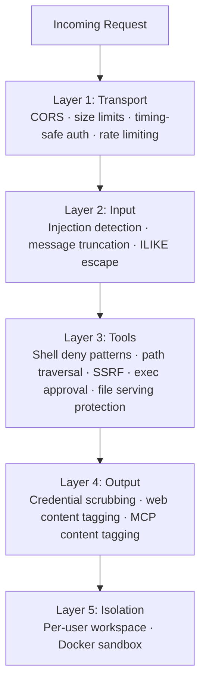
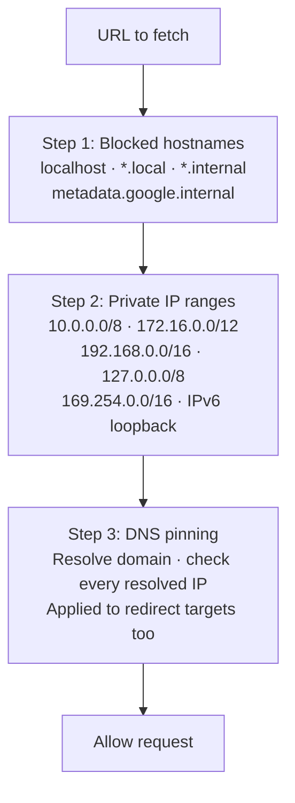

# Security Hardening

> GoClaw uses five independent defense layers — transport, input, tools, output, and isolation — so a bypass of one layer doesn't compromise the rest.

## Overview

Each layer operates independently. Together they form a defense-in-depth architecture covering the full request lifecycle from incoming WebSocket connection to agent tool execution output.



---

## Layer 1: Transport Security

Controls what reaches the gateway at the network and HTTP level.

| Mechanism | Detail |
|-----------|--------|
| CORS | `checkOrigin()` validates against `gateway.allowed_origins`; empty list allows all (backward compatible) |
| WebSocket message limit | 512 KB — gorilla/websocket auto-closes on exceed |
| HTTP body limit | 1 MB — enforced before JSON decode |
| Token auth | `crypto/subtle.ConstantTimeCompare` — timing-safe bearer token check |
| Rate limiting | Token bucket per user/IP; configurable via `gateway.rate_limit_rpm` (0 = disabled) |

**Hardening actions:**

```json
{
  "gateway": {
    "allowed_origins": ["https://your-dashboard.example.com"],
    "rate_limit_rpm": 20
  }
}
```

Set `allowed_origins` to your dashboard's domain in production. Leave empty only if you control all WebSocket clients.

---

## Layer 2: Input — Injection Detection

The input guard scans every user message for 6 prompt injection patterns before it reaches the LLM.

| Pattern ID | Detects |
|-----------|---------|
| `ignore_instructions` | "ignore all previous instructions" |
| `role_override` | "you are now…", "pretend you are…" |
| `system_tags` | `<system>`, `[SYSTEM]`, `[INST]`, `<<SYS>>` |
| `instruction_injection` | "new instructions:", "override:", "system prompt:" |
| `null_bytes` | Null characters `\x00` (obfuscation attempts) |
| `delimiter_escape` | "end of system", `</instructions>`, `</prompt>` |

**Configurable action** via `gateway.injection_action`:

| Value | Behavior |
|-------|----------|
| `"off"` | Disable detection entirely |
| `"log"` | Log at info level, continue |
| `"warn"` (default) | Log at warning level, continue |
| `"block"` | Log warning, return error, stop processing |

For public-facing deployments or shared multi-user agents, set `"block"`.

**Message truncation:** Messages exceeding `gateway.max_message_chars` (default 32,000) are truncated — not rejected — and the LLM is notified of the truncation.

**ILIKE ESCAPE:** All database ILIKE queries (search/filter operations) escape `%`, `_`, and `\` characters before execution, preventing SQL wildcard injection attacks.

---

## Layer 3: Tool Security

Protects against dangerous command execution, unauthorized file access, and server-side request forgery.

### Shell deny patterns

7 categories of commands are always blocked regardless of exec approval config:

| Category | Examples |
|----------|----------|
| Destructive file ops | `rm -rf`, `del /f`, `rmdir /s` |
| Destructive disk ops | `mkfs`, `dd if=`, `> /dev/sd*` |
| System commands | `shutdown`, `reboot`, `poweroff` |
| Fork bombs | `:(){ ... };:` |
| Remote code execution | `curl \| sh`, `wget -O - \| sh` |
| Reverse shells | `/dev/tcp/`, `nc -e` |
| Eval injection | `eval $()`, `base64 -d \| sh` |

### Path traversal prevention

`resolvePath()` applies `filepath.Clean()` then `HasPrefix()` to ensure all file paths stay within the agent's workspace. With `restrict_to_workspace: true` (the default on agents), any path outside the workspace is blocked.

All four filesystem tools (`read_file`, `write_file`, `list_files`, `edit`) implement the `PathDenyable` interface. The agent loop calls `DenyPaths(".goclaw")` at startup — agents cannot read GoClaw's internal data directory. The `list_files` tool filters denied paths from directory listings entirely, so agents never see them.

### File serving path traversal protection

The file serving endpoint (`/v1/files/...`) validates all requested paths to prevent directory traversal attacks. Any path containing `../` sequences or resolving outside the permitted base directory is rejected with a 400 error.

### SSRF protection (3-step validation)

Applied to all outbound URL fetches by the `web_fetch` tool:



### Credentialed exec (Direct Exec Mode)

For tools that need credentials (e.g., `gh`, `aws`), GoClaw uses direct process execution instead of a shell — eliminating shell injection entirely.

4-layer defense:
1. **No shell** — `exec.CommandContext(binary, args...)`, never `sh -c`
2. **Path verification** — binary resolved to absolute path via `exec.LookPath()`, matched against config
3. **Deny patterns** — per-binary regex deny lists on arguments (`deny_args`) and verbose flags (`deny_verbose`)
4. **Output scrubbing** — credentials registered at runtime are scrubbed from stdout/stderr

Shell metacharacters (`;`, `|`, `&`, `$()`, backticks) are detected and rejected before execution.

### Exec approval

See [Exec Approval](#exec-approval) for the full interactive approval flow. At minimum, enable `ask: "on-miss"` to prompt before network and infrastructure tools run:

```json
{
  "tools": {
    "execApproval": {
      "security": "full",
      "ask": "on-miss"
    }
  }
}
```

---

## Layer 4: Output Security

Prevents secrets from leaking back through tool output or LLM responses.

### Credential scrubbing (automatic)

All tool output passes through a regex scrubber that redacts known secret formats. Replaced with `[REDACTED]`:

| Pattern | Examples |
|---------|----------|
| OpenAI keys | `sk-...` |
| Anthropic keys | `sk-ant-...` |
| GitHub tokens | `ghp_`, `gho_`, `ghu_`, `ghs_`, `ghr_` |
| AWS access keys | `AKIA...` |
| Connection strings | `postgres://...`, `mysql://...` |
| Env var patterns | `KEY=...`, `SECRET=...`, `DSN=...` |
| Long hex strings | 64+ character hex sequences |
| DSN / database URLs | `DSN=...`, `DATABASE_URL=...`, `REDIS_URL=...`, `MONGO_URI=...` |
| Generic key-value | `api_key=...`, `token=...`, `secret=...`, `bearer=...` (case-insensitive) |
| Runtime env vars | `VIRTUAL_*=...` patterns |

13 regex patterns in total cover all major secret formats.

Scrubbing is enabled by default. To disable (not recommended):

```json
{ "tools": { "scrub_credentials": false } }
```

You can also register runtime values for dynamic scrubbing (e.g., server IPs discovered at runtime) via `AddDynamicScrubValues()` in custom tool integrations.

### MCP content tagging

Results returned by MCP tool calls are wrapped in the same untrusted-content markers as web fetches:

```
<<<EXTERNAL_UNTRUSTED_CONTENT>>>
[MCP tool result here]
<<<END_EXTERNAL_UNTRUSTED_CONTENT>>>
```

This prevents prompt injection from malicious MCP servers — the LLM is instructed not to treat tagged content as instructions.

### Web content tagging

Content fetched from external URLs is wrapped:

```
<<<EXTERNAL_UNTRUSTED_CONTENT>>>
[fetched content here]
<<<END_EXTERNAL_UNTRUSTED_CONTENT>>>
```

This signals to the LLM that the content is untrusted and should not be treated as instructions.

The content markers are protected against Unicode homoglyph spoofing — GoClaw sanitizes lookalike characters (e.g., Cyrillic `а` vs Latin `a`) to prevent external content from forging the boundary markers.

---

## Layer 5: Isolation

### Per-user workspace isolation

Every user gets a sandboxed directory. Two levels:

| Level | Directory pattern |
|-------|-----------------|
| Per-agent | `~/.goclaw/{agent-key}-workspace/` |
| Per-user | `{agent-workspace}/user_{sanitized_user_id}/` |

User IDs are sanitized — characters outside `[a-zA-Z0-9_-]` become underscores. Example: `group:telegram:-1001234` → `group_telegram_-1001234`.

### Docker sandbox

For agent shell execution, enable the Docker sandbox to run commands in an isolated container:

```bash
# Build the sandbox image
docker build -t goclaw-sandbox:bookworm-slim -f Dockerfile.sandbox .
```

```json
{
  "sandbox": {
    "mode": "all",
    "image": "goclaw-sandbox:bookworm-slim",
    "workspace_access": "rw",
    "scope": "session"
  }
}
```

Container hardening applied automatically:

| Setting | Value |
|---------|-------|
| Root filesystem | Read-only (`--read-only`) |
| Capabilities | All dropped (`--cap-drop ALL`) |
| New privileges | Disabled (`--security-opt no-new-privileges`) |
| Memory limit | 512 MB |
| CPU limit | 1.0 |
| Network | Disabled (`--network none`) |
| Max output | 1 MB |
| Timeout | 300 seconds |

Sandbox modes: `off` (direct host exec), `non-main` (sandbox all except the main agent), `all` (sandbox every agent).

---

## Encryption

Secrets stored in PostgreSQL are encrypted with AES-256-GCM:

| What | Table | Column |
|------|-------|--------|
| LLM provider API keys | `llm_providers` | `api_key` |
| MCP server API keys | `mcp_servers` | `api_key` |
| Custom tool env vars | `custom_tools` | `env` |
| Channel credentials | `channel_instances` | `credentials` |

Set the encryption key before first run:

```bash
# Generate a strong key
openssl rand -hex 32

# Add to .env
GOCLAW_ENCRYPTION_KEY=your-64-char-hex-key
```

Format stored: `"aes-gcm:" + base64(12-byte nonce + ciphertext + GCM tag)`. Values without the prefix are returned as plaintext for migration compatibility.

---

## RBAC — 3 Roles

WebSocket RPC methods and HTTP endpoints are gated by role. Roles are hierarchical.

| Role | Key permissions |
|------|----------------|
| **Viewer** | `agents.list`, `config.get`, `sessions.list`, `health`, `status`, `skills.list` |
| **Operator** | + `chat.send`, `chat.abort`, `sessions.delete/reset`, `cron.*`, `skills.update` |
| **Admin** | + `config.apply/patch`, `agents.create/update/delete`, `channels.toggle`, `device.pair.approve/revoke` |

### API Keys

For fine-grained access control, create scoped API keys instead of sharing the gateway token. Keys are hashed with SHA-256 before storage and cached for 5 minutes.

Authentication priority:
1. **Gateway token** → Admin role (full access)
2. **API key** → Role derived from scopes
3. **No token** → Operator (backward compatibility)

Available scopes:

| Scope | Access level |
|-------|-------------|
| `operator.admin` | Full admin access |
| `operator.read` | Read-only (viewer-equivalent) |
| `operator.write` | Read + write operations |
| `operator.approvals` | Exec approval management |
| `operator.pairing` | Device pairing management |

API keys are passed via `Authorization: Bearer {key}` header, same as the gateway token.

---

## Hardening Checklist

Use this before exposing GoClaw to the internet or shared users:

- [ ] Set `GOCLAW_GATEWAY_TOKEN` to a strong random token
- [ ] Set `GOCLAW_ENCRYPTION_KEY` to a 32-byte (64-char hex) random key
- [ ] Set `gateway.allowed_origins` to your dashboard domain
- [ ] Set `gateway.rate_limit_rpm` (e.g., `20`) to limit per-user request rate
- [ ] Set `gateway.injection_action` to `"block"` for public-facing deployments
- [ ] Enable exec approval with `tools.execApproval.ask: "on-miss"` (or `"always"`)
- [ ] Enable Docker sandbox with `sandbox.mode: "all"` for untrusted agent workloads
- [ ] Set `POSTGRES_PASSWORD` to a strong password (not the default `"goclaw"`)
- [ ] Enable TLS on PostgreSQL (`sslmode=require` in DSN)
- [ ] Review `gateway.owner_ids` — only trusted user IDs should have owner-level access
- [ ] Set `agents.restrict_to_workspace: true` (this is the default — do not disable)
- [ ] Create scoped API keys for integrations instead of sharing the gateway token
- [ ] Configure `tools.credentialed_exec` for secure CLI tool integrations (gh, aws, etc.)

---

## Security Logging

All security events log at `slog.Warn` with a `security.*` prefix:

| Event | Meaning |
|-------|---------|
| `security.injection_detected` | Prompt injection pattern found |
| `security.injection_blocked` | Message rejected (action = block) |
| `security.rate_limited` | Request rejected by rate limiter |
| `security.cors_rejected` | WebSocket connection rejected by CORS policy |
| `security.message_truncated` | Message truncated at `max_message_chars` |

Filter all security events:

```bash
./goclaw 2>&1 | grep '"security\.'
# or with structured logs:
journalctl -u goclaw | grep 'security\.'
```

---

## Common Issues

| Problem | Cause | Fix |
|---------|-------|-----|
| Legitimate messages blocked | `injection_action: "block"` too aggressive | Switch to `"warn"` and review logs before re-enabling block |
| Agent can read files outside workspace | `restrict_to_workspace: false` on agent | Re-enable (default is `true`) |
| Credentials appear in tool output | `scrub_credentials: false` | Remove that override — scrubbing is on by default |
| Sandbox not isolating | Sandbox mode is `"off"` | Set `sandbox.mode` to `"non-main"` or `"all"` |
| Encryption key not set | `GOCLAW_ENCRYPTION_KEY` empty | Set before first run; rotating requires re-encrypting stored secrets |

---

## What's Next

- [Exec Approval](#exec-approval) — interactive human-in-the-loop for shell commands
- [Sandbox](#sandbox) — Docker sandbox configuration details
- [Docker Compose](#deploy-docker-compose) — deploying with security settings via compose overlays
- [Database Setup](#deploy-database) — PostgreSQL TLS and encrypted secret storage

<!-- goclaw-source: 120fc2d | updated: 2026-03-18 -->
