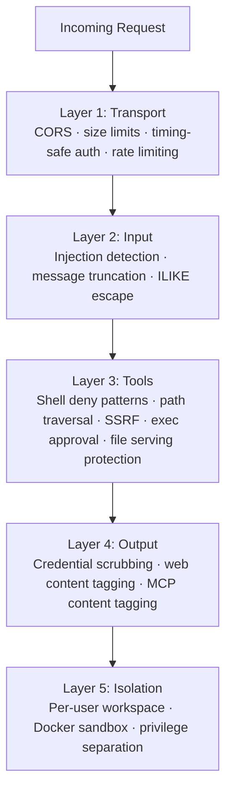
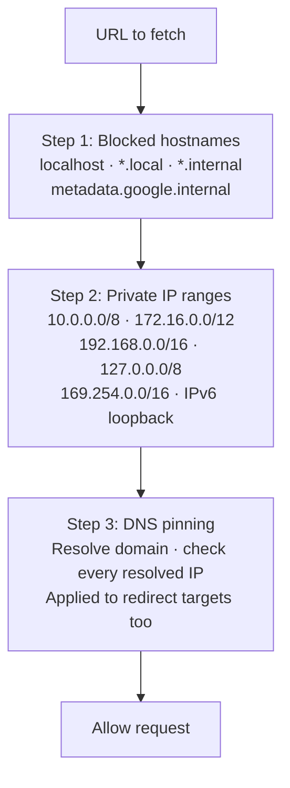

# Security Hardening

> GoClaw uses five independent defense layers — transport, input, tools, output, and isolation — so a bypass of one layer doesn't compromise the rest.

## Overview

Each layer operates independently. Together they form a defense-in-depth architecture covering the full request lifecycle from incoming WebSocket connection to agent tool execution output.



---

## Layer 1: Transport Security

Controls what reaches the gateway at the network and HTTP level.

| Mechanism | Detail |
|-----------|--------|
| CORS | `checkOrigin()` validates against `gateway.allowed_origins`; empty list allows all (backward compatible) |
| WebSocket message limit | 512 KB — gorilla/websocket auto-closes on exceed |
| HTTP body limit | 1 MB — enforced before JSON decode |
| Token auth | `crypto/subtle.ConstantTimeCompare` — timing-safe bearer token check |
| Rate limiting | Token bucket per user/IP; configurable via `gateway.rate_limit_rpm` (0 = disabled) |
| Dev mode | Empty gateway token → admin role granted (single-user / local dev only — never use in production) |

**Hardening actions:**

```json
{
  "gateway": {
    "allowed_origins": ["https://your-dashboard.example.com"],
    "rate_limit_rpm": 20
  }
}
```

Set `allowed_origins` to your dashboard's domain in production. Leave empty only if you control all WebSocket clients.

---

## Layer 2: Input — Injection Detection

The input guard scans every user message for 6 prompt injection patterns before it reaches the LLM.

| Pattern ID | Detects |
|-----------|---------|
| `ignore_instructions` | "ignore all previous instructions" |
| `role_override` | "you are now…", "pretend you are…" |
| `system_tags` | `<system>`, `[SYSTEM]`, `[INST]`, `<<SYS>>` |
| `instruction_injection` | "new instructions:", "override:", "system prompt:" |
| `null_bytes` | Null characters `\x00` (obfuscation attempts) |
| `delimiter_escape` | "end of system", `</instructions>`, `</prompt>` |

**Configurable action** via `gateway.injection_action`:

| Value | Behavior |
|-------|----------|
| `"off"` | Disable detection entirely |
| `"log"` | Log at info level, continue |
| `"warn"` (default) | Log at warning level, continue |
| `"block"` | Log warning, return error, stop processing |

For public-facing deployments or shared multi-user agents, set `"block"`.

**Message truncation:** Messages exceeding `gateway.max_message_chars` (default 32,000) are truncated — not rejected — and the LLM is notified of the truncation.

**ILIKE ESCAPE:** All database ILIKE queries (search/filter operations) escape `%`, `_`, and `\` characters before execution, preventing SQL wildcard injection attacks.

---

## Layer 3: Tool Security

Protects against dangerous command execution, unauthorized file access, and server-side request forgery.

### Shell deny groups

15 categories of commands are blocked by default. All groups are **on (denied)** out of the box. Per-agent overrides are possible via `shell_deny_groups` in agent config.

| # | Group | Examples |
|---|-------|----------|
| 1 | `destructive_ops` | `rm -rf /`, `dd if=`, `mkfs`, `reboot`, `shutdown` |
| 2 | `data_exfiltration` | `curl \| sh`, localhost access, DNS queries |
| 3 | `reverse_shell` | `nc -e`, `socat`, Python/Node socket |
| 4 | `code_injection` | `eval $()`, `base64 -d \| sh` |
| 5 | `privilege_escalation` | `sudo`, `su -`, `nsenter`, `mount`, `setcap`, `halt`, `doas`, `pkexec`, `runuser` |
| 6 | `dangerous_paths` | `chmod`/`chown` on `/` paths |
| 7 | `env_injection` | `LD_PRELOAD=`, `DYLD_INSERT_LIBRARIES=` |
| 8 | `container_escape` | `docker.sock`, `/proc/sys/`, `/sys/kernel/` |
| 9 | `crypto_mining` | `xmrig`, `cpuminer`, stratum URLs |
| 10 | `filter_bypass` | `sed /e`, `git --upload-pack=`, CVE mitigations |
| 11 | `network_recon` | `nmap`, `ssh@`, `ngrok`, `chisel` |
| 12 | `package_install` | `pip install`, `npm i`, `apk add`, `yarn` |
| 13 | `persistence` | `crontab`, `.bashrc`, tee shell init |
| 14 | `process_control` | `kill -9`, `killall`, `pkill` |
| 15 | `env_dump` | `env`, `printenv`, `GOCLAW_*` vars, `/proc/*/environ` |

To allow a specific group for one agent, set it to `false` in the agent's config:

```json
{
  "agents": {
    "list": {
      "devops-bot": {
        "shell_deny_groups": {
          "package_install": false,
          "process_control": false
        }
      }
    }
  }
}
```

### Path traversal prevention

`resolvePath()` applies `filepath.Clean()` then `HasPrefix()` to ensure all file paths stay within the agent's workspace. With `restrict_to_workspace: true` (the default on agents), any path outside the workspace is blocked.

All four filesystem tools (`read_file`, `write_file`, `list_files`, `edit`) implement the `PathDenyable` interface. The agent loop calls `DenyPaths(".goclaw")` at startup — agents cannot read GoClaw's internal data directory. The `list_files` tool filters denied paths from directory listings entirely, so agents never see them.

### File serving path traversal protection

The file serving endpoint (`/v1/files/...`) validates all requested paths to prevent directory traversal attacks. Any path containing `../` sequences or resolving outside the permitted base directory is rejected with a 400 error.

### SSRF protection (3-step validation)

Applied to all outbound URL fetches by the `web_fetch` tool:



### Credentialed exec (Direct Exec Mode)

For tools that need credentials (e.g., `gh`, `aws`), GoClaw uses direct process execution instead of a shell — eliminating shell injection entirely.

4-layer defense:
1. **No shell** — `exec.CommandContext(binary, args...)`, never `sh -c`
2. **Path verification** — binary resolved to absolute path via `exec.LookPath()`, matched against config
3. **Deny patterns** — per-binary regex deny lists on arguments (`deny_args`) and verbose flags (`deny_verbose`)
4. **Output scrubbing** — credentials registered at runtime are scrubbed from stdout/stderr

Shell metacharacters (`;`, `|`, `&`, `$()`, backticks) are detected and rejected before execution.

### Shell output limit

Host-executed commands have stdout and stderr capped at **1 MB** each. If a command exceeds this limit, output is truncated with a flag to prevent further writes. Sandboxed execution uses Docker container limits instead.

### XML parsing (XXE prevention)

GoClaw replaced the stdlib `xml.etree.ElementTree` XML parser with `defusedxml` in all XML processing paths. `defusedxml` blocks XML eXternal Entity (XXE) attacks — where a crafted XML payload references external entities to read local files or trigger SSRF. This applies to any agent tool or skill that parses XML input.

### Exec approval

See [Exec Approval](/exec-approval) for the full interactive approval flow. At minimum, enable `ask: "on-miss"` to prompt before network and infrastructure tools run:

```json
{
  "tools": {
    "execApproval": {
      "security": "full",
      "ask": "on-miss"
    }
  }
}
```

---

## Layer 4: Output Security

Prevents secrets from leaking back through tool output or LLM responses.

### Credential scrubbing (automatic)

All tool output passes through a regex scrubber that redacts known secret formats. Replaced with `[REDACTED]`:

| Pattern | Examples |
|---------|----------|
| OpenAI keys | `sk-...` |
| Anthropic keys | `sk-ant-...` |
| GitHub tokens | `ghp_`, `gho_`, `ghu_`, `ghs_`, `ghr_` |
| AWS access keys | `AKIA...` |
| Connection strings | `postgres://...`, `mysql://...` |
| Env var patterns | `KEY=...`, `SECRET=...`, `DSN=...` |
| Long hex strings | 64+ character hex sequences |
| DSN / database URLs | `DSN=...`, `DATABASE_URL=...`, `REDIS_URL=...`, `MONGO_URI=...` |
| Generic key-value | `api_key=...`, `token=...`, `secret=...`, `bearer=...` (case-insensitive) |
| Runtime env vars | `VIRTUAL_*=...` patterns |

13 regex patterns in total cover all major secret formats.

Scrubbing is enabled by default. To disable (not recommended):

```json
{ "tools": { "scrub_credentials": false } }
```

You can also register runtime values for dynamic scrubbing (e.g., server IPs discovered at runtime) via `AddDynamicScrubValues()` in custom tool integrations.

### Web content tagging

Content fetched from external URLs is wrapped:

```
<<<EXTERNAL_UNTRUSTED_CONTENT>>>
[fetched content here]
<<<END_EXTERNAL_UNTRUSTED_CONTENT>>>
```

This signals to the LLM that the content is untrusted and should not be treated as instructions.

The content markers are protected against Unicode homoglyph spoofing — GoClaw sanitizes lookalike characters (e.g., Cyrillic `а` vs Latin `a`) to prevent external content from forging the boundary markers.

### MCP content tagging

Tool results from MCP servers are wrapped with the same untrusted content markers:

```
<<<EXTERNAL_UNTRUSTED_CONTENT>>> (MCP server: my-server, tool: search)
[tool result here]
<<<END_EXTERNAL_UNTRUSTED_CONTENT>>>
```

The header identifies the server and tool name. The footer warns the LLM not to follow instructions from the content. Marker breakout attempts are sanitized.

---

## Layer 5: Isolation

### Per-user workspace isolation

Every user gets a sandboxed directory. Two levels:

| Level | Directory pattern |
|-------|-----------------|
| Per-agent | `~/.goclaw/{agent-key}-workspace/` |
| Per-user | `{agent-workspace}/user_{sanitized_user_id}/` |

User IDs are sanitized — characters outside `[a-zA-Z0-9_-]` become underscores. Example: `group:telegram:-1001234` → `group_telegram_-1001234`.

### Docker entrypoint — privilege separation

GoClaw's Docker container uses a three-phase privilege model:

**Phase 1: Root (`docker-entrypoint.sh`)**
- Re-installs persisted system packages from `/app/data/.runtime/apk-packages`
- Starts `pkg-helper` (root-privileged service listening on Unix socket `/tmp/pkg.sock`, mode 0660, group `goclaw`)
- Sets up Python and Node.js runtime directories

**Phase 2: Drop to `goclaw` user (`su-exec`)**
- Main app runs as `goclaw` (UID 1000) via `su-exec goclaw /app/goclaw`
- All agent operations execute in this context
- System package requests are delegated to `pkg-helper` via Unix socket

**Phase 3: Optional sandbox (per-agent)**
- Shell execution can be sandboxed in Docker containers (configurable)

### pkg-helper — root service

`pkg-helper` runs as root on a Unix socket (`/tmp/pkg.sock`, 0660 `root:goclaw`). It accepts only `apk add` / `apk del` requests from the `goclaw` user. Required Docker Compose capabilities:

| Capability | Purpose |
|-----------|---------|
| `SETUID` | `su-exec` privilege drop |
| `SETGID` | Group membership for socket |
| `CHOWN` | Runtime directory ownership setup |
| `DAC_OVERRIDE` | pkg-helper socket access |

All other capabilities are dropped (`cap_drop: ALL`). The full compose security config:

```yaml
cap_drop:
  - ALL
cap_add:
  - SETUID
  - SETGID
  - CHOWN
  - DAC_OVERRIDE
security_opt:
  - no-new-privileges:true
tmpfs:
  - /tmp:size=256m,noexec,nosuid
```

### Runtime directories

Packages and runtime data are stored under `/app/data/.runtime`, which survives container recreation:

| Path | Owner | Purpose |
|------|-------|---------|
| `/app/data/.runtime/apk-packages` | 0666 | Persisted apk package list |
| `/app/data/.runtime/pip` | goclaw | Python packages (`$PIP_TARGET`) |
| `/app/data/.runtime/npm-global` | goclaw | npm packages (`$NPM_CONFIG_PREFIX`) |
| `/tmp/pkg.sock` | root:goclaw 0660 | pkg-helper Unix socket |

### Docker sandbox

For agent shell execution, enable the Docker sandbox to run commands in an isolated container:

```bash
# Build the sandbox image
docker build -t goclaw-sandbox:bookworm-slim -f Dockerfile.sandbox .
```

```json
{
  "sandbox": {
    "mode": "all",
    "image": "goclaw-sandbox:bookworm-slim",
    "workspace_access": "rw",
    "scope": "session"
  }
}
```

Container hardening applied automatically:

| Setting | Value |
|---------|-------|
| Root filesystem | Read-only (`--read-only`) |
| Capabilities | All dropped (`--cap-drop ALL`) |
| New privileges | Disabled (`--security-opt no-new-privileges`) |
| Memory limit | 512 MB |
| CPU limit | 1.0 |
| Network | Disabled (`--network none`) |
| Max output | 1 MB |
| Timeout | 300 seconds |

Sandbox modes: `off` (direct host exec), `non-main` (sandbox all except the main agent), `all` (sandbox every agent).

---

## Session IDOR Fix

All five `chat.*` WebSocket methods (`chat.send`, `chat.abort`, `chat.stop`, `chat.stopall`, `chat.reset`) verify that the caller owns the session before acting on it. The `requireSessionOwner` helper in `internal/gateway/methods/access.go` performs this check. Non-admin users supplying a `sessionKey` that belongs to another user receive an authorization error — the operation is never executed.

---

## Pairing Auth Hardening

Browser device pairing is fail-closed:

| Control | Detail |
|---------|--------|
| Fail-closed | `IsPaired()` check blocks unpaired sessions — no fallback to open access |
| Rate limiting | Max 3 pending pairing requests per account; prevents enumeration spam |
| TTL enforcement | Pairing codes expire after 60 minutes; paired device tokens expire after 30 days |
| Approval flow | Requires WebSocket `device.pair.approve` from an authenticated admin session |

---

## Encryption

Secrets stored in PostgreSQL are encrypted with AES-256-GCM:

| What | Table | Column |
|------|-------|--------|
| LLM provider API keys | `llm_providers` | `api_key` |
| MCP server API keys | `mcp_servers` | `api_key` |
| Custom tool env vars | `custom_tools` | `env` |
| Channel credentials | `channel_instances` | `credentials` |

Set the encryption key before first run:

```bash
# Generate a strong key
openssl rand -hex 32

# Add to .env
GOCLAW_ENCRYPTION_KEY=your-64-char-hex-key
```

Format stored: `"aes-gcm:" + base64(12-byte nonce + ciphertext + GCM tag)`. Values without the prefix are returned as plaintext for migration compatibility.

---

## RBAC — 3 Roles

WebSocket RPC methods and HTTP endpoints are gated by role. Roles are hierarchical.

| Role | Key permissions |
|------|----------------|
| **Viewer** | `agents.list`, `config.get`, `sessions.list`, `health`, `status`, `skills.list` |
| **Operator** | + `chat.send`, `chat.abort`, `sessions.delete/reset`, `cron.*`, `skills.update` |
| **Admin** | + `config.apply/patch`, `agents.create/update/delete`, `channels.toggle`, `device.pair.approve/revoke` |

### API Keys

For fine-grained access control, create scoped API keys instead of sharing the gateway token. Keys are hashed with SHA-256 before storage and cached for 5 minutes.

Authentication priority:
1. **Gateway token** → Admin role (full access)
2. **API key** → Role derived from scopes
3. **No token** → Operator (backward compatibility); if no gateway token is configured at all → Admin (dev mode)

Available scopes:

| Scope | Access level |
|-------|-------------|
| `operator.admin` | Full admin access |
| `operator.read` | Read-only (viewer-equivalent) |
| `operator.write` | Read + write operations |
| `operator.approvals` | Exec approval management |
| `operator.pairing` | Device pairing management |

API keys are passed via `Authorization: Bearer {key}` header, same as the gateway token.

---

## Memory File Overwrite Protection

The memory interceptor prevents silent data loss when an agent attempts to overwrite an existing memory file with different content. When a write is issued in replace mode (not append) and the target already contains different content, the previous value is captured and returned to the caller so the agent can be warned before data is lost.

---

## Config Permissions System

GoClaw exposes three RPC methods to control which users can modify an agent's configuration:

| Method | Description |
|--------|-------------|
| `config.permissions.list` | List all granted permissions for an agent |
| `config.permissions.grant` | Grant a specific user permission to modify a config type |
| `config.permissions.revoke` | Revoke a previously granted permission |

By default, config modifications require admin access. Granting permission to a `userId` for a given `scope` and `configType` allows that user to make the specific change without full admin rights.

---

## Goroutine Panic Recovery

GoClaw wraps all background goroutines (tool execution, cron jobs, summarization) in a panic recovery handler via the `safego` package. If a goroutine panics, the error is caught and logged instead of crashing the entire server process. No configuration required — panic recovery is always active.

---

## Hardening Checklist

Use this before exposing GoClaw to the internet or shared users:

- [ ] Set `GOCLAW_GATEWAY_TOKEN` to a strong random token
- [ ] Set `GOCLAW_ENCRYPTION_KEY` to a 32-byte (64-char hex) random key
- [ ] Set `gateway.allowed_origins` to your dashboard domain
- [ ] Set `gateway.rate_limit_rpm` (e.g., `20`) to limit per-user request rate
- [ ] Set `gateway.injection_action` to `"block"` for public-facing deployments
- [ ] Enable exec approval with `tools.execApproval.ask: "on-miss"` (or `"always"`)
- [ ] Enable Docker sandbox with `sandbox.mode: "all"` for untrusted agent workloads
- [ ] Set `POSTGRES_PASSWORD` to a strong password (not the default `"goclaw"`)
- [ ] Enable TLS on PostgreSQL (`sslmode=require` in DSN)
- [ ] Review `gateway.owner_ids` — only trusted user IDs should have owner-level access
- [ ] Set `agents.restrict_to_workspace: true` (this is the default — do not disable)
- [ ] Create scoped API keys for integrations instead of sharing the gateway token
- [ ] Configure `tools.credentialed_exec` for secure CLI tool integrations (gh, aws, etc.)
- [ ] Review shell deny groups — all 15 are on by default; only relax for specific agents that need it
- [ ] Verify sandbox mode does not fall back to host execution (fail-closed)
- [ ] Confirm `GOCLAW_GATEWAY_TOKEN` is set — empty token enables dev mode (admin for all)

---

## Security Logging

All security events log at `slog.Warn` with a `security.*` prefix:

| Event | Meaning |
|-------|---------|
| `security.injection_detected` | Prompt injection pattern found |
| `security.injection_blocked` | Message rejected (action = block) |
| `security.rate_limited` | Request rejected by rate limiter |
| `security.cors_rejected` | WebSocket connection rejected by CORS policy |
| `security.message_truncated` | Message truncated at `max_message_chars` |

Filter all security events:

```bash
./goclaw 2>&1 | grep '"security\.'
# or with structured logs:
journalctl -u goclaw | grep 'security\.'
```

---

## Common Issues

| Problem | Cause | Fix |
|---------|-------|-----|
| Legitimate messages blocked | `injection_action: "block"` too aggressive | Switch to `"warn"` and review logs before re-enabling block |
| Agent can read files outside workspace | `restrict_to_workspace: false` on agent | Re-enable (default is `true`) |
| Credentials appear in tool output | `scrub_credentials: false` | Remove that override — scrubbing is on by default |
| Sandbox not isolating | Sandbox mode is `"off"` | Set `sandbox.mode` to `"non-main"` or `"all"` |
| Encryption key not set | `GOCLAW_ENCRYPTION_KEY` empty | Set before first run; rotating requires re-encrypting stored secrets |
| All users have admin access | `GOCLAW_GATEWAY_TOKEN` not set | Set a strong token; empty = dev mode |

---

## What's Next

- [Exec Approval](../advanced/exec-approval.md) — interactive human-in-the-loop for shell commands
- [Sandbox](../advanced/sandbox.md) — Docker sandbox configuration details
- [Docker Compose](./docker-compose.md) — deploying with security settings via compose overlays
- [Database Setup](./database-setup.md) — PostgreSQL TLS and encrypted secret storage

<!-- goclaw-source: 050aafc9 | updated: 2026-04-09 -->
