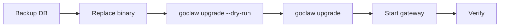

# Upgrading

> How to safely upgrade GoClaw — binary, database schema, and data migrations — with zero surprises.

## Overview

A GoClaw upgrade has two parts:

1. **SQL migrations** — schema changes applied by `golang-migrate` (idempotent, versioned)
2. **Data hooks** — optional Go-based data transformations that run after schema migrations (e.g. backfilling a new column)

The `./goclaw upgrade` command handles both in the correct order. It is safe to run multiple times — it is fully idempotent.



## The Upgrade Command

```bash
# Preview what would happen (no changes applied)
./goclaw upgrade --dry-run

# Show current schema version and pending items
./goclaw upgrade --status

# Apply all pending SQL migrations and data hooks
./goclaw upgrade
```

### Status output explained

```
  App version:     v1.2.0 (protocol 3)
  Schema current:  12
  Schema required: 14
  Status:          UPGRADE NEEDED (12 -> 14)

  Pending data hooks: 1
    - 013_backfill_agent_slugs

  Run 'goclaw upgrade' to apply all pending changes.
```

| Status | Meaning |
|--------|---------|
| `UP TO DATE` | Schema matches binary — nothing to do |
| `UPGRADE NEEDED` | Run `./goclaw upgrade` |
| `BINARY TOO OLD` | Your binary is older than the DB schema — upgrade the binary |
| `DIRTY` | A migration failed partway — see recovery below |

## Standard Upgrade Procedure

### Step 1 — Back up the database

```bash
pg_dump -Fc "$GOCLAW_POSTGRES_DSN" > goclaw-backup-$(date +%Y%m%d).dump
```

Never skip this. Schema migrations are not automatically reversible.

### Step 2 — Replace the binary

```bash
# Download new binary or build from source
go build -o goclaw-new .

# Verify version
./goclaw-new upgrade --status
```

### Step 3 — Dry run

```bash
./goclaw-new upgrade --dry-run
```

Review what SQL migrations and data hooks will be applied.

### Step 4 — Apply

```bash
./goclaw-new upgrade
```

Expected output:

```
  App version:     v1.2.0 (protocol 3)
  Schema current:  12
  Schema required: 14

  Applying SQL migrations... OK (v12 -> v14)
  Running data hooks... 1 applied

  Upgrade complete.
```

### Step 5 — Start the gateway

```bash
mv goclaw-new goclaw
./goclaw
```

### Step 6 — Verify

- Open the dashboard and confirm agents load correctly
- Check logs for any `ERROR` or `WARN` lines during startup
- Run a test agent message end-to-end

## Docker Compose Upgrade

Use the `docker-compose.upgrade.yml` overlay to run the upgrade as a one-shot container:

```bash
# Dry run
docker compose \
  -f docker-compose.yml \
  -f docker-compose.postgres.yml \
  -f docker-compose.upgrade.yml \
  run --rm upgrade --dry-run

# Apply
docker compose \
  -f docker-compose.yml \
  -f docker-compose.postgres.yml \
  -f docker-compose.upgrade.yml \
  run --rm upgrade

# Check status
docker compose \
  -f docker-compose.yml \
  -f docker-compose.postgres.yml \
  -f docker-compose.upgrade.yml \
  run --rm upgrade --status
```

The `upgrade` service starts, runs `goclaw upgrade`, then exits. The `--rm` flag removes the container automatically.

> Make sure `GOCLAW_ENCRYPTION_KEY` is set in your `.env` — the upgrade service needs it to access encrypted config.

## Auto-Upgrade on Startup

For CI or ephemeral environments where manual upgrade steps are impractical:

```bash
export GOCLAW_AUTO_UPGRADE=true
./goclaw
```

When set, the gateway checks the schema on startup and applies any pending SQL migrations and data hooks automatically before serving traffic.

**Use with caution in production** — prefer explicit `./goclaw upgrade` so you control timing and have a backup first.

## Rollback Procedure

GoClaw does not provide automatic rollback. If something goes wrong:

### Option A — Restore from backup (safest)

```bash
# Stop gateway
# Restore DB from pre-upgrade backup
pg_restore -d "$GOCLAW_POSTGRES_DSN" goclaw-backup-20250308.dump

# Restore previous binary
./goclaw-old
```

### Option B — Fix a dirty schema

If a migration failed partway, the schema is marked dirty:

```
  Status: DIRTY (failed migration)
  Fix:  ./goclaw migrate force 13
  Then: ./goclaw upgrade
```

Force the migration version back to the last known good state, then re-run upgrade:

```bash
./goclaw migrate force 13
./goclaw upgrade
```

Only do this if you understand what the failed migration was doing. When in doubt, restore from backup.

## Breaking Changes Checklist

Before each upgrade, check the release notes for:

- [ ] Protocol version bump — clients (dashboard, CLI) may need updating too
- [ ] Config field renames or removals — update `config.json` accordingly
- [ ] Removed env vars — check your `.env` against `.env.example`
- [ ] New required env vars — e.g. new encryption settings
- [ ] Tool or provider removals — verify your agents still have their configured tools

## Common Issues

| Issue | Likely cause | Fix |
|-------|-------------|-----|
| `Database not configured` | `GOCLAW_POSTGRES_DSN` not set | Set the env var before running upgrade |
| `DIRTY` status | Previous migration failed mid-way | `./goclaw migrate force <version-1>` then retry |
| `BINARY TOO OLD` | Running old binary against newer schema | Download or build the latest binary |
| Upgrade hangs | DB unreachable or locked | Check DB connectivity; look for long-running transactions |
| Data hooks not running | Schema already at required version | Data hooks only run if schema was just migrated or pending |

## What's Next

- [Production Checklist](./production-checklist.md) — full pre-launch verification
- [Database Setup](./database-setup.md) — PostgreSQL and pgvector setup
- [Observability](./observability.md) — monitor your gateway post-upgrade
