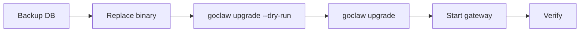

# Upgrading

> How to safely upgrade GoClaw — binary, database schema, and data migrations — with zero surprises.

## Overview

A GoClaw upgrade has two parts:

1. **SQL migrations** — schema changes applied by `golang-migrate` (idempotent, versioned)
2. **Data hooks** — optional Go-based data transformations that run after schema migrations (e.g. backfilling a new column)

The `./goclaw upgrade` command handles both in the correct order. It is safe to run multiple times — it is fully idempotent. The current required schema version is **55**.



## The Upgrade Command

```bash
# Preview what would happen (no changes applied)
./goclaw upgrade --dry-run

# Show current schema version and pending items
./goclaw upgrade --status

# Apply all pending SQL migrations and data hooks
./goclaw upgrade
```

### Status output explained

```
  App version:     v1.2.0 (protocol 3)
  Schema current:  12
  Schema required: 14
  Status:          UPGRADE NEEDED (12 -> 14)

  Pending data hooks: 1
    - 013_backfill_agent_slugs

  Run 'goclaw upgrade' to apply all pending changes.
```

| Status | Meaning |
|--------|---------|
| `UP TO DATE` | Schema matches binary — nothing to do |
| `UPGRADE NEEDED` | Run `./goclaw upgrade` |
| `BINARY TOO OLD` | Your binary is older than the DB schema — upgrade the binary |
| `DIRTY` | A migration failed partway — see recovery below |

## Standard Upgrade Procedure

### Step 1 — Back up the database

```bash
pg_dump -Fc "$GOCLAW_POSTGRES_DSN" > goclaw-backup-$(date +%Y%m%d).dump
```

Never skip this. Schema migrations are not automatically reversible.

### Step 2 — Replace the binary

```bash
# Download new binary or build from source
go build -o goclaw-new .

# Verify version
./goclaw-new upgrade --status
```

### Step 3 — Dry run

```bash
./goclaw-new upgrade --dry-run
```

Review what SQL migrations and data hooks will be applied.

### Step 4 — Apply

```bash
./goclaw-new upgrade
```

Expected output:

```
  App version:     v1.2.0 (protocol 3)
  Schema current:  12
  Schema required: 14

  Applying SQL migrations... OK (v12 -> v14)
  Running data hooks... 1 applied

  Upgrade complete.
```

### Step 5 — Start the gateway

```bash
mv goclaw-new goclaw
./goclaw
```

### Step 6 — Verify

- Open the dashboard and confirm agents load correctly
- Check logs for any `ERROR` or `WARN` lines during startup
- Run a test agent message end-to-end

## Docker Compose Upgrade

Use the `docker-compose.upgrade.yml` overlay to run the upgrade as a one-shot container:

```bash
# Dry run
docker compose \
  -f docker-compose.yml \
  -f docker-compose.postgres.yml \
  -f docker-compose.upgrade.yml \
  run --rm upgrade --dry-run

# Apply
docker compose \
  -f docker-compose.yml \
  -f docker-compose.postgres.yml \
  -f docker-compose.upgrade.yml \
  run --rm upgrade

# Check status
docker compose \
  -f docker-compose.yml \
  -f docker-compose.postgres.yml \
  -f docker-compose.upgrade.yml \
  run --rm upgrade --status
```

The `upgrade` service starts, runs `goclaw upgrade`, then exits. The `--rm` flag removes the container automatically.

> Make sure `GOCLAW_ENCRYPTION_KEY` is set in your `.env` — the upgrade service needs it to access encrypted config.

## Auto-Upgrade on Startup

For CI or ephemeral environments where manual upgrade steps are impractical:

```bash
export GOCLAW_AUTO_UPGRADE=true
./goclaw
```

When set, the gateway checks the schema on startup and applies any pending SQL migrations and data hooks automatically before serving traffic.

**Use with caution in production** — prefer explicit `./goclaw upgrade` so you control timing and have a backup first.

## Rollback Procedure

GoClaw does not provide automatic rollback. If something goes wrong:

### Option A — Restore from backup (safest)

```bash
# Stop gateway
# Restore DB from pre-upgrade backup
pg_restore -d "$GOCLAW_POSTGRES_DSN" goclaw-backup-20250308.dump

# Restore previous binary
./goclaw-old
```

### Option B — Fix a dirty schema

If a migration failed partway, the schema is marked dirty:

```
  Status: DIRTY (failed migration)
  Fix:  ./goclaw migrate force 13
  Then: ./goclaw upgrade
```

Force the migration version back to the last known good state, then re-run upgrade:

```bash
./goclaw migrate force 13
./goclaw upgrade
```

Only do this if you understand what the failed migration was doing. When in doubt, restore from backup.

### All migrate subcommands

```bash
./goclaw migrate up              # Apply pending migrations
./goclaw migrate down            # Roll back one step
./goclaw migrate down 3          # Roll back 3 steps
./goclaw migrate version         # Show current version + dirty state
./goclaw migrate force <version> # Force version (recovery only)
./goclaw migrate goto <version>  # Migrate to a specific version
./goclaw migrate drop            # DROP ALL TABLES (dangerous — use only in dev)
```

> **Data hooks tracking:** GoClaw tracks post-migration Go transforms in a separate `data_migrations` table (distinct from `schema_migrations`). Run `./goclaw upgrade --status` to see both SQL migration version and pending data hooks.

## Recent Migrations

### v3 Migrations (037–044) — v2→v3 Upgrade Guide

These migrations are applied automatically via `./goclaw upgrade`. They constitute the **v3 major release**. Read the breaking changes below before upgrading from v2.

| Version | What changed |
|---------|-------------|
| 037 | **V3 memory evolution** — creates `episodic_summaries`, `agent_evolution_metrics`, `agent_evolution_suggestions`; adds `valid_from`/`valid_until` to KG tables; promotes 12 agent fields from `other_config` JSONB to dedicated columns |
| 038 | **Knowledge Vault** — creates `vault_documents`, `vault_links`, `vault_versions` |
| 039 | Truncates stale `agent_links` data |
| 040 | Adds `search_vector` FTS generated column + HNSW index to `episodic_summaries` |
| 041 | Adds `promoted_at` column to `episodic_summaries` for dreaming pipeline |
| 042 | Adds `summary` column to `vault_documents`; rebuilds FTS |
| 043 | Adds `team_id`, `custom_scope` to `vault_documents` and 9 other tables; team-safe unique constraint; scope-fix trigger |
| 044 | Seeds `AGENTS_CORE.md` and `AGENTS_TASK.md` context files for all agents; removes `AGENTS_MINIMAL.md` |
| 045 | `episodic_recall_tracking` — adds `recall_count`, `recall_score`, `last_recalled_at` to `episodic_summaries`; partial index for priority-based episode promotion in the dreaming worker |
| 046 | `vault_nullable_agent_id` — makes `vault_documents.agent_id` nullable to support team-scoped and tenant-shared vault files |
| 047 | `cron_jobs_unique_constraint` — adds unique constraint per `(agent_id, tenant_id, name)` and deduplicates existing rows |
| 048 | `vault_media_linking` — adds `base_name` generated column on `team_task_attachments`, `metadata JSONB` on `vault_links`, fixes CASCADE FK constraints |
| 049 | `vault_path_prefix_index` — adds concurrent index `idx_vault_docs_path_prefix` with `text_pattern_ops` for fast prefix queries |
| 050 | Seeds the `stt` (Speech-to-Text) tool into `builtin_tools`. See [TTS & Voice](/advanced/tts-voice) for configuration. `ON CONFLICT DO NOTHING` — customized settings are preserved. |
| 051 | Backfills `mode: "cache-ttl"` into `agents.context_pruning` for agents that already had a custom `context_pruning` object but were missing the `mode` field. **Pruning remains opt-in globally** — this migration only sets `mode` for agents that had custom config without it; no agents are silently enrolled into pruning. |
| 052 | New agent hooks system: creates `agent_hooks`, `hook_executions`, and `tenant_hook_budget` tables. See [Hooks & Quality Gates](/advanced/hooks-quality-gates). |
| 053 | Extends `agent_hooks`: adds `script` handler type (goja-backed inline scripts) and `builtin` source marker; drops per-scope uniqueness indexes to allow multiple hooks per event. |
| 054 | Adds `name` column to `agent_hooks` for user-facing labels; introduces `agent_hook_agents` N:M junction table (replaces single `agent_id` FK); migrates existing agent assignments; renames tables `agent_hooks` → `hooks` and `agent_hook_agents` → `hook_agents`. |
| 055 | Adds `vault_documents_scope_consistency` CHECK constraint (NOT VALID) on `vault_documents`. Enforces: `personal` scope requires `agent_id NOT NULL`, `team` scope requires `team_id NOT NULL`, `shared` scope requires both NULL, `custom` is unconstrained. Run `ALTER TABLE vault_documents VALIDATE CONSTRAINT vault_documents_scope_consistency;` after auditing legacy rows. |

#### Breaking Changes in v3

| Change | Impact | Action required |
|--------|--------|-----------------|
| Legacy `runLoop()` deleted (~745 LOC) | All agents now run the unified 8-stage v3 pipeline | None — automatic |
| `v3PipelineEnabled` flag removed | Flag is no longer accepted; v3 pipeline is always active | Remove `v3PipelineEnabled` from `config.json` if set |
| Web UI v2/v3 toggle removed | Settings page no longer shows pipeline toggle | None |
| `workspace_read` / `workspace_write` tools removed | File access now uses the standard file tools (`read_file`, `write_file`, `edit`) | Update any agent prompts that reference these tool names |
| WhatsApp `bridge_url` removed | Direct in-process WhatsApp protocol replaces Baileys bridge sidecar | Remove `bridge_url` from channel config; see [WhatsApp setup](/channels/whatsapp) |
| `docker-compose.whatsapp.yml` removed | The bridge sidecar Docker Compose overlay no longer exists | Remove from deployment scripts |
| Team workspace files: file tools auto-resolve | `read_file`/`write_file` targeting team workspace paths work directly | None — transparent |
| Store unification (`internal/store/base/`) | Internal refactor only | None — no schema or config changes |
| Gateway decomposed into modules | Internal refactor only | None |

### v2.x Migrations (024–032)

These five migrations are auto-applied on startup when upgrading to v2.x. No manual steps are needed for standard upgrades — run `./goclaw upgrade` as usual. Manual migration is only required for major version jumps where a backup-and-restore approach is recommended.

| Version | What changed |
|---------|-------------|
| 022 | Creates `agent_heartbeats` and `heartbeat_run_logs` tables for heartbeat monitoring; adds `agent_config_permissions` generic permission table (replaces `group_file_writers`) |
| 023 | Adds agent hard-delete support (cascade FK constraints on sessions, cron_jobs, delegation_history, team tables; unique index on active agents only); merges `group_file_writers` into `agent_config_permissions` and drops the old table |
| 024 | Team attachments refactor — drops old workspace file tables and `team_messages`; new path-based `team_task_attachments` table; adds denormalized count columns and semantic embedding on `team_tasks` |
| 025 | Adds `embedding vector(1536)` to `kg_entities` for semantic knowledge graph entity search |
| 026 | Binds API keys to specific users via `owner_id` column; adds `team_user_grants` access control table; drops legacy `handoff_routes` and `delegation_history` tables |
| 027 | Tenant foundation — adds `tenants`, `tenant_users`, and per-tenant config tables; backfills `tenant_id` on 40+ tables with master tenant UUID; updates unique constraints to be tenant-scoped |
| 028 | Adds `comment_type` to `team_task_comments` for blocker escalation support |
| 029 | Adds `system_configs` table — per-tenant key-value store for system settings (plain text; use `config_secrets` for secrets) |
| 030 | Adds GIN indexes on `spans.metadata` (partial, `span_type = 'llm_call'`) and `sessions.metadata` JSONB columns for query performance |
| 031 | Adds `tsv tsvector` generated column + GIN index to `kg_entities` for full-text search; creates `kg_dedup_candidates` table for entity deduplication review |
| 032 | Creates `secure_cli_user_credentials` for per-user CLI credential injection; adds `contact_type` column to `channel_contacts` |
| 033 | Cron payload columns | Promotes `stateless`, `deliver`, `deliver_channel`, `deliver_to`, `wake_heartbeat` from `payload` JSONB to dedicated columns on `cron_jobs` |
| 034 | `subagent_tasks` | Subagent task persistence for DB-backed task tracking |
| 035 | `contact_thread_id` | Adds `thread_id VARCHAR(100)` and `thread_type VARCHAR(20)` to `channel_contacts`; cleans up `sender_id` by stripping `\|username` suffixes; rebuilds unique index as `(tenant_id, channel_type, sender_id, COALESCE(thread_id, ''))` |
| 036 | `secure_cli_agent_grants` | Restructures CLI credentials from per-binary agent assignment to a grants model; creates `secure_cli_agent_grants` table for per-agent access with optional setting overrides; adds `is_global BOOLEAN` to `secure_cli_binaries`; removes `agent_id` column from `secure_cli_binaries` |

### Breaking Changes in v2.x

- **`delegation_history` table dropped** (migration 026): delegation history is no longer stored in the DB. Any code or tooling querying this table will fail. The delegation result is available in the agent tool response instead.
- **`team_messages` table dropped** (migration 024): peer-to-peer team mailbox has been removed. Team communication now uses task comments.
- **`custom_tools` table dropped** (migration 027): custom tools via DB were dead code — the agent loop never wired them. Use `config.json` `tools.mcp_servers` instead.
- **Tenant-scoped unique constraints**: unique indexes on `agents.agent_key`, `sessions.session_key`, `mcp_servers.name`, etc. now include `tenant_id`. This is transparent for single-tenant deployments (all rows default to master tenant).
- **API key user binding**: API keys with `owner_id` set now force `user_id = owner_id` during authentication. Existing keys without `owner_id` are unaffected.

### Automatic Version Checker

GoClaw v2.x includes an automatic version checker. After startup, the gateway polls GitHub releases in the background and shows a notification banner in the dashboard when a newer version is available. No configuration is needed — the check runs automatically and requires outbound HTTPS to `api.github.com`. The check runs periodically while the gateway is running; the result is cached and served to dashboard clients.

For the full schema history see [Database Schema → Migration History](/database-schema).

## Recently Removed Environment Variables

These environment variables have been removed and will be silently ignored if set:

| Removed variable | Reason | Migration path |
|-----------------|--------|----------------|
| `GOCLAW_SESSIONS_STORAGE` | Sessions are now PostgreSQL-only | Remove from `.env` — no replacement needed |
| `GOCLAW_MODE` | Managed mode is now the default | Remove from `.env` — no replacement needed |

If your `.env` or deployment scripts reference these, clean them up to avoid confusion.

## Breaking Changes Checklist

Before each upgrade, check the release notes for:

- [ ] Protocol version bump — clients (dashboard, CLI) may need updating too
- [ ] Config field renames or removals — update `config.json` accordingly
- [ ] Removed env vars — check your `.env` against `.env.example`
- [ ] New required env vars — e.g. new encryption settings
- [ ] Tool or provider removals — verify your agents still have their configured tools

## Common Issues

| Issue | Likely cause | Fix |
|-------|-------------|-----|
| `Database not configured` | `GOCLAW_POSTGRES_DSN` not set | Set the env var before running upgrade |
| `DIRTY` status | Previous migration failed mid-way | `./goclaw migrate force <version-1>` then retry |
| `BINARY TOO OLD` | Running old binary against newer schema | Download or build the latest binary |
| Upgrade hangs | DB unreachable or locked | Check DB connectivity; look for long-running transactions |
| Data hooks not running | Schema already at required version | Data hooks only run if schema was just migrated or pending |

## What's Next

- [Production Checklist](/deploy-checklist) — full pre-launch verification
- [Database Setup](/deploy-database) — PostgreSQL and pgvector setup
- [Observability](/deploy-observability) — monitor your gateway post-upgrade

<!-- goclaw-source: 050aafc9 | updated: 2026-04-17 -->
