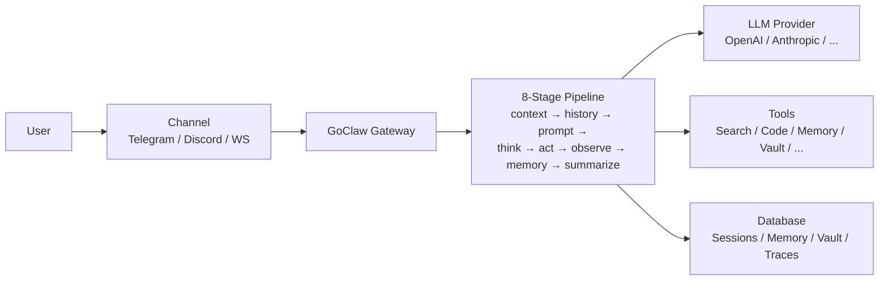

# What Is GoClaw

> A multi-tenant AI agent gateway that connects LLMs to messaging channels, tools, and teams.

## Overview

GoClaw is an open-source AI agent gateway written in Go. It lets you run AI agents that can chat on Telegram, Discord, WhatsApp, and other channels — while sharing tools, memory, and context across a team. Think of it as the bridge between your LLM providers and the real world.

## Key Features

| Category | What You Get |
|----------|-------------|
| **Multi-Tenant v3** | Per-user isolation for context, sessions, memory, and traces; per-edition rate limits |
| **8-Stage Agent Pipeline** | context → history → prompt → think → act → observe → memory → summarize (v3, always-on) |
| **22 Provider Types** | OpenAI, Anthropic, Google, Groq, DeepSeek, Mistral, xAI, and more (15 LLM APIs + local models + CLI agents + media) |
| **Messaging Channels** | Telegram, Discord, WhatsApp (native), Zalo, Zalo Personal, Larksuite, Slack, WebSocket |
| **32 Built-in Tools** | File system, web search, browser, code execution, memory, and more |
| **64+ WebSocket RPC Methods** | Real-time control — chat, agent management, traces, and more via `/ws` |
| **Agent Orchestration** | Delegation (sync/async), teams, handoff, evaluate loops, WaitAll via `BatchQueue[T]` |
| **3-Tier Memory** | L0/L1/L2 with consolidation workers (episodic, semantic, dreaming, dedup) |
| **Knowledge Vault** | Wikilink document mesh, LLM auto-summary + semantic auto-linking, hybrid BM25 + vector search |
| **Knowledge Graph** | LLM-powered entity/relationship extraction with graph traversal |
| **Agent Evolution** | Guardrails + suggestion engine; predefined agents refine SOUL.md / CAPABILITIES.md and grow skills |
| **Mode Prompt System** | Switchable prompt modes (full / task / minimal / none) with per-agent overrides |
| **MCP Support** | Connect to Model Context Protocol servers (stdio/SSE/HTTP) |
| **Skills System** | SKILL.md-based knowledge base with hybrid search; publishing, grants, evolution-driven drafts |
| **Quality Gates** | Hook-based output validation with configurable feedback loops |
| **Extended Thinking** | Per-provider reasoning modes (Anthropic, OpenAI, DashScope) |
| **Prompt Caching** | Up to ~90% cost reduction on repeated prefixes; v3 cache-boundary markers |
| **Web Dashboard** | Visual management for agents, providers, channels, vault, traces |
| **Security** | Rate limiting, SSRF protection, credential scrubbing, RBAC, session IDOR hardening |
| **Dual-DB** | PostgreSQL (full) or SQLite desktop variant via unified store Dialect |
| **Single Binary** | ~25 MB, <1s startup, runs on a $5 VPS |

## Who Is It For?

- **Developers** building AI-powered chatbots and assistants
- **Teams** that need shared AI agents with role-based access
- **Enterprises** requiring multi-tenant isolation and audit trails

## Operating Mode

GoClaw runs on **PostgreSQL** (full multi-tenant production) or **SQLite** (single-user desktop). Both paths support encrypted credentials, per-user isolated workspaces, and persistent memory — giving you full isolation, complete activity logs, and smart search across all conversations. SQLite omits pgvector-only features (vault semantic auto-linking falls back to lexical).

## How It Works

1. A user sends a message through a **channel** (Telegram, WebSocket, etc.)
2. The **gateway** routes it to the right agent based on channel bindings
3. The **8-stage pipeline** runs: it assembles context, pulls history, builds the prompt, thinks (LLM call), acts (tool calls), observes results, updates memory, and summarizes
4. Tools can **search the web, run code, query memory, knowledge graph, or knowledge vault**
5. The agent can **delegate** tasks to subagents (with `BatchQueue[T]` for parallel waits), **hand off** conversations, or run **evaluate loops** for quality-gated output
6. Background **consolidation workers** promote episodic facts into semantic memory; the **vault enrich worker** auto-summarizes and semantically links new documents
7. The response flows back through the channel to the user

## What's Next

- [Installation](/installation) — Get GoClaw running on your machine
- [Quick Start](/quick-start) — Your first agent in 5 minutes
- [How GoClaw Works](/how-goclaw-works) — Deep dive into the architecture

<!-- goclaw-source: 050aafc9 | updated: 2026-04-09 -->
