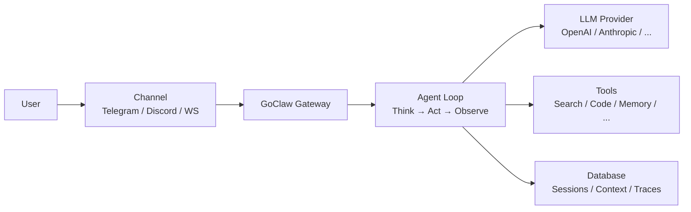

# What Is GoClaw

> A multi-tenant AI agent gateway that connects LLMs to messaging channels, tools, and teams.

## Overview

GoClaw is an open-source AI agent gateway written in Go. It lets you run AI agents that can chat on Telegram, Discord, WhatsApp, and other channels — while sharing tools, memory, and context across a team. Think of it as the bridge between your LLM providers and the real world.

## Key Features

| Category | What You Get |
|----------|-------------|
| **Multi-Tenant** | Per-user isolation for context, sessions, memory, and traces |
| **13+ LLM Providers** | OpenAI, Anthropic, Google, Groq, DeepSeek, Mistral, xAI, and more |
| **6 Channels** | Telegram, Discord, WhatsApp, Zalo, Feishu/Lark, WebSocket |
| **60+ Built-in Tools** | File system, web search, browser, code execution, memory, and more |
| **Agent Teams** | Multiple agents with shared task board and delegation |
| **MCP Support** | Connect to Model Context Protocol servers for extended capabilities |
| **Web Dashboard** | Visual management for agents, providers, channels, and traces |
| **Memory** | Long-term memory with hybrid search (vector + full-text) |
| **Single Binary** | ~25 MB, <1s startup, runs on a $5 VPS |

## Who Is It For?

- **Developers** building AI-powered chatbots and assistants
- **Teams** that need shared AI agents with role-based access
- **Enterprises** requiring multi-tenant isolation and audit trails

## Operating Mode

GoClaw requires a PostgreSQL backend with encrypted credentials, multi-user support, and persistent memory. This gives you full multi-tenant isolation, tracing, and hybrid search out of the box.

## How It Works

1. A user sends a message through a **channel** (Telegram, WebSocket, etc.)
2. The **gateway** routes it to the right agent based on channel bindings
3. The **agent loop** sends the conversation to an LLM provider
4. The LLM may call **tools** (search the web, run code, query memory)
5. The response flows back through the channel to the user

## What's Next

- [Installation](installation.md) — Get GoClaw running on your machine
- [Quick Start](quick-start.md) — Your first agent in 5 minutes
- [How GoClaw Works](../core-concepts/how-goclaw-works.md) — Deep dive into the architecture
