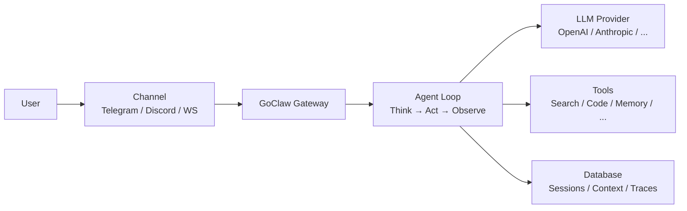

# What Is GoClaw

> A multi-tenant AI agent gateway that connects LLMs to messaging channels, tools, and teams.

## Overview

GoClaw is an open-source AI agent gateway written in Go. It lets you run AI agents that can chat on Telegram, Discord, WhatsApp, and other channels — while sharing tools, memory, and context across a team. Think of it as the bridge between your LLM providers and the real world.

## Key Features

| Category | What You Get |
|----------|-------------|
| **Multi-Tenant** | Per-user isolation for context, sessions, memory, and traces |
| **22 Provider Types** | OpenAI, Anthropic, Google, Groq, DeepSeek, Mistral, xAI, and more (15 LLM APIs + local models + CLI agents + media) |
| **7 Channels** | Telegram, Discord, WhatsApp, Zalo, Zalo Personal, Larksuite, Slack |
| **32 Built-in Tools** | File system, web search, browser, code execution, memory, and more |
| **64+ WebSocket RPC Methods** | Real-time control — chat, agent management, traces, and more via `/ws` |
| **Agent Orchestration** | 4 patterns — delegation (sync/async), teams, handoff, evaluate loops |
| **Knowledge Graph** | LLM-powered entity/relationship extraction with graph traversal |
| **MCP Support** | Connect to Model Context Protocol servers (stdio/SSE/HTTP) |
| **Skills System** | SKILL.md-based knowledge base with hybrid search (BM25 + vector) |
| **Quality Gates** | Hook-based output validation with configurable feedback loops |
| **Extended Thinking** | Per-provider reasoning modes (Anthropic, OpenAI, DashScope) |
| **Prompt Caching** | Up to ~90% cost reduction on repeated prefixes |
| **Web Dashboard** | Visual management for agents, providers, channels, and traces |
| **Memory** | Long-term memory with hybrid search (vector + full-text) |
| **Security** | Rate limiting, SSRF protection, credential scrubbing, RBAC |
| **Single Binary** | ~25 MB, <1s startup, runs on a $5 VPS |

## Who Is It For?

- **Developers** building AI-powered chatbots and assistants
- **Teams** that need shared AI agents with role-based access
- **Enterprises** requiring multi-tenant isolation and audit trails

## Operating Mode

GoClaw requires a PostgreSQL backend with encrypted credentials, multi-user support (each user gets their own isolated workspace), and persistent memory. This gives you full isolation between users, complete activity logs, and smart search across all conversations.

## How It Works

1. A user sends a message through a **channel** (Telegram, WebSocket, etc.)
2. The **gateway** routes it to the right agent based on channel bindings
3. The **agent loop** sends the conversation to an LLM provider
4. The LLM may call **tools** (search the web, run code, query memory, search knowledge graph)
5. The agent can **delegate** tasks to other agents, **hand off** conversations, or run **evaluate loops** for quality-gated output
6. The response flows back through the channel to the user

## What's Next

- [Installation](/installation) — Get GoClaw running on your machine
- [Quick Start](/quick-start) — Your first agent in 5 minutes
- [How GoClaw Works](/how-goclaw-works) — Deep dive into the architecture

<!-- goclaw-source: 57754a5 | updated: 2026-03-18 -->
