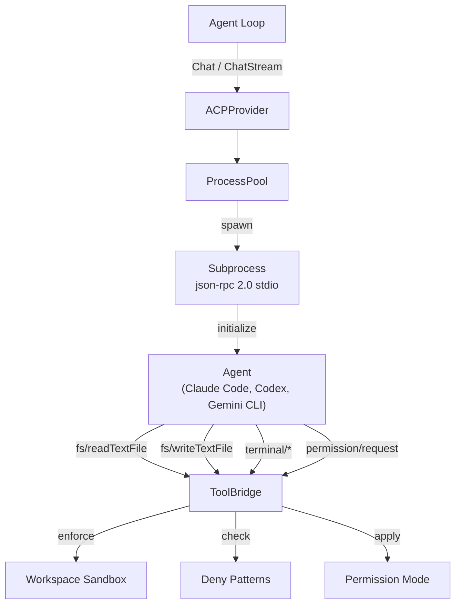
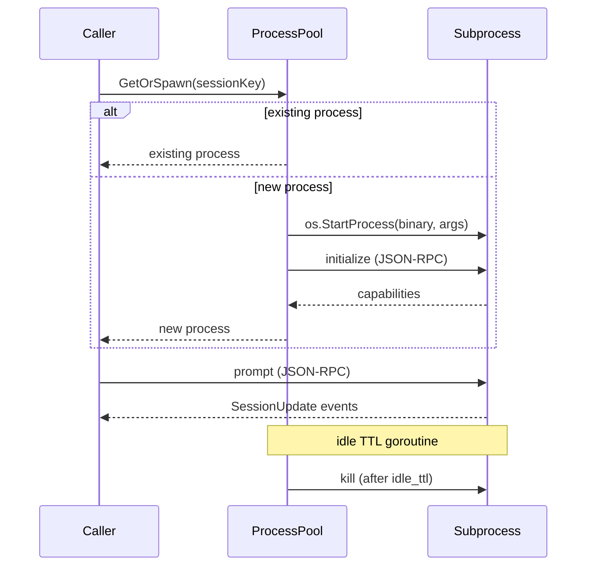

# ACP (Agent Client Protocol)

> Use Claude Code, Codex CLI, or Gemini CLI as LLM providers through the Agent Client Protocol — orchestrated as JSON-RPC subprocesses.

## What is ACP?

ACP (Agent Client Protocol) enables GoClaw to orchestrate external coding agents — Claude Code, OpenAI Codex CLI, Gemini CLI, or any ACP-compatible agent — as subprocesses via **JSON-RPC 2.0 over stdio**. Instead of calling an HTTP API, GoClaw spawns the agent binary as a child process and exchanges structured messages through its stdin/stdout pipes.

This allows delegating complex code generation and reasoning tasks to specialized CLI agents while maintaining GoClaw's unified `Provider` interface: the rest of the system treats ACP exactly like any other provider.



---

## Configuration

Add an `acp` entry under `providers` in `config.json`:

```json
{
  "providers": {
    "acp": {
      "binary": "claude",
      "args": ["--profile", "goclaw"],
      "model": "claude",
      "work_dir": "/tmp/workspace",
      "idle_ttl": "5m",
      "perm_mode": "approve-all"
    }
  }
}
```

### ACPConfig Fields

| Field | Type | Default | Description |
|-------|------|---------|-------------|
| `binary` | string | `"claude"` | Agent binary name or absolute path (e.g. `"claude"`, `"codex"`, `"gemini"`) |
| `args` | `[]string` | `[]` | Extra spawn arguments appended to every subprocess launch |
| `model` | string | `"claude"` | Default model/agent name reported to callers |
| `work_dir` | string | required | Base workspace directory — all file operations are scoped here |
| `idle_ttl` | string | `"5m"` | Duration after which idle subprocesses are reaped (Go duration string) |
| `perm_mode` | string | `"approve-all"` | Permission policy: `approve-all`, `approve-reads`, or `deny-all` |

### Database Registration

Providers can also be registered dynamically via the `llm_providers` table:

| Column | Value |
|--------|-------|
| `provider_type` | `"acp"` |
| `api_base` | binary name (e.g. `"claude"`) |
| `settings` | `{"args": [...], "idle_ttl": "5m", "perm_mode": "approve-all", "work_dir": "..."}` |

---

## ProcessPool

The `ProcessPool` manages subprocess lifecycle. Each session (identified by `session_key`) maps to one long-lived subprocess:

1. **GetOrSpawn** — on each request, retrieve the existing subprocess for the session or spawn a new one.
2. **Initialize** — freshly spawned processes receive a JSON-RPC `initialize` call that negotiates protocol capabilities.
3. **Idle TTL reaping** — a background goroutine periodically checks last-used timestamps; processes idle longer than `idle_ttl` are killed and removed.
4. **Crash recovery** — if a subprocess exits unexpectedly, the pool detects the broken pipe on the next request, removes the stale entry, and spawns a fresh process transparently.



---

## ToolBridge

When the agent subprocess needs to read a file, run a command, or request a permission, it sends a JSON-RPC request back to GoClaw over stdio. The `ToolBridge` handles these agent→client callbacks:

| Method | Description |
|--------|-------------|
| `fs/readTextFile` | Read a file within the workspace sandbox |
| `fs/writeTextFile` | Write a file within the workspace sandbox |
| `terminal/createTerminal` | Spawn a terminal subprocess |
| `terminal/terminalOutput` | Fetch terminal output and exit status |
| `terminal/waitForTerminalExit` | Block until terminal exits |
| `terminal/releaseTerminal` | Release terminal resources |
| `terminal/killTerminal` | Force-terminate a terminal |
| `permission/request` | Request user approval for an action |

Every ToolBridge call is validated through:
1. **Workspace isolation** — path must be within `work_dir`
2. **Deny pattern matching** — path regex patterns checked before execution
3. **Permission mode** — final gate based on `perm_mode`

---

## Session Tracking

Each ACP subprocess maintains a server-assigned session ID. The session lifecycle is:

1. **`session/new`** — called immediately after `initialize`; the server returns a `sessionID`
2. **`session/prompt`** — sends the user content with the `sessionID`; server emits `SessionUpdate` notifications during execution
3. **`session/cancel`** — sent as a notification when the caller cancels context

The session ID is stored per-process in `ACPProcess.sessionID` and included in every prompt request. This allows the ACP agent to maintain conversation history and file state across multiple turns within the same process lifetime.

## Session Sequencing

Concurrent requests to the same session would risk corrupting file state. ACP serializes per-session requests via a `sessionMu` mutex:

```go
unlock := p.lockSession(sessionKey)
defer unlock()
// Chat or ChatStream executes with guaranteed serial access
```

This means requests to different sessions run in parallel, but requests to the same session are queued.

---

## Streaming vs Non-Streaming

### Chat (non-streaming)

Waits for the agent subprocess to finish executing the prompt, then collects all accumulated `SessionUpdate` text blocks and returns a single `ChatResponse`. Use this when you need the full answer before processing.

### ChatStream

Emits `StreamChunk` callbacks for each text delta as the agent produces output. Supports context cancellation: if the caller cancels, GoClaw sends a `session/cancel` JSON-RPC notification to the subprocess. Returns the combined `ChatResponse` when complete.

---

## Workspace Sandbox

All file operations are confined to `work_dir`. Path traversal attempts (e.g. `../../etc/passwd`) are detected and rejected before reaching the filesystem.

### Deny Patterns

Regex patterns block access to sensitive paths regardless of workspace scope:

```json
[
  "^/etc/",
  "^\\.env",
  "^secret",
  "^[Cc]redentials"
]
```

Patterns are evaluated against the resolved absolute path. Any match causes the request to be rejected with an error.

---

## Permission Modes

| Mode | Behavior |
|------|----------|
| `approve-all` | All `permission/request` calls are auto-approved (default) |
| `approve-reads` | Read operations are approved; filesystem writes are denied |
| `deny-all` | All `permission/request` calls are denied |

---

## Content Handling

ACP uses `ContentBlock` for messages, supporting text, image, and audio:

```go
type ContentBlock struct {
    Type     string // "text", "image", "audio"
    Text     string // text content
    Data     string // base64-encoded for image/audio
    MimeType string // e.g. "image/png", "audio/wav"
}
```

On each request, GoClaw:
1. Extracts the system prompt and user messages from `ChatRequest.Messages`
2. Prepends the system prompt to the first user message (ACP agents have no separate system API)
3. Attaches any image content blocks as additional message blocks

On response, GoClaw:
1. Accumulates `SessionUpdate` notifications emitted during execution
2. Collects all text blocks into response content
3. Maps `stopReason`: `"maxContextLength"` → `"length"`, all others → `"stop"`

---

## Security Considerations

- **Subprocess isolation**: each agent process runs as the same OS user as GoClaw. Use OS-level sandboxing (e.g. containers, seccomp) for stronger isolation.
- **Workspace confinement**: `work_dir` is the only directory the agent can read/write via ToolBridge. Set it to a dedicated, non-sensitive directory.
- **Deny patterns**: configure patterns matching your secrets layout (`.env`, `credentials`, `*.pem`, etc.)
- **Permission mode**: use `approve-reads` or `deny-all` in production environments where write access should be restricted.
- **Binary path**: specify an absolute path for `binary` to prevent PATH injection attacks.
- **idle_ttl**: keep short (≤10m) to limit the attack surface from a compromised subprocess.

---

## What's Next

- [Provider Overview](/providers-overview)
- [Claude CLI](/provider-claude-cli)
- [Custom / OpenAI-Compatible](/provider-custom)

<!-- goclaw-source: 050aafc9 | updated: 2026-04-09 -->
