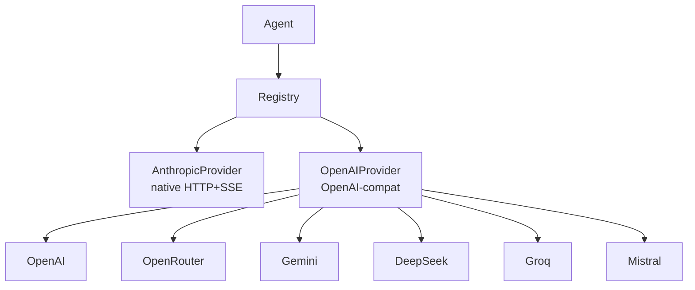

# Providers Overview

> Providers are the interface between GoClaw and LLM APIs — configure one (or many) and every agent can use it.

## Overview

A provider wraps an LLM API and exposes a common interface: `Chat()`, `ChatStream()`, `DefaultModel()`, and `Name()`. GoClaw has two provider implementations: a native Anthropic client (custom HTTP+SSE) and a generic OpenAI-compatible client that covers OpenAI, OpenRouter, Gemini, DeepSeek, Groq, Mistral, and more. You pick which provider an agent uses via its config; the rest of the system is provider-agnostic.

## Provider Interface

Every provider implements the same Go interface:

```
Chat()        — blocking call, returns full response
ChatStream()  — streaming call, fires onChunk callback per token
DefaultModel() — returns the configured default model name
Name()        — returns provider identifier (e.g. "anthropic", "openai")
```

Providers that support extended thinking also implement `SupportsThinking() bool`.

## Adding a Provider

### Static config (config.json)

Add your API key under `providers.<name>`:

```json
{
  "providers": {
    "anthropic": {
      "api_key": "sk-ant-..."
    },
    "openai": {
      "api_key": "sk-...",
      "api_base": "https://api.openai.com/v1"
    },
    "openrouter": {
      "api_key": "sk-or-..."
    }
  }
}
```

The `api_base` field is optional — each provider has a built-in default endpoint.

### Dashboard (llm_providers table)

Providers can also be stored in the `llm_providers` PostgreSQL table. API keys are encrypted at rest using AES-256-GCM. You can add, edit, or remove providers from the dashboard without restarting GoClaw. Changes take effect on the next request.

## Retry Logic

All providers share the same retry behavior via `RetryDo()`:

| Setting | Value |
|---|---|
| Max attempts | 3 |
| Initial delay | 300ms |
| Max delay | 30s |
| Jitter | ±10% |
| Retryable status codes | 429, 500, 502, 503, 504 |
| Retryable network errors | timeouts, connection reset, broken pipe, EOF |

When the API returns a `Retry-After` header (common on 429 responses), GoClaw uses that value instead of computing exponential backoff.

## Provider Architecture



## Auto-Clamp max_tokens

When a model rejects a request because `max_tokens` is too large, GoClaw automatically retries with a clamped value. This handles both `max_tokens` and `max_completion_tokens` parameter names depending on the provider. The retry is transparent — the agent never sees the error.

## Common Issues

| Issue | Cause | Fix |
|---|---|---|
| `provider not found: X` | Provider name typo or missing config | Check spelling in config.json matches provider name |
| `HTTP 401` | Invalid or missing API key | Verify API key is correct |
| `HTTP 429` | Rate limit hit | GoClaw retries automatically; reduce request concurrency |
| Provider not listed | Key not set | Add `api_key` to the provider's config block |

## What's Next

- [Anthropic](/provider-anthropic) — native Claude integration with extended thinking
- [OpenAI](/provider-openai) — GPT-4o, o-series reasoning models
- [OpenRouter](/provider-openrouter) — access 100+ models through one API
- [Gemini](/provider-gemini) — Google Gemini via OpenAI-compatible endpoint
- [DeepSeek](/provider-deepseek) — DeepSeek with reasoning_content support
- [Groq](/provider-groq) — ultra-fast inference
- [Mistral](/provider-mistral) — Mistral AI models

<!-- goclaw-source: 941a965 | updated: 2026-03-19 -->

<!-- goclaw-source: 57754a5 | updated: 2026-03-18 -->
