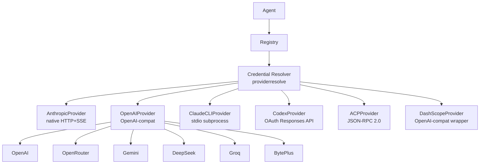

# Providers Overview

> Providers are the interface between GoClaw and LLM APIs — configure one (or many) and every agent can use it.

## Overview

A provider wraps an LLM API and exposes a common interface: `Chat()`, `ChatStream()`, `DefaultModel()`, and `Name()`. GoClaw has six concrete provider implementations: a native Anthropic client (custom HTTP+SSE), a generic OpenAI-compatible client that covers 15+ API endpoints, Claude CLI (local binary via stdio), Codex (OAuth-based ChatGPT Responses API), ACP (subagent orchestration via JSON-RPC 2.0), and DashScope (Alibaba Qwen). You pick which provider an agent uses via its config; the rest of the system is provider-agnostic.

## Provider Adapter System

GoClaw v3 introduces a pluggable **provider adapter** layer. Each provider type registers an adapter via `adapter_register.go`. Adapters share a common `SSEScanner` (`internal/providers/sse_reader.go`) that reads Server-Sent Events line-by-line, eliminating the per-provider streaming duplication that existed before.

```
SSEScanner
└── Shared by: Anthropic, OpenAI-compat, Codex adapters
    └── Reads SSE data payloads, tracks event types, stops at [DONE]
```

## Credential Resolver

The `internal/providerresolve/` package provides a unified **credential resolver** (`ResolveConfiguredProvider`) used across all adapters. It:

1. Looks up the provider from the tenant registry
2. For `chatgpt_oauth` (Codex) providers, resolves pool routing configuration from both provider-level defaults and agent-level overrides
3. Returns the correct `Provider` (or a `ChatGPTOAuthRouter` for pool strategies)

Credentials are stored encrypted (AES-256-GCM) in the `llm_providers` PostgreSQL table and decrypted at load time — never stored in memory as plaintext beyond the initial load.

## Provider Interface

Every provider implements the same Go interface:

```
Chat()        — blocking call, returns full response
ChatStream()  — streaming call, fires onChunk callback per token
DefaultModel() — returns the configured default model name
Name()        — returns provider identifier (e.g. "anthropic", "openai")
```

Providers that support extended thinking also implement `SupportsThinking() bool`.

## Supported Provider Types

| Provider | Type | Default Model |
|----------|------|---------------|
| **anthropic** | Native HTTP + SSE | `claude-sonnet-4-5-20250929` |
| **claude_cli** | stdio subprocess + MCP | `sonnet` |
| **codex** / **chatgpt_oauth** | OAuth Responses API | `gpt-5.3-codex` |
| **acp** | JSON-RPC 2.0 subagents | `claude` |
| **dashscope** | OpenAI-compat wrapper | `qwen3-max` |
| **openai** (+ 15+ variants) | OpenAI-compatible | Model-specific |

### OpenAI-Compatible Providers

| Provider | API Base | Default Model |
|----------|----------|---------------|
| openai | `https://api.openai.com/v1` | `gpt-4o` |
| openrouter | `https://openrouter.ai/api/v1` | `anthropic/claude-sonnet-4-5-20250929` |
| groq | `https://api.groq.com/openai/v1` | `llama-3.3-70b-versatile` |
| deepseek | `https://api.deepseek.com/v1` | `deepseek-chat` |
| gemini | `https://generativelanguage.googleapis.com/v1beta/openai` | `gemini-2.0-flash` |
| mistral | `https://api.mistral.ai/v1` | `mistral-large-latest` |
| xai | `https://api.x.ai/v1` | `grok-3-mini` |
| minimax | `https://api.minimax.io/v1` | `MiniMax-M2.5` |
| cohere | `https://api.cohere.ai/compatibility/v1` | `command-a` |
| perplexity | `https://api.perplexity.ai` | `sonar-pro` |
| ollama | `http://localhost:11434/v1` | `llama3.3` |
| byteplus | `https://ark.ap-southeast.bytepluses.com/api/v3` | `seed-2-0-lite-260228` |

## Adding a Provider

### Static config (config.json)

Add your API key under `providers.<name>`:

```json
{
  "providers": {
    "anthropic": {
      "api_key": "sk-ant-..."
    },
    "openai": {
      "api_key": "sk-...",
      "api_base": "https://api.openai.com/v1"
    },
    "openrouter": {
      "api_key": "sk-or-..."
    }
  }
}
```

The `api_base` field is optional — each provider has a built-in default endpoint.

### Dashboard (llm_providers table)

Providers can also be stored in the `llm_providers` PostgreSQL table. API keys are encrypted at rest using AES-256-GCM. You can add, edit, or remove providers from the dashboard without restarting GoClaw. Changes take effect on the next request.

> **Note:** `provider_type` is immutable after creation — it cannot be changed via the API or dashboard. To switch provider types, delete and recreate the provider.

## Provider Architecture



## Retry Logic

All providers share the same retry behavior via `RetryDo()`:

| Setting | Value |
|---|---|
| Max attempts | 3 |
| Initial delay | 300ms |
| Max delay | 30s |
| Jitter | ±10% |
| Retryable status codes | 429, 500, 502, 503, 504 |
| Retryable network errors | timeouts, connection reset, broken pipe, EOF |

When the API returns a `Retry-After` header (common on 429 responses), GoClaw uses that value instead of computing exponential backoff.

## BytePlus Media Generation (Seedream & Seedance)

The `byteplus` provider supports two async media generation capabilities via the BytePlus ModelArk platform:

| Tool | Model | Capability |
|------|-------|-----------|
| `create_image_byteplus` | Seedream (e.g. `seedream-3-0`) | Async image generation — submits a job and polls for the result |
| `create_video_byteplus` | Seedance (e.g. `seedance-1-0`) | Async video generation — submits a job and polls `/text-to-video-pro/status/{id}` |

Both tools are automatically available when a `byteplus` provider is configured. They share the same API key and `api_base` as the text provider; media endpoints are derived automatically (always `/api/v3`, not `/api/coding/v3`).

## ACP Provider (Claude Code, Codex CLI, Gemini CLI)

The `acp` provider orchestrates external coding agents (Claude Code, Codex CLI, Gemini CLI, or any ACP-compatible agent) as subprocesses via JSON-RPC 2.0 over stdio. Configure via `provider_type: "acp"` with `binary`, `work_dir`, `idle_ttl`, and `perm_mode` settings. See [ACP Provider](/provider-acp) for full details.

## Qwen 3.5 / DashScope Per-Model Thinking

The `dashscope` provider supports extended thinking for Qwen models with a per-model thinking guard. When tools are present, streaming is automatically disabled and GoClaw falls back to a single non-streaming call (DashScope limitation). Thinking budget mapping: low=4,096, medium=16,384, high=32,768 tokens.

## OpenAI GPT-5 / o-series Notes

For GPT-5 and o-series models, use `max_completion_tokens` instead of `max_tokens`. GoClaw automatically selects the correct parameter name based on model capabilities. Temperature is silently skipped for reasoning models that do not support it.

## Anthropic Prompt Caching

Anthropic prompt caching is applied via the `CacheMiddleware` in the request middleware pipeline. Model aliases are resolved before the cache key is computed — e.g., `sonnet` resolves to the full model name before the request is sent.

## Codex OAuth Pool Routing

When multiple `chatgpt_oauth` provider aliases are configured, GoClaw can route requests across them using a pool strategy. Configure this via `settings.codex_pool` on the pool-owner provider:

```json
{
  "name": "openai-codex",
  "provider_type": "chatgpt_oauth",
  "settings": {
    "codex_pool": {
      "strategy": "round_robin",
      "extra_provider_names": ["codex-work", "codex-personal"]
    }
  }
}
```

| Strategy | Behavior |
|----------|----------|
| `round_robin` | Rotates requests across the preferred account plus all extra accounts |
| `priority_order` | Tries the preferred account first, then drains extra accounts in order |
| `primary_first` | Keeps the preferred account fixed (disables pool for that agent) |

Retryable upstream failures fall through to the next eligible account in the same request. Pool activity per-agent is visible at `GET /v1/agents/{id}/codex-pool-activity`.

## Provider-Level `reasoning_defaults`

Providers (currently `chatgpt_oauth`) can store reusable reasoning defaults in `settings.reasoning_defaults`. Agents inherit them via `reasoning.override_mode: "inherit"` or override with `"custom"`. See [OpenAI provider](/provider-openai) for full details.

## Capability-Aware Reasoning Effort

Reasoning effort controls (`reasoning_effort`, `thinking_budget`, etc.) are resolved against model capabilities before each request. If the target model does not support reasoning effort, the parameter is silently dropped — no error is returned. This means you can configure reasoning effort globally and it will only be applied to models that support it.

## Datetime Tool for Provider Context

A built-in `datetime` tool is available in provider context, allowing agents and providers to access the current date and time. This is useful for time-sensitive reasoning and scheduling tasks without relying on the model's knowledge cutoff.

## Auto-Clamp max_tokens

When a model rejects a request because `max_tokens` is too large, GoClaw automatically retries with a clamped value. This handles both `max_tokens` and `max_completion_tokens` parameter names depending on the provider. The retry is transparent — the agent never sees the error.

## Tool Schema Normalization for MCP Tools

When GoClaw bridges MCP (Model Context Protocol) tools to a provider, tool schemas are normalized to match the provider's expected format. Field types, required arrays, and unsupported properties are adjusted automatically. This ensures MCP tools work across all provider backends without manual schema adaptation.

## Common Issues

| Issue | Cause | Fix |
|---|---|---|
| `provider not found: X` | Provider name typo or missing config | Check spelling in config.json matches provider name |
| `HTTP 401` | Invalid or missing API key | Verify API key is correct |
| `HTTP 429` | Rate limit hit | GoClaw retries automatically; reduce request concurrency |
| Provider not listed | Key not set | Add `api_key` to the provider's config block |

## What's Next

- [Anthropic](/provider-anthropic) — native Claude integration with extended thinking
- [OpenAI](/provider-openai) — GPT-4o, o-series, GPT-5 reasoning models
- [OpenRouter](/provider-openrouter) — access 100+ models through one API
- [Gemini](/provider-gemini) — Google Gemini via OpenAI-compatible endpoint
- [DeepSeek](/provider-deepseek) — DeepSeek with reasoning_content support
- [Groq](/provider-groq) — ultra-fast inference
- [DashScope](/provider-dashscope) — Alibaba Qwen models with thinking support
- [ACP](/provider-acp) — Claude Code, Codex CLI, Gemini CLI subagent orchestration

<!-- goclaw-source: 050aafc9 | updated: 2026-04-09 -->
