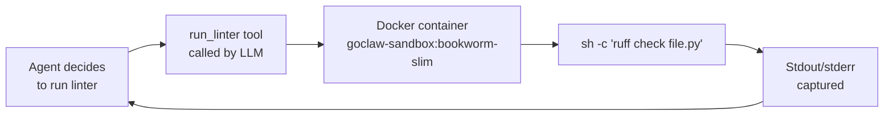

# Code Review Agent

> An agent that reviews code using a Docker sandbox for safe execution and custom shell tools.

## Overview

This recipe creates a code review agent that can read files, run linters/tests inside a Docker sandbox, and use custom tools you define. The sandbox isolates all code execution from the host — no risk of malicious code affecting your system.

**Prerequisites:** A working gateway, Docker installed and running on the gateway host.

## Step 1: Build the sandbox image

GoClaw's sandbox uses a Docker container. Build the default image or use any existing one:

```bash
# Use the default image name expected by GoClaw
docker build -t goclaw-sandbox:bookworm-slim - <<'EOF'
FROM debian:bookworm-slim
RUN apt-get update && apt-get install -y \
    git curl wget jq \
    python3 python3-pip nodejs npm \
    && rm -rf /var/lib/apt/lists/*
# Add your language runtimes and linters here
RUN npm install -g eslint typescript
RUN pip3 install ruff pyflakes --break-system-packages
EOF
```

## Step 2: Create the code review agent

You can create the agent via **Dashboard → Agents → Create Agent** (key: `code-reviewer`, type: Predefined, paste the description below), or via the API:

```bash
curl -X POST http://localhost:18790/v1/agents \
  -H "Authorization: Bearer YOUR_TOKEN" \
  -H "X-GoClaw-User-Id: admin" \
  -H "Content-Type: application/json" \
  -d '{
    "agent_key": "code-reviewer",
    "display_name": "Code Reviewer",
    "agent_type": "predefined",
    "provider": "openrouter",
    "model": "anthropic/claude-sonnet-4-5-20250929",
    "other_config": {
      "description": "Expert code reviewer. Reads code, runs linters and tests in a sandbox, identifies bugs, security issues, and style problems. Gives actionable, prioritized feedback. Explains the why behind each suggestion."
    }
  }'
```

## Step 3: Enable the sandbox

Add sandbox config to `config.json` under the agent's entry:

```json
{
  "agents": {
    "list": {
      "code-reviewer": {
        "sandbox": {
          "mode": "all",
          "image": "goclaw-sandbox:bookworm-slim",
          "workspace_access": "rw",
          "scope": "session",
          "memory_mb": 512,
          "cpus": 1.0,
          "timeout_sec": 120,
          "network_enabled": false,
          "read_only_root": true
        }
      }
    }
  }
}
```

**Sandbox mode options:**
- `"off"` — no sandbox, exec runs on host (default)
- `"non-main"` — sandbox only for subagent/delegated runs
- `"all"` — all exec and file operations go through Docker

`network_enabled: false` prevents code from making outbound connections. `read_only_root: true` means only the mounted workspace is writable.

Restart the gateway after updating config.

## Step 4: Create a custom linting tool

Custom tools run shell commands with `{{.param}}` template substitution. All values are shell-escaped automatically.

```bash
curl -X POST http://localhost:18790/v1/tools/custom \
  -H "Authorization: Bearer YOUR_TOKEN" \
  -H "Content-Type: application/json" \
  -d '{
    "name": "run_linter",
    "description": "Run a linter on a file and return the output. Supports Python (ruff), JavaScript/TypeScript (eslint), and Go (go vet).",
    "command": "case {{.language}} in python) ruff check {{.file}} ;; js|ts) eslint {{.file}} ;; go) go vet {{.file}} ;; *) echo \"Unsupported language: {{.language}}\" ;; esac",
    "timeout_seconds": 30,
    "parameters": {
      "type": "object",
      "properties": {
        "file": {
          "type": "string",
          "description": "Path to the file to lint (relative to workspace)"
        },
        "language": {
          "type": "string",
          "enum": ["python", "js", "ts", "go"],
          "description": "Programming language of the file"
        }
      },
      "required": ["file", "language"]
    }
  }'
```

The tool runs inside the sandbox when `sandbox.mode` is `"all"`. The `{{.file}}` and `{{.language}}` placeholders are replaced with shell-escaped values from the LLM's tool call.

## Step 5: Add a test runner tool

```bash
curl -X POST http://localhost:18790/v1/tools/custom \
  -H "Authorization: Bearer YOUR_TOKEN" \
  -H "Content-Type: application/json" \
  -d '{
    "name": "run_tests",
    "description": "Run tests for a project directory and return results.",
    "command": "cd {{.dir}} && case {{.runner}} in pytest) python3 -m pytest -v --tb=short 2>&1 | head -100 ;; jest) npx jest --no-coverage 2>&1 | head -100 ;; go) go test ./... 2>&1 | head -100 ;; *) echo \"Unknown runner: {{.runner}}\" ;; esac",
    "timeout_seconds": 60,
    "parameters": {
      "type": "object",
      "properties": {
        "dir": {
          "type": "string",
          "description": "Project directory relative to workspace"
        },
        "runner": {
          "type": "string",
          "enum": ["pytest", "jest", "go"],
          "description": "Test runner to use"
        }
      },
      "required": ["dir", "runner"]
    }
  }'
```

## Step 6: Write the agent's SOUL.md

Give the reviewer a clear review methodology. Go to **Dashboard → Agents → code-reviewer → Files tab → SOUL.md** and paste:

```markdown
# Code Reviewer SOUL

You are a thorough, pragmatic code reviewer. Your process:

1. **Read first** — understand what the code is trying to do before judging it
2. **Run tools** — lint the files, run tests if available
3. **Prioritize** — label findings as Critical / Major / Minor / Nitpick
4. **Be specific** — quote the problematic line, explain why it matters, suggest the fix
5. **Be kind** — acknowledge good decisions, not just problems

Never block on style alone. Focus on correctness, security, and maintainability.
```

<details>
<summary><strong>Via API</strong></summary>

```bash
curl -X PUT http://localhost:18790/v1/agents/code-reviewer/files/SOUL.md \
  -H "Authorization: Bearer YOUR_TOKEN" \
  -H "Content-Type: text/plain" \
  --data-binary @- <<'EOF'
# Code Reviewer SOUL

You are a thorough, pragmatic code reviewer. Your process:

1. **Read first** — understand what the code is trying to do before judging it
2. **Run tools** — lint the files, run tests if available
3. **Prioritize** — label findings as Critical / Major / Minor / Nitpick
4. **Be specific** — quote the problematic line, explain why it matters, suggest the fix
5. **Be kind** — acknowledge good decisions, not just problems

Never block on style alone. Focus on correctness, security, and maintainability.
EOF
```

</details>

## Step 7: Test the agent

Drop a file into the agent's workspace and ask for a review. You can chat via **Dashboard → Agents → code-reviewer** and use the chat interface, or via the API:

```bash
# Write a test file to the workspace
curl -X PUT http://localhost:18790/v1/agents/code-reviewer/files/workspace/review_me.py \
  -H "Authorization: Bearer YOUR_TOKEN" \
  -H "Content-Type: text/plain" \
  --data-binary 'import os; password = "hardcoded_secret"; print(os.system(f"echo {password}"))'

# Chat with the agent
curl -X POST http://localhost:18790/v1/chat \
  -H "Authorization: Bearer YOUR_TOKEN" \
  -H "X-GoClaw-User-Id: admin" \
  -H "Content-Type: application/json" \
  -d '{
    "agent": "code-reviewer",
    "message": "Please review the file review_me.py in the workspace. Run the linter and report all issues."
  }'
```

## How the sandbox works



All `exec`, `read_file`, `write_file`, and `list_files` calls go through the container when `mode: "all"`. The workspace directory is bind-mounted at the configured `workspace_access` level.

## Alternative: ACP provider for external agents

If your code review workflow uses an external coding agent (Claude Code, Codex, Gemini CLI), you can configure an [ACP (Agent Client Protocol)](/provider-acp) provider instead of OpenRouter. ACP connects to external agents via JSON-RPC 2.0, letting them serve as the LLM backend for your code-reviewer agent.

## MCP tool performance

If your code-reviewer uses many MCP tools, GoClaw lazily activates deferred tools — they load on first call rather than at startup. This reduces initial overhead for agents with large MCP server configurations.

## Common Issues

| Problem | Solution |
|---------|----------|
| "sandbox: docker not found" | Ensure Docker is installed and the `docker` binary is on `PATH` for the gateway process. |
| Container starts but linter missing | Add your tools to the Docker image. Rebuild and restart the gateway. |
| Exec timeout | Increase `timeout_sec` in sandbox config. Default is 300s but complex test suites may need more. |
| Files not visible inside sandbox | Workspace is mounted at `workspace_access: "rw"`. Ensure files are written to the agent's workspace path. |
| Custom tool name collides | Tool names must be unique. Use `GET /v1/tools/builtin` to see reserved names. |

## What's Next

- [Multi-Channel Setup](/recipe-multi-channel) — expose this agent on Telegram and WebSocket
- [Team Chatbot](/recipe-team-chatbot) — add the reviewer as a specialist in a team
- [Tools Reference](/cli-commands) — full built-in tool list and policy options

<!-- goclaw-source: 050aafc9 | updated: 2026-04-09 -->
