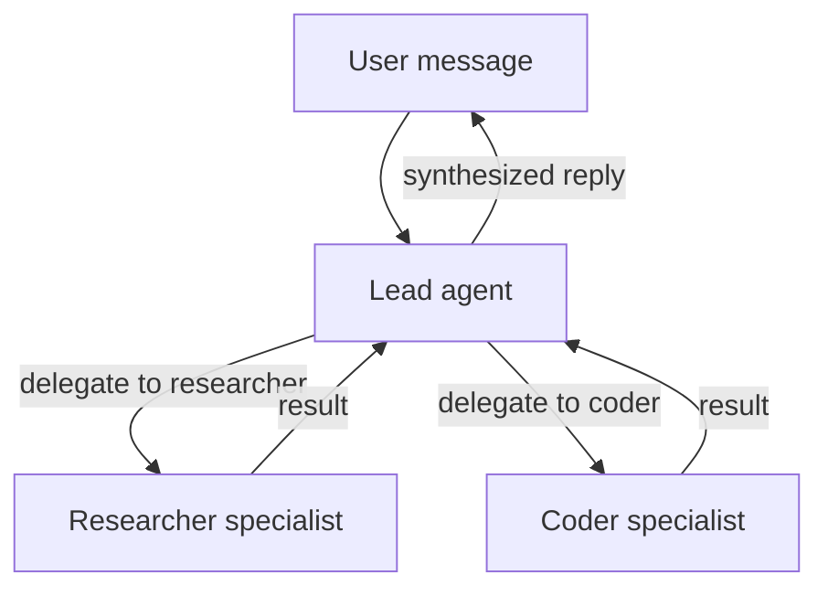

# Team Chatbot

> Multi-agent team with a lead coordinator and specialist sub-agents for different tasks.

## Overview

This recipe builds a team of three agents: a lead that handles conversation and delegates, plus two specialists (a researcher and a coder). Users talk only to the lead — it decides when to call in a specialist. Teams use GoClaw's built-in delegation system, so the lead can run specialists in parallel and synthesize results.

**What you need:**
- A working gateway (run `./goclaw onboard` first)
- Web dashboard access at `http://localhost:18790`
- At least one LLM provider configured

## Step 1: Create the specialist agents

Specialists must be **predefined** agents — only predefined agents can receive delegations.

Open the web dashboard and go to **Agents → Create Agent**. Create two specialists:

**Researcher agent:**
- **Key:** `researcher`
- **Display name:** Research Specialist
- **Type:** Predefined
- **Provider / Model:** Choose your preferred provider and model
- **Description:** "Deep research specialist. Searches the web, reads pages, synthesizes findings into concise reports with sources. Factual, thorough, cites everything."

Click **Save**. The `description` field triggers **summoning** — the gateway uses the LLM to auto-generate SOUL.md and IDENTITY.md. The agent status shows `summoning` then transitions to `active`.

**Coder agent:**

Repeat the same flow with:
- **Key:** `coder`
- **Display name:** Code Specialist
- **Type:** Predefined
- **Description:** "Senior software engineer. Writes clean, production-ready code. Explains implementation decisions. Prefers simple solutions. Tests edge cases."

Wait for both agents to reach `active` status before proceeding.

<details>
<summary><strong>Via API</strong></summary>

```bash
# Researcher
curl -X POST http://localhost:18790/v1/agents \
  -H "Authorization: Bearer YOUR_TOKEN" \
  -H "X-GoClaw-User-Id: admin" \
  -H "Content-Type: application/json" \
  -d '{
    "agent_key": "researcher",
    "display_name": "Research Specialist",
    "agent_type": "predefined",
    "provider": "openrouter",
    "model": "anthropic/claude-sonnet-4-5-20250929",
    "other_config": {
      "description": "Deep research specialist. Searches the web, reads pages, synthesizes findings into concise reports with sources. Factual, thorough, cites everything."
    }
  }'

# Coder
curl -X POST http://localhost:18790/v1/agents \
  -H "Authorization: Bearer YOUR_TOKEN" \
  -H "X-GoClaw-User-Id: admin" \
  -H "Content-Type: application/json" \
  -d '{
    "agent_key": "coder",
    "display_name": "Code Specialist",
    "agent_type": "predefined",
    "provider": "openrouter",
    "model": "anthropic/claude-sonnet-4-5-20250929",
    "other_config": {
      "description": "Senior software engineer. Writes clean, production-ready code. Explains implementation decisions. Prefers simple solutions. Tests edge cases."
    }
  }'
```

Poll agent status until `summoning` → `active`:

```bash
curl http://localhost:18790/v1/agents/researcher \
  -H "Authorization: Bearer YOUR_TOKEN"
```

</details>

## Step 2: Create the lead agent

The lead is an **open** agent — each user gets their own context, making it feel like a personal assistant that happens to have a team behind it.

In the dashboard, go to **Agents → Create Agent**:
- **Key:** `lead`
- **Display name:** Assistant
- **Type:** Open
- **Provider / Model:** Choose your preferred provider and model

Click **Save**.

<details>
<summary><strong>Via API</strong></summary>

```bash
curl -X POST http://localhost:18790/v1/agents \
  -H "Authorization: Bearer YOUR_TOKEN" \
  -H "X-GoClaw-User-Id: admin" \
  -H "Content-Type: application/json" \
  -d '{
    "agent_key": "lead",
    "display_name": "Assistant",
    "agent_type": "open",
    "provider": "openrouter",
    "model": "anthropic/claude-sonnet-4-5-20250929"
  }'
```

</details>

## Step 3: Create the team

Go to **Teams → Create Team** in the dashboard:
- **Name:** Assistant Team
- **Description:** Personal assistant team with research and coding capabilities
- **Lead:** Select `lead`
- **Members:** Add `researcher` and `coder`

Click **Save**. Creating a team automatically sets up delegation links from the lead to each member. The lead agent's context now includes a `TEAM.md` file listing available specialists and how to delegate to them.

<details>
<summary><strong>Via API</strong></summary>

Team management uses WebSocket RPC. Connect to `ws://localhost:18790/ws` and send:

```json
{
  "type": "req",
  "id": "1",
  "method": "teams.create",
  "params": {
    "name": "Assistant Team",
    "lead": "lead",
    "members": ["researcher", "coder"],
    "description": "Personal assistant team with research and coding capabilities"
  }
}
```

</details>

## Step 4: Connect a channel

Go to **Channels → Create Instance** in the dashboard:
- **Channel type:** Telegram (or Discord, Slack, etc.)
- **Name:** `team-telegram`
- **Agent:** Select `lead`
- **Credentials:** Paste your bot token
- **Config:** Set DM policy and other channel-specific options

Click **Save**. The channel is immediately active — no gateway restart needed.

> **Important:** Only bind the lead agent to the channel. Specialists should not have their own channel bindings — they receive work exclusively through delegation.

<details>
<summary><strong>Via config.json</strong></summary>

Alternatively, add a binding to `config.json` and restart the gateway:

```json
{
  "bindings": [
    {
      "agentId": "lead",
      "match": {
        "channel": "telegram"
      }
    }
  ]
}
```

```bash
./goclaw
```

</details>

## Step 5: Test delegation

Send your bot a message that requires both research and code:

> "What are the key differences between Rust's async model and Go's goroutines? Then write me a simple HTTP server in each."

The lead will:
1. Delegate the research question to `researcher`
2. Delegate the code request to `coder`
3. Run both in parallel (up to `maxConcurrent` limit, default 3 per link)
4. Synthesize and reply with both results

## Step 6: Monitor with the Task Board

Open **Teams → Assistant Team → Task Board** in the dashboard. The Kanban board shows delegation tasks in real time:

- **Columns:** To-Do, In-Progress, Done — tasks move automatically as specialists work
- **Real-time updates:** The board refreshes via delta updates, no manual reload needed
- **Task details:** Click any task to see the assigned agent, status, and output
- **Bulk operations:** Select multiple tasks with checkboxes for bulk delete or status changes

The Task Board is the best way to verify that delegation is working correctly and to debug issues when specialists don't respond as expected.

## Workspace scope

Each team has a workspace for files produced during task execution. The scope is configurable:

| Mode | Behavior | Best for |
|------|----------|----------|
| **Isolated** (default) | Each conversation gets its own folder (`teams/{teamID}/{chatID}/`) | Privacy between users, independent tasks |
| **Shared** | All members access one folder (`teams/{teamID}/`) | Collaborative tasks where agents build on each other's output |

Configure via team settings — in the dashboard, go to **Teams → your team → Settings** and set **Workspace Scope** to `shared` or `isolated`.

**Limits:** Max 10 MB per file, 100 files per scope.

## Progress notifications

Teams support automatic progress notifications with two modes:

| Mode | Behavior |
|------|----------|
| **Direct** | Progress updates sent directly to the chat channel — the user sees real-time status |
| **Leader** | Progress updates injected into the lead agent's session — the lead decides what to surface |

Enable in team settings: set **Progress Notifications** to on, then choose the **Escalation Mode**.

## How delegation works



The lead delegates via the `delegate` tool. Specialists run as sub-sessions and return their output. The lead sees all results and composes the final response.

## Common Issues

| Problem | Solution |
|---------|----------|
| "cannot delegate to open agents" | Specialists must be `agent_type: "predefined"`. Re-create them with the correct type. |
| Lead doesn't delegate | The lead needs to know about its team. Check that `TEAM.md` appears in the lead's context files (Dashboard → Agent → Files tab). Restart the gateway if missing. |
| Specialist summoning stuck | Check gateway logs for LLM errors. Summoning uses the configured provider — ensure it has a valid API key. |
| Users see specialist responses directly | Only the lead should be bound to the channel. Check Dashboard → Channels to verify specialists have no channel bindings. |
| Tasks not appearing on board | Ensure you're viewing the correct team. Delegation tasks appear automatically — if missing, check that the team was created correctly with all members. |

## What's Next

- [What Are Teams?](/teams-what-are-teams) — team concepts and architecture
- [Task Board](/teams-task-board) — full task board reference
- [Open vs. Predefined](/open-vs-predefined) — why specialists must be predefined
- [Customer Support](/recipe-customer-support) — predefined agent handling many users

<!-- goclaw-source: 57754a5 | updated: 2026-03-18 -->
