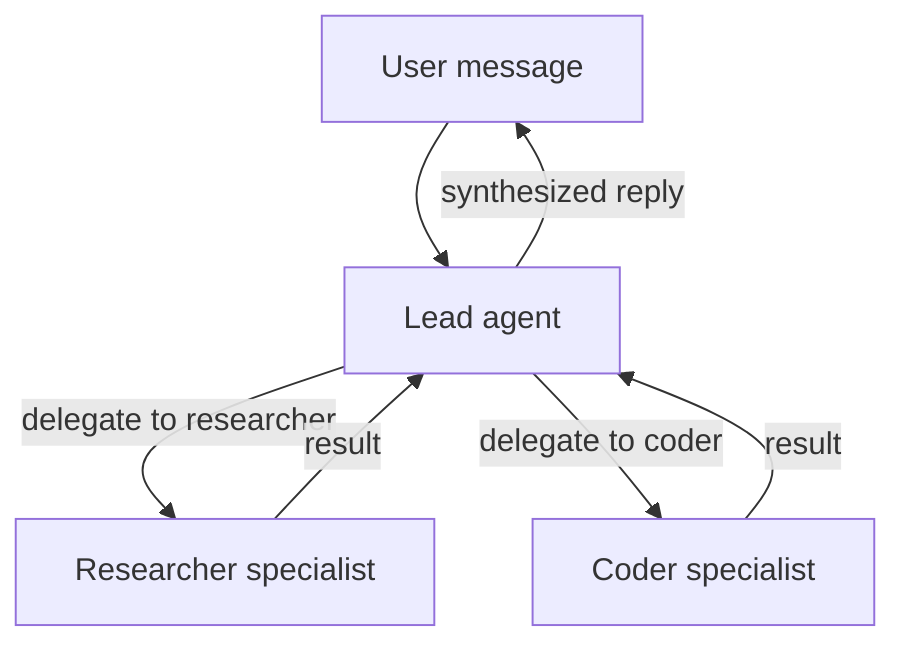

# Team Chatbot

> Multi-agent team with a lead coordinator and specialist sub-agents for different tasks.

## Overview

This recipe builds a team of three agents: a lead that handles conversation and delegates, plus two specialists (a researcher and a coder). Users talk only to the lead — it decides when to call in a specialist. Teams use GoClaw's built-in delegation system, so the lead can run specialists in parallel and synthesize results.

**Prerequisites:** A working gateway (run `./goclaw onboard` first), at least one channel configured.

## Step 1: Create the specialist agents

Specialists must be **predefined** agents — only predefined agents can receive delegations.

**Researcher agent:**

```bash
curl -X POST http://localhost:18790/v1/agents \
  -H "Authorization: Bearer YOUR_TOKEN" \
  -H "X-GoClaw-User-Id: admin" \
  -H "Content-Type: application/json" \
  -d '{
    "agent_key": "researcher",
    "display_name": "Research Specialist",
    "agent_type": "predefined",
    "provider": "openrouter",
    "model": "anthropic/claude-sonnet-4-5-20250929",
    "other_config": {
      "description": "Deep research specialist. Searches the web, reads pages, synthesizes findings into concise reports with sources. Factual, thorough, cites everything."
    }
  }'
```

**Coder agent:**

```bash
curl -X POST http://localhost:18790/v1/agents \
  -H "Authorization: Bearer YOUR_TOKEN" \
  -H "X-GoClaw-User-Id: admin" \
  -H "Content-Type: application/json" \
  -d '{
    "agent_key": "coder",
    "display_name": "Code Specialist",
    "agent_type": "predefined",
    "provider": "openrouter",
    "model": "anthropic/claude-sonnet-4-5-20250929",
    "other_config": {
      "description": "Senior software engineer. Writes clean, production-ready code. Explains implementation decisions. Prefers simple solutions. Tests edge cases."
    }
  }'
```

The `description` field triggers **summoning** — the gateway uses the LLM to auto-generate SOUL.md and IDENTITY.md for each specialist. Poll the agent status until it transitions from `summoning` to `active`.

## Step 2: Create the lead agent

The lead is an **open** agent — each user gets their own context, making it feel like a personal assistant that happens to have a team behind it.

```bash
curl -X POST http://localhost:18790/v1/agents \
  -H "Authorization: Bearer YOUR_TOKEN" \
  -H "X-GoClaw-User-Id: admin" \
  -H "Content-Type: application/json" \
  -d '{
    "agent_key": "lead",
    "display_name": "Assistant",
    "agent_type": "open",
    "provider": "openrouter",
    "model": "anthropic/claude-sonnet-4-5-20250929"
  }'
```

## Step 3: Create the team

Creating a team automatically sets up delegation links from the lead to each member.

```bash
curl -X POST http://localhost:18790/v1/teams \
  -H "Authorization: Bearer YOUR_TOKEN" \
  -H "X-GoClaw-User-Id: admin" \
  -H "Content-Type: application/json" \
  -d '{
    "name": "Assistant Team",
    "lead": "lead",
    "members": ["researcher", "coder"],
    "description": "Personal assistant team with research and coding capabilities"
  }'
```

After this call, the lead agent's context automatically includes a `TEAM.md` file listing available specialists and how to delegate to them.

## Step 4: Configure the channel

Route channel messages to the lead agent. Add a binding in `config.json`:

```json
{
  "bindings": [
    {
      "agentId": "lead",
      "match": {
        "channel": "telegram"
      }
    }
  ]
}
```

Restart the gateway to apply:

```bash
./goclaw
```

## Step 5: Test delegation

Send your bot a message that requires research:

> "What are the key differences between Rust's async model and Go's goroutines? Then write me a simple HTTP server in each."

The lead will:
1. Delegate the research question to `researcher`
2. Delegate the code request to `coder`
3. Run both in parallel (up to `maxConcurrent` limit, default 3 per link)
4. Synthesize and reply with both results

Check the web dashboard → Sessions to see the delegation trace.

## How delegation works



The lead delegates via the `delegate` tool. Specialists run as sub-sessions and return their output. The lead sees all results and composes the final response.

## Common Issues

| Problem | Solution |
|---------|----------|
| "cannot delegate to open agents" | Specialists must be `agent_type: "predefined"`. Re-create them with the correct type. |
| Lead doesn't delegate | The lead needs to know about its team. Check that `TEAM.md` appears in the lead's context files after team creation. Restart the gateway if missing. |
| Specialist summoning stuck | Check gateway logs for LLM errors. Summoning uses the default provider — ensure it has a valid API key. |
| Users see specialist responses directly | Only the lead should be bound to the channel. Check `bindings` in config. Specialists should have no channel bindings. |

## What's Next

- [Open vs. Predefined](../agents/open-vs-predefined.md) — why specialists must be predefined
- [Customer Support](./customer-support.md) — predefined agent handling many users
- [Agent Teams](../agent-teams/) — manual delegation link management
