# Database Schema

> All PostgreSQL tables, columns, types, and constraints across all migrations.

## Overview

GoClaw requires **PostgreSQL 15+** with two extensions:

```sql
CREATE EXTENSION IF NOT EXISTS "pgcrypto";  -- UUID v7 generation
CREATE EXTENSION IF NOT EXISTS "vector";    -- pgvector for embeddings
```

A custom `uuid_generate_v7()` function provides time-ordered UUIDs. All primary keys use this function by default.

Schema versions are tracked by `golang-migrate`. Run `goclaw migrate up` or `goclaw upgrade` to apply all migrations.

---

## ER Diagram

```mermaid
erDiagram
    agents ||--o{ agent_shares : "shared with"
    agents ||--o{ agent_context_files : "has"
    agents ||--o{ user_context_files : "has"
    agents ||--o{ user_agent_profiles : "tracks"
    agents ||--o{ sessions : "owns"
    agents ||--o{ memory_documents : "stores"
    agents ||--o{ memory_chunks : "stores"
    agents ||--o{ skills : "owns"
    agents ||--o{ cron_jobs : "schedules"
    agents ||--o{ channel_instances : "bound to"
    agents ||--o{ agent_links : "links"
    agents ||--o{ agent_teams : "leads"
    agents ||--o{ agent_team_members : "member of"
    agents ||--o{ kg_entities : "has"
    agents ||--o{ kg_relations : "has"
    agents ||--o{ usage_snapshots : "measured in"
    agent_teams ||--o{ team_tasks : "has"
    agent_teams ||--o{ team_messages : "has"
    agent_teams ||--o{ team_workspace_files : "stores"
    memory_documents ||--o{ memory_chunks : "split into"
    cron_jobs ||--o{ cron_run_logs : "logs"
    traces ||--o{ spans : "contains"
    mcp_servers ||--o{ mcp_agent_grants : "granted to"
    mcp_servers ||--o{ mcp_user_grants : "granted to"
    skills ||--o{ skill_agent_grants : "granted to"
    skills ||--o{ skill_user_grants : "granted to"
    kg_entities ||--o{ kg_relations : "source of"
    team_tasks ||--o{ team_task_comments : "has"
    team_tasks ||--o{ team_task_events : "logs"
    team_workspace_files ||--o{ team_workspace_file_versions : "versioned by"
    team_workspace_files ||--o{ team_workspace_comments : "commented on"
    agents ||--o| agent_heartbeats : "has"
    agent_heartbeats ||--o{ heartbeat_run_logs : "logs"
    agents ||--o{ agent_config_permissions : "has"
    tenants ||--o{ system_configs : "has"
```



---

## Tables

### `llm_providers`

Registered LLM providers. API keys are encrypted with AES-256-GCM.

| Column | Type | Constraints | Description |
|--------|------|-------------|-------------|
| `id` | UUID | PK | UUID v7 |
| `name` | VARCHAR(50) | UNIQUE NOT NULL | Identifier (e.g. `openrouter`) |
| `display_name` | VARCHAR(255) | | Human-readable name |
| `provider_type` | VARCHAR(30) | NOT NULL DEFAULT `openai_compat` | `openai_compat` or `anthropic` |
| `api_base` | TEXT | | Custom endpoint URL |
| `api_key` | TEXT | | Encrypted API key |
| `enabled` | BOOLEAN | NOT NULL DEFAULT true | |
| `settings` | JSONB | NOT NULL DEFAULT `{}` | Extra provider-specific config |
| `created_at` | TIMESTAMPTZ | DEFAULT NOW() | |
| `updated_at` | TIMESTAMPTZ | DEFAULT NOW() | |

---

### `agents`

Core agent records. Each agent has its own context, tools, and model configuration.

| Column | Type | Constraints | Description |
|--------|------|-------------|-------------|
| `id` | UUID | PK | UUID v7 |
| `agent_key` | VARCHAR(100) | UNIQUE NOT NULL | Slug identifier (e.g. `researcher`) |
| `display_name` | VARCHAR(255) | | UI display name |
| `owner_id` | VARCHAR(255) | NOT NULL | User ID of creator |
| `provider` | VARCHAR(50) | NOT NULL DEFAULT `openrouter` | LLM provider |
| `model` | VARCHAR(200) | NOT NULL | Model ID |
| `context_window` | INT | NOT NULL DEFAULT 200000 | Context window in tokens |
| `max_tool_iterations` | INT | NOT NULL DEFAULT 20 | Max tool rounds per run |
| `workspace` | TEXT | NOT NULL DEFAULT `.` | Workspace directory path |
| `restrict_to_workspace` | BOOLEAN | NOT NULL DEFAULT true | Sandbox file access to workspace |
| `tools_config` | JSONB | NOT NULL DEFAULT `{}` | Tool policy overrides |
| `sandbox_config` | JSONB | | Docker sandbox configuration |
| `subagents_config` | JSONB | | Subagent concurrency configuration |
| `memory_config` | JSONB | | Memory system configuration |
| `compaction_config` | JSONB | | Session compaction configuration |
| `context_pruning` | JSONB | | Context pruning configuration |
| `other_config` | JSONB | NOT NULL DEFAULT `{}` | Miscellaneous config (e.g. `description` for summoning) |
| `is_default` | BOOLEAN | NOT NULL DEFAULT false | Marks the default agent |
| `agent_type` | VARCHAR(20) | NOT NULL DEFAULT `open` | `open` or `predefined` |
| `status` | VARCHAR(20) | DEFAULT `active` | `active`, `inactive`, `summoning` |
| `frontmatter` | TEXT | | Short expertise summary for delegation and UI |
| `tsv` | tsvector | GENERATED ALWAYS | Full-text search vector (display_name + frontmatter) |
| `embedding` | vector(1536) | | Semantic search embedding |
| `budget_monthly_cents` | INTEGER | | Monthly spend cap in USD cents; NULL = unlimited (migration 015) |
| `created_at` | TIMESTAMPTZ | DEFAULT NOW() | |
| `updated_at` | TIMESTAMPTZ | DEFAULT NOW() | |
| `deleted_at` | TIMESTAMPTZ | | Soft delete timestamp |

**Indexes:** `owner_id`, `status` (partial, non-deleted), `tsv` (GIN), `embedding` (HNSW cosine)

---

### `agent_shares`

Grants another user access to an agent.

| Column | Type | Description |
|--------|------|-------------|
| `id` | UUID PK | |
| `agent_id` | UUID FK → agents | |
| `user_id` | VARCHAR(255) | Grantee |
| `role` | VARCHAR(20) DEFAULT `user` | `user`, `operator`, `admin` |
| `granted_by` | VARCHAR(255) | Who granted access |
| `created_at` | TIMESTAMPTZ | |

---

### `agent_context_files`

Per-agent context files (SOUL.md, IDENTITY.md, etc.). Shared across all users of the agent.

| Column | Type | Description |
|--------|------|-------------|
| `id` | UUID PK | |
| `agent_id` | UUID FK → agents | |
| `file_name` | VARCHAR(255) | Filename (e.g. `SOUL.md`) |
| `content` | TEXT | File content |
| `created_at` | TIMESTAMPTZ | |
| `updated_at` | TIMESTAMPTZ | |

**Unique:** `(agent_id, file_name)`

---

### `user_context_files`

Per-user, per-agent context files (USER.md, etc.). Private to each user.

| Column | Type | Description |
|--------|------|-------------|
| `id` | UUID PK | |
| `agent_id` | UUID FK → agents | |
| `user_id` | VARCHAR(255) | |
| `file_name` | VARCHAR(255) | |
| `content` | TEXT | |
| `created_at` / `updated_at` | TIMESTAMPTZ | |

**Unique:** `(agent_id, user_id, file_name)`

---

### `user_agent_profiles`

Tracks first/last seen timestamps per user per agent.

| Column | Type | Description |
|--------|------|-------------|
| `agent_id` | UUID FK → agents | |
| `user_id` | VARCHAR(255) | |
| `workspace` | TEXT | Per-user workspace override |
| `first_seen_at` | TIMESTAMPTZ | |
| `last_seen_at` | TIMESTAMPTZ | |
| `metadata` | JSONB DEFAULT `{}` | Arbitrary profile metadata (migration 011) |

**PK:** `(agent_id, user_id)`

---

### `user_agent_overrides`

Per-user model/provider overrides for a specific agent.

| Column | Type | Description |
|--------|------|-------------|
| `id` | UUID PK | |
| `agent_id` | UUID FK → agents | |
| `user_id` | VARCHAR(255) | |
| `provider` | VARCHAR(50) | Override provider |
| `model` | VARCHAR(200) | Override model |
| `settings` | JSONB | Extra settings |

---

### `sessions`

Chat sessions. One session per channel/user/agent combination.

| Column | Type | Description |
|--------|------|-------------|
| `id` | UUID PK | |
| `session_key` | VARCHAR(500) UNIQUE | Composite key (e.g. `telegram:123456789`) |
| `agent_id` | UUID FK → agents | |
| `user_id` | VARCHAR(255) | |
| `messages` | JSONB DEFAULT `[]` | Full message history |
| `summary` | TEXT | Compacted summary |
| `model` | VARCHAR(200) | Active model for this session |
| `provider` | VARCHAR(50) | Active provider |
| `channel` | VARCHAR(50) | Origin channel |
| `input_tokens` | BIGINT DEFAULT 0 | Cumulative input token count |
| `output_tokens` | BIGINT DEFAULT 0 | Cumulative output token count |
| `compaction_count` | INT DEFAULT 0 | Number of compactions performed |
| `memory_flush_compaction_count` | INT DEFAULT 0 | Compactions with memory flush |
| `label` | VARCHAR(500) | Human-readable session label |
| `spawned_by` | VARCHAR(200) | Parent session key (for subagents) |
| `spawn_depth` | INT DEFAULT 0 | Nesting depth |
| `metadata` | JSONB DEFAULT `{}` | Arbitrary session metadata (migration 011) |
| `team_id` | UUID FK → agent_teams (nullable) | Set for team-scoped sessions (migration 019) |
| `created_at` / `updated_at` | TIMESTAMPTZ | |

**Indexes:** `agent_id`, `user_id`, `updated_at DESC`, `team_id` (partial)

---

### `memory_documents` and `memory_chunks`

Hybrid BM25 + vector memory system.

**`memory_documents`** — top-level indexed documents:

| Column | Type | Description |
|--------|------|-------------|
| `id` | UUID PK | |
| `agent_id` | UUID FK → agents | |
| `user_id` | VARCHAR(255) | Null = global (shared) |
| `path` | VARCHAR(500) | Logical document path/title |
| `content` | TEXT | Full document content |
| `hash` | VARCHAR(64) | SHA-256 of content for change detection |
| `team_id` | UUID FK → agent_teams (nullable) | Team scope; NULL = personal (migration 019) |

**`memory_chunks`** — searchable segments of documents:

| Column | Type | Description |
|--------|------|-------------|
| `id` | UUID PK | |
| `agent_id` | UUID FK → agents | |
| `document_id` | UUID FK → memory_documents | |
| `user_id` | VARCHAR(255) | |
| `path` | TEXT | Source path |
| `start_line` / `end_line` | INT | Source line range |
| `hash` | VARCHAR(64) | Chunk content hash |
| `text` | TEXT | Chunk content |
| `embedding` | vector(1536) | Semantic embedding |
| `tsv` | tsvector GENERATED | Full-text search (simple config, multilingual) |
| `team_id` | UUID FK → agent_teams (nullable) | Team scope; NULL = personal (migration 019) |

**Indexes:** agent+user (standard + partial for global), document, GIN on tsv, HNSW cosine on embedding, `team_id` (partial)

**`embedding_cache`** — deduplicates embedding API calls:

| Column | Type | Description |
|--------|------|-------------|
| `hash` | VARCHAR(64) | Content hash |
| `provider` | VARCHAR(50) | Embedding provider |
| `model` | VARCHAR(200) | Embedding model |
| `embedding` | vector(1536) | Cached vector |
| `dims` | INT | Embedding dimensions |

**PK:** `(hash, provider, model)`

---

### `skills`

Uploaded skill packages with BM25 + semantic search.

| Column | Type | Description |
|--------|------|-------------|
| `id` | UUID PK | |
| `name` | VARCHAR(255) | Display name |
| `slug` | VARCHAR(255) UNIQUE | URL-safe identifier |
| `description` | TEXT | Short description |
| `owner_id` | VARCHAR(255) | Creator user ID |
| `visibility` | VARCHAR(10) DEFAULT `private` | `private` or `public` |
| `version` | INT DEFAULT 1 | Version counter |
| `status` | VARCHAR(20) DEFAULT `active` | `active` or `archived` |
| `frontmatter` | JSONB | Skill metadata from SKILL.md |
| `file_path` | TEXT | Filesystem path to skill content |
| `file_size` | BIGINT | File size in bytes |
| `file_hash` | VARCHAR(64) | Content hash |
| `embedding` | vector(1536) | Semantic search embedding |
| `tags` | TEXT[] | Tag list |
| `is_system` | BOOLEAN DEFAULT false | Built-in system skill; not user-deletable (migration 017) |
| `deps` | JSONB DEFAULT `{}` | Skill dependency declarations (migration 017) |
| `enabled` | BOOLEAN DEFAULT true | Whether skill is active (migration 017) |

**Indexes:** owner, visibility (partial active), slug, HNSW embedding, GIN tags, `is_system` (partial true), `enabled` (partial false)

**`skill_agent_grants`** / **`skill_user_grants`** — access control for skills, same pattern as MCP grants.

---

### `cron_jobs`

Scheduled agent tasks.

| Column | Type | Description |
|--------|------|-------------|
| `id` | UUID PK | |
| `agent_id` | UUID FK → agents | |
| `user_id` | TEXT | Owning user |
| `name` | VARCHAR(255) | Human-readable job name |
| `enabled` | BOOLEAN DEFAULT true | |
| `schedule_kind` | VARCHAR(10) | `at`, `every`, or `cron` |
| `cron_expression` | VARCHAR(100) | Cron expression (when kind=`cron`) |
| `interval_ms` | BIGINT | Interval in ms (when kind=`every`) |
| `run_at` | TIMESTAMPTZ | One-shot run time (when kind=`at`) |
| `timezone` | VARCHAR(50) | Timezone for cron expressions |
| `payload` | JSONB | Message payload sent to agent |
| `delete_after_run` | BOOLEAN DEFAULT false | Self-delete after first successful run |
| `stateless` | BOOLEAN DEFAULT false | Stateless mode — run without session history |
| `deliver` | BOOLEAN DEFAULT false | Deliver result to channel |
| `deliver_channel` | TEXT | Target channel type (`telegram`, `discord`, etc.) |
| `deliver_to` | TEXT | Chat/recipient ID |
| `wake_heartbeat` | BOOLEAN DEFAULT false | Trigger heartbeat after job completes |
| `next_run_at` | TIMESTAMPTZ | Calculated next execution time |
| `last_run_at` | TIMESTAMPTZ | Last execution time |
| `last_status` | VARCHAR(20) | `ok`, `error`, `running` |
| `last_error` | TEXT | Last error message |
| `team_id` | UUID FK → agent_teams (nullable) | Team scope; NULL = personal (migration 019) |

**`cron_run_logs`** — per-run history with token counts and duration. `team_id` column also added (migration 019).

---

### `pairing_requests` and `paired_devices`

Device pairing flow (channel users requesting access).

**`pairing_requests`** — pending 8-character codes:

| Column | Type | Description |
|--------|------|-------------|
| `code` | VARCHAR(8) UNIQUE | Pairing code shown to user |
| `sender_id` | VARCHAR(200) | Channel user ID |
| `channel` | VARCHAR(255) | Channel name |
| `chat_id` | VARCHAR(200) | Chat ID |
| `expires_at` | TIMESTAMPTZ | Code expiry |

**`paired_devices`** — approved pairings:

| Column | Type | Description |
|--------|------|-------------|
| `sender_id` | VARCHAR(200) | |
| `channel` | VARCHAR(255) | |
| `chat_id` | VARCHAR(200) | |
| `paired_by` | VARCHAR(100) | Who approved |
| `paired_at` | TIMESTAMPTZ | |
| `metadata` | JSONB DEFAULT `{}` | Arbitrary pairing metadata (migration 011) |
| `expires_at` | TIMESTAMPTZ | Pairing expiry; NULL = no expiry (migration 021) |

**Unique:** `(sender_id, channel)`

> `pairing_requests` also received `metadata JSONB DEFAULT '{}'` in migration 011.

---

### `traces` and `spans`

LLM call tracing.

**`traces`** — one record per agent run:

| Column | Type | Description |
|--------|------|-------------|
| `id` | UUID PK | |
| `agent_id` | UUID | |
| `user_id` | VARCHAR(255) | |
| `session_key` | TEXT | |
| `run_id` | TEXT | |
| `parent_trace_id` | UUID | For delegation — links to parent run's trace |
| `status` | VARCHAR(20) | `running`, `ok`, `error` |
| `total_input_tokens` | INT | |
| `total_output_tokens` | INT | |
| `total_cost` | NUMERIC(12,6) | Estimated cost |
| `span_count` / `llm_call_count` / `tool_call_count` | INT | Summary counters |
| `input_preview` / `output_preview` | TEXT | Truncated first/last message |
| `tags` | TEXT[] | Searchable tags |
| `metadata` | JSONB | |

**`spans`** — individual LLM calls and tool invocations within a trace:

Key columns: `trace_id`, `parent_span_id`, `span_type` (`llm`, `tool`, `agent`), `model`, `provider`, `input_tokens`, `output_tokens`, `total_cost`, `tool_name`, `finish_reason`.

**Indexes:** Optimized for agent+time, user+time, session, status=error. Partial index `idx_traces_quota` on `(user_id, created_at DESC)` filters `parent_trace_id IS NULL` for quota counting. Both `traces` and `spans` have `team_id UUID FK → agent_teams` (nullable, migration 019) with partial indexes. `traces` also has `idx_traces_start_root` on `(start_time DESC) WHERE parent_trace_id IS NULL` and `spans` has `idx_spans_trace_type` on `(trace_id, span_type)` (migration 016).

---

### `mcp_servers`

External MCP (Model Context Protocol) tool providers.

| Column | Type | Description |
|--------|------|-------------|
| `id` | UUID PK | |
| `name` | VARCHAR(255) UNIQUE | Server name |
| `transport` | VARCHAR(50) | `stdio`, `sse`, `streamable-http` |
| `command` | TEXT | Stdio: command to spawn |
| `args` | JSONB | Stdio: arguments |
| `url` | TEXT | SSE/HTTP: server URL |
| `headers` | JSONB | SSE/HTTP: HTTP headers |
| `env` | JSONB | Stdio: environment variables |
| `api_key` | TEXT | Encrypted API key |
| `tool_prefix` | VARCHAR(50) | Optional tool name prefix |
| `timeout_sec` | INT DEFAULT 60 | |
| `enabled` | BOOLEAN DEFAULT true | |

**`mcp_agent_grants`** / **`mcp_user_grants`** — per-agent and per-user access grants with optional tool allowlists/denylists.

**`mcp_access_requests`** — approval workflow for agents requesting MCP access.

---

### `custom_tools`

Dynamic shell-command-backed tools managed via the API.

| Column | Type | Description |
|--------|------|-------------|
| `id` | UUID PK | |
| `name` | VARCHAR(100) | Tool name |
| `description` | TEXT | Shown to the LLM |
| `parameters` | JSONB | JSON Schema for tool parameters |
| `command` | TEXT | Shell command to execute |
| `working_dir` | TEXT | Working directory |
| `timeout_seconds` | INT DEFAULT 60 | |
| `env` | BYTEA | Encrypted environment variables |
| `agent_id` | UUID FK → agents (nullable) | Null = global tool |
| `enabled` | BOOLEAN DEFAULT true | |

**Unique:** name globally (when `agent_id IS NULL`), `(name, agent_id)` per agent.

---

### `channel_instances`

Database-managed channel connections (replaces static config-file channel setup).

| Column | Type | Description |
|--------|------|-------------|
| `id` | UUID PK | |
| `name` | VARCHAR(100) UNIQUE | Instance name |
| `channel_type` | VARCHAR(50) | `telegram`, `discord`, `feishu`, `zalo_oa`, `zalo_personal`, `whatsapp` |
| `agent_id` | UUID FK → agents | Bound agent |
| `credentials` | BYTEA | Encrypted channel credentials |
| `config` | JSONB | Channel-specific configuration |
| `enabled` | BOOLEAN DEFAULT true | |

---

### `agent_links`

Inter-agent delegation permissions. Source agent can delegate tasks to target agent.

| Column | Type | Description |
|--------|------|-------------|
| `id` | UUID PK | |
| `source_agent_id` | UUID FK → agents | Delegating agent |
| `target_agent_id` | UUID FK → agents | Delegate agent |
| `direction` | VARCHAR(20) DEFAULT `outbound` | |
| `description` | TEXT | Link description shown during delegation |
| `max_concurrent` | INT DEFAULT 3 | Max concurrent delegations |
| `team_id` | UUID FK → agent_teams (nullable) | Set when link was created by a team |
| `status` | VARCHAR(20) DEFAULT `active` | |

---

### `agent_teams`, `agent_team_members`, `team_tasks`, `team_messages`

Collaborative multi-agent coordination.

**`agent_teams`** — team records with a lead agent.

**`agent_team_members`** — many-to-many `(team_id, agent_id)` with role (`lead`, `member`).

**`team_tasks`** — shared task list:

| Column | Type | Description |
|--------|------|-------------|
| `subject` | VARCHAR(500) | Task title |
| `description` | TEXT | Full task description |
| `status` | VARCHAR(20) DEFAULT `pending` | `pending`, `in_progress`, `completed`, `cancelled` |
| `owner_agent_id` | UUID | Agent that claimed the task |
| `blocked_by` | UUID[] DEFAULT `{}` | Task IDs this task is blocked by |
| `priority` | INT DEFAULT 0 | Higher = higher priority |
| `result` | TEXT | Task output |
| `task_type` | VARCHAR(30) DEFAULT `general` | Task category (migration 018) |
| `task_number` | INT DEFAULT 0 | Sequential number per team (migration 018) |
| `identifier` | VARCHAR(20) | Human-readable ID e.g. `TSK-1` (migration 018) |
| `created_by_agent_id` | UUID FK → agents | Agent that created the task (migration 018) |
| `assignee_user_id` | VARCHAR(255) | Human user assignee (migration 018) |
| `parent_id` | UUID FK → team_tasks | Parent task for subtasks (migration 018) |
| `chat_id` | VARCHAR(255) DEFAULT `''` | Originating chat (migration 018) |
| `locked_at` | TIMESTAMPTZ | When task lock was acquired (migration 018) |
| `lock_expires_at` | TIMESTAMPTZ | Lock TTL (migration 018) |
| `progress_percent` | INT DEFAULT 0 | 0–100 completion indicator (migration 018) |
| `progress_step` | TEXT | Current progress description (migration 018) |
| `followup_at` | TIMESTAMPTZ | Next followup reminder time (migration 018) |
| `followup_count` | INT DEFAULT 0 | Number of followups sent (migration 018) |
| `followup_max` | INT DEFAULT 0 | Max followups to send (migration 018) |
| `followup_message` | TEXT | Message to send at followup (migration 018) |
| `followup_channel` | VARCHAR(60) | Channel for followup delivery (migration 018) |
| `followup_chat_id` | VARCHAR(255) | Chat ID for followup delivery (migration 018) |
| `confidence_score` | FLOAT | Agent self-assessment score (migration 021) |

**Indexes:** `parent_id` (partial), `(team_id, channel, chat_id)`, `(team_id, task_type)`, `lock_expires_at` (partial in_progress), `(team_id, identifier)` (unique partial), `followup_at` (partial in_progress), `blocked_by` (GIN), `(team_id, owner_agent_id, status)`

**`team_messages`** — peer-to-peer mailbox between agents within a team. Received `confidence_score FLOAT` in migration 021.

---

### `builtin_tools`

Registry of built-in gateway tools with enable/disable control.

| Column | Type | Description |
|--------|------|-------------|
| `name` | VARCHAR(100) PK | Tool name (e.g. `exec`, `read_file`) |
| `display_name` | VARCHAR(255) | |
| `description` | TEXT | |
| `category` | VARCHAR(50) DEFAULT `general` | Tool category |
| `enabled` | BOOLEAN DEFAULT true | Global enable/disable |
| `settings` | JSONB | Tool-specific settings |
| `requires` | TEXT[] | Required external dependencies |

---

### `config_secrets`

Encrypted key-value store for secrets that override `config.json` values (managed via the web UI).

| Column | Type | Description |
|--------|------|-------------|
| `key` | VARCHAR(100) PK | Secret key name |
| `value` | BYTEA | AES-256-GCM encrypted value |

---

### `group_file_writers`

> **Removed in migration 023.** Data was migrated into `agent_config_permissions` (`config_type = 'file_writer'`).

---

### `channel_pending_messages`

Group chat message buffer. Persists messages when the bot is not mentioned so that full conversational context is available when it is mentioned. Supports LLM-based compaction (`is_summary` rows) and 7-day TTL cleanup. (migration 012)

| Column | Type | Constraints | Description |
|--------|------|-------------|-------------|
| `id` | UUID | PK | UUID v7 |
| `channel_name` | VARCHAR(100) | NOT NULL | Channel instance name |
| `history_key` | VARCHAR(200) | NOT NULL | Composite key scoping the conversation buffer |
| `sender` | VARCHAR(255) | NOT NULL | Display name of sender |
| `sender_id` | VARCHAR(255) | NOT NULL DEFAULT `''` | Platform user ID |
| `body` | TEXT | NOT NULL | Raw message text |
| `platform_msg_id` | VARCHAR(100) | NOT NULL DEFAULT `''` | Native platform message ID |
| `is_summary` | BOOLEAN | NOT NULL DEFAULT false | True if this row is a compacted summary |
| `created_at` | TIMESTAMPTZ | NOT NULL DEFAULT NOW() | |
| `updated_at` | TIMESTAMPTZ | NOT NULL DEFAULT NOW() | |

**Indexes:** `(channel_name, history_key, created_at)`

---

### `kg_entities`

Knowledge graph entity nodes scoped per agent and user. (migration 013)

| Column | Type | Constraints | Description |
|--------|------|-------------|-------------|
| `id` | UUID | PK | |
| `agent_id` | UUID FK → agents | NOT NULL | Owning agent (cascade delete) |
| `user_id` | VARCHAR(255) | NOT NULL DEFAULT `''` | User scope; empty = agent-global |
| `external_id` | VARCHAR(255) | NOT NULL | Caller-supplied entity identifier |
| `name` | TEXT | NOT NULL | Entity display name |
| `entity_type` | VARCHAR(100) | NOT NULL | e.g. `person`, `company`, `concept` |
| `description` | TEXT | DEFAULT `''` | Free-text description |
| `properties` | JSONB | DEFAULT `{}` | Structured entity attributes |
| `source_id` | VARCHAR(255) | DEFAULT `''` | Source document/chunk reference |
| `confidence` | FLOAT | NOT NULL DEFAULT 1.0 | Extraction confidence score |
| `team_id` | UUID FK → agent_teams (nullable) | | Team scope; NULL = personal (migration 019) |
| `created_at` / `updated_at` | TIMESTAMPTZ | | |

**Unique:** `(agent_id, user_id, external_id)`

**Indexes:** `(agent_id, user_id)`, `(agent_id, user_id, entity_type)`, `team_id` (partial)

---

### `kg_relations`

Knowledge graph edges between entities. (migration 013)

| Column | Type | Constraints | Description |
|--------|------|-------------|-------------|
| `id` | UUID | PK | |
| `agent_id` | UUID FK → agents | NOT NULL | Owning agent (cascade delete) |
| `user_id` | VARCHAR(255) | NOT NULL DEFAULT `''` | User scope |
| `source_entity_id` | UUID FK → kg_entities | NOT NULL | Source node (cascade delete) |
| `relation_type` | VARCHAR(200) | NOT NULL | Relation label e.g. `works_at`, `knows` |
| `target_entity_id` | UUID FK → kg_entities | NOT NULL | Target node (cascade delete) |
| `confidence` | FLOAT | NOT NULL DEFAULT 1.0 | Extraction confidence score |
| `properties` | JSONB | DEFAULT `{}` | Relation attributes |
| `team_id` | UUID FK → agent_teams (nullable) | | Team scope; NULL = personal (migration 019) |
| `created_at` | TIMESTAMPTZ | | |

**Unique:** `(agent_id, user_id, source_entity_id, relation_type, target_entity_id)`

**Indexes:** `(source_entity_id, relation_type)`, `target_entity_id`, `team_id` (partial)

---

### `channel_contacts`

Global unified contact directory auto-collected from all channel interactions. Not per-agent. Used for contact selector, analytics, and future RBAC. (migration 014)

| Column | Type | Constraints | Description |
|--------|------|-------------|-------------|
| `id` | UUID | PK | |
| `channel_type` | VARCHAR(50) | NOT NULL | e.g. `telegram`, `discord` |
| `channel_instance` | VARCHAR(255) | | Instance name (nullable) |
| `sender_id` | VARCHAR(255) | NOT NULL | Platform-native user ID |
| `user_id` | VARCHAR(255) | | Matched GoClaw user ID |
| `display_name` | VARCHAR(255) | | Resolved display name |
| `username` | VARCHAR(255) | | Platform username/handle |
| `avatar_url` | TEXT | | Profile image URL |
| `peer_kind` | VARCHAR(20) | | e.g. `user`, `bot`, `group` |
| `metadata` | JSONB | DEFAULT `{}` | Extra platform-specific data |
| `merged_id` | UUID | | Canonical contact after de-duplication |
| `first_seen_at` | TIMESTAMPTZ | NOT NULL DEFAULT NOW() | |
| `last_seen_at` | TIMESTAMPTZ | NOT NULL DEFAULT NOW() | |

**Unique:** `(channel_type, sender_id)`

**Indexes:** `channel_instance` (partial non-null), `merged_id` (partial non-null), `(display_name, username)`

---

### `activity_logs`

Immutable audit trail for user and system actions. (migration 015)

| Column | Type | Constraints | Description |
|--------|------|-------------|-------------|
| `id` | UUID | PK | UUID v7 |
| `actor_type` | VARCHAR(20) | NOT NULL | `user`, `agent`, `system` |
| `actor_id` | VARCHAR(255) | NOT NULL | User or agent ID |
| `action` | VARCHAR(100) | NOT NULL | e.g. `agent.create`, `skill.delete` |
| `entity_type` | VARCHAR(50) | | Type of affected entity |
| `entity_id` | VARCHAR(255) | | ID of affected entity |
| `details` | JSONB | | Action-specific context |
| `ip_address` | VARCHAR(45) | | Client IP (IPv4 or IPv6) |
| `created_at` | TIMESTAMPTZ | NOT NULL DEFAULT NOW() | |

**Indexes:** `(actor_type, actor_id)`, `action`, `(entity_type, entity_id)`, `created_at DESC`

---

### `usage_snapshots`

Hourly pre-aggregated metrics per agent/provider/model/channel combination. Populated by a background snapshot worker that reads `traces` and `spans`. (migration 016)

| Column | Type | Description |
|--------|------|-------------|
| `id` | UUID PK | UUID v7 |
| `bucket_hour` | TIMESTAMPTZ | Hour bucket (truncated to hour) |
| `agent_id` | UUID (nullable) | Agent scope; NULL = system-wide |
| `provider` | VARCHAR(50) DEFAULT `''` | LLM provider |
| `model` | VARCHAR(200) DEFAULT `''` | Model ID |
| `channel` | VARCHAR(50) DEFAULT `''` | Channel name |
| `input_tokens` | BIGINT DEFAULT 0 | |
| `output_tokens` | BIGINT DEFAULT 0 | |
| `cache_read_tokens` | BIGINT DEFAULT 0 | |
| `cache_create_tokens` | BIGINT DEFAULT 0 | |
| `thinking_tokens` | BIGINT DEFAULT 0 | |
| `total_cost` | NUMERIC(12,6) DEFAULT 0 | Estimated USD cost |
| `request_count` | INT DEFAULT 0 | |
| `llm_call_count` | INT DEFAULT 0 | |
| `tool_call_count` | INT DEFAULT 0 | |
| `error_count` | INT DEFAULT 0 | |
| `unique_users` | INT DEFAULT 0 | Distinct users in bucket |
| `avg_duration_ms` | INT DEFAULT 0 | Average request duration |
| `memory_docs` | INT DEFAULT 0 | Point-in-time memory document count |
| `memory_chunks` | INT DEFAULT 0 | Point-in-time memory chunk count |
| `kg_entities` | INT DEFAULT 0 | Point-in-time KG entity count |
| `kg_relations` | INT DEFAULT 0 | Point-in-time KG relation count |
| `created_at` | TIMESTAMPTZ | |

**Unique:** `(bucket_hour, COALESCE(agent_id, '00000000...'), provider, model, channel)` — enables safe upserts.

**Indexes:** `bucket_hour DESC`, `(agent_id, bucket_hour DESC)`, `(provider, bucket_hour DESC)` (partial non-empty), `(channel, bucket_hour DESC)` (partial non-empty)

---

### `team_workspace_files`

Shared file storage scoped by `(team_id, chat_id)`. Supports pinning, tagging, and soft-archiving. (migration 018)

| Column | Type | Constraints | Description |
|--------|------|-------------|-------------|
| `id` | UUID | PK | UUID v7 |
| `team_id` | UUID FK → agent_teams | NOT NULL | Owning team |
| `channel` | VARCHAR(50) DEFAULT `''` | | Channel context |
| `chat_id` | VARCHAR(255) DEFAULT `''` | | System-derived user/chat ID |
| `file_name` | VARCHAR(255) | NOT NULL | Display file name |
| `mime_type` | VARCHAR(100) | | MIME type |
| `file_path` | TEXT | NOT NULL | Storage path |
| `size_bytes` | BIGINT DEFAULT 0 | | File size |
| `uploaded_by` | UUID FK → agents | NOT NULL | Uploader agent |
| `task_id` | UUID FK → team_tasks (nullable) | | Linked task |
| `pinned` | BOOLEAN DEFAULT false | | Pinned to workspace |
| `tags` | TEXT[] DEFAULT `{}` | | Searchable tags |
| `metadata` | JSONB | | Extra metadata |
| `archived_at` | TIMESTAMPTZ | | Soft delete timestamp |
| `created_at` / `updated_at` | TIMESTAMPTZ | | |

**Unique:** `(team_id, chat_id, file_name)`

**Indexes:** `(team_id, chat_id)`, `uploaded_by`, `task_id` (partial), `archived_at` (partial), `(team_id, pinned)` (partial true), `tags` (GIN)

---

### `team_workspace_file_versions`

Version history for workspace files. Each upload of a new version creates a row. (migration 018)

| Column | Type | Constraints | Description |
|--------|------|-------------|-------------|
| `id` | UUID | PK | UUID v7 |
| `file_id` | UUID FK → team_workspace_files | NOT NULL | Parent file |
| `version` | INT | NOT NULL | Version number |
| `file_path` | TEXT | NOT NULL | Storage path for this version |
| `size_bytes` | BIGINT DEFAULT 0 | | |
| `uploaded_by` | UUID FK → agents | NOT NULL | |
| `created_at` | TIMESTAMPTZ | NOT NULL | |

**Unique:** `(file_id, version)`

---

### `team_workspace_comments`

Annotations on workspace files. (migration 018)

| Column | Type | Constraints | Description |
|--------|------|-------------|-------------|
| `id` | UUID | PK | UUID v7 |
| `file_id` | UUID FK → team_workspace_files | NOT NULL | Commented file |
| `agent_id` | UUID FK → agents | NOT NULL | Commenting agent |
| `content` | TEXT | NOT NULL | Comment text |
| `created_at` | TIMESTAMPTZ | NOT NULL | |

**Index:** `file_id`

---

### `team_task_comments`

Discussion thread on a task. (migration 018)

| Column | Type | Constraints | Description |
|--------|------|-------------|-------------|
| `id` | UUID | PK | UUID v7 |
| `task_id` | UUID FK → team_tasks | NOT NULL | Parent task |
| `agent_id` | UUID FK → agents (nullable) | | Commenting agent |
| `user_id` | VARCHAR(255) | | Commenting human user |
| `content` | TEXT | NOT NULL | Comment body |
| `metadata` | JSONB DEFAULT `{}` | | |
| `confidence_score` | FLOAT | | Agent self-assessment (migration 021) |
| `created_at` | TIMESTAMPTZ | NOT NULL | |

**Index:** `task_id`

---

### `team_task_events`

Immutable audit log for task state changes. (migration 018)

| Column | Type | Constraints | Description |
|--------|------|-------------|-------------|
| `id` | UUID | PK | UUID v7 |
| `task_id` | UUID FK → team_tasks | NOT NULL | Parent task |
| `event_type` | VARCHAR(30) | NOT NULL | e.g. `status_change`, `assigned`, `locked` |
| `actor_type` | VARCHAR(10) | NOT NULL | `agent` or `user` |
| `actor_id` | VARCHAR(255) | NOT NULL | Acting entity ID |
| `data` | JSONB | | Event payload |
| `created_at` | TIMESTAMPTZ | NOT NULL | |

**Index:** `task_id`

---

### `secure_cli_binaries`

Credential injection configuration for the Exec tool (Direct Exec Mode). Admins map binary names to encrypted environment variables; GoClaw auto-injects them into child processes. (migration 020)

| Column | Type | Constraints | Description |
|--------|------|-------------|-------------|
| `id` | UUID | PK | UUID v7 |
| `binary_name` | TEXT | NOT NULL | Display name (e.g. `gh`, `gcloud`) |
| `binary_path` | TEXT | | Absolute path; NULL = auto-resolved at runtime |
| `description` | TEXT | NOT NULL DEFAULT `''` | Admin-facing description |
| `encrypted_env` | BYTEA | NOT NULL | AES-256-GCM encrypted JSON env map |
| `deny_args` | JSONB DEFAULT `[]` | | Regex patterns of forbidden argument prefixes |
| `deny_verbose` | JSONB DEFAULT `[]` | | Verbose flag patterns to strip |
| `timeout_seconds` | INT DEFAULT 30 | | Process timeout |
| `tips` | TEXT DEFAULT `''` | | Hint injected into TOOLS.md context |
| `agent_id` | UUID FK → agents (nullable) | | NULL = global (all agents) |
| `enabled` | BOOLEAN DEFAULT true | | |
| `created_by` | TEXT DEFAULT `''` | | Admin user who created this entry |
| `created_at` / `updated_at` | TIMESTAMPTZ | | |

**Unique:** `(binary_name, COALESCE(agent_id, '00000000...'))` — one config per binary per scope.

**Indexes:** `binary_name`, `agent_id` (partial non-null)

---

### `api_keys`

Fine-grained API key management with scope-based access control. (migration 020)

| Column | Type | Constraints | Description |
|--------|------|-------------|-------------|
| `id` | UUID | PK | |
| `name` | VARCHAR(100) | NOT NULL | Human-readable key name |
| `prefix` | VARCHAR(8) | NOT NULL | First 8 chars for display/search |
| `key_hash` | VARCHAR(64) | NOT NULL UNIQUE | SHA-256 hex digest of the full key |
| `scopes` | TEXT[] DEFAULT `{}` | | e.g. `{'operator.admin','operator.read'}` |
| `expires_at` | TIMESTAMPTZ | | NULL = never expires |
| `last_used_at` | TIMESTAMPTZ | | |
| `revoked` | BOOLEAN DEFAULT false | | |
| `created_by` | VARCHAR(255) | | User ID who created the key |
| `created_at` / `updated_at` | TIMESTAMPTZ | | |

**Indexes:** `key_hash` (partial `NOT revoked`), `prefix`

---

### `agent_heartbeats`

Per-agent heartbeat configuration for periodic proactive check-ins. (migration 022)

| Column | Type | Constraints | Description |
|--------|------|-------------|-------------|
| `id` | UUID | PK | UUID v7 |
| `agent_id` | UUID FK → agents | NOT NULL UNIQUE ON DELETE CASCADE | One config per agent |
| `enabled` | BOOLEAN | NOT NULL DEFAULT false | Whether heartbeat is active |
| `interval_sec` | INT | NOT NULL DEFAULT 1800 | Run interval in seconds |
| `prompt` | TEXT | | Message sent to the agent each heartbeat |
| `provider_id` | UUID FK → llm_providers (nullable) | | Override LLM provider |
| `model` | VARCHAR(200) | | Override model |
| `isolated_session` | BOOLEAN | NOT NULL DEFAULT true | Run in a dedicated session |
| `light_context` | BOOLEAN | NOT NULL DEFAULT false | Inject minimal context |
| `ack_max_chars` | INT | NOT NULL DEFAULT 300 | Max chars in acknowledgement response |
| `max_retries` | INT | NOT NULL DEFAULT 2 | Max retry attempts on failure |
| `active_hours_start` | VARCHAR(5) | | Start of active window (HH:MM) |
| `active_hours_end` | VARCHAR(5) | | End of active window (HH:MM) |
| `timezone` | TEXT | | Timezone for active hours |
| `channel` | VARCHAR(50) | | Delivery channel |
| `chat_id` | TEXT | | Delivery chat ID |
| `next_run_at` | TIMESTAMPTZ | | Scheduled next execution |
| `last_run_at` | TIMESTAMPTZ | | Last execution time |
| `last_status` | VARCHAR(20) | | Last run status |
| `last_error` | TEXT | | Last run error |
| `run_count` | INT | NOT NULL DEFAULT 0 | Total runs |
| `suppress_count` | INT | NOT NULL DEFAULT 0 | Total suppressed runs |
| `metadata` | JSONB | DEFAULT `{}` | Extra metadata |
| `created_at` / `updated_at` | TIMESTAMPTZ | DEFAULT NOW() | |

**Indexes:** `idx_heartbeats_due` on `(next_run_at) WHERE enabled = true AND next_run_at IS NOT NULL` — partial index for efficient scheduler polling.

---

### `heartbeat_run_logs`

Execution log for each heartbeat run. (migration 022)

| Column | Type | Constraints | Description |
|--------|------|-------------|-------------|
| `id` | UUID | PK | UUID v7 |
| `heartbeat_id` | UUID FK → agent_heartbeats | NOT NULL ON DELETE CASCADE | Parent heartbeat config |
| `agent_id` | UUID FK → agents | NOT NULL ON DELETE CASCADE | Owning agent |
| `status` | VARCHAR(20) | NOT NULL | `ok`, `error`, `skipped` |
| `summary` | TEXT | | Short run summary |
| `error` | TEXT | | Error message if failed |
| `duration_ms` | INT | | Run duration in milliseconds |
| `input_tokens` | INT | DEFAULT 0 | |
| `output_tokens` | INT | DEFAULT 0 | |
| `skip_reason` | VARCHAR(50) | | Reason run was skipped |
| `metadata` | JSONB | DEFAULT `{}` | Extra metadata |
| `ran_at` | TIMESTAMPTZ | DEFAULT NOW() | |
| `created_at` | TIMESTAMPTZ | DEFAULT NOW() | |

**Indexes:** `idx_hb_logs_heartbeat` on `(heartbeat_id, ran_at DESC)`, `idx_hb_logs_agent` on `(agent_id, ran_at DESC)`

---

### `agent_config_permissions`

Generic permission table for agent configuration (heartbeat, cron, file writers, etc.). Replaces `group_file_writers`. (migration 022)

| Column | Type | Constraints | Description |
|--------|------|-------------|-------------|
| `id` | UUID | PK | UUID v7 |
| `agent_id` | UUID FK → agents | NOT NULL ON DELETE CASCADE | Owning agent |
| `scope` | VARCHAR(255) | NOT NULL | Group/chat ID scope |
| `config_type` | VARCHAR(50) | NOT NULL | e.g. `file_writer`, `heartbeat` |
| `user_id` | VARCHAR(255) | NOT NULL | Grantee user ID |
| `permission` | VARCHAR(10) | NOT NULL | `allow` or `deny` |
| `granted_by` | VARCHAR(255) | | Who granted this permission |
| `metadata` | JSONB | DEFAULT `{}` | Extra metadata (e.g. displayName, username) |
| `created_at` / `updated_at` | TIMESTAMPTZ | DEFAULT NOW() | |

**Unique:** `(agent_id, scope, config_type, user_id)`

**Indexes:** `idx_acp_lookup` on `(agent_id, scope, config_type)`

---

### `system_configs`

Centralized key-value store for per-tenant system settings. Falls back to master tenant at application layer. (migration 029)

| Column | Type | Constraints | Description |
|--------|------|-------------|-------------|
| `key` | VARCHAR(100) | PK (composite) | Config key |
| `value` | TEXT | NOT NULL | Config value (plain text, not encrypted) |
| `tenant_id` | UUID FK → tenants | PK (composite), ON DELETE CASCADE | Owning tenant |
| `updated_at` | TIMESTAMPTZ | DEFAULT NOW() | Last update time |

**Primary Key:** `(key, tenant_id)`

**Indexes:** `idx_system_configs_tenant` on `(tenant_id)`

---

## Migration History

| Version | Description |
|---------|-------------|
| 1 | Initial schema — providers, agents, sessions, memory, skills, cron, pairing, traces, MCP, custom tools, channels, config_secrets, group_file_writers |
| 2 | Agent links, agent frontmatter, FTS + embedding on agents, parent_trace_id on traces |
| 3 | Agent teams, team tasks, team messages, team_id on agent_links |
| 4 | Teams v2 refinements |
| 5 | Phase 4 additions |
| 6 | Builtin tools registry, metadata column on custom_tools |
| 7 | Team metadata |
| 8 | Team tasks user scope |
| 9 | Quota index — partial index on traces for efficient per-user quota counting |
| 10 | Agents markdown v2 |
| 11 | `metadata JSONB` on sessions, user_agent_profiles, pairing_requests, paired_devices |
| 12 | `channel_pending_messages` — group chat message buffer |
| 13 | `kg_entities` and `kg_relations` — knowledge graph tables |
| 14 | `channel_contacts` — global unified contact directory |
| 15 | `budget_monthly_cents` on agents; `activity_logs` audit table |
| 16 | `usage_snapshots` for hourly metrics; perf indexes on traces and spans |
| 17 | `is_system`, `deps`, `enabled` on skills |
| 18 | Team workspace files/versions/comments, task comments/events, task v2 columns (locking, progress, followup, identifier), `team_id` on handoff_routes |
| 19 | `team_id` FK on memory_documents, memory_chunks, kg_entities, kg_relations, traces, spans, cron_jobs, cron_run_logs, sessions |
| 20 | `secure_cli_binaries` and `api_keys` tables |
| 21 | `expires_at` on paired_devices; `confidence_score` on team_tasks, team_messages, team_task_comments |
| 22 | `agent_heartbeats` and `heartbeat_run_logs` tables for heartbeat monitoring; `agent_config_permissions` generic permission table |
| 23 | Agent hard-delete support (cascade FK constraints, unique index on active agents); merges `group_file_writers` into `agent_config_permissions` |
| 24 | Team attachments refactor — drops `team_workspace_files`, `team_workspace_file_versions`, `team_workspace_comments`, and `team_messages`; adds new path-based `team_task_attachments` table linked to tasks; adds `comment_count` and `attachment_count` denormalized columns on `team_tasks`; adds `embedding vector(1536)` on `team_tasks` for semantic task search |
| 25 | Adds `embedding vector(1536)` column and HNSW index to `kg_entities` for pgvector-backed semantic entity search |
| 26 | Adds `owner_id VARCHAR(255)` to `api_keys` — when set, authenticating via this key forces `user_id = owner_id` (user-bound API key); adds `team_user_grants` table for team-level access control; drops legacy `handoff_routes` and `delegation_history` tables |
| 27 | Tenant foundation — creates `tenants` and `tenant_users` tables; seeds master tenant (`0193a5b0-7000-7000-8000-000000000001`); adds `tenant_id` column to 40+ tables for multi-tenant isolation; drops global unique constraints and replaces with per-tenant composite indexes; adds `builtin_tool_tenant_configs`, `skill_tenant_configs`, and `mcp_user_credentials` tables; drops `custom_tools` table (dead code); migrates remaining UUID v4 defaults to v7 |
| 28 | Adds `comment_type VARCHAR(20) DEFAULT 'note'` to `team_task_comments` — supports `"blocker"` type that triggers task auto-fail and leader escalation |
| 29 | `system_configs` — centralized per-tenant key-value configuration store; composite PK `(key, tenant_id)` with cascade delete |
| 30 | Adds GIN indexes on `spans.metadata` (partial, `span_type = 'llm_call'`) and `sessions.metadata` JSONB columns for query performance |
| 31 | Adds `tsv tsvector` generated column + GIN index to `kg_entities` for full-text search; creates `kg_dedup_candidates` table for entity deduplication review |
| 32 | Creates `secure_cli_user_credentials` for per-user credential injection (mirrors `mcp_user_credentials` pattern); adds `contact_type VARCHAR(20) DEFAULT 'user'` to `channel_contacts` |
| 33 | Promotes `stateless`, `deliver`, `deliver_channel`, `deliver_to`, `wake_heartbeat` from `payload` JSONB to dedicated columns on `cron_jobs` |

---

### `kg_dedup_candidates`

Stores candidate pairs of knowledge graph entities that may be duplicates, for human or automated review. (migration 031)

| Column | Type | Constraints | Description |
|--------|------|-------------|-------------|
| `id` | UUID | PK DEFAULT gen_random_uuid() | |
| `tenant_id` | UUID FK → tenants | ON DELETE CASCADE | Owning tenant |
| `agent_id` | UUID FK → agents | NOT NULL ON DELETE CASCADE | Owning agent |
| `user_id` | VARCHAR(255) | NOT NULL DEFAULT `''` | User scope |
| `entity_a_id` | UUID FK → kg_entities | NOT NULL ON DELETE CASCADE | First entity |
| `entity_b_id` | UUID FK → kg_entities | NOT NULL ON DELETE CASCADE | Second entity |
| `similarity` | FLOAT | NOT NULL | Similarity score (0–1) |
| `status` | VARCHAR(20) | NOT NULL DEFAULT `pending` | `pending`, `merged`, `dismissed` |
| `created_at` | TIMESTAMPTZ | NOT NULL DEFAULT NOW() | |

**Unique:** `(entity_a_id, entity_b_id)`

**Indexes:** `idx_kg_dedup_agent` on `(agent_id, status)`

---

### `secure_cli_user_credentials`

Per-user credential overrides for secure CLI binaries. Mirrors the `mcp_user_credentials` pattern — user-specific env vars are injected instead of binary defaults. (migration 032)

| Column | Type | Constraints | Description |
|--------|------|-------------|-------------|
| `id` | UUID | PK DEFAULT gen_random_uuid() | |
| `binary_id` | UUID FK → secure_cli_binaries | NOT NULL ON DELETE CASCADE | Parent binary config |
| `user_id` | VARCHAR(255) | NOT NULL | User the credentials belong to |
| `encrypted_env` | BYTEA | NOT NULL | AES-256-GCM encrypted JSON env map |
| `metadata` | JSONB | NOT NULL DEFAULT `{}` | Extra metadata |
| `tenant_id` | UUID FK → tenants | NOT NULL | Owning tenant |
| `created_at` / `updated_at` | TIMESTAMPTZ | NOT NULL DEFAULT NOW() | |

**Unique:** `(binary_id, user_id, tenant_id)`

**Indexes:** `idx_scuc_tenant` on `(tenant_id)`, `idx_scuc_binary` on `(binary_id)`

> Migration 032 also adds `contact_type VARCHAR(20) NOT NULL DEFAULT 'user'` to `channel_contacts` to distinguish user vs group contacts.

---

## What's Next

- [Environment Variables](/env-vars) — `GOCLAW_POSTGRES_DSN` and `GOCLAW_ENCRYPTION_KEY`
- [Config Reference](/config-reference) — how database config maps to `config.json`
- [Glossary](/glossary) — Session, Compaction, Lane, and other key terms

<!-- goclaw-source: a47d7f9f | updated: 2026-03-31 -->
