# Database Schema

> All PostgreSQL tables, columns, types, and constraints across all migrations.

## Overview

GoClaw requires **PostgreSQL 15+** with two extensions:

```sql
CREATE EXTENSION IF NOT EXISTS "pgcrypto";  -- UUID v7 generation
CREATE EXTENSION IF NOT EXISTS "vector";    -- pgvector for embeddings
```

A custom `uuid_generate_v7()` function provides time-ordered UUIDs. All primary keys use this function by default.

Schema versions are tracked by `golang-migrate`. Run `goclaw migrate up` or `goclaw upgrade` to apply all migrations.

---

## ER Diagram

```mermaid
erDiagram
    agents ||--o{ agent_shares : "shared with"
    agents ||--o{ agent_context_files : "has"
    agents ||--o{ user_context_files : "has"
    agents ||--o{ user_agent_profiles : "tracks"
    agents ||--o{ sessions : "owns"
    agents ||--o{ memory_documents : "stores"
    agents ||--o{ memory_chunks : "stores"
    agents ||--o{ skills : "owns"
    agents ||--o{ cron_jobs : "schedules"
    agents ||--o{ channel_instances : "bound to"
    agents ||--o{ agent_links : "links"
    agents ||--o{ agent_teams : "leads"
    agents ||--o{ agent_team_members : "member of"
    agent_teams ||--o{ team_tasks : "has"
    agent_teams ||--o{ team_messages : "has"
    memory_documents ||--o{ memory_chunks : "split into"
    cron_jobs ||--o{ cron_run_logs : "logs"
    traces ||--o{ spans : "contains"
    mcp_servers ||--o{ mcp_agent_grants : "granted to"
    mcp_servers ||--o{ mcp_user_grants : "granted to"
    skills ||--o{ skill_agent_grants : "granted to"
    skills ||--o{ skill_user_grants : "granted to"
```



---

## Tables

### `llm_providers`

Registered LLM providers. API keys are encrypted with AES-256-GCM.

| Column | Type | Constraints | Description |
|--------|------|-------------|-------------|
| `id` | UUID | PK | UUID v7 |
| `name` | VARCHAR(50) | UNIQUE NOT NULL | Identifier (e.g. `openrouter`) |
| `display_name` | VARCHAR(255) | | Human-readable name |
| `provider_type` | VARCHAR(30) | NOT NULL DEFAULT `openai_compat` | `openai_compat` or `anthropic` |
| `api_base` | TEXT | | Custom endpoint URL |
| `api_key` | TEXT | | Encrypted API key |
| `enabled` | BOOLEAN | NOT NULL DEFAULT true | |
| `settings` | JSONB | NOT NULL DEFAULT `{}` | Extra provider-specific config |
| `created_at` | TIMESTAMPTZ | DEFAULT NOW() | |
| `updated_at` | TIMESTAMPTZ | DEFAULT NOW() | |

---

### `agents`

Core agent records. Each agent has its own context, tools, and model configuration.

| Column | Type | Constraints | Description |
|--------|------|-------------|-------------|
| `id` | UUID | PK | UUID v7 |
| `agent_key` | VARCHAR(100) | UNIQUE NOT NULL | Slug identifier (e.g. `researcher`) |
| `display_name` | VARCHAR(255) | | UI display name |
| `owner_id` | VARCHAR(255) | NOT NULL | User ID of creator |
| `provider` | VARCHAR(50) | NOT NULL DEFAULT `openrouter` | LLM provider |
| `model` | VARCHAR(200) | NOT NULL | Model ID |
| `context_window` | INT | NOT NULL DEFAULT 200000 | Context window in tokens |
| `max_tool_iterations` | INT | NOT NULL DEFAULT 20 | Max tool rounds per run |
| `workspace` | TEXT | NOT NULL DEFAULT `.` | Workspace directory path |
| `restrict_to_workspace` | BOOLEAN | NOT NULL DEFAULT true | Sandbox file access to workspace |
| `tools_config` | JSONB | NOT NULL DEFAULT `{}` | Tool policy overrides |
| `sandbox_config` | JSONB | | Docker sandbox configuration |
| `subagents_config` | JSONB | | Subagent concurrency configuration |
| `memory_config` | JSONB | | Memory system configuration |
| `compaction_config` | JSONB | | Session compaction configuration |
| `context_pruning` | JSONB | | Context pruning configuration |
| `other_config` | JSONB | NOT NULL DEFAULT `{}` | Miscellaneous config (e.g. `description` for summoning) |
| `is_default` | BOOLEAN | NOT NULL DEFAULT false | Marks the default agent |
| `agent_type` | VARCHAR(20) | NOT NULL DEFAULT `open` | `open` or `predefined` |
| `status` | VARCHAR(20) | DEFAULT `active` | `active`, `inactive`, `summoning` |
| `frontmatter` | TEXT | | Short expertise summary for delegation and UI |
| `tsv` | tsvector | GENERATED ALWAYS | Full-text search vector (display_name + frontmatter) |
| `embedding` | vector(1536) | | Semantic search embedding |
| `created_at` | TIMESTAMPTZ | DEFAULT NOW() | |
| `updated_at` | TIMESTAMPTZ | DEFAULT NOW() | |
| `deleted_at` | TIMESTAMPTZ | | Soft delete timestamp |

**Indexes:** `owner_id`, `status` (partial, non-deleted), `tsv` (GIN), `embedding` (HNSW cosine)

---

### `agent_shares`

Grants another user access to an agent.

| Column | Type | Description |
|--------|------|-------------|
| `id` | UUID PK | |
| `agent_id` | UUID FK → agents | |
| `user_id` | VARCHAR(255) | Grantee |
| `role` | VARCHAR(20) DEFAULT `user` | `user`, `operator`, `admin` |
| `granted_by` | VARCHAR(255) | Who granted access |
| `created_at` | TIMESTAMPTZ | |

---

### `agent_context_files`

Per-agent context files (SOUL.md, IDENTITY.md, etc.). Shared across all users of the agent.

| Column | Type | Description |
|--------|------|-------------|
| `id` | UUID PK | |
| `agent_id` | UUID FK → agents | |
| `file_name` | VARCHAR(255) | Filename (e.g. `SOUL.md`) |
| `content` | TEXT | File content |
| `created_at` | TIMESTAMPTZ | |
| `updated_at` | TIMESTAMPTZ | |

**Unique:** `(agent_id, file_name)`

---

### `user_context_files`

Per-user, per-agent context files (USER.md, etc.). Private to each user.

| Column | Type | Description |
|--------|------|-------------|
| `id` | UUID PK | |
| `agent_id` | UUID FK → agents | |
| `user_id` | VARCHAR(255) | |
| `file_name` | VARCHAR(255) | |
| `content` | TEXT | |
| `created_at` / `updated_at` | TIMESTAMPTZ | |

**Unique:** `(agent_id, user_id, file_name)`

---

### `user_agent_profiles`

Tracks first/last seen timestamps per user per agent.

| Column | Type | Description |
|--------|------|-------------|
| `agent_id` | UUID FK → agents | |
| `user_id` | VARCHAR(255) | |
| `workspace` | TEXT | Per-user workspace override |
| `first_seen_at` | TIMESTAMPTZ | |
| `last_seen_at` | TIMESTAMPTZ | |

**PK:** `(agent_id, user_id)`

---

### `user_agent_overrides`

Per-user model/provider overrides for a specific agent.

| Column | Type | Description |
|--------|------|-------------|
| `id` | UUID PK | |
| `agent_id` | UUID FK → agents | |
| `user_id` | VARCHAR(255) | |
| `provider` | VARCHAR(50) | Override provider |
| `model` | VARCHAR(200) | Override model |
| `settings` | JSONB | Extra settings |

---

### `sessions`

Chat sessions. One session per channel/user/agent combination.

| Column | Type | Description |
|--------|------|-------------|
| `id` | UUID PK | |
| `session_key` | VARCHAR(500) UNIQUE | Composite key (e.g. `telegram:123456789`) |
| `agent_id` | UUID FK → agents | |
| `user_id` | VARCHAR(255) | |
| `messages` | JSONB DEFAULT `[]` | Full message history |
| `summary` | TEXT | Compacted summary |
| `model` | VARCHAR(200) | Active model for this session |
| `provider` | VARCHAR(50) | Active provider |
| `channel` | VARCHAR(50) | Origin channel |
| `input_tokens` | BIGINT DEFAULT 0 | Cumulative input token count |
| `output_tokens` | BIGINT DEFAULT 0 | Cumulative output token count |
| `compaction_count` | INT DEFAULT 0 | Number of compactions performed |
| `memory_flush_compaction_count` | INT DEFAULT 0 | Compactions with memory flush |
| `label` | VARCHAR(500) | Human-readable session label |
| `spawned_by` | VARCHAR(200) | Parent session key (for subagents) |
| `spawn_depth` | INT DEFAULT 0 | Nesting depth |
| `created_at` / `updated_at` | TIMESTAMPTZ | |

**Indexes:** `agent_id`, `user_id`, `updated_at DESC`

---

### `memory_documents` and `memory_chunks`

Hybrid BM25 + vector memory system.

**`memory_documents`** — top-level indexed documents:

| Column | Type | Description |
|--------|------|-------------|
| `id` | UUID PK | |
| `agent_id` | UUID FK → agents | |
| `user_id` | VARCHAR(255) | Null = global (shared) |
| `path` | VARCHAR(500) | Logical document path/title |
| `content` | TEXT | Full document content |
| `hash` | VARCHAR(64) | SHA-256 of content for change detection |

**`memory_chunks`** — searchable segments of documents:

| Column | Type | Description |
|--------|------|-------------|
| `id` | UUID PK | |
| `agent_id` | UUID FK → agents | |
| `document_id` | UUID FK → memory_documents | |
| `user_id` | VARCHAR(255) | |
| `path` | TEXT | Source path |
| `start_line` / `end_line` | INT | Source line range |
| `hash` | VARCHAR(64) | Chunk content hash |
| `text` | TEXT | Chunk content |
| `embedding` | vector(1536) | Semantic embedding |
| `tsv` | tsvector GENERATED | Full-text search (simple config, multilingual) |

**Indexes:** agent+user (standard + partial for global), document, GIN on tsv, HNSW cosine on embedding

**`embedding_cache`** — deduplicates embedding API calls:

| Column | Type | Description |
|--------|------|-------------|
| `hash` | VARCHAR(64) | Content hash |
| `provider` | VARCHAR(50) | Embedding provider |
| `model` | VARCHAR(200) | Embedding model |
| `embedding` | vector(1536) | Cached vector |
| `dims` | INT | Embedding dimensions |

**PK:** `(hash, provider, model)`

---

### `skills`

Uploaded skill packages with BM25 + semantic search.

| Column | Type | Description |
|--------|------|-------------|
| `id` | UUID PK | |
| `name` | VARCHAR(255) | Display name |
| `slug` | VARCHAR(255) UNIQUE | URL-safe identifier |
| `description` | TEXT | Short description |
| `owner_id` | VARCHAR(255) | Creator user ID |
| `visibility` | VARCHAR(10) DEFAULT `private` | `private` or `public` |
| `version` | INT DEFAULT 1 | Version counter |
| `status` | VARCHAR(20) DEFAULT `active` | `active` or `archived` |
| `frontmatter` | JSONB | Skill metadata from SKILL.md |
| `file_path` | TEXT | Filesystem path to skill content |
| `file_size` | BIGINT | File size in bytes |
| `file_hash` | VARCHAR(64) | Content hash |
| `embedding` | vector(1536) | Semantic search embedding |
| `tags` | TEXT[] | Tag list |

**Indexes:** owner, visibility (partial active), slug, HNSW embedding, GIN tags

**`skill_agent_grants`** / **`skill_user_grants`** — access control for skills, same pattern as MCP grants.

---

### `cron_jobs`

Scheduled agent tasks.

| Column | Type | Description |
|--------|------|-------------|
| `id` | UUID PK | |
| `agent_id` | UUID FK → agents | |
| `user_id` | TEXT | Owning user |
| `name` | VARCHAR(255) | Human-readable job name |
| `enabled` | BOOLEAN DEFAULT true | |
| `schedule_kind` | VARCHAR(10) | `at`, `every`, or `cron` |
| `cron_expression` | VARCHAR(100) | Cron expression (when kind=`cron`) |
| `interval_ms` | BIGINT | Interval in ms (when kind=`every`) |
| `run_at` | TIMESTAMPTZ | One-shot run time (when kind=`at`) |
| `timezone` | VARCHAR(50) | Timezone for cron expressions |
| `payload` | JSONB | Message payload sent to agent |
| `delete_after_run` | BOOLEAN DEFAULT false | Self-delete after first successful run |
| `next_run_at` | TIMESTAMPTZ | Calculated next execution time |
| `last_run_at` | TIMESTAMPTZ | Last execution time |
| `last_status` | VARCHAR(20) | `ok`, `error`, `running` |
| `last_error` | TEXT | Last error message |

**`cron_run_logs`** — per-run history with token counts and duration.

---

### `pairing_requests` and `paired_devices`

Device pairing flow (channel users requesting access).

**`pairing_requests`** — pending 8-character codes:

| Column | Type | Description |
|--------|------|-------------|
| `code` | VARCHAR(8) UNIQUE | Pairing code shown to user |
| `sender_id` | VARCHAR(200) | Channel user ID |
| `channel` | VARCHAR(255) | Channel name |
| `chat_id` | VARCHAR(200) | Chat ID |
| `expires_at` | TIMESTAMPTZ | Code expiry |

**`paired_devices`** — approved pairings:

| Column | Type | Description |
|--------|------|-------------|
| `sender_id` | VARCHAR(200) | |
| `channel` | VARCHAR(255) | |
| `chat_id` | VARCHAR(200) | |
| `paired_by` | VARCHAR(100) | Who approved |
| `paired_at` | TIMESTAMPTZ | |

**Unique:** `(sender_id, channel)`

---

### `traces` and `spans`

LLM call tracing.

**`traces`** — one record per agent run:

| Column | Type | Description |
|--------|------|-------------|
| `id` | UUID PK | |
| `agent_id` | UUID | |
| `user_id` | VARCHAR(255) | |
| `session_key` | TEXT | |
| `run_id` | TEXT | |
| `parent_trace_id` | UUID | For delegation — links to parent run's trace |
| `status` | VARCHAR(20) | `running`, `ok`, `error` |
| `total_input_tokens` | INT | |
| `total_output_tokens` | INT | |
| `total_cost` | NUMERIC(12,6) | Estimated cost |
| `span_count` / `llm_call_count` / `tool_call_count` | INT | Summary counters |
| `input_preview` / `output_preview` | TEXT | Truncated first/last message |
| `tags` | TEXT[] | Searchable tags |
| `metadata` | JSONB | |

**`spans`** — individual LLM calls and tool invocations within a trace:

Key columns: `trace_id`, `parent_span_id`, `span_type` (`llm`, `tool`, `agent`), `model`, `provider`, `input_tokens`, `output_tokens`, `total_cost`, `tool_name`, `finish_reason`.

**Indexes:** Optimized for agent+time, user+time, session, status=error. Partial index `idx_traces_quota` on `(user_id, created_at DESC)` filters `parent_trace_id IS NULL` for quota counting.

---

### `mcp_servers`

External MCP (Model Context Protocol) tool providers.

| Column | Type | Description |
|--------|------|-------------|
| `id` | UUID PK | |
| `name` | VARCHAR(255) UNIQUE | Server name |
| `transport` | VARCHAR(50) | `stdio`, `sse`, `streamable-http` |
| `command` | TEXT | Stdio: command to spawn |
| `args` | JSONB | Stdio: arguments |
| `url` | TEXT | SSE/HTTP: server URL |
| `headers` | JSONB | SSE/HTTP: HTTP headers |
| `env` | JSONB | Stdio: environment variables |
| `api_key` | TEXT | Encrypted API key |
| `tool_prefix` | VARCHAR(50) | Optional tool name prefix |
| `timeout_sec` | INT DEFAULT 60 | |
| `enabled` | BOOLEAN DEFAULT true | |

**`mcp_agent_grants`** / **`mcp_user_grants`** — per-agent and per-user access grants with optional tool allowlists/denylists.

**`mcp_access_requests`** — approval workflow for agents requesting MCP access.

---

### `custom_tools`

Dynamic shell-command-backed tools managed via the API.

| Column | Type | Description |
|--------|------|-------------|
| `id` | UUID PK | |
| `name` | VARCHAR(100) | Tool name |
| `description` | TEXT | Shown to the LLM |
| `parameters` | JSONB | JSON Schema for tool parameters |
| `command` | TEXT | Shell command to execute |
| `working_dir` | TEXT | Working directory |
| `timeout_seconds` | INT DEFAULT 60 | |
| `env` | BYTEA | Encrypted environment variables |
| `agent_id` | UUID FK → agents (nullable) | Null = global tool |
| `enabled` | BOOLEAN DEFAULT true | |

**Unique:** name globally (when `agent_id IS NULL`), `(name, agent_id)` per agent.

---

### `channel_instances`

Database-managed channel connections (replaces static config-file channel setup).

| Column | Type | Description |
|--------|------|-------------|
| `id` | UUID PK | |
| `name` | VARCHAR(100) UNIQUE | Instance name |
| `channel_type` | VARCHAR(50) | `telegram`, `discord`, `feishu`, `zalo_oa`, `zalo_personal`, `whatsapp` |
| `agent_id` | UUID FK → agents | Bound agent |
| `credentials` | BYTEA | Encrypted channel credentials |
| `config` | JSONB | Channel-specific configuration |
| `enabled` | BOOLEAN DEFAULT true | |

---

### `agent_links`

Inter-agent delegation permissions. Source agent can delegate tasks to target agent.

| Column | Type | Description |
|--------|------|-------------|
| `id` | UUID PK | |
| `source_agent_id` | UUID FK → agents | Delegating agent |
| `target_agent_id` | UUID FK → agents | Delegate agent |
| `direction` | VARCHAR(20) DEFAULT `outbound` | |
| `description` | TEXT | Link description shown during delegation |
| `max_concurrent` | INT DEFAULT 3 | Max concurrent delegations |
| `team_id` | UUID FK → agent_teams (nullable) | Set when link was created by a team |
| `status` | VARCHAR(20) DEFAULT `active` | |

---

### `agent_teams`, `agent_team_members`, `team_tasks`, `team_messages`

Collaborative multi-agent coordination.

**`agent_teams`** — team records with a lead agent.

**`agent_team_members`** — many-to-many `(team_id, agent_id)` with role (`lead`, `member`).

**`team_tasks`** — shared task list:

| Column | Type | Description |
|--------|------|-------------|
| `subject` | VARCHAR(500) | Task title |
| `description` | TEXT | Full task description |
| `status` | VARCHAR(20) DEFAULT `pending` | `pending`, `in_progress`, `completed`, `cancelled` |
| `owner_agent_id` | UUID | Agent that claimed the task |
| `blocked_by` | UUID[] | Task IDs this task is blocked by |
| `priority` | INT DEFAULT 0 | Higher = higher priority |
| `result` | TEXT | Task output |

**`team_messages`** — peer-to-peer mailbox between agents within a team.

---

### `builtin_tools`

Registry of built-in gateway tools with enable/disable control.

| Column | Type | Description |
|--------|------|-------------|
| `name` | VARCHAR(100) PK | Tool name (e.g. `exec`, `read_file`) |
| `display_name` | VARCHAR(255) | |
| `description` | TEXT | |
| `category` | VARCHAR(50) DEFAULT `general` | Tool category |
| `enabled` | BOOLEAN DEFAULT true | Global enable/disable |
| `settings` | JSONB | Tool-specific settings |
| `requires` | TEXT[] | Required external dependencies |

---

### `config_secrets`

Encrypted key-value store for secrets that override `config.json` values (managed via the web UI).

| Column | Type | Description |
|--------|------|-------------|
| `key` | VARCHAR(100) PK | Secret key name |
| `value` | BYTEA | AES-256-GCM encrypted value |

---

### `group_file_writers`

Telegram group members authorized to use file-writing tools.

| Column | Type | Description |
|--------|------|-------------|
| `agent_id` | UUID FK → agents | |
| `group_id` | VARCHAR(255) | Telegram group/chat ID |
| `user_id` | VARCHAR(255) | Telegram user ID |
| `display_name` | VARCHAR(255) | |
| `username` | VARCHAR(255) | |

**PK:** `(agent_id, group_id, user_id)`

---

## Migration History

| Version | Description |
|---------|-------------|
| 1 | Initial schema — providers, agents, sessions, memory, skills, cron, pairing, traces, MCP, custom tools, channels, config_secrets, group_file_writers |
| 2 | Agent links, agent frontmatter, FTS + embedding on agents, parent_trace_id on traces |
| 3 | Agent teams, team tasks, team messages, team_id on agent_links |
| 4 | Teams v2 refinements |
| 5 | Phase 4 additions |
| 6 | Builtin tools registry, metadata column on custom_tools |
| 7 | Team metadata |
| 8 | Team tasks user scope |
| 9 | Quota index — partial index on traces for efficient per-user quota counting |
| 10 | Agents markdown v2 |

---

## What's Next

- [Environment Variables](./environment-variables.md) — `GOCLAW_POSTGRES_DSN` and `GOCLAW_ENCRYPTION_KEY`
- [Config Reference](./config-reference.md) — how database config maps to `config.json`
- [Glossary](./glossary.md) — Session, Compaction, Lane, and other key terms
