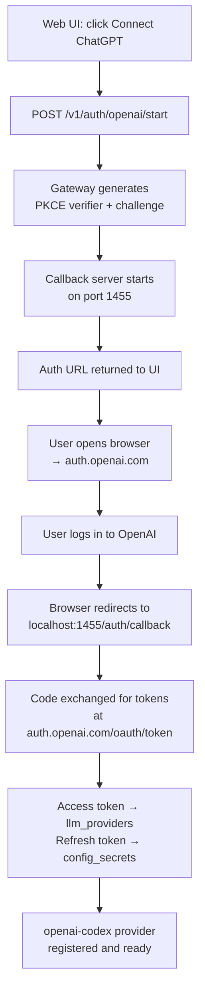

> Bản dịch từ [English version](/authentication)

# Authentication

> Kết nối GoClaw với ChatGPT qua OAuth — không cần API key, dùng tài khoản OpenAI hiện có của bạn.

## Tổng quan

GoClaw hỗ trợ xác thực OAuth 2.0 PKCE cho provider OpenAI/Codex. Điều này cho phép bạn dùng ChatGPT (provider `openai-codex`) mà không cần API key trả phí bằng cách xác thực qua tài khoản OpenAI của bạn qua trình duyệt. Token được lưu an toàn trong database và tự động làm mới trước khi hết hạn.

Luồng này khác với các provider API key tiêu chuẩn — chỉ cần thiết nếu bạn muốn dùng loại provider `openai-codex`.

---

## Định tuyến OAuth Provider (v3)

GoClaw hỗ trợ định tuyến OAuth token đến nhiều loại provider ngoài OpenAI/Codex. Trong v3, loại provider `media` bao gồm các dịch vụ như **Suno** (nhạc AI) và **DashScope** (tạo media của Alibaba) sử dụng OAuth hoặc session token thay vì API key thông thường.

### Các loại Media Provider

| Loại provider | Dịch vụ | Phương thức xác thực |
|---------------|----------|---------------------|
| `openai-codex` | ChatGPT qua Responses API | OAuth 2.0 PKCE |
| `suno` | Suno AI music generation | Session token |
| `dashscope` | Alibaba DashScope (khi dùng OAuth) | OAuth hoặc API key |

Các loại media provider được đăng ký trong bảng `llm_providers` với giá trị `provider_type` phù hợp. Gateway giải quyết nguồn token và logic refresh đúng dựa trên `provider_type` vào lúc request.

---

## Cách hoạt động



Gateway khởi động một HTTP server tạm thời trên cổng **1455** để nhận OAuth callback. Cổng này phải truy cập được từ trình duyệt (tức là truy cập được trên localhost khi dùng web UI locally, hoặc qua port forwarding cho server từ xa).

---

## Bắt đầu luồng OAuth

### Qua Web UI

1. Mở dashboard web GoClaw
2. Điều hướng đến **Providers** → **ChatGPT OAuth**
3. Click **Connect** — gateway gọi `POST /v1/auth/openai/start` và trả về auth URL
4. Trình duyệt của bạn mở `auth.openai.com` — đăng nhập và chấp thuận quyền truy cập
5. Callback đến `localhost:1455/auth/callback` — token được lưu tự động

### Môi trường Remote / VPS

Nếu callback của trình duyệt không thể đến cổng 1455 trên server, dùng fallback **manual redirect URL**:

1. Bắt đầu luồng qua web UI — sao chép auth URL
2. Mở auth URL trong trình duyệt local của bạn
3. Sau khi chấp thuận, trình duyệt cố chuyển hướng đến `localhost:1455/auth/callback` và thất bại (vì server ở xa)
4. Sao chép URL chuyển hướng đầy đủ từ thanh địa chỉ trình duyệt (bắt đầu bằng `http://localhost:1455/auth/callback?code=...`)
5. Dán vào trường manual callback trong web UI — UI gọi `POST /v1/auth/openai/callback` với URL
6. Gateway trích xuất code, hoàn tất trao đổi, và lưu token

---

## Lệnh CLI

Subcommand `./goclaw auth` giao tiếp với gateway đang chạy để kiểm tra và quản lý trạng thái OAuth.

### Kiểm tra trạng thái

```bash
./goclaw auth status
```

Đầu ra khi đã xác thực:

```
OpenAI OAuth: active (provider: openai-codex)
Use model prefix 'openai-codex/' in agent config (e.g. openai-codex/gpt-4o).
```

Đầu ra khi chưa xác thực:

```
No OAuth tokens found.
Use the web UI to authenticate with ChatGPT OAuth.
```

Lệnh này gọi `GET /v1/auth/openai/status` trên gateway đang chạy. URL gateway được giải quyết từ biến môi trường:

| Biến | Mặc định |
|----------|---------|
| `GOCLAW_GATEWAY_URL` | — (ghi đè host+port) |
| `GOCLAW_HOST` | `127.0.0.1` |
| `GOCLAW_PORT` | `3577` |

Đặt `GOCLAW_TOKEN` để xác thực request CLI nếu gateway yêu cầu token.

### Đăng xuất

```bash
./goclaw auth logout
# hoặc rõ ràng:
./goclaw auth logout openai
```

Lệnh này gọi `POST /v1/auth/openai/logout`, sẽ:

1. Xóa toàn bộ dòng provider `openai-codex` khỏi `llm_providers`
2. Xóa refresh token khỏi `config_secrets`
3. Hủy đăng ký provider `openai-codex` khỏi registry trong bộ nhớ

---

## Endpoint OAuth Gateway

Tất cả endpoint yêu cầu `Authorization: Bearer <GOCLAW_TOKEN>`.

| Method | Path | Mô tả |
|--------|------|-------------|
| `GET` | `/v1/auth/openai/status` | Kiểm tra OAuth có đang hoạt động và token hợp lệ không — trả về `{ authenticated, provider_name? }` |
| `POST` | `/v1/auth/openai/start` | Bắt đầu luồng OAuth — trả về `{ auth_url }` hoặc `{ status: "already_authenticated" }` |
| `POST` | `/v1/auth/openai/callback` | Submit redirect URL để trao đổi thủ công — body: `{ redirect_url }` — trả về `{ authenticated, provider_name, provider_id }` |
| `POST` | `/v1/auth/openai/logout` | Xóa token đã lưu và hủy đăng ký provider — trả về `{ status: "logged out" }` |

---

## Lưu trữ và Làm mới Token

GoClaw lưu OAuth token qua hai bảng:

| Lưu trữ | Nội dung lưu |
|---------|---------------|
| `llm_providers` | Access token (dưới dạng `api_key`), timestamp hết hạn trong `settings` JSONB |
| `config_secrets` | Refresh token dưới key `oauth.openai-codex.refresh_token` |

`DBTokenSource` xử lý toàn bộ vòng đời:

- **Cache**: access token được cache trong bộ nhớ và tái sử dụng cho đến khi còn 5 phút là hết hạn
- **Tự động làm mới**: khi token sắp hết hạn, refresh token được lấy từ `config_secrets` và token mới được lấy từ `auth.openai.com/oauth/token`
- **Bền vững**: cả access token mới (trong `llm_providers`) và refresh token mới (trong `config_secrets`) đều được ghi lại vào database sau khi làm mới
- **Giảm nhẹ lỗi**: nếu làm mới thất bại nhưng token vẫn còn tồn tại, token hiện có được trả về và ghi log cảnh báo — provider vẫn dùng được cho đến khi token thực sự hết hạn

Các OAuth scope được yêu cầu trong quá trình đăng nhập:

```
openid profile email offline_access api.connectors.read api.connectors.invoke
```

`offline_access` là thứ cấp refresh token cho session lâu dài.

---

## Dùng Provider trong Agent Config

Sau khi xác thực, tham chiếu provider với prefix `openai-codex/`:

```json
{
  "agent": {
    "key": "my-agent",
    "provider": "openai-codex/gpt-4o"
  }
}
```

Tên provider `openai-codex` là cố định — khớp với hằng số `DefaultProviderName` trong gói oauth.

---

## Ví dụ

**Kiểm tra trạng thái sau khi onboarding:**

```bash
source .env.local
./goclaw auth status
```

**Buộc xác thực lại (đăng xuất rồi kết nối lại qua UI):**

```bash
./goclaw auth logout
# sau đó mở web UI → Providers → Connect ChatGPT
```

---

## Các vấn đề thường gặp

| Vấn đề | Nguyên nhân | Giải pháp |
|-------|-------|-----|
| `cannot reach gateway at http://127.0.0.1:3577` | Gateway không chạy | Khởi động gateway trước: `./goclaw` |
| `failed to start OAuth flow (is port 1455 available?)` | Cổng 1455 đang được dùng | Dừng thứ đang dùng cổng 1455 |
| Callback thất bại trên server từ xa | Trình duyệt không thể đến cổng 1455 của server | Dùng luồng manual redirect URL (dán URL vào web UI) |
| `token invalid or expired` từ endpoint status | Làm mới thất bại | Chạy `./goclaw auth logout` rồi xác thực lại |
| `unknown provider: xyz` từ logout | Tên provider không được hỗ trợ | Chỉ `openai` được hỗ trợ: `./goclaw auth logout openai` |
| Agent nhận 401 từ ChatGPT | Token hết hạn và làm mới thất bại | Xác thực lại qua web UI |

---

## Tiếp theo

- [Providers Overview](/providers-overview) — tất cả provider LLM được hỗ trợ và cách cấu hình
- [Hooks & Quality Gates](/hooks-quality-gates) — thêm validation cho đầu ra agent

<!-- goclaw-source: 050aafc9 | cập nhật: 2026-04-09 -->
