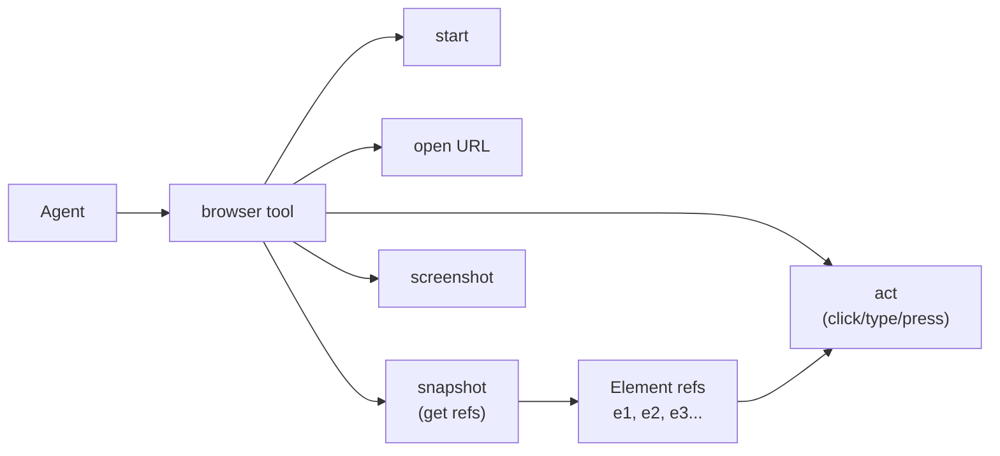

> Bản dịch từ [English version](/browser-automation)

# Browser Automation

> Cấp cho agent một trình duyệt thật — điều hướng trang, chụp ảnh màn hình, scrape nội dung, và điền form.

## Tổng quan

GoClaw tích hợp sẵn tool tự động hóa trình duyệt được cung cấp bởi [Rod](https://github.com/go-rod/rod) và Chrome DevTools Protocol (CDP). Agent có thể mở URL, tương tác với các phần tử, chụp ảnh màn hình, và đọc nội dung trang — tất cả thông qua giao diện tool có cấu trúc.

Hai chế độ hoạt động được hỗ trợ:

- **Local Chrome**: Rod tự động khởi chạy tiến trình Chrome local
- **Remote Chrome sidecar**: Kết nối đến container Chrome headless qua CDP (khuyến nghị cho server và Docker)

---

## Thiết lập Docker (Khuyến nghị)

Với triển khai production hoặc server, chạy Chrome dưới dạng container sidecar bằng `docker-compose.browser.yml`:

```bash
docker compose \
  -f docker-compose.yml \
  -f docker-compose.postgres.yml \
  -f docker-compose.browser.yml \
  up -d --build
```

Lệnh này khởi chạy container `zenika/alpine-chrome:124` mở CDP trên cổng 9222. GoClaw kết nối tự động thông qua biến môi trường `GOCLAW_BROWSER_REMOTE_URL`, mà file compose đặt là `ws://chrome:9222`.

```yaml
# docker-compose.browser.yml (trích đoạn)
services:
  chrome:
    image: zenika/alpine-chrome:124
    command:
      - --no-sandbox
      - --remote-debugging-address=0.0.0.0
      - --remote-debugging-port=9222
      - --remote-allow-origins=*
      - --disable-gpu
      - --disable-dev-shm-usage
    ports:
      - "${CHROME_CDP_PORT:-9222}:9222"
    shm_size: 2gb
    healthcheck:
      test: ["CMD-SHELL", "wget -qO- http://127.0.0.1:9222/json/version >/dev/null 2>&1"]
      interval: 5s
      timeout: 3s
      retries: 5
    deploy:
      resources:
        limits:
          memory: 2G
          cpus: '2.0'
    restart: unless-stopped

  goclaw:
    environment:
      - GOCLAW_BROWSER_REMOTE_URL=ws://chrome:9222
    depends_on:
      chrome:
        condition: service_healthy
```

Container Chrome có healthcheck xác nhận CDP sẵn sàng trước khi GoClaw khởi động.

---

## Local Chrome (Chỉ cho Dev)

Khi không có `GOCLAW_BROWSER_REMOTE_URL`, Rod khởi chạy tiến trình Chrome local. Chrome phải được cài trên host. Phù hợp cho phát triển local nhưng không khuyến nghị cho server.

---

## Cách Tool Browser hoạt động

Agent tương tác với trình duyệt qua một tool `browser` duy nhất với tham số `action`:



Quy trình chuẩn là:

1. `start` — khởi chạy hoặc kết nối trình duyệt (tự động kích hoạt bởi hầu hết action)
2. `open` — mở URL trong tab mới, nhận `targetId`
3. `snapshot` — lấy accessibility tree của trang với các ref phần tử (`e1`, `e2`, ...)
4. `act` — tương tác với phần tử dùng ref
5. `snapshot` lại để xác minh thay đổi

---

## Các Action có sẵn

| Action | Mô tả | Tham số bắt buộc |
|--------|-------------|----------------|
| `status` | Trạng thái chạy và số tab của trình duyệt | — |
| `start` | Khởi chạy hoặc kết nối trình duyệt | — |
| `stop` | Đóng trình duyệt local hoặc ngắt kết nối remote sidecar (container sidecar vẫn chạy) | — |
| `tabs` | Liệt kê các tab đang mở với URL | — |
| `open` | Mở URL trong tab mới | `targetUrl` |
| `close` | Đóng một tab | `targetId` |
| `snapshot` | Lấy accessibility tree với ref phần tử | `targetId` (tùy chọn) |
| `screenshot` | Chụp ảnh PNG | `targetId`, `fullPage` |
| `navigate` | Điều hướng tab hiện tại đến URL | `targetId`, `targetUrl` |
| `console` | Lấy tin nhắn console của trình duyệt (buffer bị xóa sau mỗi lần gọi) | `targetId` |
| `act` | Tương tác với một phần tử | đối tượng `request` |

### Các loại Act Request

| Kind | Chức năng | Trường bắt buộc | Trường tùy chọn |
|------|-------------|----------------|----------------|
| `click` | Click vào phần tử | `ref` | `doubleClick` (bool), `button` (`"left"`, `"right"`, `"middle"`) |
| `type` | Gõ văn bản vào phần tử | `ref`, `text` | `submit` (bool — nhấn Enter sau khi gõ), `slowly` (bool — gõ từng ký tự) |
| `press` | Nhấn phím bàn phím | `key` (ví dụ: `"Enter"`, `"Tab"`, `"Escape"`) | — |
| `hover` | Hover qua phần tử | `ref` | — |
| `wait` | Chờ điều kiện | một trong: `timeMs`, `text`, `textGone`, `url`, hoặc `fn` | — |
| `evaluate` | Chạy JavaScript và trả về kết quả | `fn` | — |

---

## Các trường hợp sử dụng

### Chụp ảnh trang

```json
{ "action": "open", "targetUrl": "https://example.com" }
```
```json
{ "action": "screenshot", "targetId": "<id from open>", "fullPage": true }
```

Ảnh chụp màn hình được lưu vào file tạm và trả về dưới dạng `MEDIA:/tmp/goclaw_screenshot_*.png` — pipeline media gửi nó dưới dạng ảnh (ví dụ: ảnh Telegram).

### Scrape nội dung trang

```json
{ "action": "open", "targetUrl": "https://example.com" }
```
```json
{ "action": "snapshot", "targetId": "<id>", "compact": true, "maxChars": 8000 }
```

Snapshot trả về accessibility tree. Dùng `interactive: true` để chỉ thấy các phần tử có thể click/gõ. Dùng `depth` để giới hạn độ sâu cây.

### Điền và submit form

```json
{ "action": "open", "targetUrl": "https://example.com/login" }
```
```json
{ "action": "snapshot", "targetId": "<id>" }
```
```json
{
  "action": "act",
  "targetId": "<id>",
  "request": { "kind": "type", "ref": "e3", "text": "user@example.com" }
}
```
```json
{
  "action": "act",
  "targetId": "<id>",
  "request": { "kind": "type", "ref": "e4", "text": "mypassword", "submit": true }
}
```

`submit: true` nhấn Enter sau khi gõ.

### Chạy JavaScript

```json
{
  "action": "act",
  "targetId": "<id>",
  "request": { "kind": "evaluate", "fn": "document.title" }
}
```

---

## Tùy chọn Snapshot

| Tham số | Kiểu | Mặc định | Mô tả |
|-----------|------|---------|-------------|
| `maxChars` | number | 8000 | Số ký tự tối đa trong đầu ra snapshot |
| `interactive` | boolean | false | Chỉ hiển thị các phần tử tương tác |
| `compact` | boolean | false | Xóa các node cấu trúc rỗng |
| `depth` | number | không giới hạn | Độ sâu cây tối đa |

---

## Lưu ý bảo mật

- **Bảo vệ SSRF**: GoClaw áp dụng lọc SSRF cho đầu vào tool — agent không thể dễ dàng bị hướng đến các địa chỉ mạng nội bộ.
- **Cờ no-sandbox**: Config docker compose truyền `--no-sandbox` là bắt buộc bên trong container. Không dùng cờ này trên host nếu không có cô lập container.
- **Bộ nhớ chia sẻ**: Chrome tốn nhiều bộ nhớ. Sidecar được cấu hình với `shm_size: 2gb` và giới hạn bộ nhớ 2GB. Điều chỉnh theo workload của bạn.
- **Cổng CDP được mở**: Theo mặc định, cổng 9222 chỉ truy cập được trong mạng Docker. Không mở công khai — CDP cho phép kiểm soát trình duyệt hoàn toàn mà không cần xác thực.

---

## Ví dụ

**Prompt agent để kích hoạt sử dụng trình duyệt:**

```
Take a screenshot of https://news.ycombinator.com and show me the top 5 stories.
```

Agent sẽ gọi `browser` với `open`, sau đó `screenshot` hoặc `snapshot` tùy theo tác vụ.

**Kiểm tra trạng thái trình duyệt trong hội thoại agent:**

```
Are you connected to a browser?
```

Agent gọi:

```json
{ "action": "status" }
```

Trả về:

```json
{ "running": true, "tabs": 1, "url": "https://example.com" }
```

---

## Các vấn đề thường gặp

| Vấn đề | Nguyên nhân | Giải pháp |
|-------|-------|-----|
| `failed to start browser: launch Chrome` | Chrome chưa được cài local | Dùng Docker sidecar thay thế |
| `resolve remote Chrome at ws://chrome:9222` | Sidecar chưa healthy | Chờ `service_healthy` hoặc tăng timeout khởi động |
| `snapshot failed` | Trang chưa tải xong | Thêm action `wait` sau `open` |
| Ảnh chụp màn hình trắng | Vấn đề render GPU | Đảm bảo cờ `--disable-gpu` được đặt (đã có trong compose) |
| Sử dụng bộ nhớ cao | Nhiều tab đang mở | Gọi `close` trên tab khi xong |
| Cổng CDP bị mở công khai | Cấu hình ports sai | Xóa `9222` khỏi host port mappings trong production |

---

## Tiếp theo

- [Exec Approval](/exec-approval) — yêu cầu người dùng ký duyệt trước khi chạy lệnh
- [Hooks & Quality Gates](/hooks-quality-gates) — thêm kiểm tra trước/sau cho hành động agent

<!-- goclaw-source: 050aafc9 | cập nhật: 2026-04-09 -->
