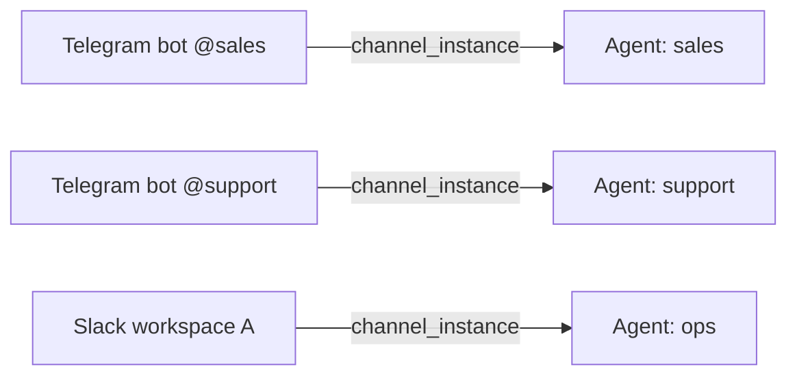

# Channel Instances

> Chạy nhiều tài khoản trên cùng loại channel — mỗi tài khoản có thông tin xác thực, agent binding, và quyền writer riêng.

## Tổng quan

**Channel instance** là kết nối được đặt tên giữa một tài khoản nhắn tin và một agent. Instance lưu trữ thông tin xác thực của tài khoản (được mã hóa khi lưu trữ), config tùy chọn theo channel, và ID của agent sở hữu nó.

Vì các instance được lưu trong database và định danh bằng UUID, bạn có thể:

- Kết nối nhiều Telegram bot với các agent khác nhau trên cùng một server
- Thêm Slack workspace thứ hai mà không ảnh hưởng đến workspace đầu tiên
- Tắt một channel mà không xóa nó hoặc thông tin xác thực
- Xoay vòng credentials chỉ với một lệnh `PUT`

Mỗi instance thuộc về đúng một agent. Khi có tin nhắn đến trên tài khoản channel đó, GoClaw định tuyến đến agent đã được gắn kết.



### Instance mặc định

Các instance có `name` bằng với loại channel (`telegram`, `discord`, `feishu`, `zalo_oa`, `whatsapp`) hoặc kết thúc bằng `/default` là các instance **mặc định** (seeded). Instance mặc định **không thể xóa** qua API — chúng được GoClaw quản lý khi khởi động.

---

## Các loại channel được hỗ trợ

| `channel_type` | Mô tả |
|---|---|
| `telegram` | Telegram bot (Bot API token) |
| `discord` | Discord bot (bot token + application ID) |
| `slack` | Slack workspace (OAuth bot token + app token) |
| `whatsapp` | WhatsApp Business (qua Meta Cloud API) |
| `zalo_oa` | Zalo Official Account |
| `zalo_personal` | Tài khoản Zalo cá nhân |
| `feishu` | Feishu / Lark bot |

---

## Đối tượng instance

Tất cả API response trả về đối tượng instance với credentials được che:

```json
{
  "id": "3f2a1b4c-0000-0000-0000-000000000001",
  "name": "telegram/sales-bot",
  "display_name": "Sales Bot",
  "channel_type": "telegram",
  "agent_id": "a1b2c3d4-...",
  "credentials": { "token": "***" },
  "has_credentials": true,
  "config": {},
  "enabled": true,
  "is_default": false,
  "created_by": "admin",
  "created_at": "2025-01-01T00:00:00Z",
  "updated_at": "2025-01-01T00:00:00Z"
}
```

| Trường | Kiểu | Ghi chú |
|---|---|---|
| `id` | UUID | Tự động tạo |
| `name` | string | Slug định danh duy nhất (ví dụ: `telegram/sales-bot`) |
| `display_name` | string | Nhãn hiển thị (tùy chọn) |
| `channel_type` | string | Một trong các loại được hỗ trợ ở trên |
| `agent_id` | UUID | Agent sở hữu instance này |
| `credentials` | object | Các key credential được hiển thị; giá trị luôn là `"***"` |
| `has_credentials` | bool | `true` nếu có credentials được lưu |
| `config` | object | Config theo từng channel (tùy chọn) |
| `enabled` | bool | `false` tắt instance mà không xóa |
| `is_default` | bool | `true` với instance seeded — không thể xóa |

---

## REST API

Tất cả endpoint yêu cầu `Authorization: Bearer <token>`.

### Liệt kê instance

```bash
GET /v1/channels/instances
```

Tham số query: `search`, `limit` (tối đa 200, mặc định 50), `offset`.

```bash
curl http://localhost:8080/v1/channels/instances \
  -H "Authorization: Bearer $GOCLAW_TOKEN"
```

Response:

```json
{
  "instances": [...],
  "total": 4,
  "limit": 50,
  "offset": 0
}
```

---

### Lấy instance

```bash
GET /v1/channels/instances/{id}
```

```bash
curl http://localhost:8080/v1/channels/instances/3f2a1b4c-... \
  -H "Authorization: Bearer $GOCLAW_TOKEN"
```

---

### Tạo instance

```bash
POST /v1/channels/instances
```

Trường bắt buộc: `name`, `channel_type`, `agent_id`.

```bash
curl -X POST http://localhost:8080/v1/channels/instances \
  -H "Authorization: Bearer $GOCLAW_TOKEN" \
  -H "Content-Type: application/json" \
  -d '{
    "name": "telegram/sales-bot",
    "display_name": "Sales Bot",
    "channel_type": "telegram",
    "agent_id": "a1b2c3d4-...",
    "credentials": {
      "token": "7123456789:AAF..."
    },
    "enabled": true
  }'
```

Trả về `201 Created` với đối tượng instance mới (credentials đã được che).

---

### Cập nhật instance

```bash
PUT /v1/channels/instances/{id}
```

Chỉ gửi các trường muốn thay đổi. Cập nhật credentials được **merge** vào credentials hiện có — cập nhật một phần không xóa các credential key khác.

```bash
# Chỉ xoay vòng bot token, giữ nguyên các credential khác
curl -X PUT http://localhost:8080/v1/channels/instances/3f2a1b4c-... \
  -H "Authorization: Bearer $GOCLAW_TOKEN" \
  -H "Content-Type: application/json" \
  -d '{
    "credentials": { "token": "7999999999:BBG..." }
  }'
```

```bash
# Tắt instance mà không xóa
curl -X PUT http://localhost:8080/v1/channels/instances/3f2a1b4c-... \
  -H "Authorization: Bearer $GOCLAW_TOKEN" \
  -H "Content-Type: application/json" \
  -d '{ "enabled": false }'
```

Trả về `{ "status": "updated" }`.

---

### Xóa instance

```bash
DELETE /v1/channels/instances/{id}
```

Trả về `403 Forbidden` nếu instance là instance mặc định (seeded).

```bash
curl -X DELETE http://localhost:8080/v1/channels/instances/3f2a1b4c-... \
  -H "Authorization: Bearer $GOCLAW_TOKEN"
```

---

## Group file writers

Mỗi channel instance cung cấp các endpoint quản lý writer ủy quyền cho agent đã gắn kết. Writer kiểm soát ai có thể upload file thông qua tính năng group file.

```bash
# Liệt kê writer groups của một channel instance
GET /v1/channels/instances/{id}/writers/groups

# Liệt kê writers trong một group
GET /v1/channels/instances/{id}/writers?group_id=<group_id>

# Thêm writer
POST /v1/channels/instances/{id}/writers
{
  "group_id": "...",
  "user_id": "123456789",
  "display_name": "Alice",
  "username": "alice"
}

# Xóa writer
DELETE /v1/channels/instances/{id}/writers/{userId}?group_id=<group_id>
```

---

## Bảo mật credentials

- Credentials được **mã hóa AES** trước khi lưu vào PostgreSQL.
- API response **không bao giờ trả về credentials dạng plaintext** — tất cả giá trị được thay bằng `"***"`.
- `has_credentials: true` trong response xác nhận credentials đã được lưu.
- Cập nhật credentials một phần an toàn: GoClaw merge các key mới vào object hiện có (đã giải mã) trước khi mã hóa lại.

---

## Các vấn đề thường gặp

| Vấn đề | Nguyên nhân | Cách khắc phục |
|---|---|---|
| `403` khi xóa | Instance là instance mặc định/seeded | Instance mặc định không thể xóa; thay vào đó dùng `enabled: false` để tắt |
| `400 invalid channel_type` | Lỗi đánh máy hoặc loại không được hỗ trợ | Dùng một trong: `telegram`, `discord`, `slack`, `whatsapp`, `zalo_oa`, `zalo_personal`, `feishu` |
| Tin nhắn không định tuyến đến agent | Instance bị tắt hoặc `agent_id` sai | Kiểm tra `enabled: true` và `agent_id` đúng |
| Credentials không được lưu | `GOCLAW_ENCRYPTION_KEY` chưa được đặt | Đặt biến môi trường encryption key; credentials yêu cầu key này |
| Cache cũ sau khi cập nhật | Cache trong bộ nhớ chưa được làm mới | GoClaw phát sự kiện cache-invalidate sau mỗi lần ghi; cache làm mới trong vài giây |

---

## Tiếp theo

- [Tổng quan Channel](#channels-overview)
- [Multi-Channel Setup](#recipe-multi-channel)
- [Multi-Tenancy](#multi-tenancy)

<!-- goclaw-source: 57754a5 | cập nhật: 2026-03-18 -->
