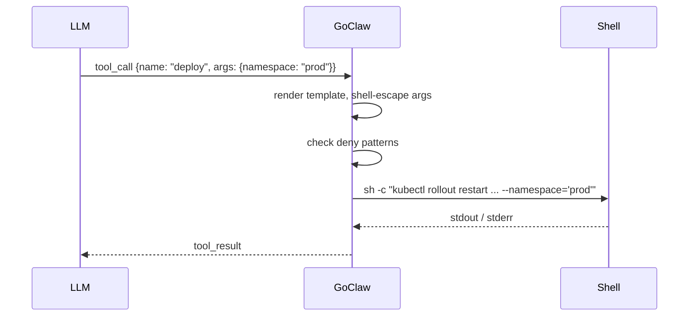

> Bản dịch từ [English version](../../advanced/custom-tools.md)

# Custom Tools

> Thêm khả năng mới cho agent bằng lệnh shell — không cần biên dịch lại, không cần khởi động lại.

## Tổng quan

Custom tools cho phép bạn mở rộng bất kỳ agent nào với các lệnh chạy trực tiếp trên server. Bạn định nghĩa tên, mô tả (dùng để LLM quyết định khi nào gọi tool), JSON Schema cho các tham số, và template lệnh shell. GoClaw lưu định nghĩa vào PostgreSQL, tải lên khi có yêu cầu, và tự động escape shell để LLM không thể inject cú pháp shell tùy ý.

Tool có thể là **global** (dùng cho tất cả agent) hoặc **chỉ cho một agent** bằng cách đặt `agent_id`.



## Tạo Tool

### Qua HTTP API

```bash
curl -X POST http://localhost:8080/v1/tools/custom \
  -H "Authorization: Bearer $GOCLAW_TOKEN" \
  -H "Content-Type: application/json" \
  -d '{
    "name": "deploy",
    "description": "Roll out the latest image to a Kubernetes namespace. Use when the user asks to deploy or restart a service.",
    "parameters": {
      "type": "object",
      "properties": {
        "namespace": {
          "type": "string",
          "description": "Target Kubernetes namespace (e.g. production, staging)"
        },
        "deployment": {
          "type": "string",
          "description": "Name of the Kubernetes deployment"
        }
      },
      "required": ["namespace", "deployment"]
    },
    "command": "kubectl rollout restart deployment/{{.deployment}} --namespace={{.namespace}}",
    "timeout_seconds": 120,
    "agent_id": "3f2a1b4c-0000-0000-0000-000000000000"
  }'
```

**Các trường bắt buộc:** `name` và `command`. Tên phải là dạng slug (chữ thường, số, dấu gạch ngang) và không được trùng với tên tool tích hợp sẵn hoặc MCP tool.

### Tham chiếu các trường

| Trường | Kiểu | Mặc định | Mô tả |
|---|---|---|---|
| `name` | string | — | Định danh slug duy nhất |
| `description` | string | — | Hiển thị cho LLM để kích hoạt tool |
| `parameters` | JSON Schema | `{}` | Các tham số LLM phải cung cấp |
| `command` | string | — | Template lệnh shell |
| `working_dir` | string | workspace của agent | Ghi đè thư mục làm việc |
| `timeout_seconds` | int | 60 | Timeout thực thi |
| `agent_id` | UUID | null | Giới hạn cho một agent; bỏ trống để dùng global |
| `enabled` | bool | true | Tắt mà không cần xóa |

### Command template

Dùng placeholder `{{.paramName}}`. GoClaw thay thế chúng bằng giá trị đã được shell-escape (single-quoted, các single-quote nhúng trong cũng được escape). Điều này đảm bảo ngay cả LLM độc hại cũng không thể thoát ra ngoài argument.

```bash
# Các placeholder này luôn được xử lý như chuỗi ký tự thông thường
kubectl rollout restart deployment/{{.deployment}} --namespace={{.namespace}}
git -C {{.repo_path}} pull origin {{.branch}}
```

### Thêm biến môi trường (secrets)

Secrets được mã hóa bằng AES-256-GCM trước khi lưu và **không bao giờ được trả về qua API**.

```bash
curl -X PUT http://localhost:8080/v1/tools/custom/{id} \
  -H "Authorization: Bearer $GOCLAW_TOKEN" \
  -H "Content-Type: application/json" \
  -d '{
    "env": {
      "KUBE_TOKEN": "eyJhbGc...",
      "SLACK_WEBHOOK": "https://hooks.slack.com/services/..."
    }
  }'
```

Các biến này chỉ được inject vào tiến trình con — không hiển thị cho LLM và không ghi vào log.

## Quản lý Tool

```bash
# Liệt kê (phân trang)
GET /v1/tools/custom?limit=50&offset=0

# Lọc theo agent
GET /v1/tools/custom?agent_id=<uuid>

# Tìm kiếm theo tên
GET /v1/tools/custom?search=deploy

# Lấy một tool
GET /v1/tools/custom/{id}

# Cập nhật (từng phần — bất kỳ trường nào)
PUT /v1/tools/custom/{id}

# Xóa
DELETE /v1/tools/custom/{id}
```

## Bảo mật

Mọi lệnh của custom tool đều được kiểm tra qua cùng **danh sách mẫu bị chặn** như tool `exec` tích hợp sẵn. Các loại bị chặn bao gồm:

- Thao tác file nguy hiểm (`rm -rf`, `dd if=`, `mkfs`)
- Rò rỉ dữ liệu (`curl | sh`, `wget --post-data`, các DNS tool)
- Reverse shell (`nc -e`, `socat`, `openssl s_client`)
- Leo thang đặc quyền (`sudo`, `nsenter`, `mount`)
- Dump biến môi trường (`printenv`, `env` thuần, `/proc/PID/environ`)
- Thoát khỏi container (`/var/run/docker.sock`, `/proc/sys/kernel/`)

Kiểm tra được thực hiện trên **lệnh đã render đầy đủ** sau khi thay thế tất cả `{{.param}}`.

## Ví dụ

### Kiểm tra dung lượng đĩa

```json
{
  "name": "check-disk",
  "description": "Report disk usage for a directory on the server.",
  "parameters": {
    "type": "object",
    "properties": {
      "path": { "type": "string", "description": "Directory path to check" }
    },
    "required": ["path"]
  },
  "command": "df -h {{.path}}"
}
```

### Xem log ứng dụng

```json
{
  "name": "tail-logs",
  "description": "Show the last N lines of an application log file.",
  "parameters": {
    "type": "object",
    "properties": {
      "service": { "type": "string", "description": "Service name, e.g. api, worker" },
      "lines":   { "type": "integer", "description": "Number of lines to show" }
    },
    "required": ["service", "lines"]
  },
  "command": "tail -n {{.lines}} /var/log/app/{{.service}}.log"
}
```

## Các vấn đề thường gặp

| Vấn đề | Nguyên nhân | Giải pháp |
|---|---|---|
| `name must be a valid slug` | Tên có chữ hoa hoặc khoảng trắng | Chỉ dùng chữ thường, số, dấu gạch ngang |
| `tool name conflicts with existing built-in or MCP tool` | Trùng với `exec`, `read_file`, hoặc MCP | Chọn tên khác |
| `command denied by safety policy` | Khớp với mẫu bị chặn | Cấu trúc lại lệnh để tránh thao tác bị chặn |
| Tool không hiển thị với agent | Sai `agent_id` hoặc `enabled: false` | Kiểm tra agent ID; bật lại nếu đã tắt |
| Timeout thực thi | Mặc định 60s quá ngắn cho tác vụ | Tăng `timeout_seconds` |

## Tiếp theo

- [MCP Integration](./mcp-integration.md) — kết nối server tool bên ngoài thay vì viết lệnh shell
- [Exec Approval](./exec-approval.md) — yêu cầu phê duyệt từ người dùng trước khi lệnh chạy
- [Sandbox](./sandbox.md) — chạy lệnh trong Docker để tăng cô lập
