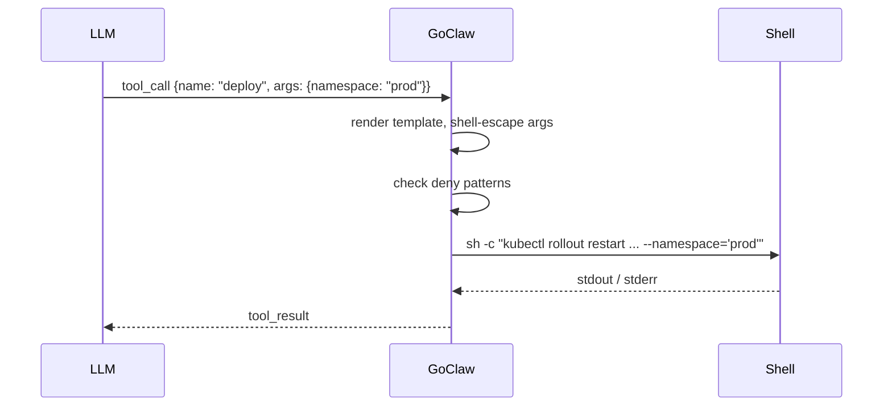

> Bản dịch từ [English version](/custom-tools)

# Custom Tools

> Thêm khả năng mới cho agent bằng lệnh shell — không cần biên dịch lại, không cần khởi động lại.

## Tổng quan

Custom tools cho phép bạn mở rộng bất kỳ agent nào với các lệnh chạy trực tiếp trên server. Bạn định nghĩa tên, mô tả (dùng để LLM quyết định khi nào gọi tool), JSON Schema cho các tham số, và template lệnh shell. GoClaw lưu định nghĩa vào PostgreSQL, tải lên khi có yêu cầu, và tự động escape shell để LLM không thể inject cú pháp shell tùy ý.

Tool có thể là **global** (dùng cho tất cả agent) hoặc **chỉ cho một agent** bằng cách đặt `agent_id`.



## Tạo Tool

### Qua HTTP API

```bash
curl -X POST http://localhost:8080/v1/tools/custom \
  -H "Authorization: Bearer $GOCLAW_TOKEN" \
  -H "Content-Type: application/json" \
  -d '{
    "name": "deploy",
    "description": "Roll out the latest image to a Kubernetes namespace. Use when the user asks to deploy or restart a service.",
    "parameters": {
      "type": "object",
      "properties": {
        "namespace": {
          "type": "string",
          "description": "Target Kubernetes namespace (e.g. production, staging)"
        },
        "deployment": {
          "type": "string",
          "description": "Name of the Kubernetes deployment"
        }
      },
      "required": ["namespace", "deployment"]
    },
    "command": "kubectl rollout restart deployment/{{.deployment}} --namespace={{.namespace}}",
    "timeout_seconds": 120,
    "agent_id": "3f2a1b4c-0000-0000-0000-000000000000"
  }'
```

**Các trường bắt buộc:** `name` và `command`. Tên phải là dạng slug (chữ thường, số, dấu gạch ngang) và không được trùng với tên tool tích hợp sẵn hoặc MCP tool.

### Tham chiếu các trường

| Trường | Kiểu | Mặc định | Mô tả |
|---|---|---|---|
| `name` | string | — | Định danh slug duy nhất |
| `description` | string | — | Hiển thị cho LLM để kích hoạt tool |
| `parameters` | JSON Schema | `{}` | Các tham số LLM phải cung cấp |
| `command` | string | — | Template lệnh shell |
| `working_dir` | string | workspace của agent | Ghi đè thư mục làm việc |
| `timeout_seconds` | int | 60 | Timeout thực thi |
| `agent_id` | UUID | null | Giới hạn cho một agent; bỏ trống để dùng global |
| `enabled` | bool | true | Tắt mà không cần xóa |

### Command template

Dùng placeholder `{{.paramName}}`. GoClaw thay thế chúng bằng giá trị đã được shell-escape qua cơ chế thay thế chuỗi đơn giản — không dùng engine `text/template` của Go, vì vậy các hàm template và pipeline không được hỗ trợ. Mỗi giá trị được thay thế đều được bọc trong single-quote với các single-quote nhúng trong cũng được escape, đảm bảo ngay cả LLM độc hại cũng không thể thoát ra ngoài argument.

```bash
# Các placeholder luôn được xử lý như chuỗi ký tự thông thường — không có logic template
kubectl rollout restart deployment/{{.deployment}} --namespace={{.namespace}}
git -C {{.repo_path}} pull origin {{.branch}}
```

### Thêm biến môi trường (secrets)

Secrets phải được đặt qua `PUT` riêng sau khi tạo — không thể đưa vào trong yêu cầu `POST` ban đầu. Chúng được mã hóa bằng AES-256-GCM trước khi lưu và **không bao giờ được trả về qua API**.

```bash
curl -X PUT http://localhost:8080/v1/tools/custom/{id} \
  -H "Authorization: Bearer $GOCLAW_TOKEN" \
  -H "Content-Type: application/json" \
  -d '{
    "env": {
      "KUBE_TOKEN": "eyJhbGc...",
      "SLACK_WEBHOOK": "https://hooks.slack.com/services/..."
    }
  }'
```

Các biến này chỉ được inject vào tiến trình con — không hiển thị cho LLM và không ghi vào log.

## Quản lý Tool

```bash
# Liệt kê (phân trang) — chỉ trả về các tool đang bật
GET /v1/tools/custom?limit=50&offset=0

# Lọc theo agent — chỉ trả về các tool đang bật của agent đó
GET /v1/tools/custom?agent_id=<uuid>

# Tìm kiếm theo tên hoặc mô tả (không phân biệt hoa thường)
GET /v1/tools/custom?search=deploy

# Lấy một tool
GET /v1/tools/custom/{id}

# Cập nhật (từng phần — bất kỳ trường nào)
PUT /v1/tools/custom/{id}

# Xóa
DELETE /v1/tools/custom/{id}
```

## Bảo mật

Mọi lệnh của custom tool đều được kiểm tra qua cùng **danh sách mẫu bị chặn** như tool `exec` tích hợp sẵn. Các loại bị chặn bao gồm:

- Thao tác file nguy hiểm (`rm -rf`, `rm --recursive`, `dd if=`, `mkfs`, `shutdown`, `reboot`, fork bomb)
- Rò rỉ dữ liệu (`curl | sh`, `curl` với cờ POST/PUT, `wget --post-data`, DNS tool: `nslookup`, `dig`, `host`, redirect `/dev/tcp/`)
- Reverse shell (`nc -e`, `ncat`, `socat`, `openssl s_client`, `telnet`, `mkfifo`, import socket qua scripting)
- Eval/code injection nguy hiểm (`eval $`, `base64 -d | sh`)
- Leo thang đặc quyền (`sudo`, `su -`, `nsenter`, `unshare`, `mount`, `capsh`, `setcap`)
- Thao tác path nguy hiểm (`chmod` trên đường dẫn `/`, `chmod +x` trong `/tmp`, `/var/tmp`, `/dev/shm`)
- Inject biến môi trường (`LD_PRELOAD=`, `DYLD_INSERT_LIBRARIES=`, `LD_LIBRARY_PATH=`, `BASH_ENV=`)
- Dump biến môi trường (`printenv`, `env` thuần, `env | ...`, `env > file`, dump `set`/`export -p`/`declare -x`, `/proc/PID/environ`, `/proc/self/environ`)
- Thoát khỏi container (`/var/run/docker.sock`, `/proc/sys/`, `/sys/kernel/`)
- Đào coin (`xmrig`, `cpuminer`, giao thức stratum)
- Bypass filter (`sed /e`, `sort --compress-program`, `git --upload-pack=`, `grep --pre=`)
- Dò quét mạng (`nmap`, `masscan`, outbound `ssh`/`scp` có `@`)
- Persistence (`crontab`, ghi vào shell RC như `.bashrc`, `.zshrc`)
- Thao tác tiến trình (`kill -9`, `killall`, `pkill`)

Kiểm tra được thực hiện trên **lệnh đã render đầy đủ** sau khi thay thế tất cả `{{.param}}`.

## Ví dụ

### Kiểm tra dung lượng đĩa

```json
{
  "name": "check-disk",
  "description": "Report disk usage for a directory on the server.",
  "parameters": {
    "type": "object",
    "properties": {
      "path": { "type": "string", "description": "Directory path to check" }
    },
    "required": ["path"]
  },
  "command": "df -h {{.path}}"
}
```

### Xem log ứng dụng

```json
{
  "name": "tail-logs",
  "description": "Show the last N lines of an application log file.",
  "parameters": {
    "type": "object",
    "properties": {
      "service": { "type": "string", "description": "Service name, e.g. api, worker" },
      "lines":   { "type": "integer", "description": "Number of lines to show" }
    },
    "required": ["service", "lines"]
  },
  "command": "tail -n {{.lines}} /var/log/app/{{.service}}.log"
}
```

## Các vấn đề thường gặp

| Vấn đề | Nguyên nhân | Giải pháp |
|---|---|---|
| `name must be a valid slug` | Tên có chữ hoa hoặc khoảng trắng | Chỉ dùng chữ thường, số, dấu gạch ngang |
| `tool name conflicts with existing built-in or MCP tool` | Trùng với `exec`, `read_file`, hoặc MCP | Chọn tên khác |
| `command denied by safety policy` | Khớp với mẫu bị chặn | Cấu trúc lại lệnh để tránh thao tác bị chặn |
| Tool không hiển thị với agent | Sai `agent_id` hoặc `enabled: false` | Kiểm tra agent ID; bật lại nếu đã tắt |
| Timeout thực thi | Mặc định 60s quá ngắn cho tác vụ | Tăng `timeout_seconds` |

## Built-in Tool: send_file

Tool `send_file` gửi file đã có sẵn trong workspace dưới dạng attachment — **không tạo hay sửa file**, chỉ deliver.

| Tham số | Bắt buộc | Mô tả |
|---------|---------|-------|
| `path` | Có | Đường dẫn file (relative to workspace hoặc absolute) |
| `caption` | Không | Tin nhắn kèm theo file |

**Ví dụ:** Agent đã tạo báo cáo tại `reports/summary.pdf`, sau đó gọi:

```json
{ "path": "reports/summary.pdf", "caption": "Báo cáo tuần này" }
```

### DeliveredMedia cross-tool dedup contract

GoClaw duy trì một `DeliveredMedia` tracker trong suốt vòng đời một agent run. Khi tool `message` gửi `MEDIA:<path>`, path đó được đánh dấu là đã delivered. Nếu agent sau đó gọi `send_file` trên cùng path, lần gọi đó là **no-op** — file không bị gửi lại.

Điều này tránh duplicate delivery trong pattern phổ biến: agent phản xạ gọi cả `write_file(deliver=true)` (sẽ tự gửi qua `message`) và `send_file` trên cùng file.

> Source: `internal/tools/send_file.go`, `internal/tools/message.go`

---

## Built-in Vault Tools

Ngoài custom shell tool, GoClaw có sẵn các vault tool tích hợp cho quản lý kiến thức. Chúng luôn có sẵn khi vault store được bật.

### `vault_link` — liên kết tài liệu vault

Tạo liên kết tường minh giữa hai tài liệu vault, tương tự `[[wikilinks]]` trong Obsidian hoặc Roam.

| Tham số | Bắt buộc | Mô tả |
|---|---|---|
| `from` | Có | Đường dẫn tài liệu nguồn (workspace-relative) |
| `to` | Có | Đường dẫn tài liệu đích (workspace-relative) |
| `context` | Không | Ghi chú mô tả mối quan hệ |
| `link_type` | Không | `wikilink` (mặc định) hoặc `reference` |

**Suy luận doc-type**: Nếu tài liệu chưa được đăng ký trong vault, GoClaw tự đăng ký dưới dạng stub, suy luận `doc_type` từ đường dẫn file (ví dụ `.md` → `note`, phần mở rộng media → `media`). Liên kết cross-team bị chặn — cả hai tài liệu phải thuộc cùng một team.

```json
{
  "from": "projects/goclaw/overview.md",
  "to": "projects/goclaw/architecture.md",
  "context": "Chi tiết kiến trúc mở rộng từ tổng quan",
  "link_type": "reference"
}
```

### `vault_backlinks` — tìm tài liệu liên kết đến một tài liệu

Trả về tất cả tài liệu liên kết đến đường dẫn được chỉ định. Tuân theo ranh giới team — team context chỉ hiển thị tài liệu cùng team; personal context chỉ hiển thị tài liệu cá nhân.

| Tham số | Bắt buộc | Mô tả |
|---|---|---|
| `path` | Có | Đường dẫn tài liệu cần tìm backlink |

## Tiếp theo

- [MCP Integration](/mcp-integration) — kết nối server tool bên ngoài thay vì viết lệnh shell
- [Exec Approval](/exec-approval) — yêu cầu phê duyệt từ người dùng trước khi lệnh chạy
- [Sandbox](/sandbox) — chạy lệnh trong Docker để tăng cô lập

<!-- goclaw-source: 29457bb3 | cập nhật: 2026-04-25 -->
