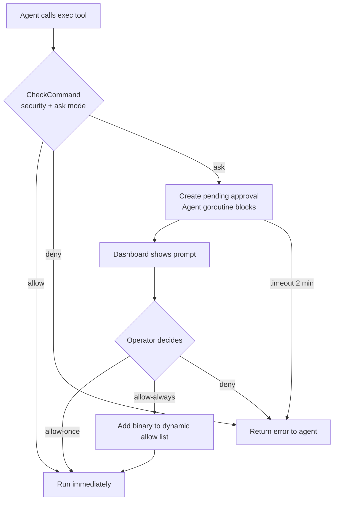

> Bản dịch từ [English version](/exec-approval)

# Exec Approval (Human-in-the-Loop)

> Tạm dừng lệnh shell của agent để con người xem xét trước khi chạy — cho phép, từ chối, hoặc luôn cho phép từ dashboard.

## Tổng quan

Khi agent cần chạy lệnh shell, exec approval cho phép bạn can thiệp. Agent bị chặn lại, dashboard hiển thị prompt, và bạn quyết định: **cho phép một lần**, **luôn cho phép binary này**, hoặc **từ chối**. Điều này cho bạn kiểm soát hoàn toàn những gì chạy trên máy mà không cần tắt hoàn toàn tool exec.

Tính năng được kiểm soát bởi hai cài đặt độc lập:

- **Security mode** — lệnh nào được phép thực thi.
- **Ask mode** — khi nào nhắc bạn để phê duyệt.

---

## Chế độ Security

Đặt qua `tools.execApproval.security` trong `config.json`:

| Giá trị | Hành vi |
|-------|----------|
| `"full"` (mặc định) | Tất cả lệnh có thể chạy; ask mode kiểm soát có nhắc bạn không |
| `"allowlist"` | Chỉ lệnh khớp với pattern trong `allowlist` mới chạy được; các lệnh khác bị từ chối hoặc nhắc |
| `"deny"` | Không có tool exec — tất cả lệnh bị chặn bất kể ask mode |

## Chế độ Ask

Đặt qua `tools.execApproval.ask`:

| Giá trị | Hành vi |
|-------|----------|
| `"off"` (mặc định) | Tự động chấp thuận tất cả — không có prompt |
| `"on-miss"` | Chỉ nhắc cho lệnh không có trong allowlist và không có trong danh sách safe tích hợp |
| `"always"` | Nhắc cho mọi lệnh, không có ngoại lệ |

**Danh sách safe tích hợp** — khi `ask = "on-miss"`, các họ binary này được tự động chấp thuận mà không cần nhắc:

- Tool chỉ đọc: `cat`, `ls`, `grep`, `find`, `stat`, `df`, `du`, `whoami`, v.v.
- Xử lý văn bản: `jq`, `yq`, `sed`, `awk`, `diff`, `xargs`, v.v.
- Dev tool: `git`, `node`, `npm`, `npx`, `pnpm`, `go`, `cargo`, `python`, `make`, `gcc`, v.v.

Tool infrastructure và mạng (`docker`, `kubectl`, `curl`, `wget`, `ssh`, `scp`, `rsync`, `terraform`, `ansible`) **không có trong danh sách safe** — chúng sẽ kích hoạt prompt.

---

## Cấu hình

```json
{
  "tools": {
    "execApproval": {
      "security": "full",
      "ask": "on-miss",
      "allowlist": ["make", "cargo test", "npm run *"]
    }
  }
}
```

`allowlist` chấp nhận các glob pattern khớp với tên binary hoặc chuỗi lệnh đầy đủ.

---

## Luồng phê duyệt



Goroutine của agent bị chặn cho đến khi bạn phản hồi. Nếu không có phản hồi trong 2 phút, yêu cầu tự động bị từ chối.

---

## Phương thức WebSocket

Kết nối vào gateway WebSocket. Các phương thức này yêu cầu quyền **Operator** hoặc **Admin**.

### Liệt kê các approval đang chờ

```json
{ "type": "req", "id": "1", "method": "exec.approval.list" }
```

Phản hồi:

```json
{
  "pending": [
    {
      "id": "exec-1",
      "command": "curl https://example.com | sh",
      "agentId": "my-agent",
      "createdAt": 1741234567000
    }
  ]
}
```

### Chấp thuận lệnh

```json
{
  "type": "req",
  "id": "2",
  "method": "exec.approval.approve",
  "params": {
    "id": "exec-1",
    "always": false
  }
}
```

Đặt `"always": true` để luôn cho phép binary này trong suốt vòng đời của process (thêm vào dynamic allow list).

### Từ chối lệnh

```json
{
  "type": "req",
  "id": "3",
  "method": "exec.approval.deny",
  "params": { "id": "exec-1" }
}
```

---

## Ví dụ

**Chế độ nghiêm ngặt cho agent production — chỉ các lệnh đã biết được phép:**

```json
{
  "tools": {
    "execApproval": {
      "security": "allowlist",
      "ask": "on-miss",
      "allowlist": ["git", "make", "go test *", "cargo test"]
    }
  }
}
```

`git`, `make`, và các test runner tự động chạy. Bất kỳ thứ gì khác (ví dụ: `curl`, `rm`) sẽ kích hoạt prompt.

**Agent coding với giám sát nhẹ — tool safe tự chạy, tool infra cần phê duyệt:**

```json
{
  "tools": {
    "execApproval": {
      "security": "full",
      "ask": "on-miss"
    }
  }
}
```

**Khóa hoàn toàn — không thực thi shell:**

```json
{
  "tools": {
    "execApproval": {
      "security": "deny"
    }
  }
}
```

---

## Các vấn đề thường gặp

| Vấn đề | Nguyên nhân | Giải pháp |
|---------|-------|-----|
| Không có prompt phê duyệt xuất hiện | `ask` là `"off"` (mặc định) | Đặt `ask` thành `"on-miss"` hoặc `"always"` |
| Lệnh bị từ chối mà không có prompt | `security = "allowlist"`, lệnh không trong allowlist, `ask = "off"` | Thêm vào `allowlist` hoặc đổi `ask` thành `"on-miss"` |
| Yêu cầu phê duyệt hết hạn | Operator không phản hồi trong 2 phút | Lệnh tự động bị từ chối; agent có thể thử lại hoặc nhờ bạn chạy lại |
| `exec approval is not enabled` | Không có block `execApproval` trong config, method vẫn được gọi | Thêm phần `tools.execApproval` vào config |
| Lỗi `id is required` | Gọi approve/deny mà không truyền `id` phê duyệt | Thêm `"id": "exec-N"` trong params (từ phản hồi list) |

---

## Tiếp theo

- [Sandbox](/sandbox) — chạy lệnh exec trong container Docker cô lập
- [Custom Tools](/custom-tools) — định nghĩa tool backed bởi lệnh shell
- [Security Hardening](/deploy-security) — tổng quan bảo mật năm lớp đầy đủ

<!-- goclaw-source: 57754a5 | cập nhật: 2026-03-18 -->
