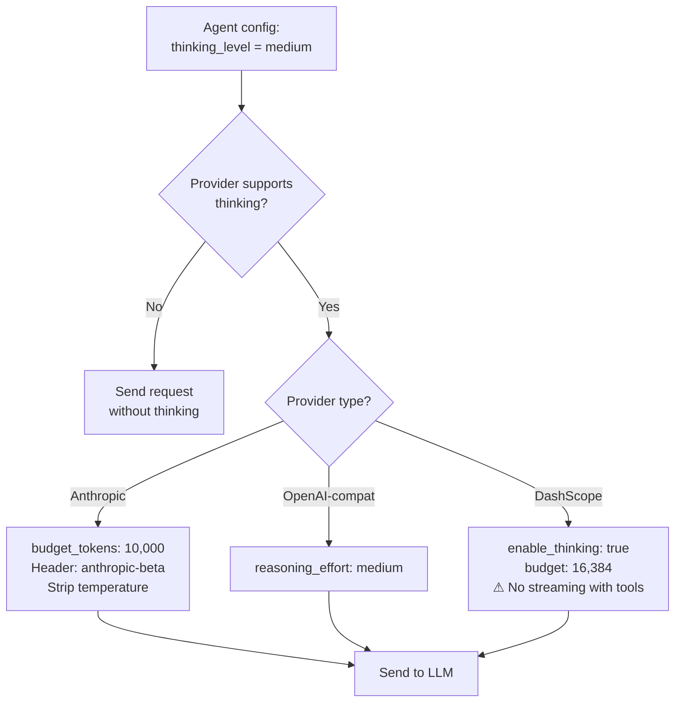
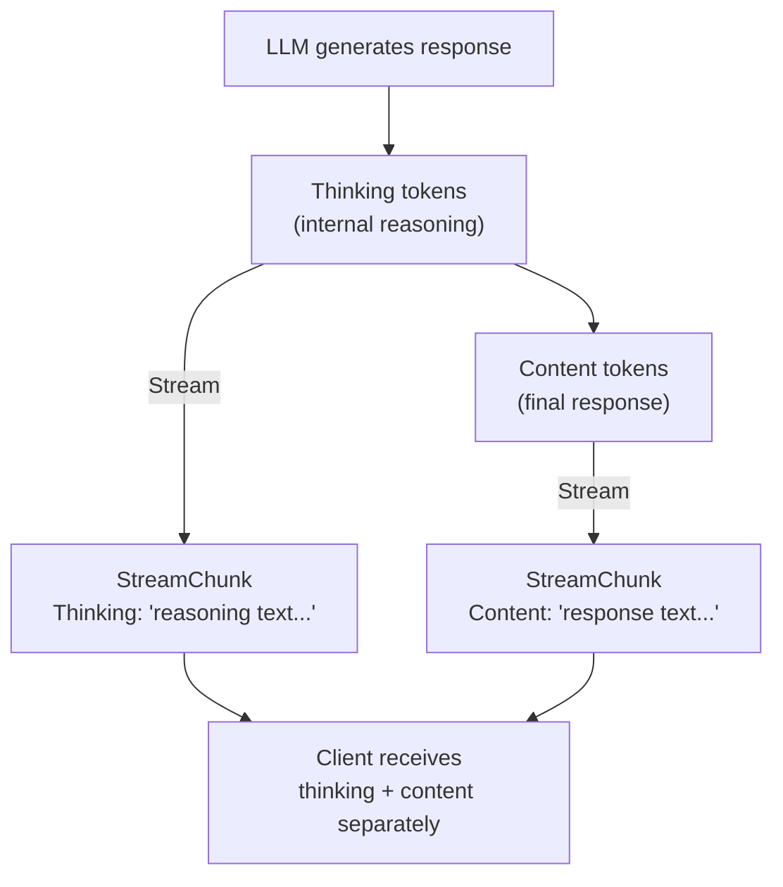
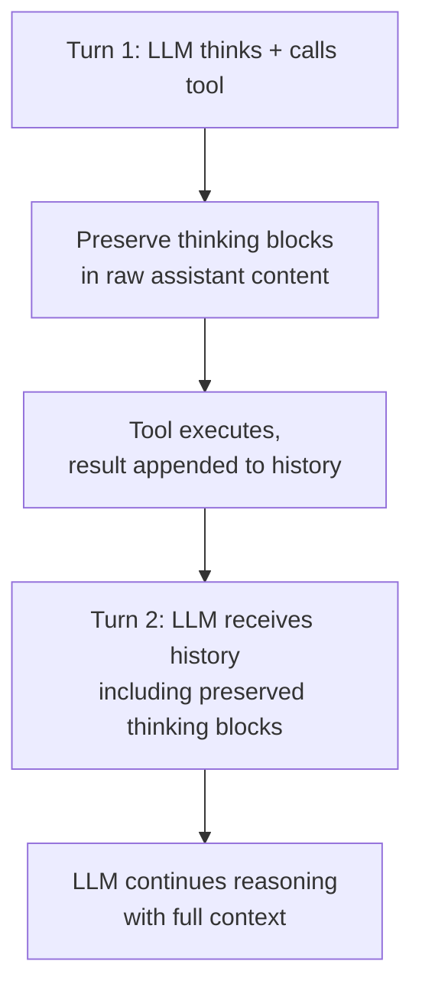

> Bản dịch từ [English version](../../advanced/extended-thinking.md)

# Extended Thinking

> Để agent "suy nghĩ thành tiếng" trước khi trả lời — kết quả tốt hơn với các tác vụ phức tạp, đổi lấy thêm token và độ trễ.

## Tổng quan

Extended thinking cho phép LLM được hỗ trợ suy luận qua một vấn đề trước khi tạo ra câu trả lời cuối cùng. Model tạo ra các token suy luận nội bộ không phải là một phần của phản hồi hiển thị nhưng cải thiện chất lượng phân tích phức tạp, lập kế hoạch nhiều bước, và ra quyết định.

GoClaw hỗ trợ extended thinking trên ba họ provider — Anthropic, OpenAI-compatible, và DashScope (Alibaba Qwen) — thông qua một cài đặt `thinking_level` thống nhất mỗi agent.

---

## Cấu hình

Đặt `thinking_level` trong config của agent:

| Mức độ | Hành vi |
|-------|----------|
| `off` | Thinking bị tắt (mặc định) |
| `low` | Thinking tối thiểu — nhanh, suy luận nhẹ |
| `medium` | Thinking vừa phải — cân bằng chất lượng và chi phí |
| `high` | Thinking tối đa — suy luận sâu cho tác vụ khó |

Cài đặt này theo từng agent và áp dụng cho tất cả người dùng của agent đó.

---

## Ánh xạ Provider

Mỗi provider dịch `thinking_level` theo cách khác nhau:



### Anthropic

| Mức độ | Budget tokens |
|-------|:---:|
| `low` | 4,096 |
| `medium` | 10,000 |
| `high` | 32,000 |

Khi thinking hoạt động, GoClaw:

- Thêm `thinking: { type: "enabled", budget_tokens: N }` vào body request
- Đặt header `anthropic-beta: interleaved-thinking-2025-05-14`
- **Xóa tham số `temperature`** — Anthropic từ chối request thinking kèm temperature
- Tự động điều chỉnh `max_tokens` thành `budget_tokens + 8,192` để phù hợp với overhead thinking

### OpenAI-Compatible (OpenAI, Groq, DeepSeek, v.v.)

Ánh xạ `thinking_level` trực tiếp sang `reasoning_effort`:

- `low` → `reasoning_effort: "low"`
- `medium` → `reasoning_effort: "medium"`
- `high` → `reasoning_effort: "high"`

Nội dung suy luận đến trong `reasoning_content` trong quá trình streaming và không yêu cầu xử lý passback đặc biệt giữa các turn.

### DashScope (Alibaba Qwen)

| Mức độ | Budget tokens |
|-------|:---:|
| `low` | 4,096 |
| `medium` | 16,384 |
| `high` | 32,768 |

Thinking được bật qua `enable_thinking: true` cộng với tham số `thinking_budget`.

**Giới hạn quan trọng**: DashScope không thể stream phản hồi khi có tool. Khi agent có tool được bật và thinking đang hoạt động, GoClaw tự động fallback sang chế độ non-streaming (một lần gọi `Chat()`) và tổng hợp các stream chunk callback để luồng sự kiện vẫn nhất quán cho client.

---

## Streaming

Khi thinking hoạt động, nội dung suy luận được stream cùng với nội dung câu trả lời thông thường. Client nhận cả hai riêng biệt:



| Provider | Sự kiện thinking | Sự kiện content |
|----------|---------------|---------------|
| Anthropic | `thinking_delta` trong content blocks | `text_delta` trong content blocks |
| OpenAI-compat | `reasoning_content` trong delta | `content` trong delta |
| DashScope | Không stream với tools (fallback sang non-streaming) | Như vậy |

Token thinking được ước tính là `character_count / 4` để theo dõi context window.

---

## Xử lý vòng lặp Tool

Khi agent dùng tool, thinking phải tồn tại qua nhiều turn. GoClaw xử lý điều này tự động — nhưng cơ chế khác nhau theo provider.



**Anthropic**: Thinking block bao gồm trường `signature` mật mã phải được echo lại chính xác trong các turn tiếp theo. GoClaw tích lũy raw content block trong quá trình streaming (bao gồm cả block loại `thinking`) và gửi lại chúng ở turn tiếp theo. Xóa hoặc sửa đổi các block này khiến API từ chối request hoặc tạo ra phản hồi kém chất lượng.

**OpenAI-compatible**: Nội dung suy luận được coi là metadata. Suy luận của mỗi turn là độc lập — không cần passback.

---

## Giới hạn

| Provider | Giới hạn |
|----------|-----------|
| DashScope | Không thể stream khi có tool — fallback sang non-streaming |
| Anthropic | `temperature` bị xóa khi thinking được bật |
| Tất cả | Token thinking được tính vào budget context window |
| Tất cả | Thinking tăng độ trễ và chi phí tỉ lệ với mức budget |

---

## Ví dụ

**Bật thinking ở mức medium cho agent Anthropic:**

```json
{
  "agent": {
    "key": "analyst",
    "provider": "claude-opus-4-5",
    "thinking_level": "medium"
  }
}
```

Ở mức `medium`, Anthropic nhận `budget_tokens: 10,000`. Câu trả lời hiển thị của agent không thay đổi — thinking diễn ra nội bộ.

**Thinking cao cho agent nghiên cứu phức tạp:**

```json
{
  "agent": {
    "key": "researcher",
    "provider": "claude-opus-4-5",
    "thinking_level": "high"
  }
}
```

Cài đặt này đặt `budget_tokens: 32,000`. Dùng cho các tác vụ yêu cầu phân tích nhiều bước sâu. Expect độ trễ và chi phí token cao hơn.

**Agent OpenAI o-series với reasoning thấp:**

```json
{
  "agent": {
    "key": "quick-reviewer",
    "provider": "o4-mini",
    "thinking_level": "low"
  }
}
```

Ánh xạ sang `reasoning_effort: "low"` trên OpenAI API.

---

## Các vấn đề thường gặp

| Vấn đề | Nguyên nhân | Giải pháp |
|-------|-------|-----|
| `temperature` bị xóa bất ngờ | Anthropic thinking được bật | Hành vi bình thường — Anthropic yêu cầu không có temperature khi thinking |
| Agent DashScope chậm với tools | Streaming bị tắt khi có thinking + tools | Bình thường — giới hạn DashScope; giảm số tool hoặc tắt thinking |
| Sử dụng context cao | Token thinking lấp đầy cửa sổ | Dùng mức `low` hoặc `medium`; theo dõi % context trong log |
| Không thấy đầu ra thinking | Thinking là nội bộ theo mặc định | Reasoning chunk được stream riêng; kiểm tra sự kiện WebSocket phía client |
| Thinking không có tác dụng | Provider không hỗ trợ thinking | Kiểm tra loại provider — chỉ Anthropic, OpenAI-compat, và DashScope được hỗ trợ |

---

## Tiếp theo

- [Agents Overview](../core-concepts/agents-explained.md) — tài liệu tham khảo cấu hình mỗi agent
- [Hooks & Quality Gates](../advanced/hooks-quality-gates.md) — validate đầu ra agent sau khi suy luận
