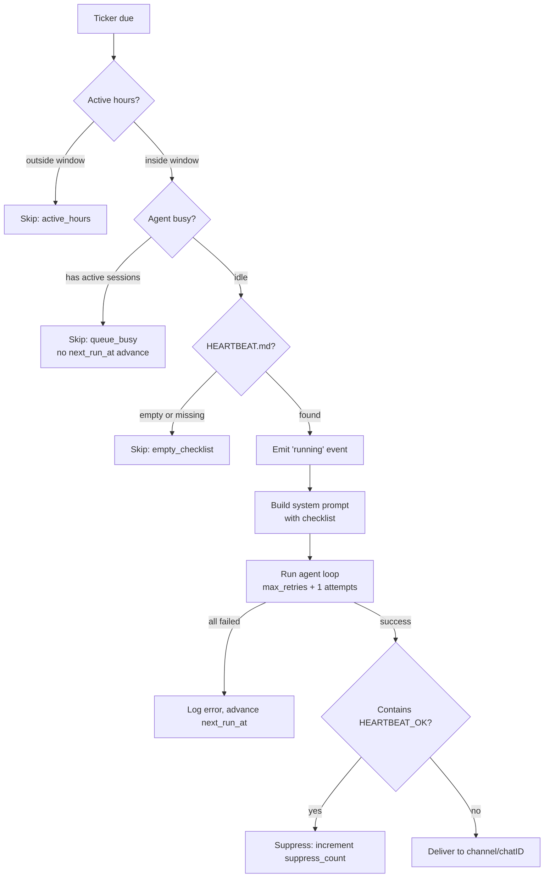

> Bản dịch từ [English version](../../advanced/heartbeat.md)

# Heartbeat

> Kiểm tra định kỳ chủ động — agent thực thi danh sách kiểm tra có thể cấu hình theo timer và báo cáo kết quả đến channel của bạn.

## Tổng quan

Heartbeat là tính năng giám sát cấp ứng dụng: agent thức dậy theo lịch, thực hiện danh sách kiểm tra HEARTBEAT.md, và gửi kết quả đến một messaging channel (Telegram, Discord, Feishu). Nếu mọi thứ ổn, agent có thể bỏ qua việc gửi hoàn toàn bằng token `HEARTBEAT_OK` — giữ channel yên tĩnh khi không có gì cần báo cáo.

Đây **không phải** là WebSocket keep-alive. Đây là hệ thống giám sát chủ động hướng người dùng với tính năng suppression thông minh, cửa sổ giờ hoạt động, và ghi đè model per-heartbeat.

## Thiết lập nhanh

### Qua Dashboard

1. Mở **Agent Detail** → tab **Heartbeat**
2. Nhấn **Configure** (hoặc **Setup** nếu chưa cấu hình)
3. Đặt interval, delivery channel, và viết danh sách kiểm tra HEARTBEAT.md
4. Nhấn **Save** — agent sẽ chạy theo lịch

### Qua agent tool

Agent có thể tự cấu hình heartbeat trong cuộc hội thoại:

```json
{
  "action": "set",
  "enabled": true,
  "interval": 1800,
  "channel": "telegram",
  "chat_id": "-100123456789",
  "active_hours": "08:00-22:00",
  "timezone": "Asia/Ho_Chi_Minh"
}
```

## Danh sách kiểm tra HEARTBEAT.md

HEARTBEAT.md là file context của agent xác định những gì agent nên làm trong mỗi lần chạy heartbeat. Nó nằm cùng với các file context khác (BOOTSTRAP.md, SKILLS.md, v.v.).

**Cách viết:**

- Liệt kê các tác vụ cụ thể dùng tool của agent — không chỉ đọc lại danh sách
- Dùng `HEARTBEAT_OK` ở cuối khi tất cả kiểm tra qua và không có gì cần gửi
- Giữ ngắn gọn: danh sách kiểm tra ngắn chạy nhanh hơn và tốn ít chi phí hơn

**Ví dụ HEARTBEAT.md:**

```markdown
# Heartbeat Checklist

1. Check https://api.example.com/health — if non-200, alert immediately
2. Query the DB for any failed jobs in the last 30 minutes — summarize if any
3. If all clear, respond with: HEARTBEAT_OK
```

Agent nhận danh sách kiểm tra trong system prompt với hướng dẫn rõ ràng để thực thi các tác vụ bằng tool, không chỉ lặp lại văn bản danh sách.

## Cấu hình

| Trường | Kiểu | Mặc định | Mô tả |
|---|---|---|---|
| `enabled` | bool | `false` | Công tắc bật/tắt chính |
| `interval_sec` | int | 1800 | Giây giữa các lần chạy (tối thiểu: 300) |
| `prompt` | string | — | Tin nhắn check-in tùy chỉnh (mặc định: "Execute your heartbeat checklist now.") |
| `provider_id` | UUID | — | Ghi đè LLM provider cho lần chạy heartbeat |
| `model` | string | — | Ghi đè model (ví dụ: `gpt-4o-mini`) |
| `isolated_session` | bool | `true` | Session mới cho mỗi lần chạy, tự động xóa sau |
| `light_context` | bool | `false` | Bỏ qua file context, chỉ inject HEARTBEAT.md |
| `max_retries` | int | 2 | Số lần thử lại khi thất bại (0–10, exponential backoff) |
| `active_hours_start` | string | — | Thời điểm bắt đầu cửa sổ theo định dạng `HH:MM` |
| `active_hours_end` | string | — | Thời điểm kết thúc cửa sổ (hỗ trợ qua nửa đêm) |
| `timezone` | string | — | Timezone IANA cho active hours (mặc định: UTC) |
| `channel` | string | — | Delivery channel: `telegram`, `discord`, `feishu` |
| `chat_id` | string | — | ID chat hoặc group đích |
| `ack_max_chars` | int | — | Dành cho logic ngưỡng trong tương lai (chưa hoạt động) |

## Lên lịch và Wake Mode

Heartbeat ticker kiểm tra các agent đến hạn mỗi 30 giây. Có bốn cách kích hoạt lần chạy heartbeat:

| Chế độ | Trigger |
|---|---|
| **Ticker poll** | Goroutine nền chạy `ListDue(now)` mỗi 30s |
| **Manual test** | Nút "Test" trong Dashboard UI hoặc lệnh gọi agent tool `{"action": "test"}` |
| **RPC test** | Lệnh gọi WebSocket RPC `heartbeat.test` |
| **Cron wake** | Cron job với `wake_heartbeat: true` hoàn thành → kích hoạt chạy ngay |

**Cơ chế stagger:** Khi bật heartbeat lần đầu, `next_run_at` ban đầu được offset một lượng xác định (hash FNV-1a của agent UUID, giới hạn 10% `interval_sec`). Điều này ngăn nhiều agent bật cùng lúc đều kích hoạt cùng một lúc. Các lần chạy tiếp theo tăng bằng interval cố định không có stagger.

## Luồng thực thi



**Các bước:**

1. **Lọc active hours** — Nếu ngoài cửa sổ cấu hình, bỏ qua và tăng `next_run_at`
2. **Kiểm tra queue** — Nếu agent có session chat đang hoạt động, bỏ qua *mà không* tăng `next_run_at` (thử lại ở lần poll 30s tiếp theo)
3. **Tải checklist** — Đọc HEARTBEAT.md từ context file của agent; bỏ qua nếu trống
4. **Emit event** — Phát `heartbeat: running` đến tất cả WebSocket client
5. **Build prompt** — Inject checklist + suppression rule vào extra system prompt của agent
6. **Chạy agent loop** — Exponential backoff: ngay lập tức → 1s → 2s → ... tổng cộng `max_retries + 1` lần
7. **Kiểm tra suppression** — Nếu response chứa `HEARTBEAT_OK` bất kỳ đâu, hủy delivery
8. **Deliver** — Publish đến `channel` + `chat_id` đã cấu hình qua message bus

## Suppression thông minh

Khi response của agent chứa token `HEARTBEAT_OK` bất kỳ đâu, **toàn bộ response bị suppressed** — không có gì được gửi đến channel. Điều này giữ chat yên tĩnh trong các lần chạy "all clear" thường ngày.

**Dùng `HEARTBEAT_OK` khi:**
- Tất cả kiểm tra giám sát qua
- Không phát hiện bất thường
- Checklist không yêu cầu gửi nội dung

**KHÔNG dùng `HEARTBEAT_OK` khi:**
- Checklist yêu cầu báo cáo, tóm tắt, trò đùa, lời chào, v.v.
- Bất kỳ kiểm tra nào thất bại hoặc cần chú ý

Trường `suppress_count` theo dõi tần suất suppression kích hoạt, cho bạn tín hiệu về tỷ lệ tín hiệu-nhiễu của checklist.

## Ghi đè Provider và Model

Bạn có thể chạy heartbeat trên model rẻ hơn model mặc định của agent:

```json
{
  "action": "set",
  "provider_name": "openai",
  "model": "gpt-4o-mini"
}
```

Điều này chỉ áp dụng trong lần chạy heartbeat. Cuộc hội thoại thông thường của agent vẫn dùng model đã cấu hình. Ghi đè hữu ích khi tần suất heartbeat cao và bạn muốn kiểm soát chi phí.

## Light Context Mode

Theo mặc định, agent tải tất cả file context (BOOTSTRAP.md, SKILLS.md, INSTRUCTIONS.md, v.v.) trước mỗi lần chạy. Bật `light_context` bỏ qua tất cả và chỉ inject HEARTBEAT.md:

```json
{ "action": "set", "light_context": true }
```

Điều này giảm kích thước context, tăng tốc thực thi, và giảm chi phí token — lý tưởng khi checklist tự đủ và không phụ thuộc vào hướng dẫn agent chung.

## Đích gửi

Heartbeat gửi kết quả đến cặp `channel` + `chat_id` bạn cấu hình. GoClaw có thể tự động gợi ý đích bằng cách kiểm tra lịch sử session của agent:

- Trong Dashboard → tab **Delivery** → nhấn **Fetch targets**
- Qua RPC: `heartbeat.targets` trả về các tuple `(channel, chatId, title, kind)` đã biết

Khi agent tự cấu hình heartbeat dùng action `set` từ trong cuộc hội thoại channel thực, đích delivery được tự động điền từ context cuộc hội thoại hiện tại.

## Agent Tool

Tool tích hợp `heartbeat` cho phép agent đọc và quản lý cấu hình heartbeat của chính mình:

| Action | Yêu cầu Permission | Mô tả |
|---|---|---|
| `status` | Không | Trạng thái một dòng: enabled, interval, số lần chạy, thời gian last/next |
| `get` | Không | Cấu hình đầy đủ dạng JSON |
| `set` | Có | Tạo hoặc cập nhật config (upsert) |
| `toggle` | Có | Bật hoặc tắt |
| `set_checklist` | Có | Ghi nội dung HEARTBEAT.md |
| `get_checklist` | Không | Đọc nội dung HEARTBEAT.md |
| `test` | Không | Kích hoạt chạy ngay lập tức |
| `logs` | Không | Xem lịch sử chạy phân trang |

Permission cho action thay đổi (`set`, `toggle`, `set_checklist`) fallback theo thứ tự: deny list → allow list → agent owner → luôn được phép trong system context (cron, subagent).

## Phương thức RPC

| Phương thức | Mô tả |
|---|---|
| `heartbeat.get` | Lấy config heartbeat cho agent |
| `heartbeat.set` | Tạo hoặc cập nhật config (upsert) |
| `heartbeat.toggle` | Bật hoặc tắt (`agentId` + `enabled: bool`) |
| `heartbeat.test` | Kích hoạt chạy ngay qua wake channel |
| `heartbeat.logs` | Lịch sử chạy phân trang (`limit`, `offset`) |
| `heartbeat.checklist.get` | Đọc nội dung HEARTBEAT.md |
| `heartbeat.checklist.set` | Ghi nội dung HEARTBEAT.md |
| `heartbeat.targets` | Liệt kê đích delivery đã biết từ lịch sử session |

## Dashboard UI

**HeartbeatCard** (Agent Detail → tổng quan) — Tổng quan trạng thái nhanh: toggle enabled, interval, active hours, đích delivery, badge ghi đè model, thời gian chạy cuối, đếm ngược lần chạy tiếp theo, số lần chạy/suppress, và lỗi gần nhất.

**HeartbeatConfigDialog** — Năm phần:
1. **Basic** — Công tắc bật, slider interval (5–300 phút), prompt tùy chỉnh
2. **Schedule** — Active hours start/end (HH:MM), bộ chọn timezone
3. **Delivery** — Dropdown channel, chat ID, nút fetch-targets
4. **Model & Context** — Bộ chọn provider/model, toggle isolated session, toggle light context, max retries
5. **Checklist** — Editor HEARTBEAT.md với đếm ký tự, nút load/save

**HeartbeatLogsDialog** — Bảng lịch sử chạy phân trang: timestamp, badge trạng thái (ok / suppressed / error / skipped), thời lượng, token usage, tóm tắt hoặc text lỗi.

## Heartbeat vs Cron

| Khía cạnh | Heartbeat | Cron |
|---|---|---|
| Mục đích | Giám sát sức khỏe + check-in chủ động | Tác vụ theo lịch đa năng |
| Loại lịch | Chỉ interval cố định | `at`, `every`, `cron` (biểu thức 5 trường) |
| Interval tối thiểu | 300 giây | Không có tối thiểu |
| Nguồn checklist | File context HEARTBEAT.md | Trường `message` trong job |
| Suppression | Token `HEARTBEAT_OK` | Không có |
| Queue-aware | Bỏ qua nếu agent bận (không tăng) | Chạy bất kể |
| Ghi đè model | Cấu hình per-heartbeat | Không có |
| Light context | Cấu hình được | Không có |
| Active hours | Tích hợp sẵn HH:MM + timezone | Không tích hợp |
| Số lượng | Một per agent | Nhiều per agent |

## Các vấn đề thường gặp

| Vấn đề | Nguyên nhân | Giải pháp |
|---|---|---|
| Heartbeat không bao giờ kích hoạt | `enabled: false` hoặc không có `next_run_at` | Bật qua Dashboard hoặc `{"action": "toggle", "enabled": true}` |
| Chạy nhưng không gửi gì | `HEARTBEAT_OK` trong tất cả response | Kiểm tra logic checklist; chỉ dùng HEARTBEAT_OK khi thực sự im lặng |
| Bị bỏ qua mỗi lần | Agent luôn bận | Heartbeat chờ idle; giảm tải hội thoại người dùng hoặc kiểm tra session leak |
| Ngoài active hours | Cửa sổ `active_hours` cấu hình sai | Kiểm tra `timezone` khớp với zone IANA và giá trị HH:MM của bạn |
| Lỗi `interval_sec < 300` | Tối thiểu là 5 phút | Đặt `interval_sec` thành 300 hoặc cao hơn |
| Không có đích delivery | Agent không có lịch sử session | Bắt đầu cuộc hội thoại trong channel đích trước; đích được tự động phát hiện |
| Trạng thái lỗi, không có chi tiết | Tất cả lần thử lại thất bại | Kiểm tra `heartbeat.logs` để xem trường `error`; xác minh tool và provider có thể truy cập |

## Tiếp theo

- [Scheduling & Cron](scheduling-cron.md) — tác vụ theo lịch đa năng và biểu thức cron
- [Custom Tools](custom-tools.md) — cung cấp lệnh shell và API cho agent gọi trong lần chạy heartbeat
- [Sandbox](sandbox.md) — cô lập thực thi code trong lần chạy agent

<!-- goclaw-source: 050aafc9 | cập nhật: 2026-04-09 -->
