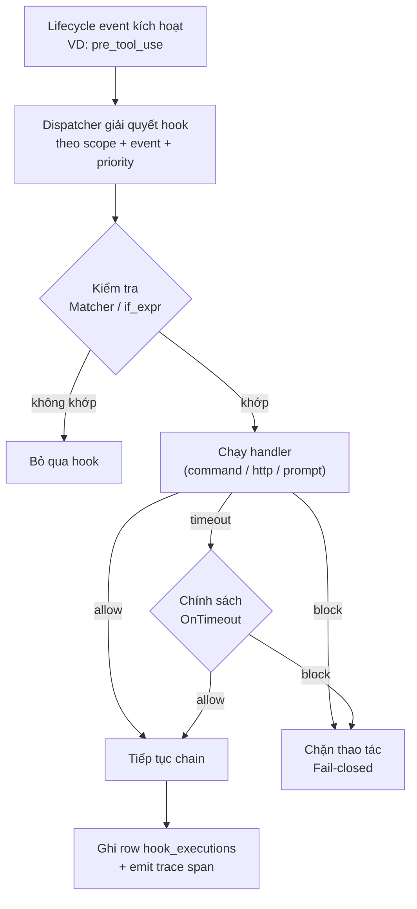

> Bản dịch từ [English version](/hooks-quality-gates)

# Agent Hooks

> Chặn, quan sát hoặc inject hành vi tại các điểm xác định trong vòng lặp agent — chặn tool call không an toàn, tự động audit sau khi ghi, inject context session, hoặc thông báo khi dừng.

## Tổng quan

Hệ thống hook của GoClaw gắn lifecycle handler vào agent session. Mỗi hook nhắm đến một **event** cụ thể, chạy một **handler** (lệnh shell, HTTP webhook, hoặc LLM evaluator), và trả về quyết định **allow/block** cho blocking event.

Hook được lưu trong bảng `agent_hooks` (migration `000052`) và quản lý qua WS method `hooks.*` hoặc panel **Hooks** trong Web UI.

---

## Khái niệm

### Events

Bảy lifecycle event kích hoạt trong agent session:

| Event | Blocking | Khi nào kích hoạt |
|---|---|---|
| `session_start` | không | Session mới được thiết lập |
| `user_prompt_submit` | **có** | Trước khi message người dùng vào pipeline |
| `pre_tool_use` | **có** | Trước khi tool call thực thi |
| `post_tool_use` | không | Sau khi tool call hoàn thành |
| `stop` | không | Agent session kết thúc bình thường |
| `subagent_start` | **có** | Sub-agent được tạo ra |
| `subagent_stop` | không | Sub-agent hoàn thành |

**Blocking** event chờ toàn bộ hook chain trả về quyết định allow/block trước khi pipeline tiếp tục. Non-blocking event kích hoạt bất đồng bộ chỉ để quan sát.

### Loại Handler

| Handler | Phiên bản | Ghi chú |
|---|---|---|
| `command` | Chỉ Lite | Lệnh shell cục bộ; exit 2 → block, exit 0 → allow |
| `http` | Lite + Standard | POST đến endpoint; body JSON → quyết định. Bảo vệ SSRF |
| `prompt` | Lite + Standard | Đánh giá bằng LLM với structured tool-call output. Giới hạn budget, yêu cầu `matcher` hoặc `if_expr` |

### Phạm vi (Scope)

- **global** — áp dụng cho tất cả tenant. Cần master scope để tạo.
- **tenant** — áp dụng cho một tenant (bất kỳ agent nào).
- **agent** — áp dụng cho một agent cụ thể trong tenant.

Hook được giải quyết theo thứ tự ưu tiên (cao nhất trước). Một quyết định `block` sẽ ngắt chuỗi ngay lập tức.

---

## Luồng Thực thi



---

## Tham chiếu Handler

### command

```json
{
  "handler_type": "command",
  "event": "pre_tool_use",
  "scope": "tenant",
  "config": {
    "command": "bash /path/to/script.sh",
    "allowed_env_vars": ["MY_VAR"],
    "cwd": "/workspace"
  }
}
```

- **Stdin**: event payload dạng JSON.
- **Exit 0**: allow (tùy chọn `{"continue": false}` → block).
- **Exit 2**: block.
- **Non-zero khác**: error → fail-closed cho blocking event.
- **Env allowlist**: chỉ key trong `allowed_env_vars` được truyền; ngăn rò rỉ secret.

### http

```json
{
  "handler_type": "http",
  "event": "user_prompt_submit",
  "scope": "tenant",
  "config": {
    "url": "https://example.com/webhook",
    "headers": { "Authorization": "<AES-encrypted>" }
  }
}
```

- Method: POST, body = event JSON.
- Giá trị Authorization header lưu mã hóa AES-256-GCM; giải mã khi dispatch.
- Giới hạn response 1 MiB. Retry một lần với 5xx (backoff 1 s); 4xx fail-closed.
- Response body mong đợi:
  ```json
  { "decision": "allow", "additionalContext": "...", "updatedInput": {}, "continue": true }
  ```
- Non-JSON 2xx → allow.

### prompt

```json
{
  "handler_type": "prompt",
  "event": "pre_tool_use",
  "scope": "tenant",
  "matcher": "^(exec|shell|write_file)$",
  "config": {
    "prompt_template": "Đánh giá mức độ an toàn của tool call này.",
    "model": "haiku",
    "max_invocations_per_turn": 5
  }
}
```

- `prompt_template` — hướng dẫn cấp hệ thống mà evaluator nhận được.
- `matcher` hoặc `if_expr` — bắt buộc; ngăn kích hoạt LLM trên mọi event.
- Evaluator PHẢI gọi tool `decide(decision, reason, injection_detected, updated_input)`. Phản hồi text thuần → fail-closed.
- Chỉ `tool_input` đến evaluator (sandboxing chống injection); message thô của người dùng không bao giờ được đưa vào.

---

## Matchers

| Trường | Mô tả |
|---|---|
| `matcher` | Regex POSIX áp dụng cho `tool_name`. Ví dụ: `^(exec|shell|write_file)$` |
| `if_expr` | Biểu thức [cel-go](https://github.com/google/cel-go) trên `{tool_name, tool_input, depth}`. Ví dụ: `tool_name == "exec" && size(tool_input.cmd) > 80` |

Cả hai đều tùy chọn cho `command`/`http`. Ít nhất một là bắt buộc cho `prompt`.

---

## Tham chiếu Trường Config

| Trường | Kiểu | Bắt buộc | Mô tả |
|---|---|---|---|
| `event` | string | có | Tên lifecycle event |
| `handler_type` | string | có | `command`, `http`, hoặc `prompt` |
| `scope` | string | có | `global`, `tenant`, hoặc `agent` |
| `name` | string | không | Nhãn dễ đọc |
| `matcher` | string | không | Regex lọc tool name |
| `if_expr` | string | không | Biểu thức CEL lọc |
| `timeout_ms` | int | không | Timeout mỗi hook (mặc định 5000, tối đa 10000) |
| `on_timeout` | string | không | `block` (mặc định) hoặc `allow` |
| `priority` | int | không | Cao hơn chạy trước (mặc định 0) |
| `enabled` | bool | không | Mặc định true |
| `config` | object | có | Sub-config cho từng handler |
| `agent_ids` | array | không | Giới hạn theo UUID agent cụ thể (scope=agent) |

---

## Mô hình Bảo mật

- **Kiểm soát phiên bản**: handler `command` bị chặn trên Standard ở cả thời điểm cấu hình và dispatch (defense in depth).
- **Tenant isolation**: tất cả đọc/ghi scope theo `tenant_id` trừ khi caller ở master scope. Hook global dùng sentinel tenant id.
- **Bảo vệ SSRF**: HTTP handler xác thực URL trước request, ghim resolved IP, chặn loopback/link-local/private range.
- **PII redaction**: audit row cắt ngắn error text còn 256 ký tự; full error mã hóa (AES-256-GCM) trong `error_detail`.
- **Fail-closed**: bất kỳ lỗi nào trong blocking event đều cho kết quả `block`. Timeout tôn trọng `on_timeout` (mặc định `block` cho blocking event).
- **Circuit breaker**: 5 block/timeout liên tiếp trong 1 phút tự động disable hook (`enabled=false`).
- **Phát hiện vòng lặp**: sub-agent hook chain giới hạn ở độ sâu 3.

---

## Tóm tắt Safeguard

| Safeguard | Mặc định | Ghi đè mỗi hook |
|---|---|---|
| Timeout mỗi hook | 5 s | có (`timeout_ms`, tối đa 10 s) |
| Chain budget | 10 s | không |
| Ngưỡng circuit | 5 block trong 1 phút | không |
| Giới hạn prompt mỗi turn | 5 lần gọi | có (`max_invocations_per_turn`) |
| TTL cache quyết định prompt | 60 s | không |
| Token budget tháng mỗi tenant | 1.000.000 token | seeded trong `tenant_hook_budget` |

---

## Quản lý Hook qua WebSocket

Toàn bộ CRUD có sẵn qua WS method `hooks.*` (xem [WebSocket Protocol](/websocket-protocol#hooks)).

**Tạo hook:**
```json
{
  "type": "req", "id": "1", "method": "hooks.create",
  "params": {
    "event": "pre_tool_use",
    "handler_type": "http",
    "scope": "tenant",
    "name": "Safety webhook",
    "matcher": "^exec$",
    "config": { "url": "https://safety.internal/check" }
  }
}
```

Response:
```json
{ "type": "res", "id": "1", "ok": true, "payload": { "hookId": "uuid..." } }
```

**Bật/tắt hook:**
```json
{ "type": "req", "id": "2", "method": "hooks.toggle",
  "params": { "hookId": "uuid...", "enabled": false } }
```

**Dry-run test (không ghi audit row):**
```json
{
  "type": "req", "id": "3", "method": "hooks.test",
  "params": {
    "config": { "event": "pre_tool_use", "handler_type": "command",
                "scope": "tenant", "config": { "command": "cat" } },
    "sampleEvent": { "toolName": "exec", "toolInput": { "cmd": "ls" } }
  }
}
```

---

## Hướng dẫn Web UI

Vào **Hooks** trong sidebar.

1. **Create** — chọn event, handler type (`command` bị ẩn trên Standard), scope, matcher, sau đó điền sub-form theo handler.
2. **Test panel** — kích hoạt hook với sample event (`dryRun=true`, không ghi audit row). Hiển thị decision badge, duration, stdout/stderr (command), status code (http), reason (prompt). Nếu response có `updatedInput`, render JSON diff side-by-side.
3. **History tab** — danh sách thực thi phân trang từ `hook_executions`.
4. **Overview tab** — thẻ tóm tắt với event, type, scope, matcher.

---

## Schema Cơ sở Dữ liệu

Ba bảng được tạo bởi migration `000052_agent_hooks`:

**`agent_hooks`** — định nghĩa hook:

| Cột | Kiểu | Ghi chú |
|---|---|---|
| `id` | UUID PK | — |
| `tenant_id` | UUID FK | sentinel UUID cho global scope |
| `agent_ids` | UUID[] | rỗng = áp dụng cho tất cả agent trong scope |
| `event` | VARCHAR(32) | một trong 7 tên event |
| `handler_type` | VARCHAR(16) | `command`, `http`, `prompt` |
| `scope` | VARCHAR(16) | `global`, `tenant`, `agent` |
| `config` | JSONB | sub-config handler |
| `matcher` | TEXT | regex tool name (tùy chọn) |
| `if_expr` | TEXT | biểu thức CEL (tùy chọn) |
| `timeout_ms` | INT | mặc định 5000 |
| `on_timeout` | VARCHAR(16) | `block` hoặc `allow` |
| `priority` | INT | cao hơn chạy trước |
| `enabled` | BOOL | circuit breaker ghi false vào đây |
| `version` | INT | tăng khi update; xóa cache prompt |
| `source` | VARCHAR(16) | `builtin` (read-only) hoặc `user` |

**`hook_executions`** — audit log:

| Cột | Ghi chú |
|---|---|
| `hook_id` | `ON DELETE SET NULL` — executions được giữ sau khi xóa hook |
| `dedup_key` | Unique index ngăn ghi trùng khi retry |
| `error` | Cắt còn 256 ký tự |
| `error_detail` | BYTEA, mã hóa AES-256-GCM full error |
| `metadata` | JSONB: `matcher_matched`, `cel_eval_result`, `stdout_len`, `http_status`, `prompt_model`, `prompt_tokens`, `trace_id` |

**`tenant_hook_budget`** — giới hạn token hàng tháng mỗi tenant (chỉ prompt handler).

---

## Observability

Mỗi lần thực thi hook phát ra trace span tên `hook.<handler_type>.<event>` (VD: `hook.prompt.pre_tool_use`) với các field: `status`, `duration_ms`, `metadata.decision`, `parent_span_id`.

Slog keys:
- `security.hook.circuit_breaker` — breaker kích hoạt.
- `security.hook.audit_write_failed` — lỗi ghi audit row.
- `security.hook.loop_depth_exceeded` — vi phạm `MaxLoopDepth`.
- `security.hook.prompt_parse_error` — evaluator trả về structured output không hợp lệ.
- `security.hook.budget_deduct_failed` / `budget_precheck_failed` — lỗi budget store.

---

## Xử lý sự cố

| Triệu chứng | Nguyên nhân có thể | Giải pháp |
|---|---|---|
| HTTP hook luôn trả `error` | SSRF block loopback | Dùng URL public/internal có thể truy cập từ gateway process |
| Prompt hook chặn mọi thứ | Evaluator trả text thuần (không có tool call) | Rút ngắn `prompt_template`; giữ ngắn gọn và mệnh lệnh |
| Hook ngừng kích hoạt | Circuit breaker kích hoạt (5 block/phút) | Sửa nguyên nhân gốc, rồi bật lại: `hooks.toggle { enabled: true }` |
| Radio `command` trong UI bị xám | Phiên bản Standard | Dùng `http` hoặc `prompt`, hoặc nâng cấp lên Lite |
| Vượt giới hạn per-turn | `max_invocations_per_turn` quá thấp | Tăng trong hook config; tối ưu `matcher` để giảm LLM call |
| Budget vượt mức | Tenant dùng hết budget token hàng tháng | Tăng `tenant_hook_budget.budget_total` hoặc chờ rollover |
| `handler_type, event, and scope are required` | Thiếu trường trong create payload | Bao gồm cả ba trường bắt buộc |

---

## Migration từ Quality Gates cũ

Trước hệ thống hook, quality gate được cấu hình inline trong `other_config.quality_gates` của source agent. Hệ thống cũ chỉ hỗ trợ event `delegation.completed` và hai handler type (`command`, `agent`).

Hệ thống hook mới thay thế bằng:

| Cũ | Mới |
|---|---|
| `other_config.quality_gates[].event: "delegation.completed"` | `subagent_stop` (non-blocking) hoặc `subagent_start` (blocking) |
| `other_config.quality_gates[].type: "command"` | `handler_type: "command"` (Lite) hoặc `handler_type: "http"` (Standard) |
| `other_config.quality_gates[].type: "agent"` | `handler_type: "prompt"` với LLM evaluator |
| `block_on_failure: true` + `max_retries` | Block semantics tích hợp sẵn; không cần vòng lặp retry |

Không cần migration dữ liệu khi nâng cấp từ phiên bản trước khi có hooks. Migration `000052_agent_hooks` tạo cả ba bảng sạch.

---

## Tiếp theo

- [WebSocket Protocol](/websocket-protocol) — tham chiếu đầy đủ method `hooks.*`
- [Exec Approval](/exec-approval) — phê duyệt từ con người cho lệnh shell
- [Extended Thinking](/extended-thinking) — suy luận sâu hơn trước khi tạo đầu ra

<!-- goclaw-source: hooks-rewrite | cập nhật: 2026-04-17 -->
