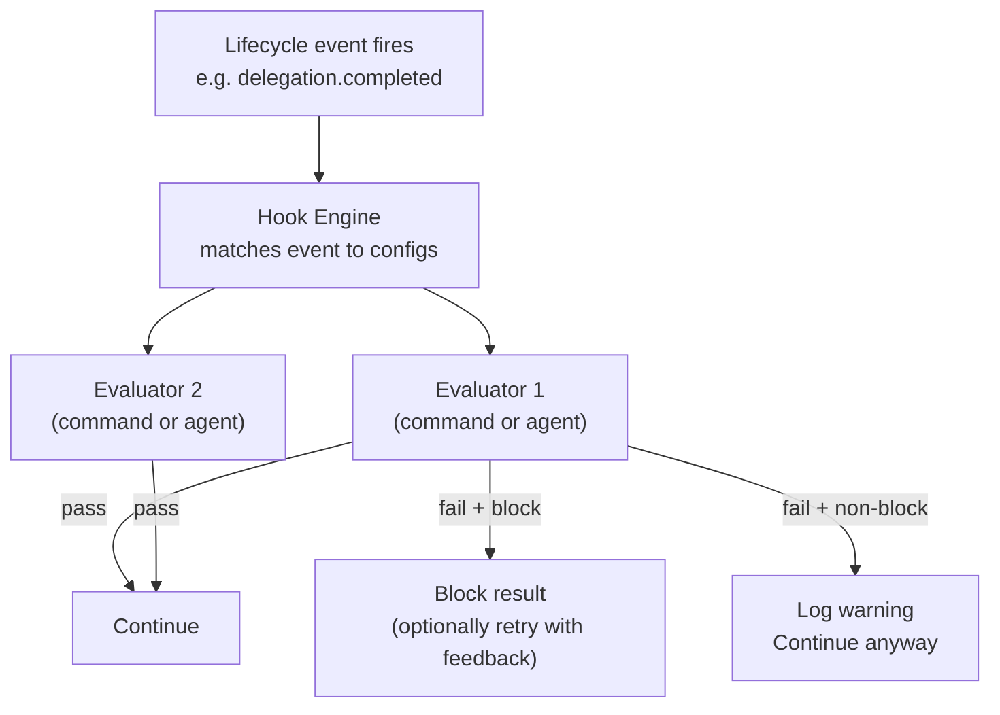

> Bản dịch từ [English version](../../advanced/hooks-quality-gates.md)

# Hooks & Quality Gates

> Chạy kiểm tra tự động trước hoặc sau hành động của agent — chặn kết quả xấu, yêu cầu phê duyệt, hoặc kích hoạt logic validation tùy chỉnh.

## Tổng quan

Hệ thống hook của GoClaw cho phép bạn gắn quality gate vào các sự kiện vòng đời của agent. Một hook là một kiểm tra chạy tại một sự kiện cụ thể (ví dụ: sau khi subagent hoàn thành một ủy quyền). Nếu kiểm tra thất bại, GoClaw có thể chặn kết quả và tùy chọn thử lại với phản hồi.

Có hai loại evaluator:

| Loại | Cách validate |
|------|-----------------|
| `command` | Chạy lệnh shell — exit 0 = pass, khác 0 = fail |
| `agent` | Ủy quyền cho agent reviewer — `APPROVED` = pass, `REJECTED: ...` = fail |

---

## Các trường cấu hình Hook

```json
{
  "event": "delegation.completed",
  "type": "command",
  "command": "./scripts/check-output.sh",
  "block_on_failure": true,
  "max_retries": 2,
  "timeout_seconds": 60
}
```

| Trường | Kiểu | Mô tả |
|-------|------|-------------|
| `event` | string | Sự kiện vòng đời kích hoạt hook này (ví dụ: `"delegation.completed"`) |
| `type` | string | `"command"` hoặc `"agent"` |
| `command` | string | Lệnh shell để chạy (chỉ cho type=command) |
| `agent` | string | Key của agent reviewer (chỉ cho type=agent) |
| `block_on_failure` | bool | Nếu `true`, hook thất bại sẽ dừng thực thi; nếu `false`, thất bại được ghi log nhưng tiếp tục |
| `max_retries` | int | Số lần thử lại sau khi thất bại có chặn (0 = không thử lại) |
| `timeout_seconds` | int | Timeout mỗi hook (mặc định 60s) |

---

## Kiến trúc Engine



Engine đánh giá hook theo thứ tự. Thất bại **có chặn** đầu tiên sẽ dừng quá trình đánh giá và trả về kết quả thất bại. Thất bại không chặn được ghi log nhưng không làm gián đoạn luồng. Nếu tất cả hook đều pass (hoặc không có hook nào khớp sự kiện), thực thi tiếp tục bình thường.

---

## Command Evaluator

Command evaluator chạy lệnh shell qua `sh -c`. Nội dung cần validate được truyền qua **stdin**. Exit 0 nghĩa là hook pass; bất kỳ exit code nào khác nghĩa là fail. Đầu ra stderr trở thành phản hồi hiển thị cho agent khi thử lại.

Biến môi trường có sẵn bên trong lệnh:

| Biến | Giá trị |
|----------|-------|
| `HOOK_EVENT` | Tên sự kiện |
| `HOOK_SOURCE_AGENT` | Key của agent tạo ra đầu ra |
| `HOOK_TARGET_AGENT` | Key của agent được ủy quyền |
| `HOOK_TASK` | Chuỗi task gốc |
| `HOOK_USER_ID` | ID người dùng kích hoạt yêu cầu |

**Ví dụ — kiểm tra độ dài nội dung cơ bản:**

```bash
#!/bin/sh
# check-output.sh: fail nếu đầu ra quá ngắn
content=$(cat)
length=${#content}
if [ "$length" -lt 100 ]; then
  echo "Output is too short ($length chars). Provide a more complete response." >&2
  exit 1
fi
exit 0
```

Cấu hình hook:

```json
{
  "event": "delegation.completed",
  "type": "command",
  "command": "./scripts/check-output.sh",
  "block_on_failure": true,
  "max_retries": 1,
  "timeout_seconds": 10
}
```

---

## Agent Evaluator

Agent evaluator ủy quyền cho một agent reviewer. GoClaw gửi một prompt có cấu trúc với task gốc, key của agent nguồn/đích, và đầu ra cần review. Reviewer phải trả lời chính xác:

- `APPROVED` (có thể kèm nhận xét) — hook pass
- `REJECTED: <phản hồi cụ thể>` — hook fail; phản hồi được dùng làm prompt thử lại

Quá trình đánh giá chạy với hooks bị bỏ qua (`WithSkipHooks`) để tránh đệ quy vô hạn.

**Ví dụ — cổng review code:**

```json
{
  "event": "delegation.completed",
  "type": "agent",
  "agent": "code-reviewer",
  "block_on_failure": true,
  "max_retries": 2,
  "timeout_seconds": 120
}
```

Agent `code-reviewer` nhận một prompt như sau:

```
[Quality Gate Evaluation]
You are reviewing the output of a delegated task for quality.

Original task: Write a Go function to parse JSON...
Source agent: orchestrator
Target agent: backend-dev

Output to evaluate:
<agent output here>

Respond with EXACTLY one of:
- "APPROVED" if the output meets quality standards
- "REJECTED: <specific feedback>" with actionable improvement suggestions
```

---

## Các trường hợp sử dụng

**Lọc nội dung** — chặn câu trả lời chứa nội dung bị cấm bằng command hook dùng grep tìm các mẫu vi phạm.

**Kiểm tra độ dài/định dạng** — từ chối đầu ra quá ngắn, thiếu các phần bắt buộc, hoặc sai định dạng.

**Quy trình phê duyệt** — dùng `agent` hook kết nối với agent reviewer nghiêm ngặt để kiểm tra tính đúng đắn trước khi chấp nhận kết quả.

**Quét bảo mật** — chạy script kiểm tra code hoặc lệnh shell được tạo ra để phát hiện các mẫu nguy hiểm trước khi thực thi.

**Audit không chặn** — đặt `block_on_failure: false` để ghi log tất cả đầu ra vào hệ thống audit mà không làm gián đoạn luồng.

---

## Ví dụ

**Cài đặt hai hook: kiểm tra định dạng rồi đến agent review:**

```json
{
  "hooks": [
    {
      "event": "delegation.completed",
      "type": "command",
      "command": "python3 ./scripts/validate-format.py",
      "block_on_failure": true,
      "max_retries": 0,
      "timeout_seconds": 15
    },
    {
      "event": "delegation.completed",
      "type": "agent",
      "agent": "quality-reviewer",
      "block_on_failure": true,
      "max_retries": 2,
      "timeout_seconds": 90
    }
  ]
}
```

**Audit logger không chặn:**

```json
{
  "event": "delegation.completed",
  "type": "command",
  "command": "curl -s -X POST https://audit.internal/log -d @-",
  "block_on_failure": false,
  "timeout_seconds": 5
}
```

---

## Các vấn đề thường gặp

| Vấn đề | Nguyên nhân | Giải pháp |
|-------|-------|-----|
| `hooks: unknown hook type, skipping` | Gõ sai trường `type` | Dùng chính xác `"command"` hoặc `"agent"` |
| Command luôn pass dù exit 1 | Script wrapper nuốt exit code | Đảm bảo script không có `|| true` che giấu thất bại |
| Agent evaluator bị treo | Agent reviewer chậm hoặc bị kẹt | Đặt `timeout_seconds` ở giá trị hợp lý |
| Vòng lặp retry vô hạn | `max_retries` quá cao và agent không thể sửa | Giới hạn `max_retries` ở 2–3; thêm điều kiện thoát |
| Hook kích hoạt cả agent reviewer | Đệ quy | GoClaw tự động inject `WithSkipHooks` cho lần gọi agent evaluator |
| Hook không chặn lại vẫn chặn | `block_on_failure: true` vô tình được đặt | Kiểm tra config; đặt `false` cho hook chỉ quan sát |

---

## Tiếp theo

- [Extended Thinking](../advanced/extended-thinking.md) — suy luận sâu hơn trước khi tạo đầu ra
- [Exec Approval](../advanced/exec-approval.md) — phê duyệt từ con người trước khi chạy lệnh shell
