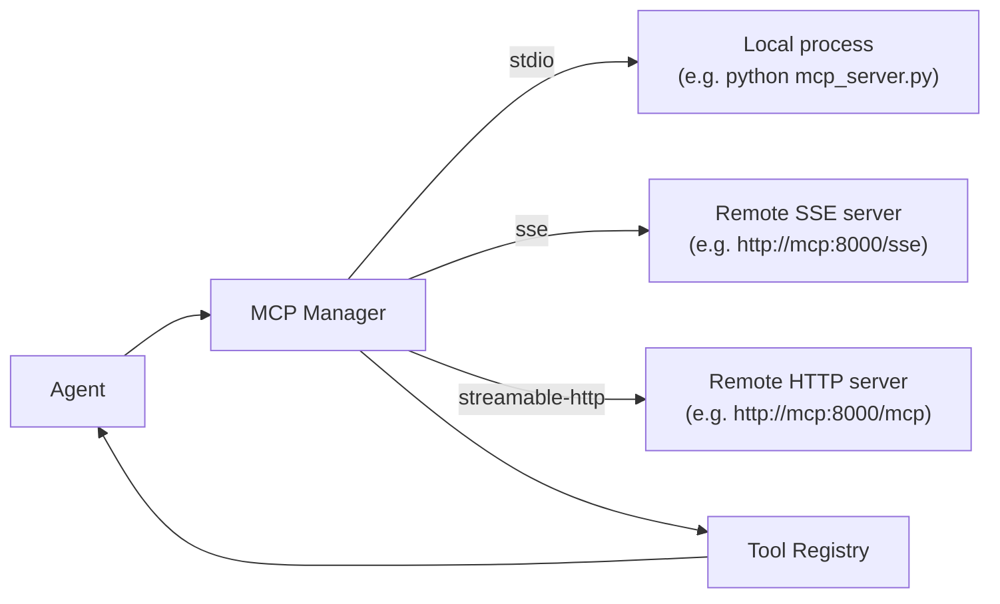

> Bản dịch từ [English version](../../advanced/mcp-integration.md)

# MCP Integration

> Kết nối bất kỳ server Model Context Protocol nào vào GoClaw và ngay lập tức cấp cho agent toàn bộ catalog tool của server đó.

## Tổng quan

MCP (Model Context Protocol) là một tiêu chuẩn mở cho phép các AI tool công khai khả năng của mình qua một giao diện thống nhất. Thay vì viết custom tool cho từng dịch vụ bên ngoài, bạn chỉ cần trỏ GoClaw vào một MCP server và nó sẽ tự động khám phá và đăng ký tất cả các tool mà server đó cung cấp.

GoClaw hỗ trợ ba loại transport:

| Transport | Khi nào dùng |
|---|---|
| `stdio` | Tiến trình local do GoClaw khởi chạy (ví dụ: một script Python) |
| `sse` | Server HTTP từ xa sử dụng Server-Sent Events |
| `streamable-http` | Server HTTP từ xa sử dụng transport streamable-HTTP mới hơn |



GoClaw chạy vòng lặp health-check mỗi 30 giây và tự động kết nối lại với exponential backoff (tối đa 10 lần thử, tối đa 60s giữa các lần thử) nếu server bị down.

## Đăng ký MCP Server

### Tùy chọn 1 — file config (dùng chung cho tất cả agent)

Thêm block `mcp_servers` vào `config.json`:

```json
{
  "mcp_servers": {
    "vnstock": {
      "transport": "streamable-http",
      "url": "http://vnstock-mcp:8000/mcp",
      "tool_prefix": "vnstock_",
      "timeout_sec": 30,
      "enabled": true
    },
    "filesystem": {
      "transport": "stdio",
      "command": "npx",
      "args": ["-y", "@modelcontextprotocol/server-filesystem", "/workspace"],
      "tool_prefix": "fs_",
      "timeout_sec": 60,
      "enabled": true
    }
  }
}
```

Các server được cấu hình qua file sẽ được tải lúc khởi động và dùng chung cho tất cả agent và người dùng.

### Tùy chọn 2 — Dashboard

Vào **Settings → MCP Servers → Add Server** và điền transport, URL hoặc lệnh, và prefix tùy chọn.

### Tùy chọn 3 — HTTP API

```bash
curl -X POST http://localhost:8080/v1/mcp/servers \
  -H "Authorization: Bearer $GOCLAW_TOKEN" \
  -H "Content-Type: application/json" \
  -d '{
    "name": "vnstock",
    "transport": "streamable-http",
    "url": "http://vnstock-mcp:8000/mcp",
    "tool_prefix": "vnstock_",
    "timeout_sec": 30,
    "enabled": true
  }'
```

### Các trường cấu hình server

| Trường | Kiểu | Mô tả |
|---|---|---|
| `transport` | string | `stdio`, `sse`, hoặc `streamable-http` |
| `command` | string | Đường dẫn thực thi (chỉ cho stdio) |
| `args` | string[] | Các đối số của lệnh (chỉ cho stdio) |
| `env` | object | Biến môi trường cho tiến trình (chỉ cho stdio) |
| `url` | string | URL của server (chỉ cho sse / streamable-http) |
| `headers` | object | HTTP headers (chỉ cho sse / streamable-http) |
| `tool_prefix` | string | Prefix thêm vào đầu tất cả tên tool từ server này |
| `timeout_sec` | int | Timeout mỗi lần gọi (mặc định 60s) |
| `enabled` | bool | Đặt `false` để tắt mà không xóa |

## Tool Prefix

Hai MCP server có thể cùng cung cấp một tool tên `search`. GoClaw ngăn xung đột bằng cách thêm `tool_prefix` vào đầu mỗi tên tool từ server đó:

```
vnstock_   → vnstock_search, vnstock_get_price, vnstock_get_financials
filesystem_ → filesystem_read_file, filesystem_write_file
```

Nếu không đặt prefix và phát hiện xung đột tên, GoClaw ghi log cảnh báo và bỏ qua tool bị trùng. Luôn đặt prefix khi kết nối các server từ các provider khác nhau.

## Phân quyền truy cập theo Agent

Các server được lưu trong DB (thêm qua Dashboard hoặc API) hỗ trợ kiểm soát truy cập theo agent và người dùng. Bạn cũng có thể giới hạn tool nào mà agent được gọi:

```bash
# Cấp quyền cho agent truy cập server, chỉ cho phép một số tool nhất định
curl -X POST http://localhost:8080/v1/mcp/grants \
  -H "Authorization: Bearer $GOCLAW_TOKEN" \
  -H "Content-Type: application/json" \
  -d '{
    "agent_id": "3f2a1b4c-...",
    "server_id": "a1b2c3d4-...",
    "tool_allow": ["vnstock_get_price", "vnstock_get_financials"],
    "tool_deny":  []
  }'
```

Khi `tool_allow` khác rỗng, chỉ những tool đó mới hiển thị với agent. `tool_deny` loại bỏ các tool cụ thể ngay cả khi phần còn lại được cho phép.

## Tự đăng ký truy cập cho người dùng

Người dùng có thể yêu cầu truy cập vào MCP server qua cổng tự phục vụ. Yêu cầu được xếp hàng chờ admin phê duyệt. Sau khi phê duyệt, server sẽ tự động được tải cho các session của người dùng đó qua `LoadForAgent`.

## Kiểm tra trạng thái server

```bash
GET /v1/mcp/servers/status
```

Phản hồi:

```json
[
  {
    "name": "vnstock",
    "transport": "streamable-http",
    "connected": true,
    "tool_count": 12,
    "error": ""
  }
]
```

## Ví dụ

### Thêm MCP server dữ liệu chứng khoán (docker-compose overlay)

```yaml
# docker-compose.vnstock-mcp.yml
services:
  vnstock-mcp:
    build:
      context: ./vnstock-mcp
    environment:
      - MCP_TRANSPORT=http
      - MCP_PORT=8000
      - MCP_HOST=0.0.0.0
      - VNSTOCK_API_KEY=${VNSTOCK_API_KEY}
    networks:
      - default
```

Sau đó đăng ký trong `config.json`:

```json
{
  "mcp_servers": {
    "vnstock": {
      "transport": "streamable-http",
      "url": "http://vnstock-mcp:8000/mcp",
      "tool_prefix": "vnstock_",
      "timeout_sec": 30,
      "enabled": true
    }
  }
}
```

Khởi động stack:

```bash
docker compose -f docker-compose.yml -f docker-compose.vnstock-mcp.yml up -d
```

Agent của bạn có thể gọi `vnstock_get_price`, `vnstock_get_financials`, v.v.

### Server stdio local (Python)

```json
{
  "mcp_servers": {
    "my-tools": {
      "transport": "stdio",
      "command": "python3",
      "args": ["/opt/mcp/my_tools_server.py"],
      "env": { "MY_API_KEY": "secret" },
      "tool_prefix": "mytools_",
      "enabled": true
    }
  }
}
```

## Các vấn đề thường gặp

| Vấn đề | Nguyên nhân | Giải pháp |
|---|---|---|
| Server hiển thị `connected: false` | Mạng không thể truy cập hoặc sai URL/lệnh | Kiểm tra log `mcp.server.connect_failed`; xác minh URL |
| Tool không hiển thị với agent | Chưa cấp quyền cho agent đó | Thêm grant qua Dashboard hoặc API |
| Cảnh báo xung đột tên tool trong log | Hai server cùng cung cấp tool trùng tên mà không có prefix | Đặt `tool_prefix` cho một hoặc cả hai server |
| Lỗi `unsupported transport` | Gõ sai trường transport | Dùng chính xác `stdio`, `sse`, hoặc `streamable-http` |
| SSE server liên tục kết nối lại | Server không implement `ping` | Đây là bình thường — GoClaw coi `method not found` là trạng thái healthy |

## Tiếp theo

- [Custom Tools](../advanced/custom-tools.md) — tạo tool shell mà không cần MCP server
- [Skills](../advanced/skills.md) — inject kiến thức tái sử dụng vào system prompt của agent
