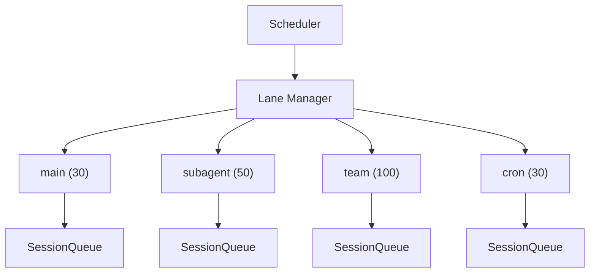
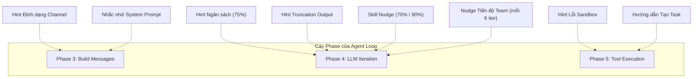
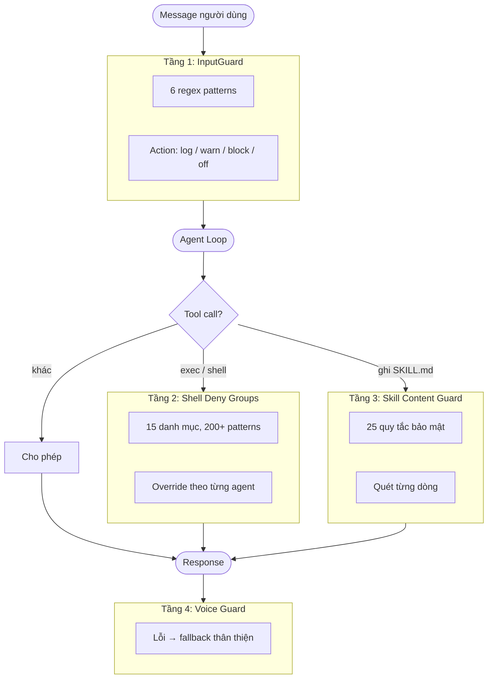
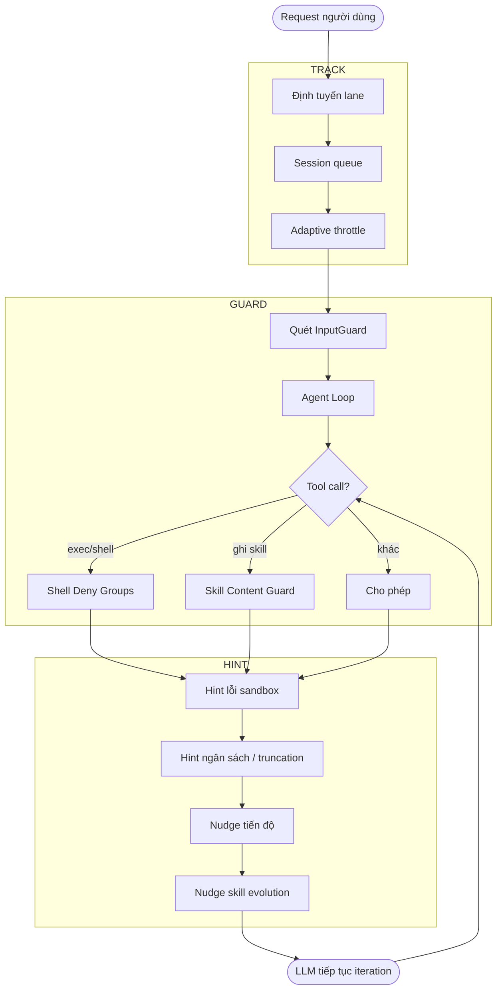

# Model Steering

> Cách GoClaw dẫn dắt các model nhỏ qua 3 tầng kiểm soát: Track (lập lịch), Hint (gợi ý theo ngữ cảnh) và Guard (ranh giới an toàn).

## Tổng quan

Các model nhỏ (< 70B tham số) khi chạy agent loop thường gặp ba vấn đề phổ biến:

| Vấn đề | Triệu chứng |
|--------|------------|
| **Mất phương hướng** | Dùng hết ngân sách iteration mà không trả lời, lặp lại tool call vô nghĩa |
| **Quên ngữ cảnh** | Không báo cáo tiến độ, bỏ qua thông tin sẵn có |
| **Vi phạm an toàn** | Chạy lệnh nguy hiểm, bị prompt injection, viết code độc hại |

GoClaw giải quyết những vấn đề này bằng **3 tầng steering** chạy đồng thời trên mỗi request:

```mermaid
flowchart LR
    REQ([Request]) --> TRACK

    subgraph TRACK["Track — Chạy ở đâu?"]
        direction TB
        T1[Định tuyến lane]
        T2[Kiểm soát concurrency]
        T3[Serialization theo session]
    end

    TRACK --> GUARD

    subgraph GUARD["Guard — Được phép làm gì?"]
        direction TB
        G1[Kiểm tra input]
        G2[Deny patterns cho shell]
        G3[Quét nội dung skill]
    end

    GUARD --> HINT

    subgraph HINT["Hint — Nên làm gì?"]
        direction TB
        H1[Cảnh báo ngân sách]
        H2[Hướng dẫn lỗi]
        H3[Nhắc nhở tiến độ]
    end

    HINT --> LOOP([Agent Loop])
```

**Nguyên tắc thiết kế:**
- **Track** — tầng hạ tầng; model không biết mình đang chạy trên lane nào
- **Guard** — ranh giới cứng; chặn hành vi nguy hiểm bất kể model nào đang chạy
- **Hint** — hướng dẫn mềm; được tiêm vào cuộc trò chuyện dưới dạng message; model có thể bỏ qua (nhưng thường không làm vậy)

---

## Track System (Lập lịch theo Lane)

Track định tuyến mỗi request theo loại công việc. Mỗi lane có giới hạn concurrency riêng để các loại workload không tranh giành tài nguyên.

### Kiến trúc Lane

### Phân công Lane

| Lane | Max Concurrent | Nguồn Request | Mục đích |
|------|:--------------:|--------------|---------|
| `main` | 30 | Chat người dùng (WebSocket / channel) | Session hội thoại chính |
| `subagent` | 50 | Subagent announce | Agent con được spawn bởi agent chính |
| `team` | 100 | Team task dispatch | Thành viên trong agent team |
| `cron` | 30 | Cron scheduler | Công việc định kỳ theo lịch |

Phân công lane là **tất định** — dựa trên loại request, không phải cấu hình agent. Agent không thể tự chọn lane.

### Queue theo Session

Mỗi session trong một lane có queue riêng:

- **DM session** — `maxConcurrent = 1` (tuần tự, không chồng lấp)
- **Group session** — `maxConcurrent = 3` (cho phép reply song song)
- **Adaptive throttle** — khi lịch sử session vượt quá 60% context window, concurrency giảm xuống 1

Adaptive throttle tồn tại để bảo vệ model nhỏ: khi context gần đầy, xử lý thêm message song song sẽ khiến model đánh mất mạch hội thoại.

---

## Hint System (Tiêm Gợi ý theo Ngữ cảnh)

Hint là các **message được tiêm vào cuộc trò chuyện** tại những thời điểm chiến lược trong agent loop. Model nhỏ được hưởng lợi nhiều nhất từ hint vì chúng có xu hướng quên các chỉ dẫn ban đầu khi hội thoại trở nên dài.

### Thời điểm Tiêm Hint

### 8 Loại Hint

#### 1. Budget Hints — Ngăn Vòng lặp Vô định hướng

Kích hoạt khi model dùng hết ngân sách iteration mà không tạo ra text response:

| Trigger | Message được tiêm |
|---------|------------------|
| Đã dùng 75% iteration, chưa có text response | "Bạn đã dùng 75% ngân sách. Hãy bắt đầu tổng hợp kết quả." |
| Đạt max iteration | Loop dừng và trả về kết quả cuối cùng |

Đặc biệt hiệu quả với model nhỏ — thay vì để chúng lặp vô tận, buộc tổng hợp sớm.

#### 2. Output Truncation Hints — Phục hồi Lỗi

Khi response của LLM bị cắt do `max_tokens`:

> `[System] Output bị cắt. Đối số tool call không đầy đủ. Thử lại với nội dung ngắn hơn — chia nhỏ write hoặc giảm text.`

Model nhỏ thường không nhận ra output của mình bị cắt. Hint này giải thích nguyên nhân và nhắc chúng điều chỉnh.

#### 3. Skill Evolution Nudges — Khuyến khích Tự cải thiện

| Trigger | Nội dung |
|---------|---------|
| Đã dùng 70% ngân sách iteration | Gợi ý tạo skill để tái sử dụng workflow hiện tại |
| Đã dùng 90% ngân sách iteration | Nhắc nhở mạnh hơn về việc tạo skill |

Các hint này là **ephemeral** (không lưu vào lịch sử session) và hỗ trợ **i18n** (en/vi/zh).

#### 4. Team Progress Nudges — Nhắc nhở Báo cáo Tiến độ

Mỗi 6 iteration khi agent đang làm việc trên một team task:

> `[System] Bạn đang ở iteration 12/20 (~60% ngân sách) cho task #3: 'Implement auth module'. Báo cáo tiến độ ngay: team_tasks(action="progress", percent=60, text="...")`

Nếu không có hint này, model nhỏ thường quên gọi hàm báo cáo tiến độ → lead agent không biết trạng thái → gây tắc nghẽn.

#### 5. Sandbox Error Hints — Giải thích Lỗi Môi trường

Khi một lệnh trong Docker sandbox gặp lỗi, hint được **gắn trực tiếp vào output lỗi**:

| Mẫu lỗi | Hint |
|---------|------|
| Exit code 127 / "command not found" | Binary chưa được cài trong sandbox image |
| "permission denied" / EACCES | Workspace được mount read-only |
| "network is unreachable" / DNS fail | `--network none` đang được bật |
| "read-only file system" / EROFS | Đang ghi ngoài workspace volume |
| "no space left" / ENOSPC | Hết disk/memory trong container |
| "no such file" | File không tồn tại trong sandbox |

Ưu tiên kiểm tra: exit code 127 trước, sau đó khớp pattern theo thứ tự ưu tiên.

#### 6. Channel Formatting Hints — Hướng dẫn theo Nền tảng

Được tiêm vào system prompt dựa trên loại channel:

- **Zalo** — "Dùng plain text, không markdown, không HTML"
- **Group chat** — Hướng dẫn dùng token `NO_REPLY` khi message không cần phản hồi

#### 7. Task Creation Guidance — Hỗ trợ Lead Agent

Khi model liệt kê hoặc tìm kiếm team task, response bao gồm:
- Danh sách thành viên + model của họ
- 4 quy tắc: viết mô tả tự đầy đủ, chia nhỏ task phức tạp, khớp độ phức tạp với khả năng model, đảm bảo task độc lập

Đặc biệt hữu ích khi model nhỏ (MiniMax, Qwen) đóng vai lead agent — chúng thường tạo task mơ hồ hoặc phân công sai độ phức tạp.

#### 8. System Prompt Reminders — Tăng cường Vùng Recency

Được tiêm ở cuối system prompt (vùng "recency" — nơi model chú ý nhất):
- Nhắc tìm kiếm memory trước khi trả lời
- Củng cố persona/nhân vật nếu agent có danh tính tùy chỉnh
- Nudge onboarding cho người dùng mới

### Bảng tóm tắt Hint

| Hint | Trigger | Ephemeral? | Điểm tiêm |
|------|---------|:----------:|-----------|
| Budget 75% | iteration == max×¾, chưa có text | Có | Message list (Phase 4) |
| Output Truncation | `finish_reason == "length"` | Có | Message list (Phase 4) |
| Skill Nudge 70% | iteration/max ≥ 0.70 | Có | Message list (Phase 4) |
| Skill Nudge 90% | iteration/max ≥ 0.90 | Có | Message list (Phase 4) |
| Team Progress | iteration % 6 == 0 và có TeamTaskID | Có | Message list (Phase 4) |
| Sandbox Error | Khớp pattern trên stderr/exit code | Không | Tool result suffix (Phase 5) |
| Channel Format | Loại channel == "zalo" v.v. | Không | System prompt (Phase 3) |
| Task Creation | Response `team_tasks` list/search | Không | Tool result JSON (Phase 5) |
| Memory/Persona | Config flags | Không | System prompt (Phase 3) |

---

## Guard System (Ranh giới An toàn)

Guard tạo ra **ranh giới cứng** — không phụ thuộc vào sự tuân thủ của model. Dù model nhỏ bị lừa bởi prompt injection, guard vẫn chặn hành vi nguy hiểm ở tầng hạ tầng.

### Kiến trúc 4 Tầng Guard

### Tầng 1: InputGuard — Phát hiện Prompt Injection

Quét **mọi message người dùng** trước khi vào agent loop, cộng với message được tiêm giữa chừng và kết quả từ web fetch/search.

| Pattern | Phát hiện |
|---------|----------|
| `ignore_instructions` | "Ignore all previous instructions…" |
| `role_override` | "You are now a…", "Pretend you are…" |
| `system_tags` | `<system>`, `[SYSTEM]`, `[INST]`, `<<SYS>>`, `<\|im_start\|>system` |
| `instruction_injection` | "New instructions:", "Override:", "System prompt:" |
| `null_bytes` | Ký tự `\x00` (null byte injection) |
| `delimiter_escape` | "End of system", `</instructions>`, `</prompt>` |

**4 chế độ action** (config: `gateway.injection_action`):

| Chế độ | Hành vi |
|--------|---------|
| `log` | Ghi log info, không chặn |
| `warn` | Ghi log warning (mặc định) |
| `block` | Từ chối message, trả lỗi cho người dùng |
| `off` | Tắt hoàn toàn việc quét |

**3 điểm quét:** message người dùng đầu vào (Phase 2), message được tiêm giữa chừng, và kết quả tool từ `web_fetch`/`web_search`.

### Tầng 2: Shell Deny Groups — An toàn Lệnh Shell

15 deny group, tất cả **BẬT mặc định**. Admin phải tường minh cho phép mới tắt được.

| Group | Ví dụ Pattern |
|-------|--------------|
| `destructive_ops` | `rm -rf`, `mkfs`, `dd if=`, `shutdown`, fork bomb |
| `data_exfiltration` | `curl \| sh`, `wget POST`, DNS lookup, `/dev/tcp/` |
| `reverse_shell` | `nc`, `socat`, `openssl s_client`, Python/Perl socket |
| `code_injection` | `eval $()`, `base64 -d \| sh` |
| `privilege_escalation` | `sudo`, `su`, `doas`, `pkexec`, `runuser`, `nsenter` |
| `dangerous_paths` | `chmod`/`chown` trên đường dẫn hệ thống |
| `env_injection` | `LD_PRELOAD`, `BASH_ENV`, `GIT_EXTERNAL_DIFF` |
| `container_escape` | Docker socket, `/proc/sys/`, `/sys/` |
| `crypto_mining` | `xmrig`, `cpuminer`, `stratum+tcp://` |
| `filter_bypass` | `sed -e`, `git --exec`, `rg --pre` |
| `network_recon` | `nmap`, `ssh`/`scp`/`sftp`, tunneling |
| `package_install` | `pip install`, `npm install`, `apk add` |
| `persistence` | `crontab`, ghi vào shell RC file |
| `process_control` | `kill -9`, `killall`, `pkill` |
| `env_dump` | `env`, `printenv`, `/proc/*/environ`, `GOCLAW_*` |

**Trường hợp đặc biệt:** `package_install` kích hoạt luồng xin phép (không phải hard deny) — agent dừng lại và hỏi người dùng. Tất cả group còn lại là hard block.

**Override theo agent:** Admin có thể cho phép các deny group cụ thể cho từng agent thông qua cấu hình DB.

### Tầng 3: Skill Content Guard

Quét **nội dung SKILL.md** trước khi ghi file. 25 quy tắc regex phát hiện:

- Shell injection và thao tác phá hoại
- Obfuscation code (`base64 -d`, `eval`, `curl | sh`)
- Đánh cắp credential (`/etc/passwd`, `.ssh/id_rsa`, `AWS_SECRET_ACCESS_KEY`)
- Path traversal (`../../..`)
- SQL injection (`DROP TABLE`, `TRUNCATE`)
- Privilege escalation (`sudo`, `chmod 777`)

Bất kỳ vi phạm nào đều dẫn đến **hard reject** — file không được ghi và model nhận thông báo lỗi.

### Tầng 4: Voice Guard

Chuyên biệt cho Telegram voice agent. Khi xử lý voice/audio gặp lỗi kỹ thuật, Voice Guard thay thế message lỗi thô bằng fallback thân thiện cho người dùng cuối. Đây là UX guard, không phải security guard.

### Tóm tắt Guard

| Guard | Phạm vi | Hành động mặc định | Cấu hình được? |
|-------|---------|:------------------:|:--------------:|
| InputGuard | Tất cả message người dùng + tiêm + tool result | warn | Có (log/warn/block/off) |
| Shell Deny | Tất cả tool call `exec`/`shell` | hard block | Có (override theo agent) |
| Skill Content | Ghi file SKILL.md | hard reject | Không |
| Voice Guard | Reply lỗi voice Telegram | fallback thân thiện | Không |

---

## 3 Tầng Phối hợp như thế nào

| Tầng | Câu hỏi trả lời | Cơ chế | Bản chất |
|------|----------------|--------|---------|
| **Track** | Chạy ở đâu? | Lane + Queue + Semaphore | Hạ tầng, model không nhìn thấy |
| **Guard** | Được phép làm gì? | Khớp regex pattern, hard deny | Ranh giới bảo mật, không phụ thuộc model |
| **Hint** | Nên làm gì? | Tiêm message vào hội thoại | Hướng dẫn mềm, model có thể bỏ qua |

**Khi dùng model lớn** (Claude, GPT-4): Guard vẫn cần thiết. Hint ít quan trọng hơn vì model lớn theo dõi ngữ cảnh tốt hơn.

**Khi dùng model nhỏ** (MiniMax, Qwen, Gemini Flash): cả 3 tầng đều quan trọng.

---

## Các vấn đề Thường gặp

| Vấn đề | Nguyên nhân | Cách xử lý |
|--------|------------|------------|
| Agent lặp vòng mà không trả lời | Budget hint không kích hoạt hoặc model bỏ qua | Kiểm tra `max_iterations` đã được set; xác nhận model phản hồi với message được tiêm |
| Lệnh shell bị từ chối im lặng | Khớp một deny group | Kiểm tra agent log tìm block `shell_deny`; admin có thể thêm override cho agent nếu cần |
| Ghi SKILL.md thất bại với lỗi guard | Nội dung khớp một quy tắc bảo mật | Xem lại SKILL.md tìm lệnh obfuscated, tham chiếu credential hoặc path traversal |
| Cảnh báo prompt injection trong log | Message người dùng khớp pattern với `injection_action: warn` | Hành vi bình thường; nâng lên `block` nếu muốn từ chối cứng |
| Model nhỏ quên báo cáo tiến độ team | Team progress nudge yêu cầu `TeamTaskID` được set | Đảm bảo task được giao qua tool `team_tasks` |

---

## Xem thêm

- [Sandbox](sandbox.md) — cô lập thực thi lệnh shell cho agent
- [Agent Teams](../agent-teams/overview.md) — phối hợp đa agent, nơi Track và Hint hoạt động tích cực nhất
- [Scheduling & Cron](scheduling-cron.md) — cách cron lane request được định tuyến qua Track

<!-- goclaw-source: 57754a5 | updated: 2026-03-23 -->
