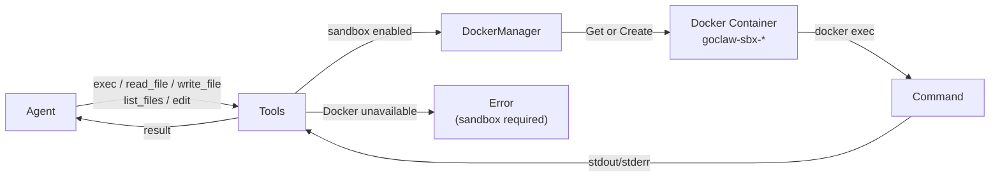

> Bản dịch từ [English version](/sandbox)

# Sandbox

> Chạy lệnh shell của agent bên trong container Docker cô lập để code không đáng tin cậy không bao giờ chạm đến host.

## Tổng quan

Khi bật chế độ sandbox, mọi lệnh gọi tool chạm vào filesystem hoặc thực thi lệnh (`exec`, `read_file`, `write_file`, `list_files`, `edit`) đều được chuyển vào container Docker thay vì chạy trực tiếp trên host. Container là tạm thời, cô lập mạng, và bị giới hạn nghiêm ngặt theo mặc định — dropped capabilities, filesystem root chỉ đọc, tmpfs cho `/tmp`, và giới hạn bộ nhớ 512 MB.

Nếu Docker không khả dụng lúc runtime, GoClaw trả về lỗi và từ chối thực thi — nó **sẽ không** fallback sang thực thi không sandbox trên host.



## Chế độ Sandbox

Đặt `GOCLAW_SANDBOX_MODE` (hoặc `agents.defaults.sandbox.mode` trong config) thành một trong các giá trị:

| Chế độ | Các agent được sandbox |
|---|---|
| `off` | Không có — tất cả lệnh chạy trên host (mặc định) |
| `non-main` | Tất cả agent ngoại trừ `main` và `default` |
| `all` | Mọi agent |

## Phạm vi Container

Phạm vi kiểm soát cách container được tái sử dụng qua các request:

| Phạm vi | Thời gian sống container | Phù hợp nhất cho |
|---|---|---|
| `session` | Một container mỗi session | Cô lập tối đa (mặc định) |
| `agent` | Một container dùng chung cho tất cả session của một agent | Trạng thái bền vững trong agent |
| `shared` | Một container cho tất cả agent | Chi phí thấp nhất |

## Cấu hình bảo mật mặc định

Theo mặc định, mọi container sandbox đều chạy với:

| Cài đặt | Giá trị |
|---|---|
| Filesystem root | Chỉ đọc (`--read-only`) |
| Capabilities | Tất cả dropped (`--cap-drop ALL`) |
| Đặc quyền mới | Bị chặn (`--security-opt no-new-privileges`) |
| tmpfs mounts | `/tmp`, `/var/tmp`, `/run` |
| Mạng | Tắt (`--network none`) |
| Giới hạn bộ nhớ | 512 MB |
| CPUs | 1.0 |
| Timeout thực thi | 300 giây |
| Đầu ra tối đa | 1 MB (stdout + stderr cộng lại) |
| Prefix container | `goclaw-sbx-` |
| Thư mục làm việc | `/workspace` |

Nếu lệnh tạo ra hơn 1 MB đầu ra, đầu ra bị cắt ngắn và thêm `...[output truncated]` vào cuối.

## Cấu hình

Tất cả cài đặt có thể cung cấp dưới dạng biến môi trường hoặc trong `config.json` dưới `agents.defaults.sandbox`.

### Biến môi trường

```bash
GOCLAW_SANDBOX_MODE=all
GOCLAW_SANDBOX_IMAGE=goclaw-sandbox:bookworm-slim
GOCLAW_SANDBOX_WORKSPACE_ACCESS=rw   # none | ro | rw
GOCLAW_SANDBOX_SCOPE=session         # session | agent | shared
GOCLAW_SANDBOX_MEMORY_MB=512
GOCLAW_SANDBOX_CPUS=1.0
GOCLAW_SANDBOX_TIMEOUT_SEC=300
GOCLAW_SANDBOX_NETWORK=false
```

### config.json

```json
{
  "agents": {
    "defaults": {
      "sandbox": {
        "mode": "all",
        "image": "goclaw-sandbox:bookworm-slim",
        "workspace_access": "rw",
        "scope": "session",
        "memory_mb": 512,
        "cpus": 1.0,
        "timeout_sec": 300,
        "network_enabled": false,
        "read_only_root": true,
        "max_output_bytes": 1048576,
        "idle_hours": 24,
        "max_age_days": 7,
        "prune_interval_min": 5
      }
    }
  }
}
```

### Tham chiếu đầy đủ các trường config

| Trường | Kiểu | Mặc định | Mô tả |
|---|---|---|---|
| `mode` | string | `off` | `off`, `non-main`, hoặc `all` |
| `image` | string | `goclaw-sandbox:bookworm-slim` | Docker image sử dụng |
| `workspace_access` | string | `rw` | Mount workspace dạng `none`, `ro`, hoặc `rw` |
| `scope` | string | `session` | Tái sử dụng container: `session`, `agent`, hoặc `shared` |
| `memory_mb` | int | 512 | Giới hạn bộ nhớ tính bằng MB |
| `cpus` | float | 1.0 | Hạn mức CPU |
| `timeout_sec` | int | 300 | Timeout mỗi lệnh tính bằng giây |
| `network_enabled` | bool | false | Bật mạng container |
| `read_only_root` | bool | true | Mount filesystem root chỉ đọc |
| `tmpfs_size_mb` | int | 0 | Kích thước mặc định cho tmpfs mounts (0 = mặc định Docker) |
| `user` | string | — | User container, ví dụ `1000:1000` hoặc `nobody` |
| `max_output_bytes` | int | 1048576 | Đầu ra stdout+stderr tối đa mỗi lần exec (1 MB) |
| `setup_command` | string | — | Lệnh shell chạy một lần sau khi tạo container |
| `env` | object | — | Biến môi trường thêm vào trong container |
| `idle_hours` | int | 24 | Dọn dẹp container idle quá N giờ |
| `max_age_days` | int | 7 | Dọn dẹp container tồn tại quá N ngày |
| `prune_interval_min` | int | 5 | Khoảng thời gian kiểm tra dọn dẹp nền (phút) |

Các bảo vệ bảo mật mặc định (`--cap-drop ALL`, `--tmpfs /tmp:/var/tmp:/run`, `--security-opt no-new-privileges`) được áp dụng tự động và không thể ghi đè qua config.

## Truy cập Workspace

Thư mục workspace được mount tại `/workspace` bên trong container:

- `none` — không mount filesystem; container không có quyền truy cập file dự án của bạn
- `ro` — mount chỉ đọc; agent có thể đọc file nhưng không thể ghi
- `rw` — mount đọc-ghi (mặc định); agent có thể đọc và ghi file dự án

## Vòng đời Container

1. **Tạo** — khi lần đầu gọi exec cho một scope key, `docker run -d ... sleep infinity` khởi chạy một container tồn tại lâu dài.
2. **Thực thi** — mỗi lệnh chạy qua `docker exec` bên trong container đang chạy.
3. **Dọn dẹp** — goroutine nền kiểm tra mỗi `prune_interval_min` phút và xóa các container đã idle quá `idle_hours` hoặc tồn tại quá `max_age_days`.
4. **Hủy** — `docker rm -f <id>` được gọi khi dọn dẹp, kết thúc session, hoặc `ReleaseAll` khi tắt.

Tên container theo mẫu `goclaw-sbx-<sanitized-scope-key>`, trong đó scope key được lấy từ session key, agent ID, hoặc `"shared"` tùy theo phạm vi được cấu hình.

## Thiết lập với docker-compose

Build sandbox image trước:

```bash
docker build -t goclaw-sandbox:bookworm-slim -f Dockerfile.sandbox .
```

Sau đó thêm sandbox overlay vào lệnh compose:

```bash
docker compose \
  -f docker-compose.yml \
  -f docker-compose.postgres.yml \
  -f docker-compose.sandbox.yml \
  up
```

`docker-compose.sandbox.yml` overlay mount Docker socket và đặt các biến môi trường sandbox:

```yaml
services:
  goclaw:
    build:
      args:
        ENABLE_SANDBOX: "true"
    volumes:
      - /var/run/docker.sock:/var/run/docker.sock
    environment:
      - GOCLAW_SANDBOX_MODE=all
      - GOCLAW_SANDBOX_IMAGE=goclaw-sandbox:bookworm-slim
      - GOCLAW_SANDBOX_WORKSPACE_ACCESS=rw
      - GOCLAW_SANDBOX_SCOPE=session
      - GOCLAW_SANDBOX_MEMORY_MB=512
      - GOCLAW_SANDBOX_CPUS=1.0
      - GOCLAW_SANDBOX_TIMEOUT_SEC=300
      - GOCLAW_SANDBOX_NETWORK=false
    # Cho phép truy cập Docker socket từ container goclaw
    cap_drop: []
    cap_add:
      - NET_BIND_SERVICE
    security_opt: []
    group_add:
      - ${DOCKER_GID:-999}
```

> **Lưu ý bảo mật:** Mount Docker socket cấp cho container GoClaw quyền kiểm soát Docker daemon của host. Chỉ dùng sandbox mode trong môi trường bạn tin tưởng tiến trình GoClaw.

## Ví dụ

### Chỉ sandbox sub-agent, không phải agent chính

```bash
GOCLAW_SANDBOX_MODE=non-main
```

Agent `main` và `default` chạy lệnh trên host. Tất cả agent khác (sub-agent, worker chuyên biệt) được sandbox.

### Workspace chỉ đọc với setup tùy chỉnh

```json
{
  "agents": {
    "defaults": {
      "sandbox": {
        "mode": "all",
        "workspace_access": "ro",
        "setup_command": "pip install -q pandas numpy",
        "memory_mb": 1024,
        "timeout_sec": 120
      }
    }
  }
}
```

`setup_command` chạy một lần sau khi tạo container. Dùng để cài sẵn các dependency để chúng có sẵn cho mọi lần `exec` tiếp theo.

### Kiểm tra các container sandbox đang hoạt động

GoClaw không expose HTTP endpoint công khai cho sandbox stats. Bạn có thể kiểm tra các container đang chạy trực tiếp qua Docker:

```bash
docker ps --filter "label=goclaw.sandbox=true"
```

## Các vấn đề thường gặp

| Vấn đề | Nguyên nhân | Giải pháp |
|---|---|---|
| `docker not available` trong log | Docker daemon không chạy hoặc socket chưa được mount | Khởi động Docker; đảm bảo socket được mount trong compose |
| Lệnh thất bại với sandbox error | Docker không khả dụng lúc exec | Khởi động Docker; đảm bảo socket được mount trong compose; sandbox mode không fallback sang host |
| `docker run failed` khi tạo container | Image không tìm thấy hoặc không đủ quyền | Build sandbox image; kiểm tra `DOCKER_GID` |
| Đầu ra bị cắt ở 1 MB | Lệnh tạo ra đầu ra rất lớn | Tăng `max_output_bytes` hoặc pipe đầu ra vào file |
| Container không dọn dẹp sau session | Pruner không chạy hoặc `idle_hours` quá cao | Giảm `idle_hours`; kiểm tra `sandbox pruning started` trong log |
| Ghi thất bại bên trong container | `workspace_access: ro` hoặc `read_only_root: true` không có tmpfs | Chuyển sang `rw` hoặc thêm tmpfs mount cho đường dẫn đích |

## Giới hạn Workspace trong Team-Root

Khi agent chạy ở chế độ team-root (thuộc một agent team), nó có **quyền đọc** workspace của các chat khác trong team. Tuy nhiên, các đường dẫn read-allowed và write-allowed được tách biệt riêng:

| Thao tác | Tập đường dẫn sử dụng |
|---|---|
| `read_file`, `list_files` | Read-allowed — bao gồm team root và workspace của các chat ngang hàng |
| `write_file`, `edit` | Write-allowed — chỉ giới hạn trong workspace chat của agent đó |
| `exec` / `shell` | Write-allowed — giải quyết cwd dùng tập write-allowed chặt hơn |

Sự bất đối xứng này ngăn agent team-root thay đổi workspace của chat khác dù có thể đọc chúng. Đường dẫn tuyệt đối trong shell command cũng bị giới hạn bởi write-allowed prefix, đóng lỗ hổng cho phép thay đổi cross-chat qua `cd` hoặc đối số đường dẫn tuyệt đối.

> **Lưu ý:** Giới hạn workspace này áp dụng bất kể chế độ sandbox là gì. Sandbox mode kiểm soát việc lệnh chạy trong Docker hay không; giới hạn đường dẫn team-root được áp dụng ở lớp tool trước khi Docker tham gia.

## Tiếp theo

- [Custom Tools](../advanced/custom-tools.md) — định nghĩa shell tool cũng hưởng lợi từ cô lập sandbox
- [Exec Approval](../advanced/exec-approval.md) — yêu cầu phê duyệt từ người dùng trước khi lệnh chạy, dù có sandbox hay không
- [Scheduling & Cron](../advanced/scheduling-cron.md) — chạy agent turn được sandbox theo lịch

<!-- goclaw-source: 29457bb3 | cập nhật: 2026-04-25 -->
