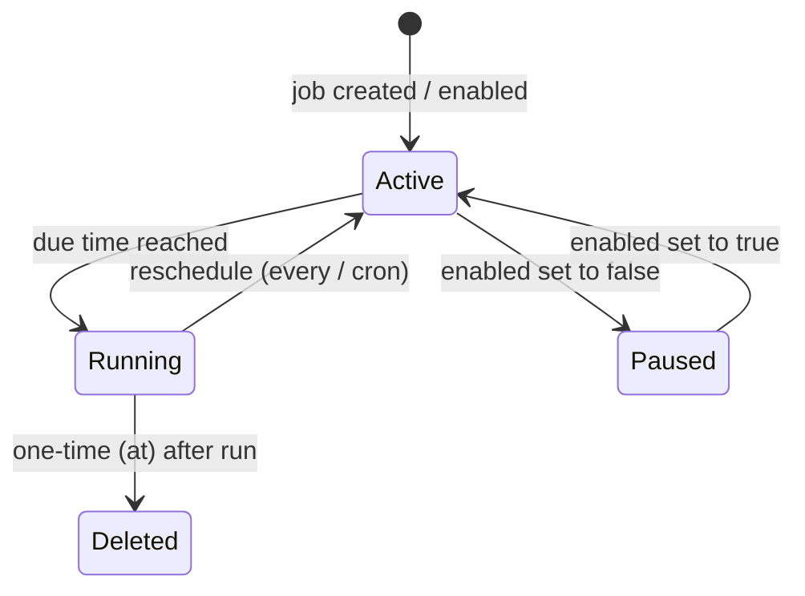

> Bản dịch từ [English version](#scheduling-cron)

# Scheduling & Cron

> Kích hoạt agent tự động — một lần, theo chu kỳ lặp lại, hoặc theo biểu thức cron.

## Tổng quan

Dịch vụ cron của GoClaw cho phép bạn lên lịch cho bất kỳ agent nào chạy một tin nhắn theo lịch cố định. Các job được lưu vào PostgreSQL nên tồn tại qua các lần khởi động lại. Scheduler kiểm tra các job đến hạn mỗi giây và thực thi chúng trong các goroutine song song.

Có ba loại lịch:

| Loại | Trường | Mô tả |
|---|---|---|
| `at` | `atMs` | Thực thi một lần tại thời điểm Unix timestamp cụ thể (ms) |
| `every` | `everyMs` | Khoảng lặp lại tính bằng millisecond |
| `cron` | `expr` | Biểu thức cron 5 trường tiêu chuẩn (phân tích bởi gronx) |

Các job một lần (`at`) tự động bị xóa sau khi chạy.



## Tạo Job

### Qua Dashboard

Vào **Cron → New Job**, điền lịch, tin nhắn agent cần xử lý, và (tùy chọn) channel giao hàng.

### Qua Gateway WebSocket API

GoClaw sử dụng WebSocket RPC. Gửi method call `cron.create`:

```json
{
  "method": "cron.create",
  "params": {
    "name": "daily-standup-summary",
    "schedule": {
      "kind": "cron",
      "expr": "0 9 * * 1-5",
      "tz": "Asia/Ho_Chi_Minh"
    },
    "message": "Summarize yesterday's GitHub activity and post a standup update.",
    "deliver": true,
    "channel": "telegram",
    "to": "123456789",
    "agentId": "3f2a1b4c-0000-0000-0000-000000000000"
  }
}
```

### Qua tool `cron` tích hợp sẵn (job do agent tạo)

Agent có thể tự lên lịch các task theo dõi trong quá trình hội thoại bằng tool `cron` với `action: "add"`:

```json
{
  "action": "add",
  "job": {
    "name": "check-server-health",
    "schedule": { "kind": "every", "everyMs": 300000 },
    "message": "Check if the API server is responding and alert me if it's down."
  }
}
```

### Qua CLI

```bash
# Liệt kê job (chỉ hiện active)
goclaw cron list

# Liệt kê tất cả kể cả disabled
goclaw cron list --all

# Liệt kê dạng JSON
goclaw cron list --json

# Bật hoặc tắt job
goclaw cron toggle <jobId> true
goclaw cron toggle <jobId> false

# Xóa job
goclaw cron delete <jobId>
```

## Các trường Job

| Trường | Kiểu | Mô tả |
|---|---|---|
| `name` | string | Slug nhận diện — chỉ dùng chữ thường, số, dấu gạch ngang (ví dụ: `daily-report`) |
| `agentId` | string | UUID agent chạy job (bỏ trống để dùng agent mặc định) |
| `enabled` | bool | `true` = đang hoạt động, `false` = tạm dừng |
| `schedule.kind` | string | `at`, `every`, hoặc `cron` |
| `schedule.atMs` | int64 | Unix timestamp tính bằng ms (cho `at`) |
| `schedule.everyMs` | int64 | Khoảng thời gian tính bằng ms (cho `every`) |
| `schedule.expr` | string | Biểu thức cron 5 trường (cho `cron`) |
| `schedule.tz` | string | Múi giờ IANA cho biểu thức cron; bỏ trống để dùng múi giờ mặc định của gateway |
| `message` | string | Văn bản agent nhận làm đầu vào |
| `deliver` | bool | `true` = giao kết quả đến channel; `false` = agent xử lý âm thầm. Tự động thành `true` khi job được tạo từ channel thực (Telegram, v.v.) |
| `channel` | string | Channel đích: `telegram`, `discord`, v.v. Tự động điền từ context khi `deliver` là `true` |
| `to` | string | Chat ID hoặc định danh người nhận. Tự động điền từ context khi `deliver` là `true` |
| `deleteAfterRun` | bool | Tự động đặt `true` cho job `at`; có thể đặt thủ công cho bất kỳ job nào |

## Biểu thức lịch

### `at` — chạy một lần tại thời điểm cụ thể

```json
{
  "kind": "at",
  "atMs": 1741392000000
}
```

Job bị xóa sau khi kích hoạt. Nếu `atMs` đã qua khi tạo job, job sẽ không bao giờ chạy.

### `every` — khoảng lặp lại

```json
{ "kind": "every", "everyMs": 3600000 }
```

Các khoảng phổ biến:

| Biểu thức | Khoảng |
|---|---|
| `60000` | Mỗi phút |
| `300000` | Mỗi 5 phút |
| `3600000` | Mỗi giờ |
| `86400000` | Mỗi 24 giờ |

### `cron` — biểu thức cron 5 trường

```json
{ "kind": "cron", "expr": "30 8 * * *", "tz": "UTC" }
```

Định dạng 5 trường: `phút giờ ngày-trong-tháng tháng ngày-trong-tuần`

| Biểu thức | Ý nghĩa |
|---|---|
| `0 9 * * 1-5` | 09:00 các ngày trong tuần |
| `30 8 * * *` | 08:30 mỗi ngày |
| `0 */4 * * *` | Mỗi 4 giờ |
| `0 0 1 * *` | Nửa đêm ngày 1 mỗi tháng |
| `*/15 * * * *` | Mỗi 15 phút |

Biểu thức được validate khi tạo bằng [gronx](https://github.com/adhocore/gronx). Biểu thức không hợp lệ bị từ chối kèm lỗi.

## Quản lý Job

GoClaw quản lý cron qua các WebSocket RPC method:

| Method | Mô tả |
|---|---|
| `cron.list` | Liệt kê job (`includeDisabled: true` để gồm cả disabled) |
| `cron.create` | Tạo job mới |
| `cron.update` | Cập nhật job (`jobId` + object `patch`) |
| `cron.delete` | Xóa job (`jobId`) |
| `cron.toggle` | Bật hoặc tắt job (`jobId` + `enabled: bool`) |
| `cron.run` | Kích hoạt thủ công (`jobId` + `mode: "force"` hoặc `"due"`) |
| `cron.runs` | Xem lịch sử chạy (`jobId`, `limit`, `offset`) |
| `cron.status` | Trạng thái scheduler (số job active, cờ running) |

**Ví dụ:**

```json
// Tạm dừng job
{ "method": "cron.toggle", "params": { "jobId": "<id>", "enabled": false } }

// Cập nhật lịch
{ "method": "cron.update", "params": { "jobId": "<id>", "patch": { "schedule": { "kind": "cron", "expr": "0 10 * * *" } } } }

// Kích hoạt thủ công (bất kể lịch)
{ "method": "cron.run", "params": { "jobId": "<id>", "mode": "force" } }

// Xem lịch sử chạy (mặc định 20 gần nhất)
{ "method": "cron.runs", "params": { "jobId": "<id>", "limit": 20, "offset": 0 } }
```

## Vòng đời Job

- **Active** — `enabled: true`, `nextRunAtMs` được đặt; sẽ kích hoạt khi đến hạn.
- **Paused** — `enabled: false`, `nextRunAtMs` bị xóa; bỏ qua bởi scheduler.
- **Running** — đang thực thi agent turn; `nextRunAtMs` bị xóa cho đến khi thực thi xong để tránh chạy trùng.
- **Completed (one-time)** — job `at` bị xóa khỏi store sau khi kích hoạt.

Scheduler kiểm tra job mỗi 1 giây. Job đến hạn được dispatch trong các goroutine song song. Run log được lưu vào bảng `cron_run_logs` trên PostgreSQL và truy cập được qua method `cron.runs`.

Job thất bại ghi `lastStatus: "error"` và `lastError` kèm thông báo. Job vẫn ở trạng thái enabled và sẽ thử lại vào lần tick tiếp theo (trừ khi là job một lần `at`).

## Ví dụ

### Bản tin tức buổi sáng qua Telegram

```json
{
  "name": "morning-briefing",
  "schedule": { "kind": "cron", "expr": "0 7 * * *", "tz": "Asia/Ho_Chi_Minh" },
  "message": "Give me a brief summary of today's tech news headlines.",
  "deliver": true,
  "channel": "telegram",
  "to": "123456789"
}
```

### Kiểm tra sức khỏe định kỳ (âm thầm — agent tự quyết định có cảnh báo không)

```json
{
  "name": "api-health-check",
  "schedule": { "kind": "every", "everyMs": 300000 },
  "message": "Check https://api.example.com/health and alert me on Telegram if it returns a non-200 status.",
  "deliver": false
}
```

### Nhắc nhở một lần

```json
{
  "name": "meeting-reminder",
  "schedule": { "kind": "at", "atMs": 1741564200000 },
  "message": "Remind me that the quarterly review meeting starts in 15 minutes.",
  "deliver": true,
  "channel": "telegram",
  "to": "123456789"
}
```

## Các vấn đề thường gặp

| Vấn đề | Nguyên nhân | Giải pháp |
|---|---|---|
| Job không bao giờ chạy | `enabled: false` hoặc `atMs` đã qua | Kiểm tra trạng thái job; bật lại hoặc cập nhật lịch |
| `invalid cron expression` khi tạo | Biểu thức sai định dạng (ví dụ: cú pháp Quartz 6 trường) | Dùng cron 5 trường tiêu chuẩn |
| `invalid timezone` | Chuỗi múi giờ IANA không hợp lệ | Dùng múi giờ hợp lệ từ database IANA tz, ví dụ `America/New_York` |
| Job chạy nhưng agent không nhận tin nhắn | Trường `message` rỗng | Đặt `message` khác rỗng |
| Lỗi validation `name` | Tên không phải slug hợp lệ | Dùng chữ thường, số, dấu gạch ngang (ví dụ: `daily-report`) |
| Thực thi trùng lặp | Clock skew giữa các lần khởi động lại (trường hợp hiếm gặp) | Scheduler xóa `next_run_at` trong DB trước khi dispatch; khi khởi động lại, job stale được tự động recompute |
| Run log trống | Job chưa kích hoạt lần nào | Kích hoạt thủ công qua method `cron.run` với `mode: "force"` |

## Tiếp theo

- [Custom Tools](#custom-tools) — cấp cho agent lệnh shell để chạy trong các turn theo lịch
- [Skills](#skills) — inject kiến thức domain để agent theo lịch hiệu quả hơn
- [Sandbox](#sandbox) — cô lập thực thi code trong các agent turn theo lịch

<!-- goclaw-source: 57754a5 | cập nhật: 2026-03-18 -->
