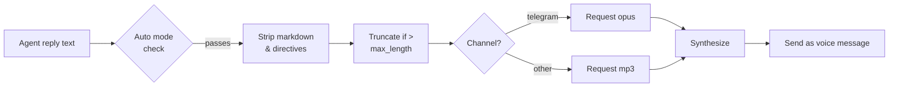
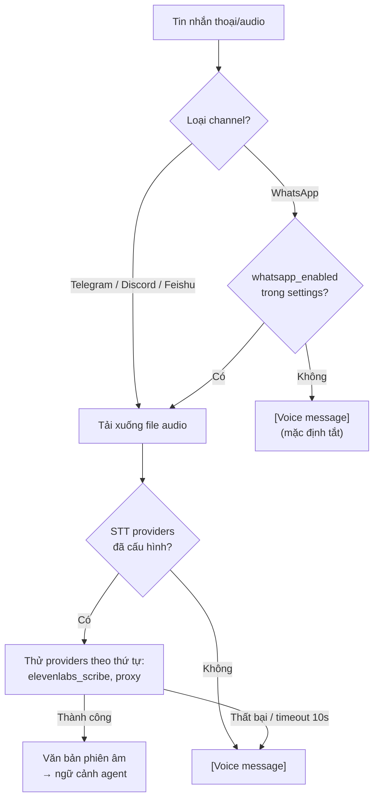

> Bản dịch từ [English version](/tts-voice)

# Chuyển văn bản thành giọng nói

> Thêm trả lời bằng giọng nói cho agent — chọn từ năm provider và kiểm soát chính xác khi nào audio được phát.

## Tổng quan

Hệ thống TTS của GoClaw chuyển đổi câu trả lời văn bản của agent thành audio và gửi dưới dạng tin nhắn thoại trên các channel được hỗ trợ (ví dụ: voice bubble trên Telegram). Bạn cấu hình provider chính, đặt chế độ tự động, và GoClaw xử lý phần còn lại — loại bỏ markdown, cắt ngắn văn bản dài, và chọn định dạng audio phù hợp cho từng channel.

Năm provider có sẵn:

| Provider | Key | Yêu cầu |
|----------|-----|---------|
| OpenAI | `openai` | API key |
| ElevenLabs | `elevenlabs` | API key |
| Microsoft Edge TTS | `edge` | CLI `edge-tts` (miễn phí) — luôn khả dụng như fallback |
| MiniMax | `minimax` | API key + Group ID |
| Google Gemini TTS | `gemini` | API key |

---

## Chế độ tự động

Trường `auto` kiểm soát khi nào TTS kích hoạt:

| Chế độ | Khi nào gửi audio |
|------|--------------------|
| `off` | Không bao giờ (mặc định) |
| `always` | Mọi câu trả lời đủ điều kiện |
| `inbound` | Chỉ khi người dùng gửi tin nhắn thoại/audio |
| `tagged` | Chỉ khi câu trả lời chứa `[[tts]]` |

Trường `mode` thu hẹp loại câu trả lời nào đủ điều kiện:

| Giá trị | Hành vi |
|-------|----------|
| `final` | Chỉ câu trả lời cuối cùng (mặc định) |
| `all` | Tất cả câu trả lời kể cả kết quả tool |

Văn bản ngắn hơn 10 ký tự hoặc chứa đường dẫn `MEDIA:` luôn bị bỏ qua. Văn bản dài hơn `max_length` (mặc định 1500) bị cắt ngắn với `...`.

---

## Cài đặt Provider

### OpenAI

```json
{
  "tts": {
    "provider": "openai",
    "auto": "inbound",
    "openai": {
      "api_key": "sk-...",
      "model": "gpt-4o-mini-tts",
      "voice": "alloy"
    }
  }
}
```

Giọng có sẵn: `alloy`, `ash`, `ballad`, `coral`, `echo`, `fable`, `onyx`, `nova`, `sage`, `shimmer`, `verse`, `marin`, `cedar`. Lưu ý: `ballad`, `verse`, `marin`, `cedar` chỉ tương thích với `gpt-4o-mini-tts`.

Model hỗ trợ: `tts-1`, `tts-1-hd`, `gpt-4o-mini-tts` (mặc định).

#### Tham số nâng cao OpenAI

| Tham số | Kiểu | Mặc định | Ghi chú |
|---------|------|----------|---------|
| `speed` | range | 1.0 | 0.25–4.0; agent có thể ghi đè |
| `response_format` | enum | `mp3` | mp3, opus, aac, flac, wav, pcm |
| `instructions` | text | — | Style prompt; chỉ dùng với `gpt-4o-mini-tts` (nâng cao) |

---

### ElevenLabs

```json
{
  "tts": {
    "provider": "elevenlabs",
    "auto": "always",
    "elevenlabs": {
      "api_key": "xi-...",
      "voice_id": "pMsXgVXv3BLzUgSXRplE",
      "model_id": "eleven_multilingual_v2"
    }
  }
}
```

Tìm voice ID trong [thư viện giọng ElevenLabs](https://elevenlabs.io/voice-library) của bạn. Model mặc định: `eleven_multilingual_v2`.

#### Các biến thể model ElevenLabs

| Model ID | Đặc điểm | Phù hợp nhất |
|----------|-----------|-------------|
| `eleven_v3` | Flagship mới nhất (tháng 11/2025), chất lượng cao nhất | Giọng cao cấp, lời nói phức tạp |
| `eleven_multilingual_v2` | Chất lượng cao, 29 ngôn ngữ | Mặc định; nội dung đa ngôn ngữ |
| `eleven_turbo_v2_5` | Tối ưu chi phí, nhanh | Khối lượng lớn, tiết kiệm ngân sách |
| `eleven_flash_v2_5` | Độ trễ thấp nhất, 32 ngôn ngữ | Dùng thời gian thực / tương tác |

Chỉ chấp nhận bốn model ID này — ID không hợp lệ sẽ bị từ chối tại gateway.

#### Tham số nâng cao ElevenLabs

| Tham số | Kiểu | Mặc định | Ghi chú |
|---------|------|----------|---------|
| `voice_settings.stability` | range | 0.5 | 0–1; độ nhất quán giọng |
| `voice_settings.similarity_boost` | range | 0.75 | 0–1; độ giống giọng gốc |
| `voice_settings.style` | range | 0.0 | 0–1; agent có thể ghi đè qua `style` |
| `voice_settings.use_speaker_boost` | boolean | true | — |
| `voice_settings.speed` | range | 1.0 | 0.7–1.2; agent có thể ghi đè qua `speed` |
| `apply_text_normalization` | enum | auto | auto / on / off |
| `seed` | integer | 0 | Đầu ra tái tạo được (nâng cao) |
| `optimize_streaming_latency` | range | 0 | 0–4 (nâng cao) |
| `language_code` | string | — | Gợi ý ISO 639-1 (nâng cao) |
| `output_format` | enum | `mp3_44100_128` | Codec + bitrate; tier cao hơn cần Creator+/Pro+ (nâng cao) |

---

### Edge TTS (Miễn phí)

Edge TTS sử dụng giọng neural của Microsoft qua CLI Python `edge-tts` — không cần API key.

```bash
pip install edge-tts
```

```json
{
  "tts": {
    "provider": "edge",
    "auto": "tagged",
    "edge": {
      "enabled": true,
      "voice": "en-US-MichelleNeural",
      "rate": "+0%"
    }
  }
}
```

Trường `enabled` phải là `true` để kích hoạt Edge provider — nó không có API key để tự động nhận diện.

Xem tất cả giọng có sẵn:

```bash
edge-tts --list-voices
```

Giọng phổ biến: `en-US-MichelleNeural`, `en-GB-SoniaNeural`, `vi-VN-HoaiMyNeural`. Trường `rate` điều chỉnh tốc độ (ví dụ: `+20%` nhanh hơn, `-10%` chậm hơn). Đầu ra luôn là MP3.

#### Tham số Edge TTS

| Tham số | Kiểu | Mặc định | Ghi chú |
|---------|------|----------|---------|
| `rate` | integer | 0 | Tốc độ −50 đến +100 (%) |
| `pitch` | integer | 0 | Cao độ −50 đến +50 (Hz) |
| `volume` | integer | 0 | Âm lượng −50 đến +100 (%) |

---

### MiniMax

API T2A của MiniMax hỗ trợ 300+ giọng hệ thống và 40+ ngôn ngữ. Danh sách giọng được tải động — dùng [Voices API](#voices-api) với `?provider=minimax`.

```json
{
  "tts": {
    "provider": "minimax",
    "auto": "always",
    "minimax": {
      "api_key": "...",
      "group_id": "your-group-id",
      "model": "speech-02-hd",
      "voice_id": "Wise_Woman"
    }
  }
}
```

Model hỗ trợ: `speech-02-hd` (chất lượng cao), `speech-02-turbo` (nhanh hơn), `speech-01-hd`, `speech-01-turbo`.

#### Tham số nâng cao MiniMax

| Tham số | Kiểu | Mặc định | Ghi chú |
|---------|------|----------|---------|
| `speed` | range | 1.0 | 0.5–2.0; agent có thể ghi đè qua `speed` |
| `vol` | range | 1.0 | Âm lượng 0.01–10.0 |
| `pitch` | integer | 0 | Cao độ tính theo semitone −12 đến +12 |
| `emotion` | enum | — | happy/sad/angry/fearful/disgusted/surprised/neutral/excited/anxious; agent có thể ghi đè |
| `text_normalization` | boolean | — | Bỏ qua khi không đặt |
| `audio.format` | enum | `mp3` | mp3, pcm, flac, wav |
| `language_boost` | enum | Auto | 18 ngôn ngữ; cải thiện phát âm |
| `subtitle_enable` | boolean | — | Trả về dữ liệu timing theo từng chữ |
| `audio.sample_rate` | enum | Mặc định | 8k–44.1 kHz (nâng cao) |
| `audio.bitrate` | enum | Mặc định | 32–256 kbps; chỉ MP3 (nâng cao) |
| `audio.channel` | enum | Mặc định | Mono / Stereo (nâng cao) |
| `pronunciation_dict` | text | — | Mảng JSON các quy tắc `"từ/phiên âm"`, tối đa 8 KB (nâng cao) |

Metadata giọng (giới tính + ngôn ngữ) được phân tích tự động từ quy ước đặt tên của MiniMax và hiển thị dưới dạng nhãn trong voice picker.

---

### Google Gemini TTS

Gemini TTS sử dụng các model preview mới nhất của Google. Cần có API key.

```json
{
  "tts": {
    "provider": "gemini",
    "auto": "always",
    "gemini": {
      "api_key": "AIza...",
      "model": "gemini-2.5-flash-preview-tts",
      "voice": "Kore"
    }
  }
}
```

Model hỗ trợ (tất cả đều ở giai đoạn preview — UI hiển thị badge **Preview**):

| Model | Ghi chú |
|-------|---------|
| `gemini-2.5-flash-preview-tts` | Mặc định; nhanh và tiết kiệm chi phí |
| `gemini-2.5-pro-preview-tts` | Chất lượng cao nhất |
| `gemini-3.1-flash-tts-preview` | Thử nghiệm |

#### Giọng Gemini (30 giọng có sẵn)

Mỗi giọng có nhãn phong cách hiển thị dưới dạng badge trong UI:

| Giọng | Phong cách | Giọng | Phong cách |
|-------|-----------|-------|-----------|
| Zephyr | Bright | Puck | Upbeat |
| Charon | Informative | Kore | Firm |
| Fenrir | Excitable | Leda | Youthful |
| Orus | Firm | Aoede | Breezy |
| Callirrhoe | Easy-going | Autonoe | Bright |
| Enceladus | Breathy | Iapetus | Clear |
| Umbriel | Easy-going | Algieba | Smooth |
| Despina | Smooth | Erinome | Clear |
| Algenib | Gravelly | Rasalgethi | Informative |
| Laomedeia | Upbeat | Achernar | Soft |
| Alnilam | Firm | Schedar | Even |
| Gacrux | Mature | Pulcherrima | Forward |
| Achird | Friendly | Zubenelgenubi | Casual |
| Vindemiatrix | Gentle | Sadachbia | Lively |
| Sadaltager | Knowledgeable | Sulafat | Warm |

#### Tham số Gemini

| Tham số | Kiểu | Mặc định | Nhóm |
|---------|------|----------|------|
| `temperature` | range | Mặc định API (1.0) | Cơ bản — ảnh hưởng nhẹ; biểu cảm chính qua audio tags |
| `seed` | integer | — | Nâng cao |
| `presencePenalty` | range | — | Nâng cao — thử nghiệm |
| `frequencyPenalty` | range | — | Nâng cao — thử nghiệm |

#### Chế độ nhiều người nói (Multi-Speaker)

Tối đa 2 người nói mỗi request. Mỗi người nói có `name` và `voice` từ 30 giọng có sẵn. Cấu hình qua Voice Picker trên portal — lưu dưới dạng JSON blob `tts.gemini.speakers`.

#### Audio Tags Gemini

Chèn nhãn biểu cảm trực tiếp vào văn bản:

```
Hello [laughs] world [sighs] how are you?
```

Danh mục: Cảm xúc, Nhịp điệu, Hiệu ứng, Chất lượng giọng. Danh sách đầy đủ có trong tag picker trên giao diện.

#### Hỗ trợ ngôn ngữ Gemini

70+ ngôn ngữ — không cần tham số ngôn ngữ riêng. Gemini tự động nhận diện ngôn ngữ từ văn bản đầu vào.

#### Lỗi validation Gemini (422)

| Lỗi | Khi nào xảy ra |
|-----|----------------|
| `ErrInvalidVoice` | Voice ID không thuộc 30 giọng có sẵn |
| `ErrSpeakerLimit` | Nhiều hơn 2 người nói trong chế độ multi-speaker |
| `ErrInvalidModel` | Model ID không trong danh sách cho phép |

---

## Ghi đè giọng theo từng Agent

Mỗi agent có thể ghi đè tham số TTS qua trường `other_config` JSONB mà không thay đổi cấu hình toàn hệ thống.

### Giọng và Model (ElevenLabs)

| Key | Kiểu | Mô tả |
|-----|------|-------|
| `tts_voice_id` | string | Voice ID ElevenLabs cho agent này |
| `tts_model_id` | string | Model ID ElevenLabs cho agent này (phải là [model được phép](#các-biến-thể-model-elevenlabs)) |

### Ghi đè tham số theo Agent (v3.10.0+)

Agent có thể ghi đè một số tham số provider qua `other_config.tts_params`. Chỉ các key sau được phép:

| Key chung | OpenAI | ElevenLabs | MiniMax | Edge / Gemini |
|-----------|--------|------------|---------|---------------|
| `speed` | `speed` | `voice_settings.speed` | `speed` | không ánh xạ |
| `emotion` | không ánh xạ | không ánh xạ | `emotion` | không ánh xạ |
| `style` | không ánh xạ | `voice_settings.style` | không ánh xạ | không ánh xạ |

Key ngoài danh sách này bị từ chối khi ghi. Adapter chạy theo từng lần thử trong vòng lặp fallback, đảm bảo đúng ánh xạ cho từng provider.

**Thứ tự ưu tiên:** CLI args → `other_config` agent → override tenant → mặc định provider.

**Ví dụ:**

```json
{
  "other_config": {
    "tts_voice_id": "pMsXgVXv3BLzUgSXRplE",
    "tts_model_id": "eleven_flash_v2_5",
    "tts_params": {
      "speed": 1.1,
      "style": 0.3
    }
  }
}
```

---

## Tham chiếu đầy đủ Config

```json
{
  "tts": {
    "provider": "openai",
    "auto": "inbound",
    "mode": "final",
    "max_length": 1500,
    "timeout_ms": 30000,
    "openai": { "api_key": "sk-...", "voice": "nova" },
    "edge":   { "enabled": true, "voice": "en-US-MichelleNeural" }
  }
}
```

Khi provider chính thất bại, GoClaw tự động thử các provider đã đăng ký khác.

---

## Voices API

GoClaw cung cấp các HTTP endpoint để khám phá giọng TTS có sẵn. Các endpoint này được phân theo tenant và yêu cầu vai trò admin hoặc operator.

| Method | Path | Mô tả |
|--------|------|-------|
| `GET` | `/v1/voices` | Danh sách giọng có sẵn (cache trong bộ nhớ, TTL 1 giờ) |
| `GET` | `/v1/voices?provider=minimax` | Danh sách giọng động của MiniMax |
| `POST` | `/v1/voices/refresh` | Buộc xóa cache giọng (chỉ admin) |

### `GET /v1/voices`

Trả về danh sách giọng cho provider đã cấu hình của tenant hiện tại. Kết quả được cache trong bộ nhớ theo tenant với TTL 1 giờ. Với ElevenLabs, giọng là riêng theo tài khoản. Với MiniMax, thêm `?provider=minimax` để lấy danh sách giọng của provider đó.

```json
[
  {
    "voice_id": "pMsXgVXv3BLzUgSXRplE",
    "name": "Alice",
    "labels": {
      "use_case": "conversational",
      "accent": "american"
    }
  }
]
```

Cache miss sẽ kích hoạt lấy dữ liệu ngay lập tức từ provider. Trả về `500` nếu provider không tiếp cận được.

### `POST /v1/voices/refresh`

Xóa cache giọng cho tenant hiện tại để lần `GET /v1/voices` tiếp theo lấy danh sách mới. Trả về `202 Accepted`.

---

## Capabilities API

```
GET /v1/tts/capabilities
```

Trả về schema `ProviderCapabilities` đầy đủ cho tất cả provider đã đăng ký — model, giọng tĩnh, schema tham số, và feature flags. Portal dùng endpoint này để hiển thị form cài đặt động và giao diện ghi đè theo agent.

---

## Tích hợp Channel

### Voice Bubble Telegram

Khi channel gốc là `telegram`, GoClaw tự động yêu cầu định dạng `opus` (container Ogg/Opus) thay vì MP3 — Telegram yêu cầu điều này cho tin nhắn thoại. Không cần cấu hình thêm.



### Chế độ Tagged

Thêm `[[tts]]` bất kỳ đâu trong câu trả lời của agent để kích hoạt tổng hợp trong chế độ `tagged`:

```
Here's your daily briefing. [[tts]]
```

---

## Ví dụ

**Thiết lập miễn phí tối giản với Edge TTS:**

```bash
pip install edge-tts
```

```json
{
  "tts": {
    "provider": "edge",
    "auto": "inbound",
    "edge": { "enabled": true, "voice": "en-US-JennyNeural" }
  }
}
```

**OpenAI chính với ElevenLabs dự phòng:**

```json
{
  "tts": {
    "provider": "openai",
    "auto": "always",
    "openai":     { "api_key": "sk-...", "voice": "alloy" },
    "elevenlabs": { "api_key": "xi-...", "voice_id": "pMsXgVXv3BLzUgSXRplE" }
  }
}
```

**Gemini nhiều người nói với audio tags:**

```json
{
  "tts": {
    "provider": "gemini",
    "auto": "always",
    "gemini": {
      "api_key": "AIza...",
      "model": "gemini-2.5-flash-preview-tts"
    }
  }
}
```

Cấu hình người nói trong Voice Picker trên portal — tối đa 2 người nói, mỗi người có tên và một trong 30 giọng Gemini có sẵn.

---

## Nhận dạng giọng nói (STT)

GoClaw định tuyến tất cả phiên âm giọng nói/audio qua `audio.Manager` thống nhất với chuỗi provider. Các channel (Telegram, Discord, Feishu, WhatsApp) dùng chung cơ sở hạ tầng STT.

### Luồng phiên âm thống nhất



### Opt-in WhatsApp

STT WhatsApp **tắt theo mặc định** (`whatsapp_enabled: false`). Lý do: tin nhắn thoại WhatsApp được mã hóa đầu cuối. Gửi dữ liệu audio đến provider STT bên ngoài phá vỡ mã hóa E2E. Admin phải bật tường minh tại **Config → Audio → STT** và xác nhận thay đổi này.

Khi tắt (mặc định): tin nhắn thoại xuất hiện trong ngữ cảnh agent dưới dạng `[Voice message]` — không có audio nào rời khỏi thiết bị.
Khi bật: audio được phiên âm qua chuỗi STT đã cấu hình; fallback về `[Voice message]` khi thất bại hoặc timeout (10 giây).

### Chuỗi provider STT

| Cài đặt | Hành vi |
|---------|---------|
| `providers: ["elevenlabs_scribe", "proxy_stt"]` | Thử ElevenLabs Scribe trước; fallback về legacy proxy |
| `providers: []` (rỗng) | Bỏ qua tất cả STT; giọng → `[Voice message]` |
| `providers` thiếu (nil) | Kiểm tra legacy `STTProxyURL` bridge khi khởi động |

Cấu hình qua **Config → Audio → STT** trong giao diện web (lưu trong `builtin_tools[stt].settings.providers`). Khi danh sách này có mặt, nó ghi đè tất cả cấu hình STT riêng theo channel cũ.

---

## Tool STT tích hợp sẵn

Tool `stt` tích hợp sẵn (được seed bởi migration 050) cho phép agent phiên âm giọng nói/audio đầu vào bằng ElevenLabs Scribe hoặc proxy tương thích — xem [Tools Overview](/tools-overview) để biết cách bật và cấu hình.

---

## Các vấn đề thường gặp

| Vấn đề | Nguyên nhân | Giải pháp |
|-------|-------------|-----------|
| `tts provider not found: edge` | Chưa đặt `enabled` | Thêm `"enabled": true` vào phần `edge` |
| `edge-tts failed` | CLI chưa cài | `pip install edge-tts` |
| `all tts providers failed` | Tất cả provider báo lỗi | Kiểm tra API key; xem log gateway |
| Không có giọng nói trong Telegram | `auto` là `off` | Đặt `auto: "inbound"` hoặc `"always"` |
| Giọng phát trên kết quả tool | `mode` là `all` | Đặt `mode: "final"` |
| MiniMax trả về audio trống | Thiếu `group_id` | Thêm `group_id` từ console MiniMax |
| Văn bản bị cắt với `...` | Vượt quá `max_length` | Tăng `max_length` trong config |
| Gemini 422 `ErrInvalidVoice` | Voice ID không thuộc 30 giọng có sẵn | Dùng voice ID hợp lệ từ bảng trên |
| Gemini 422 `ErrSpeakerLimit` | Nhiều hơn 2 người nói | Giảm xuống ≤ 2 người nói trong Voice Picker |
| Key `tts_params` bị từ chối | Key ngoài danh sách cho phép | Chỉ dùng `speed`, `emotion`, `style` |

---

## Tiếp theo

- [Scheduling & Cron](../advanced/scheduling-cron.md) — kích hoạt agent theo lịch
- [Extended Thinking](../advanced/extended-thinking.md) — suy luận sâu hơn cho câu trả lời phức tạp

<!-- goclaw-source: 1b862707 | cập nhật: 2026-04-20 -->
