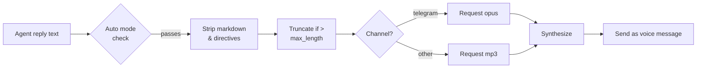

> Bản dịch từ [English version](#tts-voice)

# TTS Voice

> Thêm trả lời bằng giọng nói cho agent — chọn từ bốn provider và kiểm soát chính xác khi nào audio được phát.

## Tổng quan

Hệ thống TTS của GoClaw chuyển đổi câu trả lời văn bản của agent thành audio và gửi dưới dạng tin nhắn thoại trên các channel được hỗ trợ (ví dụ: voice bubble trên Telegram). Bạn cấu hình provider chính, đặt chế độ tự động, và GoClaw xử lý phần còn lại — loại bỏ markdown, cắt ngắn văn bản dài, và chọn định dạng audio phù hợp cho từng channel.

Bốn provider có sẵn:

| Provider | Key | Yêu cầu |
|----------|-----|---------|
| OpenAI | `openai` | API key |
| ElevenLabs | `elevenlabs` | API key |
| Microsoft Edge TTS | `edge` | CLI `edge-tts` (miễn phí) + `enabled: true` |
| MiniMax | `minimax` | API key + Group ID |

---

## Chế độ tự động

Trường `auto` kiểm soát khi nào TTS kích hoạt:

| Chế độ | Khi nào gửi audio |
|------|--------------------|
| `off` | Không bao giờ (mặc định) |
| `always` | Mọi câu trả lời đủ điều kiện |
| `inbound` | Chỉ khi người dùng gửi tin nhắn thoại/audio |
| `tagged` | Chỉ khi câu trả lời chứa `[[tts]]` |

Trường `mode` thu hẹp loại câu trả lời nào đủ điều kiện:

| Giá trị | Hành vi |
|-------|----------|
| `final` | Chỉ câu trả lời cuối cùng (mặc định) |
| `all` | Tất cả câu trả lời kể cả kết quả tool |

Văn bản ngắn hơn 10 ký tự hoặc chứa đường dẫn `MEDIA:` luôn bị bỏ qua. Văn bản dài hơn `max_length` (mặc định 1500) bị cắt ngắn với `...`.

---

## Cài đặt Provider

### OpenAI

```json
{
  "tts": {
    "provider": "openai",
    "auto": "inbound",
    "openai": {
      "api_key": "sk-...",
      "model": "gpt-4o-mini-tts",
      "voice": "alloy"
    }
  }
}
```

Giọng có sẵn: `alloy`, `echo`, `fable`, `onyx`, `nova`, `shimmer`. Model mặc định: `gpt-4o-mini-tts`.

---

### ElevenLabs

```json
{
  "tts": {
    "provider": "elevenlabs",
    "auto": "always",
    "elevenlabs": {
      "api_key": "xi-...",
      "voice_id": "pMsXgVXv3BLzUgSXRplE",
      "model_id": "eleven_multilingual_v2"
    }
  }
}
```

Tìm voice ID trong [thư viện giọng ElevenLabs](https://elevenlabs.io/voice-library) của bạn. Model mặc định: `eleven_multilingual_v2`.

---

### Edge TTS (Miễn phí)

Edge TTS sử dụng giọng neural của Microsoft qua CLI Python `edge-tts` — không cần API key.

```bash
pip install edge-tts
```

```json
{
  "tts": {
    "provider": "edge",
    "auto": "tagged",
    "edge": {
      "enabled": true,
      "voice": "en-US-MichelleNeural",
      "rate": "+0%"
    }
  }
}
```

Trường `enabled` phải là `true` để kích hoạt Edge provider — provider này không có API key để tự động phát hiện.

Xem tất cả giọng có sẵn:

```bash
edge-tts --list-voices
```

Giọng phổ biến: `en-US-MichelleNeural`, `en-GB-SoniaNeural`, `vi-VN-HoaiMyNeural`. Trường `rate` điều chỉnh tốc độ (ví dụ: `+20%` nhanh hơn, `-10%` chậm hơn). Đầu ra luôn là MP3.

---

### MiniMax

API T2A của MiniMax hỗ trợ 300+ giọng hệ thống và 40+ ngôn ngữ.

```json
{
  "tts": {
    "provider": "minimax",
    "auto": "always",
    "minimax": {
      "api_key": "...",
      "group_id": "your-group-id",
      "model": "speech-02-hd",
      "voice_id": "Wise_Woman"
    }
  }
}
```

Model: `speech-02-hd` (chất lượng cao), `speech-02-turbo` (nhanh hơn). Định dạng đầu ra được hỗ trợ: `mp3`, `opus`, `pcm`, `flac`, `wav`.

---

## Tham chiếu đầy đủ Config

```json
{
  "tts": {
    "provider": "openai",
    "auto": "inbound",
    "mode": "final",
    "max_length": 1500,
    "timeout_ms": 30000,
    "openai": { "api_key": "sk-...", "voice": "nova" },
    "edge":   { "enabled": true, "voice": "en-US-MichelleNeural" }
  }
}
```

Khi provider chính thất bại, GoClaw tự động thử các provider đã đăng ký khác.

---

## Tích hợp Channel

### Voice Bubble Telegram

Khi channel gốc là `telegram`, GoClaw tự động yêu cầu định dạng `opus` (container Ogg/Opus) thay vì MP3 — Telegram yêu cầu điều này cho tin nhắn thoại. Không cần cấu hình thêm.



### Chế độ Tagged

Thêm `[[tts]]` bất kỳ đâu trong câu trả lời của agent để kích hoạt tổng hợp trong chế độ `tagged`:

```
Here's your daily briefing. [[tts]]
```

---

## Ví dụ

**Thiết lập miễn phí tối giản với Edge TTS:**

```bash
pip install edge-tts
```

```json
{
  "tts": {
    "provider": "edge",
    "auto": "inbound",
    "edge": { "enabled": true, "voice": "en-US-JennyNeural" }
  }
}
```

**OpenAI chính với ElevenLabs dự phòng:**

```json
{
  "tts": {
    "provider": "openai",
    "auto": "always",
    "openai":     { "api_key": "sk-...", "voice": "alloy" },
    "elevenlabs": { "api_key": "xi-...", "voice_id": "pMsXgVXv3BLzUgSXRplE" }
  }
}
```

---

## Các vấn đề thường gặp

| Vấn đề | Nguyên nhân | Giải pháp |
|-------|-------|-----|
| `tts provider not found: edge` | `enabled` chưa được đặt | Thêm `"enabled": true` vào phần `edge` |
| `edge-tts failed` | CLI chưa được cài | `pip install edge-tts` |
| `all tts providers failed` | Tất cả provider báo lỗi | Kiểm tra API key; xem log gateway |
| Không có giọng nói trong Telegram | `auto` là `off` | Đặt `auto: "inbound"` hoặc `"always"` |
| Giọng phát trên kết quả tool | `mode` là `all` | Đặt `mode: "final"` |
| MiniMax trả về audio trống | Thiếu `group_id` | Thêm `group_id` từ console MiniMax |
| Văn bản bị cắt với `...` | Vượt quá `max_length` | Tăng `max_length` trong config |

---

## Tiếp theo

- [Scheduling & Cron](#scheduling-cron) — kích hoạt agent theo lịch
- [Extended Thinking](#extended-thinking) — suy luận sâu hơn cho câu trả lời phức tạp

<!-- goclaw-source: 57754a5 | cập nhật: 2026-03-18 -->
