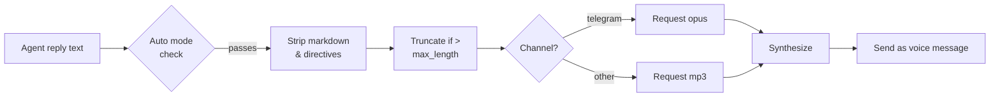
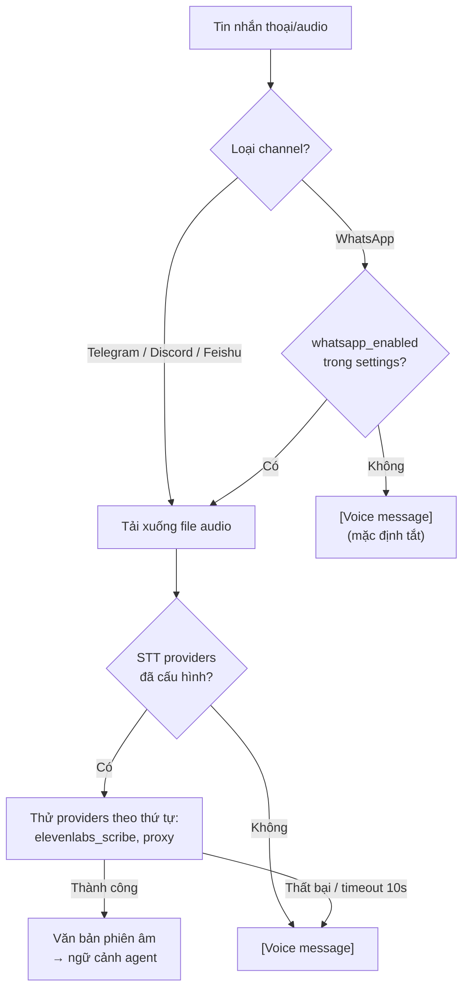

> Bản dịch từ [English version](/tts-voice)

# Chuyển văn bản thành giọng nói

> Thêm trả lời bằng giọng nói cho agent — chọn từ bốn provider và kiểm soát chính xác khi nào audio được phát.

## Tổng quan

Hệ thống TTS của GoClaw chuyển đổi câu trả lời văn bản của agent thành audio và gửi dưới dạng tin nhắn thoại trên các channel được hỗ trợ (ví dụ: voice bubble trên Telegram). Bạn cấu hình provider chính, đặt chế độ tự động, và GoClaw xử lý phần còn lại — loại bỏ markdown, cắt ngắn văn bản dài, và chọn định dạng audio phù hợp cho từng channel.

Bốn provider có sẵn:

| Provider | Key | Yêu cầu |
|----------|-----|---------|
| OpenAI | `openai` | API key |
| ElevenLabs | `elevenlabs` | API key |
| Microsoft Edge TTS | `edge` | CLI `edge-tts` (miễn phí) — luôn khả dụng như fallback |
| MiniMax | `minimax` | API key + Group ID |

---

## Chế độ tự động

Trường `auto` kiểm soát khi nào TTS kích hoạt:

| Chế độ | Khi nào gửi audio |
|------|--------------------|
| `off` | Không bao giờ (mặc định) |
| `always` | Mọi câu trả lời đủ điều kiện |
| `inbound` | Chỉ khi người dùng gửi tin nhắn thoại/audio |
| `tagged` | Chỉ khi câu trả lời chứa `[[tts]]` |

Trường `mode` thu hẹp loại câu trả lời nào đủ điều kiện:

| Giá trị | Hành vi |
|-------|----------|
| `final` | Chỉ câu trả lời cuối cùng (mặc định) |
| `all` | Tất cả câu trả lời kể cả kết quả tool |

Văn bản ngắn hơn 10 ký tự hoặc chứa đường dẫn `MEDIA:` luôn bị bỏ qua. Văn bản dài hơn `max_length` (mặc định 1500) bị cắt ngắn với `...`.

---

## Cài đặt Provider

### OpenAI

```json
{
  "tts": {
    "provider": "openai",
    "auto": "inbound",
    "openai": {
      "api_key": "sk-...",
      "model": "gpt-4o-mini-tts",
      "voice": "alloy"
    }
  }
}
```

Giọng có sẵn: `alloy`, `echo`, `fable`, `onyx`, `nova`, `shimmer`. Model mặc định: `gpt-4o-mini-tts`.

---

### ElevenLabs

```json
{
  "tts": {
    "provider": "elevenlabs",
    "auto": "always",
    "elevenlabs": {
      "api_key": "xi-...",
      "voice_id": "pMsXgVXv3BLzUgSXRplE",
      "model_id": "eleven_multilingual_v2"
    }
  }
}
```

Tìm voice ID trong [thư viện giọng ElevenLabs](https://elevenlabs.io/voice-library) của bạn. Model mặc định: `eleven_multilingual_v2`.

#### Các biến thể model ElevenLabs

| Model ID | Đặc điểm | Phù hợp nhất |
|----------|-----------|-------------|
| `eleven_v3` | Flagship mới nhất (tháng 11/2025), chất lượng cao nhất | Giọng cao cấp, lời nói phức tạp |
| `eleven_multilingual_v2` | Chất lượng cao, 29 ngôn ngữ | Mặc định; nội dung đa ngôn ngữ |
| `eleven_turbo_v2_5` | Tối ưu chi phí, nhanh | Khối lượng lớn, tiết kiệm ngân sách |
| `eleven_flash_v2_5` | Độ trễ thấp nhất, 32 ngôn ngữ | Dùng thời gian thực / tương tác |

Chỉ chấp nhận bốn model ID này — ID không hợp lệ sẽ bị từ chối tại gateway.

---

### Edge TTS (Miễn phí)

Edge TTS sử dụng giọng neural của Microsoft qua CLI Python `edge-tts` — không cần API key.

```bash
pip install edge-tts
```

```json
{
  "tts": {
    "provider": "edge",
    "auto": "tagged",
    "edge": {
      "enabled": true,
      "voice": "en-US-MichelleNeural",
      "rate": "+0%"
    }
  }
}
```

Trường `enabled` trong ví dụ trên là tùy chọn — Edge TTS luôn khả dụng và có thể dùng làm fallback tự động khi provider chính thất bại.

Xem tất cả giọng có sẵn:

```bash
edge-tts --list-voices
```

Giọng phổ biến: `en-US-MichelleNeural`, `en-GB-SoniaNeural`, `vi-VN-HoaiMyNeural`. Trường `rate` điều chỉnh tốc độ (ví dụ: `+20%` nhanh hơn, `-10%` chậm hơn). Đầu ra luôn là MP3.

---

### MiniMax

API T2A của MiniMax hỗ trợ 300+ giọng hệ thống và 40+ ngôn ngữ.

```json
{
  "tts": {
    "provider": "minimax",
    "auto": "always",
    "minimax": {
      "api_key": "...",
      "group_id": "your-group-id",
      "model": "speech-02-hd",
      "voice_id": "Wise_Woman"
    }
  }
}
```

Model: `speech-02-hd` (chất lượng cao), `speech-02-turbo` (nhanh hơn). Định dạng đầu ra được hỗ trợ: `mp3`, `opus`, `pcm`, `flac`, `wav`.

---

## Tham chiếu đầy đủ Config

```json
{
  "tts": {
    "provider": "openai",
    "auto": "inbound",
    "mode": "final",
    "max_length": 1500,
    "timeout_ms": 30000,
    "openai": { "api_key": "sk-...", "voice": "nova" },
    "edge":   { "enabled": true, "voice": "en-US-MichelleNeural" }
  }
}
```

Khi provider chính thất bại, GoClaw tự động thử các provider đã đăng ký khác.

---

## Tích hợp Channel

### Voice Bubble Telegram

Khi channel gốc là `telegram`, GoClaw tự động yêu cầu định dạng `opus` (container Ogg/Opus) thay vì MP3 — Telegram yêu cầu điều này cho tin nhắn thoại. Không cần cấu hình thêm.



### Chế độ Tagged

Thêm `[[tts]]` bất kỳ đâu trong câu trả lời của agent để kích hoạt tổng hợp trong chế độ `tagged`:

```
Here's your daily briefing. [[tts]]
```

---

## Ví dụ

**Thiết lập miễn phí tối giản với Edge TTS:**

```bash
pip install edge-tts
```

```json
{
  "tts": {
    "provider": "edge",
    "auto": "inbound",
    "edge": { "enabled": true, "voice": "en-US-JennyNeural" }
  }
}
```

**OpenAI chính với ElevenLabs dự phòng:**

```json
{
  "tts": {
    "provider": "openai",
    "auto": "always",
    "openai":     { "api_key": "sk-...", "voice": "alloy" },
    "elevenlabs": { "api_key": "xi-...", "voice_id": "pMsXgVXv3BLzUgSXRplE" }
  }
}
```

---

## Cấu hình giọng theo từng Agent

Mỗi agent có thể ghi đè giọng và model TTS toàn cục qua trường `other_config` JSONB. Điều này cho phép các agent khác nhau dùng các giọng khác nhau mà không thay đổi cấu hình toàn hệ thống.

| Key | Kiểu | Mô tả |
|-----|------|-------|
| `tts_voice_id` | string | Voice ID ElevenLabs cho agent này |
| `tts_model_id` | string | Model ID ElevenLabs cho agent này (phải là [model được phép](#các-biến-thể-model-elevenlabs)) |

**Thứ tự ưu tiên:** CLI args → `other_config` agent → override tenant → mặc định provider.

**Ví dụ** — đặt giọng riêng biệt cho từng agent qua Web UI hoặc API:

```json
{
  "other_config": {
    "tts_voice_id": "pMsXgVXv3BLzUgSXRplE",
    "tts_model_id": "eleven_flash_v2_5"
  }
}
```

---

## Voices API

GoClaw cung cấp các HTTP endpoint để khám phá giọng TTS có sẵn. Các endpoint này được phân theo tenant và yêu cầu vai trò admin hoặc operator của tenant.

| Method | Path | Mô tả |
|--------|------|-------|
| `GET` | `/v1/voices` | Danh sách giọng có sẵn (cache trong bộ nhớ, TTL 1 giờ) |
| `POST` | `/v1/voices/refresh` | Buộc xóa cache giọng (chỉ admin) |

### `GET /v1/voices`

Trả về danh sách giọng cho provider ElevenLabs đã cấu hình của tenant hiện tại. Kết quả được cache trong bộ nhớ theo tenant với TTL 1 giờ — dùng chung cho tất cả HTTP và WebSocket handler.

```json
[
  {
    "voice_id": "pMsXgVXv3BLzUgSXRplE",
    "name": "Alice",
    "preview_url": "https://...",
    "category": "premade",
    "labels": {
      "use_case": "conversational",
      "accent": "american"
    }
  }
]
```

Cache miss sẽ kích hoạt lấy dữ liệu ngay lập tức từ ElevenLabs. Trả về `500` nếu provider không tiếp cận được.

### `POST /v1/voices/refresh`

Xóa cache giọng cho tenant hiện tại để lần `GET /v1/voices` tiếp theo lấy danh sách mới từ provider. Hữu ích sau khi thêm giọng vào tài khoản ElevenLabs hoặc sau sự cố CDN hết hạn.

```json
{ "message": "voice cache invalidated" }
```

Phản hồi là `202 Accepted`.

---

## Nhận dạng giọng nói (STT)

GoClaw định tuyến tất cả phiên âm giọng nói/audio qua `audio.Manager` thống nhất với chuỗi provider. Các channel (Telegram, Discord, Feishu, WhatsApp) dùng chung cơ sở hạ tầng STT.

### Luồng phiên âm thống nhất



### Opt-in WhatsApp

STT WhatsApp **tắt theo mặc định** (`whatsapp_enabled: false`). Lý do: tin nhắn thoại WhatsApp được mã hóa đầu cuối. Gửi dữ liệu audio đến provider STT bên ngoài phá vỡ mã hóa E2E. Admin phải bật tường minh tại **Config → Audio → STT** và xác nhận thay đổi này.

Khi tắt (mặc định): tin nhắn thoại xuất hiện trong ngữ cảnh agent dưới dạng `[Voice message]` — không có audio nào rời khỏi thiết bị.
Khi bật: audio được phiên âm qua chuỗi STT đã cấu hình; fallback về `[Voice message]` khi thất bại hoặc timeout (10 giây).

### Chuỗi provider STT

| Cài đặt | Hành vi |
|---------|---------|
| `providers: ["elevenlabs_scribe", "proxy_stt"]` | Thử ElevenLabs Scribe trước; fallback về legacy proxy |
| `providers: []` (rỗng) | Bỏ qua tất cả STT; giọng → `[Voice message]` |
| `providers` thiếu (nil) | Kiểm tra legacy `STTProxyURL` bridge khi khởi động |

Cấu hình qua **Config → Audio → STT** trong giao diện web (lưu trong `builtin_tools[stt].settings.providers`). Khi danh sách này có mặt, nó ghi đè tất cả cấu hình STT riêng theo channel cũ.

---

## Tool STT tích hợp sẵn

Tool `stt` tích hợp sẵn (được seed bởi migration 050) cho phép agent phiên âm giọng nói/audio đầu vào bằng ElevenLabs Scribe hoặc proxy tương thích — xem [Tools Overview](/tools-overview) để biết cách bật và cấu hình.

---

## Các vấn đề thường gặp

| Vấn đề | Nguyên nhân | Giải pháp |
|-------|-------|-----|
| `tts provider not found: edge` | CLI `edge-tts` chưa được cài | `pip install edge-tts` |
| `edge-tts failed` | CLI lỗi khi thực thi | Kiểm tra cài đặt: `edge-tts --list-voices` |
| `all tts providers failed` | Tất cả provider báo lỗi | Kiểm tra API key; xem log gateway |
| Không có giọng nói trong Telegram | `auto` là `off` | Đặt `auto: "inbound"` hoặc `"always"` |
| Giọng phát trên kết quả tool | `mode` là `all` | Đặt `mode: "final"` |
| MiniMax trả về audio trống | Thiếu `group_id` | Thêm `group_id` từ console MiniMax |
| Văn bản bị cắt với `...` | Vượt quá `max_length` | Tăng `max_length` trong config |

---

## Tiếp theo

- [Scheduling & Cron](../advanced/scheduling-cron.md) — kích hoạt agent theo lịch
- [Extended Thinking](../advanced/extended-thinking.md) — suy luận sâu hơn cho câu trả lời phức tạp

<!-- goclaw-source: b9670555 | cập nhật: 2026-04-19 -->
