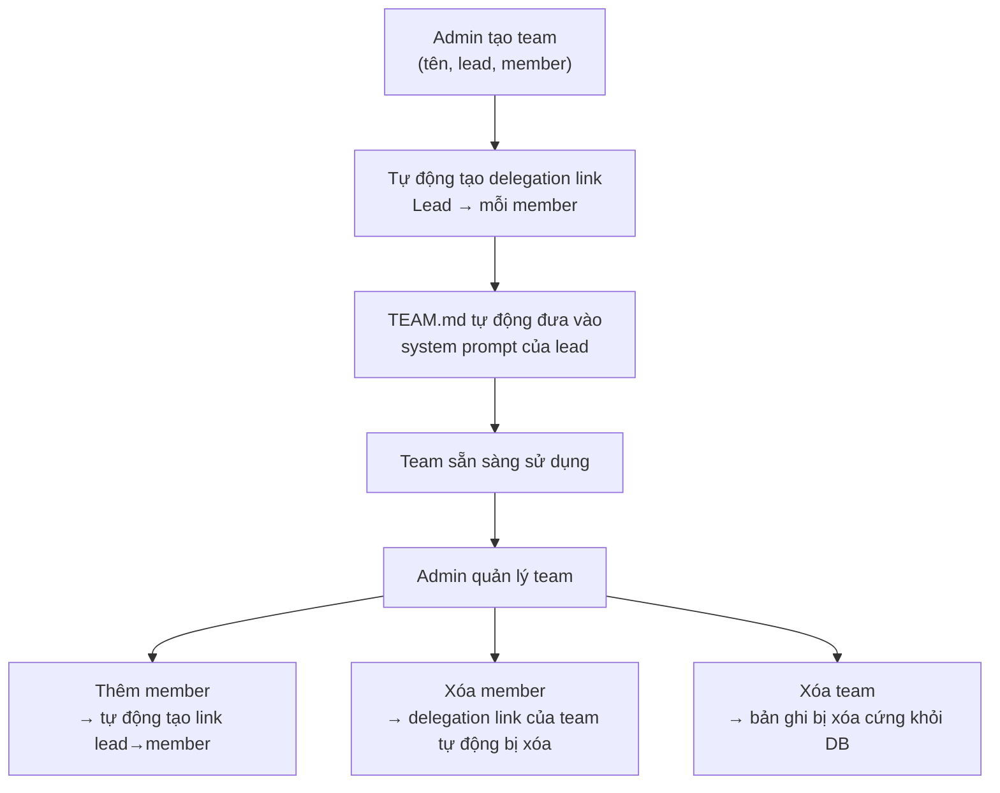

> Bản dịch từ [English version](/teams-creating)

# Tạo & Quản lý Team

Tạo team qua API, Dashboard, hoặc CLI. Hệ thống tự động thiết lập delegation link giữa lead và tất cả member, đưa `TEAM.md` vào system prompt của lead, và kết nối quyền truy cập task board cho tất cả thành viên.

## Bắt đầu Nhanh

**Tạo một team** với lead agent và các member:

```bash
# CLI
./goclaw team create \
  --name "Research Team" \
  --lead researcher_agent \
  --members analyst_agent,writer_agent \
  --description "Parallel research and writing"
```

**Qua WebSocket RPC** (`teams.create`):

```json
{
  "name": "Research Team",
  "lead": "researcher_agent",
  "members": ["analyst_agent", "writer_agent"],
  "description": "Parallel research and writing"
}
```

**Dashboard**: Teams → Create Team → Chọn Lead → Thêm Member → Save

## Điều gì Xảy ra khi Tạo Team

Khi bạn tạo một team, hệ thống sẽ:

1. **Xác thực** lead và member agent tồn tại
2. **Tạo bản ghi team** với `status=active`
3. **Thêm lead làm member** với `role=lead`
4. **Thêm từng member** với `role=member`
5. **Tự động tạo delegation link** từ lead → mỗi member:
   - Hướng: `outbound` (lead có thể delegate cho member)
   - Số delegation đồng thời tối đa mỗi link: `3`
   - Được đánh dấu với `team_id` (hệ thống biết đây là link do team quản lý)
6. **Đưa TEAM.md vào** system prompt của lead với hướng dẫn điều phối đầy đủ
7. **Bật task board** cho tất cả thành viên team

## Vòng đời Team



## Quản lý Thành viên Team

**Thêm một member** (role mặc định là `member`):

```bash
./goclaw team add-member \
  --team-id 550e8400-e29b-41d4-a716-446655440000 \
  --agent analyst_agent \
  --role member

# Khi thêm vào, một delegation link tự động được tạo
# từ lead → member mới
```

**Xóa một member**:

```bash
./goclaw team remove-member \
  --team-id 550e8400-e29b-41d4-a716-446655440000 \
  --agent-id <agent-uuid>

# Delegation link của team được tự động dọn dẹp khi xóa member
```

**Liệt kê thành viên team**:

```bash
./goclaw team list-members --team-id 550e8400-e29b-41d4-a716-446655440000

# Kết quả:
# Agent Key        Role        Display Name
# researcher_agent lead        Research Expert
# analyst_agent    member      Data Analyst
# writer_agent     member      Content Writer
```

## Vai trò Lead và Member

| Khả năng | Lead | Member |
|---------|------|--------|
| Nhận TEAM.md đầy đủ (hướng dẫn điều phối) | Có | Không (khám phá context qua tool) |
| Tạo task trên board | Có | Không |
| Delegate task cho member | Có | Không |
| Thực thi task được giao | Không | Có |
| Báo cáo tiến độ qua task board | Không | Có |
| Gửi/nhận tin nhắn mailbox | Có | Có |
| Quyền spawn / delegate | Có | Không |
| Tự gán task | Không | N/A |

> **Lưu ý**: Lead agent không thể tự gán task cho chính mình. Hành vi này bị chặn để tránh vòng lặp dual-session khi lead vừa là điều phối viên vừa là người thực thi.

Member làm việc trong cấu trúc team. Họ không có khả năng spawn hay delegate — vai trò của họ là thực thi task được giao và báo cáo kết quả.

## Cài đặt Team & Kiểm soát Truy cập

Team hỗ trợ kiểm soát truy cập và cấu hình hành vi chi tiết qua settings JSON:

```json
{
  "allow_user_ids": ["user_123", "user_456"],
  "deny_user_ids": [],
  "allow_channels": ["telegram", "slack"],
  "deny_channels": [],
  "progress_notifications": true,
  "followup_interval_minutes": 30,
  "followup_max_reminders": 3,
  "escalation_mode": "notify_lead",
  "escalation_actions": [],
  "workspace_scope": "isolated",
  "workspace_quota_mb": 500,
  "blocker_escalation": {
    "enabled": true
  }
}
```

**Các trường kiểm soát truy cập**:
- `allow_user_ids`: Chỉ những người dùng này có thể kích hoạt team (rỗng = mở)
- `deny_user_ids`: Chặn những người dùng này (deny được ưu tiên hơn allow)
- `allow_channels`: Chỉ các channel này kích hoạt team (rỗng = mở)
- `deny_channels`: Chặn các channel này

Các system channel (`teammate`, `system`) luôn vượt qua kiểm tra truy cập bất kể cài đặt.

**Các trường follow-up & escalation**:
- `followup_interval_minutes`: Số phút giữa các lần nhắc nhở tự động cho task đang xử lý
- `followup_max_reminders`: Số lần nhắc nhở tối đa cho mỗi task
- `escalation_mode`: Cách xử lý task bị trì hoãn — `"notify_lead"` (gửi thông báo) hoặc `"fail_task"` (tự động fail task)
- `escalation_actions`: Các hành động bổ sung khi escalation

**Blocker escalation**:
- `blocker_escalation.enabled`: Liệu blocker comment có tự động fail task và escalate đến lead không (mặc định: `true`)

Khi `blocker_escalation` được bật (mặc định), nếu member đăng blocker comment trên task, task sẽ tự động bị fail và lead nhận thông báo escalation kèm lý do blocker và hướng dẫn retry. Đặt `enabled: false` để lưu blocker comment mà không kích hoạt auto-fail.

**Các trường workspace**:
- `workspace_scope`: `"isolated"` (mặc định, thư mục riêng theo cuộc hội thoại) hoặc `"shared"` (tất cả member dùng chung một thư mục)
- `workspace_quota_mb`: Hạn mức ổ đĩa cho workspace của team tính bằng megabyte

**Các trường khác**:
- `progress_notifications`: Gửi cập nhật định kỳ trong quá trình delegation bất đồng bộ

**Cập nhật cài đặt team**:

```bash
./goclaw team update \
  --team-id 550e8400-e29b-41d4-a716-446655440000 \
  --settings '{
    "allow_user_ids": ["user_123"],
    "allow_channels": ["telegram"],
    "blocker_escalation": {"enabled": true},
    "escalation_mode": "notify_lead"
  }'
```

## Trạng thái Team

Team có trường `status`:

- `active`: Team đang hoạt động
- `archived`: Team tồn tại nhưng đã tắt

Để xóa hoàn toàn một team, dùng thao tác delete — bản ghi sẽ bị xóa cứng khỏi database. Không có trạng thái `deleted`.

**Thay đổi trạng thái team**:

```bash
./goclaw team update \
  --team-id 550e8400-e29b-41d4-a716-446655440000 \
  --status archived
```

## Thành viên Team trong System Prompt

Khi team đang hoạt động, GoClaw tự động inject phần `## Team Members` vào system prompt của lead agent, liệt kê tất cả các teammate:

```
## Team Members
- agent_key: analyst_agent | display_name: Data Analyst | role: member | expertise: Data analysis and visualization...
- agent_key: writer_agent | display_name: Content Writer | role: member | expertise: Technical writing...
```

Điều này giúp lead giao task cho đúng agent theo key mà không cần đoán. Phần này tự động cập nhật khi thành viên được thêm hoặc xóa.

## Sao chép Media Tự động

Khi task được tạo từ cuộc hội thoại có đính kèm file media (hình ảnh, tài liệu), GoClaw tự động sao chép các file đó vào workspace của team tại `{team_workspace}/attachments/`. Hard link được dùng khi có thể để tiết kiệm tài nguyên, với fallback là copy thông thường. File được xác thực và lưu với quyền hạn chế (0640).

## Đưa TEAM.md vào System Prompt

`TEAM.md` là file ảo được tạo động tại thời điểm agent resolution — không lưu trên ổ đĩa. Nó được inject vào system prompt được bọc trong tag `<system_context>`.

**TEAM.md của Lead** bao gồm:
- Tên và mô tả team
- Danh sách teammate với vai trò và chuyên môn
- **Quy trình bắt buộc**: tạo task trước, sau đó delegate cùng task ID — delegation không có `team_task_id` hợp lệ sẽ bị từ chối
- **Các mẫu điều phối**: tuần tự, lặp, song song, hỗn hợp
- Hướng dẫn giao tiếp

**TEAM.md của Member** bao gồm:
- Tên team và danh sách teammate
- Hướng dẫn tập trung vào công việc được giao
- Cách báo cáo tiến độ qua `team_tasks(action="progress", percent=50, text="...")`
- Các hành động task board có sẵn: `claim`, `complete`, `list`, `get`, `search`, `progress`, `comment`, `attach`, `retry` (không có `create`, `cancel`, `approve`, `reject`)

Context tự động làm mới khi cấu hình team thay đổi (thêm/xóa member, cập nhật settings).

## Tiếp theo

- [Task Board](./task-board.md) — Tạo và quản lý task
- [Team Messaging](./team-messaging.md) — Giao tiếp giữa các member
- [Delegation & Handoff](./delegation-and-handoff.md) — Điều phối công việc

<!-- goclaw-source: 19eef35 | cập nhật: 2026-03-25 -->
