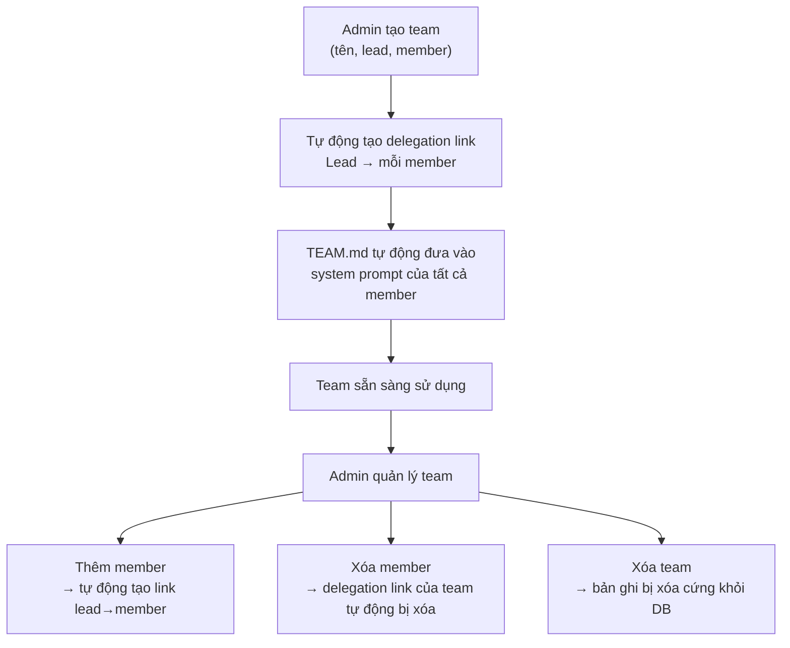

> Bản dịch từ [English version](#teams-creating)

# Tạo & Quản lý Team

Tạo team qua API, Dashboard, hoặc CLI. Hệ thống tự động thiết lập delegation link giữa lead và tất cả member, đưa `TEAM.md` vào system prompt của họ, và kết nối quyền truy cập task board.

## Bắt đầu Nhanh

**Tạo một team** với lead agent và các member:

```bash
# CLI
./goclaw team create \
  --name "Research Team" \
  --lead researcher_agent \
  --members analyst_agent,writer_agent \
  --description "Parallel research and writing"
```

**Qua WebSocket RPC** (`teams.create`):

```json
{
  "name": "Research Team",
  "lead": "researcher_agent",
  "members": ["analyst_agent", "writer_agent"],
  "description": "Parallel research and writing"
}
```

**Dashboard**: Teams → Create Team → Chọn Lead → Thêm Member → Save

## Điều gì Xảy ra khi Tạo Team

Khi bạn tạo một team, hệ thống sẽ:

1. **Xác thực** lead và member agent tồn tại
2. **Tạo bản ghi team** với `status=active`
3. **Thêm lead làm member** với `role=lead`
4. **Thêm từng member** với `role=member` (hoặc `role=reviewer` nếu được chỉ định)
5. **Tự động tạo delegation link** từ lead → mỗi member:
   - Hướng: `outbound` (lead có thể delegate cho member)
   - Số delegation đồng thời tối đa mỗi link: `3`
   - Được đánh dấu với `team_id` (hệ thống biết đây là link do team quản lý)
6. **Đưa TEAM.md vào** system prompt của tất cả member
7. **Bật task board** cho tất cả thành viên team

## Vòng đời Team



## Quản lý Thành viên Team

**Thêm một member** (role mặc định là `member`; có thể dùng `reviewer`):

```bash
./goclaw team add-member \
  --team-id 550e8400-e29b-41d4-a716-446655440000 \
  --agent analyst_agent \
  --role member

# Khi thêm vào, một delegation link tự động được tạo
# từ lead → member mới
```

**Xóa một member**:

```bash
./goclaw team remove-member \
  --team-id 550e8400-e29b-41d4-a716-446655440000 \
  --agent-id <agent-uuid>

# Delegation link của team được tự động dọn dẹp khi xóa member
```

**Liệt kê thành viên team**:

```bash
./goclaw team list-members --team-id 550e8400-e29b-41d4-a716-446655440000

# Kết quả:
# Agent Key        Role        Display Name
# researcher_agent lead        Research Expert
# analyst_agent    member      Data Analyst
# writer_agent     reviewer    Content Reviewer
```

## Cài đặt Team & Kiểm soát Truy cập

Team hỗ trợ kiểm soát truy cập chi tiết qua settings JSON:

```json
{
  "allow_user_ids": ["user_123", "user_456"],
  "deny_user_ids": [],
  "allow_channels": ["telegram", "slack"],
  "deny_channels": [],
  "progress_notifications": true,
  "followup_interval_minutes": 30,
  "followup_max_reminders": 3,
  "escalation_mode": "",
  "escalation_actions": [],
  "workspace_scope": "",
  "workspace_quota_mb": 500
}
```

**Các trường**:
- `allow_user_ids`: Chỉ những người dùng này có thể kích hoạt team (rỗng = mở)
- `deny_user_ids`: Chặn những người dùng này (deny được ưu tiên hơn allow)
- `allow_channels`: Chỉ các channel này kích hoạt team (rỗng = mở)
- `deny_channels`: Chặn các channel này
- `progress_notifications`: Gửi cập nhật định kỳ trong quá trình delegation bất đồng bộ
- `followup_interval_minutes`: Số phút giữa các lần nhắc nhở tự động cho task đang xử lý
- `followup_max_reminders`: Số lần nhắc nhở tối đa cho mỗi task
- `escalation_mode`: Hành vi leo thang khi task bị trì hoãn (tùy chọn)
- `escalation_actions`: Danh sách hành động leo thang (tùy chọn)
- `workspace_scope`: Giới hạn phạm vi cho file workspace chung (tùy chọn)
- `workspace_quota_mb`: Hạn mức ổ đĩa cho workspace của team tính bằng megabyte (tùy chọn)

**Cập nhật cài đặt team**:

```bash
./goclaw team update \
  --team-id 550e8400-e29b-41d4-a716-446655440000 \
  --settings '{
    "allow_user_ids": ["user_123"],
    "allow_channels": ["telegram"]
  }'
```

Các system channel (`delegate`, `system`) luôn vượt qua kiểm tra truy cập.

## Trạng thái Team

Team có trường `status`:

- `active`: Team đang hoạt động
- `archived`: Team tồn tại nhưng đã tắt

Để xóa hoàn toàn một team, dùng thao tác delete — bản ghi sẽ bị xóa cứng khỏi database. Không có trạng thái `deleted`.

**Thay đổi trạng thái team**:

```bash
./goclaw team update \
  --team-id 550e8400-e29b-41d4-a716-446655440000 \
  --status archived
```

## Đưa TEAM.md vào System Prompt

Khi team được tạo hoặc sửa đổi, `TEAM.md` được tạo ra và đưa vào system prompt của các member. Nội dung bao gồm:

**TEAM.md của Lead** bao gồm:
- Tên và mô tả team
- Danh sách teammate với vai trò và chuyên môn
- **Quy trình bắt buộc**: tạo task trước, sau đó delegate cùng task ID
- **Các mẫu điều phối**: tuần tự, lặp, song song, hỗn hợp

**TEAM.md của Member** bao gồm:
- Tên team và danh sách teammate
- Hướng dẫn tập trung vào công việc được giao
- Cách báo cáo tiến độ qua `team_tasks(action="progress", percent=50, text="...")`
- Các hành động task board có sẵn: `claim`, `complete`, `list`, `get`, `search`, `progress`, `comment`, `attach`, `retry` (không có `create`, `cancel`, `approve`, `reject`)

Context được bọc trong tag `<system_context>` và tự động làm mới khi cấu hình team thay đổi.

## Tiếp theo

- [Task Board](#teams-task-board) — Tạo và quản lý task
- [Team Messaging](#teams-messaging) — Giao tiếp giữa các member
- [Delegation & Handoff](#teams-delegation) — Điều phối công việc

<!-- goclaw-source: 57754a5 | cập nhật: 2026-03-18 -->
