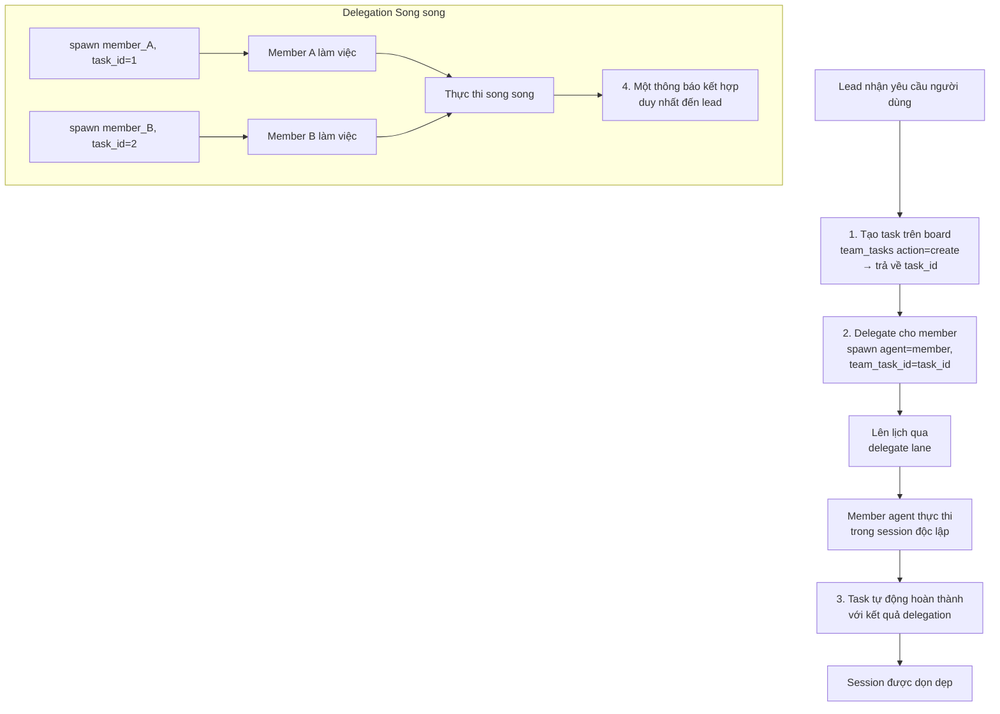

> Bản dịch từ [English version](../../agent-teams/delegation-and-handoff.md)

# Delegation & Handoff

Delegation cho phép lead tạo công việc trên các member agent. Handoff chuyển giao quyền kiểm soát hội thoại giữa các agent mà không làm gián đoạn session của người dùng.

## Luồng Delegation của Agent



## Bắt buộc Liên kết Task

**Mọi delegation phải liên kết với một team task**. Hệ thống bắt buộc điều này:

```json
{
  "action": "spawn",
  "agent": "analyst_agent",
  "task": "Phân tích xu hướng thị trường trong báo cáo Q1",
  "team_task_id": "550e8400-e29b-41d4-a716-446655440000"
}
```

**Nếu thiếu task_id**:
- Delegation bị từ chối kèm thông báo lỗi
- Lỗi bao gồm danh sách task đang chờ để giúp LLM tự sửa
- Lead phải tạo task trước, sau đó thử lại delegation

**Nếu task_id không hợp lệ** hoặc thuộc team khác:
- Delegation bị từ chối
- Thông báo lỗi hữu ích kèm danh sách task hợp lệ

Điều này đảm bảo mọi công việc đều được theo dõi trên task board.

## Delegation Đồng bộ và Bất đồng bộ

### Delegation Đồng bộ (Mặc định)

Parent chờ kết quả trước khi tiếp tục:

```json
{
  "action": "spawn",
  "agent": "analyst_agent",
  "task": "Phân tích nhanh",
  "team_task_id": "550e8400-e29b-41d4-a716-446655440000",
  "mode": "sync"
}
```

- Lead bị chặn cho đến khi member hoàn thành
- Kết quả trả về trực tiếp cho lead
- Phù hợp nhất cho task nhanh (< 2 phút)
- Task tự động nhận và tự động hoàn thành

**Thời gian**: Nếu task mất hơn 30 giây, lead nhận cập nhật tiến độ định kỳ.

### Delegation Bất đồng bộ

Parent tạo công việc nền, nhận delegation ID, và poll kết quả:

```json
{
  "action": "spawn",
  "agent": "analyst_agent",
  "task": "Nghiên cứu sâu về xu hướng thị trường",
  "team_task_id": "550e8400-e29b-41d4-a716-446655440000",
  "mode": "async"
}
```

- Lead nhận delegation ID ngay lập tức
- Lead có thể tiếp tục công việc khác
- Cập nhật tiến độ định kỳ (mỗi 30 giây)
- Kết quả được thông báo khi hoàn thành

**Phản hồi**:
```
Delegation started: d-abc123def456
You will receive progress updates while the agent works.
Task: Nghiên cứu sâu về xu hướng thị trường
Agent: analyst_agent
Status: running
```

## Xử lý Song song Delegation

Khi lead delegate cho nhiều member đồng thời, kết quả được thu thập:

1. Mỗi delegation chạy độc lập trong delegate lane
2. Các kết quả trung gian tích lũy (artifacts)
3. Khi **sibling cuối cùng** hoàn thành, tất cả kết quả được thu thập
4. Một thông báo kết hợp duy nhất được gửi đến lead

**Ví dụ**:

```json
// Lead tạo 2 task và delegate cho 2 member đồng thời
{"action": "create", "subject": "Trích xuất sự kiện"} → task_1
{"action": "create", "subject": "Trích xuất ý kiến"} → task_2

{"action": "spawn", "agent": "analyst1", "team_task_id": "task_1"}
{"action": "spawn", "agent": "analyst2", "team_task_id": "task_2"}

// Kết quả thông báo cùng nhau:
// "analyst1 (trích xuất sự kiện): ..."
// "analyst2 (trích xuất ý kiến): ..."
```

## Tự động Hoàn thành & Artifacts

Khi một delegation kết thúc:

1. Task liên kết được đánh dấu `completed` cùng kết quả delegation
2. Tóm tắt kết quả được lưu trữ
3. Các file media (hình ảnh, tài liệu) được chuyển tiếp
4. Delegation artifacts được lưu với context team
5. Session được dọn dẹp

**Thông báo bao gồm**:
- Kết quả từ từng member agent
- Deliverable và file media
- Thống kê thời gian đã qua
- Hướng dẫn: trình bày kết quả cho người dùng, delegate follow-up, hoặc yêu cầu chỉnh sửa

## Tìm kiếm Delegation

Khi một agent có quá nhiều target để liệt kê tĩnh trong `AGENTS.md` (>15), dùng delegation search:

```json
{
  "action": "delegate_search",
  "query": "phân tích dữ liệu và trực quan hóa",
  "max_results": 5
}
```

**Tìm kiếm trên**:
- Tên và key của agent (full-text search)
- Mô tả agent (full-text search)
- Độ tương đồng ngữ nghĩa (nếu có embedding provider)

**Kết quả**:
```json
{
  "agents": [
    {
      "agent_key": "analyst_agent",
      "agent_name": "Data Analyst",
      "description": "Analyzes data and creates visualizations",
      "can_delegate": true
    }
  ]
}
```

**Tìm kiếm kết hợp**: Sử dụng cả keyword matching (FTS) và semantic embedding để cho kết quả tốt nhất.

## Kiểm soát Truy cập: Agent Link

Mỗi delegation link (lead → member) có thể có kiểm soát truy cập riêng:

```json
{
  "user_allow": ["user_123", "user_456"],
  "user_deny": []
}
```

**Giới hạn đồng thời**:
- Mỗi link: 3 delegation đồng thời từ lead đến một member
- Mỗi agent: tổng cộng 5 delegation đồng thời nhắm vào một member bất kỳ

Khi đạt giới hạn, thông báo lỗi: `"Agent at capacity (5/5). Try a different agent or handle it yourself."`

## Handoff: Chuyển giao Hội thoại

Chuyển quyền kiểm soát hội thoại sang agent khác mà không làm gián đoạn người dùng:

```json
{
  "action": "handoff",
  "agent": "specialist_agent",
  "reason": "Bạn cần chuyên môn chuyên biệt cho phần tiếp theo của yêu cầu",
  "transfer_context": true
}
```

### Điều gì Xảy ra

1. Override routing được thiết lập: tin nhắn tương lai từ người dùng đến agent đích
2. Context hội thoại (tóm tắt) được chuyển cho agent đích
3. Agent đích nhận thông báo handoff kèm context
4. Sự kiện broadcast đến UI
5. Tin nhắn tiếp theo của người dùng định tuyến đến agent mới

### Tham số Handoff

- `action`: `transfer` (mặc định) hoặc `clear`
- `agent`: Key của agent đích (bắt buộc)
- `reason`: Lý do handoff (bắt buộc)
- `transfer_context`: Chuyển tóm tắt hội thoại (mặc định true)

### Hủy Handoff

```json
{
  "action": "clear"
}
```

Tin nhắn sẽ định tuyến về agent mặc định của chat này.

### Nội dung Thông báo Handoff

Thông báo handoff bao gồm:
```
[Handoff from researcher_agent]
Reason: Bạn cần chuyên môn chuyên biệt cho phần tiếp theo của yêu cầu

Conversation context:
[tóm tắt hội thoại gần đây]

Please greet the user and continue the conversation.
```

### Trường hợp Sử dụng

- Câu hỏi của người dùng trở nên chuyên biệt → handoff cho chuyên gia
- Agent đạt capacity → handoff cho instance khác
- Vấn đề phức tạp cần nhiều chuyên môn → handoff sau khi giải quyết một phần
- Chuyển từ nghiên cứu sang triển khai → handoff cho kỹ sư

## Vòng lặp Đánh giá (Generator-Evaluator)

Với công việc lặp đi lặp lại, dùng mẫu evaluate:

```json
{
  "action": "spawn",
  "agent": "generator_agent",
  "task": "Tạo đề xuất ban đầu",
  "team_task_id": "task_1",
  "mode": "async"
}

// Chờ kết quả, sau đó:

{
  "action": "spawn",
  "agent": "evaluator_agent",
  "task": "Xem xét đề xuất và cung cấp phản hồi",
  "team_task_id": "task_2",
  "context": "[kết quả trước từ generator]"
}

// Generator tinh chỉnh dựa trên phản hồi...
```

**Số vòng tối đa**: 5 lần lặp (tránh vòng lặp vô hạn). Sau 5 vòng, hỏi người dùng hướng tiếp theo.

## Cập nhật Tiến độ

Với delegation bất đồng bộ, nhận cập nhật định kỳ:

```
Progress update: analyst_agent still working on task
Task: Nghiên cứu sâu về xu hướng thị trường
Started: 2 minutes ago
Status: running
```

**Khoảng thời gian**: 30 giây (có thể cấu hình qua team settings)

## Thực hành Tốt nhất

1. **Tạo task trước khi delegate**: Task board phải có task trước
2. **Dùng sync cho task nhanh**: < 2 phút
3. **Dùng async cho task dài**: > 2 phút, công việc song song
4. **Gộp công việc song song**: Delegate cho nhiều member đồng thời
5. **Liên kết phụ thuộc**: Dùng `blocked_by` trên task board để phối hợp thứ tự
6. **Xử lý handoff khéo léo**: Thông báo người dùng về việc chuyển giao; truyền context
7. **Đặt số lần lặp tối đa**: Tránh vòng lặp evaluate vô hạn
