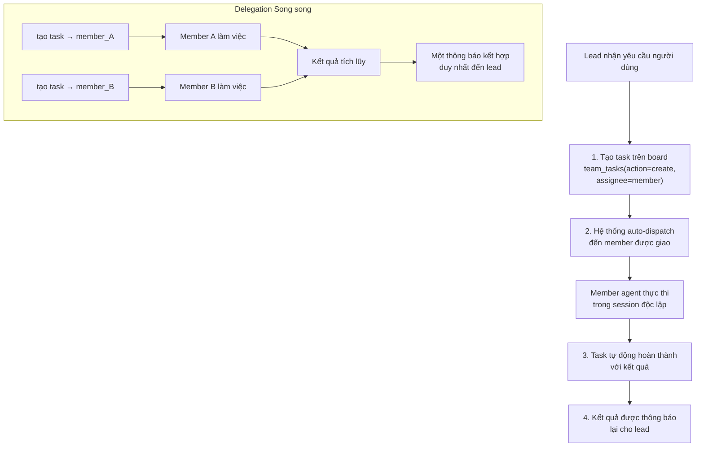

> Bản dịch từ [English version](/teams-delegation)

# Delegation & Handoff

Delegation cho phép lead giao việc cho member agent thông qua task board. Handoff chuyển giao quyền kiểm soát hội thoại giữa các agent mà không làm gián đoạn session của người dùng.

## Luồng Delegation của Agent

Delegation hoạt động thông qua tool `team_tasks` — lead tạo task với assignee, hệ thống tự động dispatch đến member được giao:



> **Lưu ý**: Tool `spawn` chỉ dùng cho **self-clone subagent** — không nhận tham số `agent`. Để delegate cho team member, luôn dùng `team_tasks(action="create", assignee=...)`.

## Tạo Delegation Task

Dùng tool `team_tasks` với `action: "create"` và `assignee` bắt buộc:

```json
{
  "action": "create",
  "subject": "Phân tích xu hướng thị trường trong báo cáo Q1",
  "description": "Tập trung vào dữ liệu doanh thu Q1 và phân tích đối thủ",
  "assignee": "analyst_agent"
}
```

Hệ thống validate và auto-dispatch:
- **`assignee` là bắt buộc** — mỗi task phải được giao cho một team member
- **Assignee phải là team member** — non-member bị từ chối
- **Lead không thể tự giao cho mình** — tránh vòng lặp dual-session
- **Auto-dispatch**: sau khi turn của lead kết thúc, task pending được dispatch đến agent được giao

**Các guard được áp dụng**:
- Tối đa **3 lần dispatch** mỗi task — auto-fail sau 3 lần để tránh vòng lặp vô hạn
- Task dispatch đến lead agent bị chặn và auto-fail
- Member request (non-lead) có thể yêu cầu leader phê duyệt trước khi dispatch

> **Lead V2**: Lead V2 không thể tạo task thủ công trước khi spawn được phát ra trong turn hiện tại. Điều này ngăn việc tạo task sớm làm hỏng luồng điều phối có cấu trúc.

## Delegation Song song

Tạo nhiều task trong cùng một turn — chúng dispatch đồng thời sau turn:

```json
// Lead tạo 2 task trong một turn
{"action": "create", "subject": "Trích xuất sự kiện", "assignee": "analyst1"}
{"action": "create", "subject": "Trích xuất ý kiến", "assignee": "analyst2"}
```

Kết quả được thu thập qua **hàng đợi producer-consumer** (`BatchQueue[T]`) gộp các kết quả hoàn thành lẻ tẻ thành một lần chạy LLM thông báo duy nhất. Lead nhận một tin nhắn kết hợp thay vì bị gián đoạn riêng lẻ theo từng member — giảm đáng kể chi phí token.

## Cải tiến Sub-Agent Song song (#600)

Ngoài delegation cho team member, lead có thể spawn **self-clone subagent** bằng tool `spawn` cho các khối lượng công việc song song không yêu cầu một team member cụ thể:

```json
{"action": "spawn", "task": "Tóm tắt báo cáo PDF", "label": "pdf-summarizer"}
```

Các hành vi chính được giới thiệu trong cải tiến sub-agent song song:

### Delegation Thông minh của Leader

Prompt delegation của leader là **có điều kiện** — chỉ kích hoạt khi tình huống thực sự yêu cầu delegation, thay vì bắt buộc với mọi lần spawn. Điều này tránh lãng phí turn LLM khi phản hồi trực tiếp phù hợp hơn.

### `spawn(action=wait)` — Điều phối WaitAll

Chặn parent cho đến khi tất cả children đã spawn hoàn thành:

```json
{"action": "wait", "timeout": 300}
```

- Turn của parent tạm dừng cho đến khi tất cả subagent đang hoạt động kết thúc (hoặc hết timeout)
- Cho phép các workflow đa bước phối hợp khi lead cần kết quả trước khi tiếp tục
- Timeout mặc định: 300 giây

### Auto-Retry với Linear Backoff

Lỗi LLM của subagent kích hoạt retry tự động. Cấu hình qua `SubagentConfig`:

| Trường | Mặc định | Mô tả |
|-------|---------|-------|
| `MaxRetries` | `2` | Số lần retry tối đa mỗi subagent |
| Backoff | linear | Mỗi lần retry chờ `attempt × 2s` trước khi chạy lại |

### Giới hạn Rate theo Edition

Giới hạn đồng thời theo phạm vi tenant trên struct Edition:

| Giới hạn | Trường | Mô tả |
|---------|-------|-------|
| Subagent đồng thời | `MaxSubagentConcurrent` | Số subagent đồng thời tối đa mỗi tenant |
| Độ sâu spawn | `MaxSubagentDepth` | Độ sâu lồng tối đa (subagent spawn subagent) |

Khi đạt giới hạn, spawn bị từ chối với thông báo lỗi rõ ràng để LLM có thể điều chỉnh.

### Bảng `subagent_tasks` (Migration 34)

Trạng thái subagent task được lưu vào bảng database `subagent_tasks` (migration 000034). Interface `SubagentTaskStore` với implementation PostgreSQL cung cấp:
- Theo dõi task bền vững qua các lần khởi động lại
- Persistence write-through từ `SubagentManager`
- Lưu trữ chi phí token theo từng task

### Theo dõi Chi phí Token

Số token đầu vào và đầu ra mỗi subagent được tích lũy và bao gồm trong:
- Tin nhắn thông báo gửi đến lead
- Bản ghi DB `subagent_tasks` để thanh toán và quan sát

### Persistence Prompt Compaction

Khi context của lead agent được compaction (tóm tắt), trạng thái subagent và team task đang chờ được bảo tồn trong compaction prompt. Tính liên tục công việc được duy trì — lead không mất dấu các task đang thực hiện sau khi tóm tắt.

### Lệnh Telegram

Hai lệnh bot Telegram có sẵn để theo dõi công việc subagent:

| Lệnh | Mô tả |
|------|-------|
| `/subagents` | Liệt kê tất cả subagent task đang hoạt động kèm trạng thái |
| `/subagent <id>` | Hiển thị chi tiết của một subagent task cụ thể từ DB |

### Hạn chế Tool của Subagent

`team_tasks` bị chặn bên trong subagent qua `SubagentDenyAlways`. Subagent không thể tạo team task hoặc thực hiện điều phối team — chỉ lead mới có thể quản lý board của team.

## Tự động Hoàn thành & Artifacts

Khi một delegation kết thúc:

1. Task liên kết được đánh dấu `completed` cùng kết quả delegation
2. Tóm tắt kết quả được lưu trữ
3. Các file media (hình ảnh, tài liệu) được chuyển tiếp
4. Delegation artifacts được lưu với context team
5. Session được dọn dẹp

**Thông báo bao gồm**:
- Kết quả từ từng member agent
- Deliverable và file media
- Thống kê thời gian đã qua
- Hướng dẫn: trình bày kết quả cho người dùng, delegate follow-up, hoặc yêu cầu chỉnh sửa

## Tìm kiếm Delegation

Khi một agent có quá nhiều target để liệt kê tĩnh trong `AGENTS.md` (>15), dùng tool `delegate_search`:

```json
{
  "query": "phân tích dữ liệu và trực quan hóa",
  "max_results": 5
}
```

**Tìm kiếm trên**:
- Tên và key của agent (full-text search)
- Mô tả agent (full-text search)
- Độ tương đồng ngữ nghĩa (nếu có embedding provider)

**Kết quả**:
```json
{
  "agents": [
    {
      "agent_key": "analyst_agent",
      "display_name": "Data Analyst",
      "frontmatter": "Analyzes data and creates visualizations"
    }
  ],
  "count": 1
}
```

**Tìm kiếm kết hợp**: Sử dụng cả keyword matching (FTS) và semantic embedding để cho kết quả tốt nhất.

## Kiểm soát Truy cập: Agent Link

Mỗi delegation link (lead → member) có thể có kiểm soát truy cập riêng:

```json
{
  "user_allow": ["user_123", "user_456"],
  "user_deny": []
}
```

**Giới hạn đồng thời**:
- Mỗi link: có thể cấu hình qua `max_concurrent` trên agent link
- Mỗi agent: mặc định 5 delegation đồng thời nhắm vào một member bất kỳ (có thể cấu hình qua `max_delegation_load` của agent)

Khi đạt giới hạn, thông báo lỗi: `"Agent at capacity. Try a different agent or handle it yourself."`

## Handoff: Chuyển giao Hội thoại

Chuyển quyền kiểm soát hội thoại sang agent khác mà không làm gián đoạn người dùng:

```json
{
  "action": "transfer",
  "agent": "specialist_agent",
  "reason": "Bạn cần chuyên môn chuyên biệt cho phần tiếp theo của yêu cầu",
  "transfer_context": true
}
```

Gọi tool `handoff` với các tham số trên.

### Điều gì Xảy ra

1. Override routing được thiết lập: tin nhắn tương lai từ người dùng đến agent đích
2. Context hội thoại (tóm tắt) được chuyển cho agent đích
3. Agent đích nhận thông báo handoff kèm context
4. Sự kiện broadcast đến UI
5. Tin nhắn tiếp theo của người dùng định tuyến đến agent mới
6. Các file workspace deliverable được sao chép sang workspace team của agent đích

### Tham số Handoff

- `action`: `transfer` (mặc định) hoặc `clear`
- `agent`: Key của agent đích (bắt buộc khi dùng `transfer`)
- `reason`: Lý do handoff (bắt buộc khi dùng `transfer`)
- `transfer_context`: Chuyển tóm tắt hội thoại (mặc định true)

### Hủy Handoff

```json
{
  "action": "clear"
}
```

Tin nhắn sẽ định tuyến về agent mặc định của chat này.

### Nội dung Thông báo Handoff

Thông báo handoff gửi đến agent đích:
```
[Handoff from researcher_agent]
Reason: Bạn cần chuyên môn chuyên biệt cho phần tiếp theo của yêu cầu

Conversation context:
[tóm tắt hội thoại gần đây]

Please greet the user and continue the conversation.
```

### Trường hợp Sử dụng

- Câu hỏi của người dùng trở nên chuyên biệt → handoff cho chuyên gia
- Agent đạt capacity → handoff cho instance khác
- Vấn đề phức tạp cần nhiều chuyên môn → handoff sau khi giải quyết một phần
- Chuyển từ nghiên cứu sang triển khai → handoff cho kỹ sư

## Vòng lặp Đánh giá (Generator-Evaluator)

Với công việc lặp đi lặp lại, dùng mẫu evaluate với task creation:

```json
{"action": "create", "subject": "Tạo đề xuất ban đầu", "assignee": "generator_agent"}

// Chờ kết quả, sau đó:

{"action": "create", "subject": "Xem xét đề xuất và cung cấp phản hồi", "assignee": "evaluator_agent"}

// Generator tinh chỉnh dựa trên phản hồi...
```

**Lưu ý**: Hệ thống không tự động giới hạn số vòng lặp cho mẫu này. Hãy đặt giới hạn trong phần hướng dẫn của lead để tránh vòng lặp vô hạn.

## Cập nhật Tiến độ

Với delegation bất đồng bộ, lead nhận cập nhật nhóm định kỳ (nếu thông báo tiến độ được bật cho team):

```
🏗 Your team is working on it...
- Data Analyst (analyst_agent): 2m15s
- Report Writer (writer_agent): 45s
```

**Khoảng thời gian**: 30 giây. Bật/tắt qua team settings (`progress_notifications`).

## Thực hành Tốt nhất

1. **Dùng `team_tasks` để delegate**: tạo task với `assignee` — hệ thống auto-dispatch
2. **Không dùng `spawn` để delegation**: `spawn` chỉ dùng cho self-clone, không dùng cho team member
3. **Tạo nhiều task trong một turn**: chúng dispatch song song sau turn
4. **Dùng `blocked_by`**: phối hợp thứ tự task với dependency
5. **Dùng `spawn(action=wait)`**: khi lead cần tất cả kết quả trước khi tiếp tục
6. **Xử lý handoff khéo léo**: Thông báo người dùng về việc chuyển giao; truyền context
7. **Đặt giới hạn vòng lặp trong hướng dẫn**: Tránh vòng lặp evaluate vô hạn

<!-- goclaw-source: 050aafc9 | updated: 2026-04-09 -->
