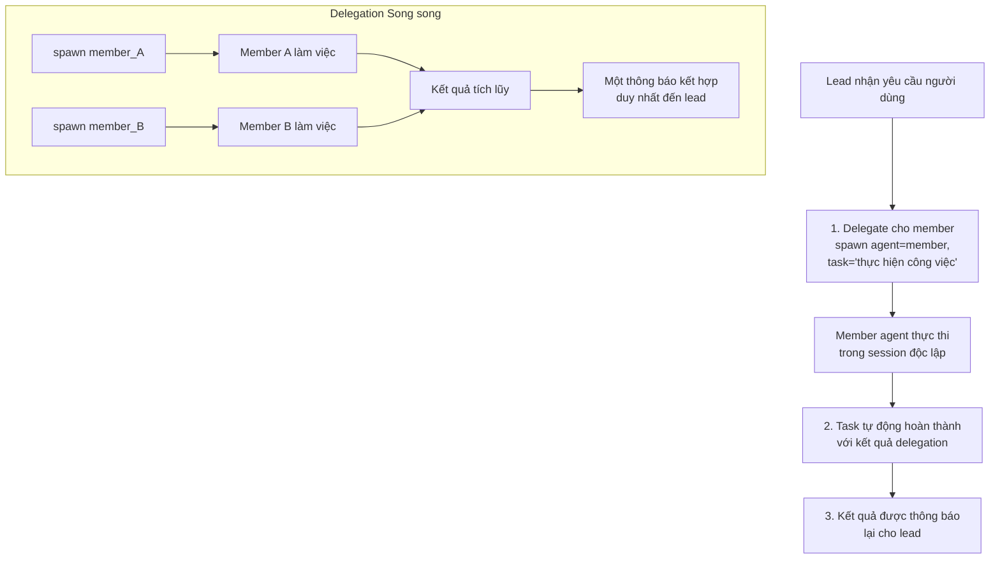

> Bản dịch từ [English version](#teams-delegation)

# Delegation & Handoff

Delegation cho phép lead tạo công việc trên các member agent. Handoff chuyển giao quyền kiểm soát hội thoại giữa các agent mà không làm gián đoạn session của người dùng.

## Luồng Delegation của Agent



## Liên kết Task

Delegation có thể tùy chọn liên kết với một team task qua `team_task_id`. Với v2 teams, **nếu bỏ qua `team_task_id`, hệ thống tự động tạo task** — bạn không cần bước tạo riêng:

```json
{
  "action": "spawn",
  "agent": "analyst_agent",
  "task": "Phân tích xu hướng thị trường trong báo cáo Q1"
}
```

Hệ thống tự tạo task và liên kết delegation. Bạn cũng có thể cung cấp task ID cụ thể:

```json
{
  "action": "spawn",
  "agent": "analyst_agent",
  "task": "Phân tích xu hướng thị trường trong báo cáo Q1",
  "team_task_id": "550e8400-e29b-41d4-a716-446655440000"
}
```

**Nếu `team_task_id` không hợp lệ** hoặc thuộc team khác:
- Delegation bị từ chối kèm thông báo lỗi hữu ích
- Lỗi bao gồm hướng dẫn bỏ qua `team_task_id` để hệ thống tự tạo

**Các guard được áp dụng**:
- Không thể tái sử dụng task ID đã completed hoặc cancelled
- Không thể tái sử dụng task ID đang in-progress (mỗi spawn cần task riêng)

Điều này đảm bảo mọi công việc đều được theo dõi trên task board.

## Delegation Đồng bộ và Bất đồng bộ

### Delegation Đồng bộ (Mặc định)

Parent chờ kết quả trước khi tiếp tục:

```json
{
  "action": "spawn",
  "agent": "analyst_agent",
  "task": "Phân tích nhanh",
  "team_task_id": "550e8400-e29b-41d4-a716-446655440000",
  "mode": "sync"
}
```

- Lead bị chặn cho đến khi member hoàn thành
- Kết quả trả về trực tiếp cho lead
- Phù hợp nhất cho task nhanh (< 2 phút)
- Task tự động nhận và tự động hoàn thành khi thành công

### Delegation Bất đồng bộ

Parent tạo công việc nền và nhận kết quả qua thông báo hệ thống khi hoàn thành:

```json
{
  "action": "spawn",
  "agent": "analyst_agent",
  "task": "Nghiên cứu sâu về xu hướng thị trường",
  "team_task_id": "550e8400-e29b-41d4-a716-446655440000",
  "mode": "async"
}
```

- Lead nhận delegation ID ngay lập tức
- Lead có thể tiếp tục công việc khác
- Thông báo tiến độ định kỳ gửi đến chat (mỗi 30 giây, nếu được bật)
- Kết quả được thông báo khi hoàn thành qua tin nhắn hệ thống đến lead

**Phản hồi** (delegation ID để theo dõi):
```json
{
  "delegation_id": "abc123def456",
  "team_task_id": "550e8400-e29b-41d4-a716-446655440000"
}
```

## Xử lý Song song Delegation

Khi lead delegate cho nhiều member đồng thời, kết quả được thu thập và thông báo cùng nhau:

1. Mỗi delegation chạy độc lập
2. Các kết quả trung gian tích lũy (artifacts)
3. Khi **sibling cuối cùng** hoàn thành, tất cả kết quả được thu thập
4. Một thông báo kết hợp duy nhất được gửi đến lead

**Ví dụ**:

```json
// Lead delegate cho 2 member đồng thời
{"action": "spawn", "agent": "analyst1", "task": "Trích xuất sự kiện"}
{"action": "spawn", "agent": "analyst2", "task": "Trích xuất ý kiến"}

// Kết quả thông báo cùng nhau:
// "analyst1 (trích xuất sự kiện): ..."
// "analyst2 (trích xuất ý kiến): ..."
```

## Tự động Hoàn thành & Artifacts

Khi một delegation kết thúc:

1. Task liên kết được đánh dấu `completed` cùng kết quả delegation
2. Tóm tắt kết quả được lưu trữ
3. Các file media (hình ảnh, tài liệu) được chuyển tiếp
4. Delegation artifacts được lưu với context team
5. Session được dọn dẹp

**Thông báo bao gồm**:
- Kết quả từ từng member agent
- Deliverable và file media
- Thống kê thời gian đã qua
- Hướng dẫn: trình bày kết quả cho người dùng, delegate follow-up, hoặc yêu cầu chỉnh sửa

## Tìm kiếm Delegation

Khi một agent có quá nhiều target để liệt kê tĩnh trong `AGENTS.md` (>15), dùng tool `delegate_search`:

```json
{
  "query": "phân tích dữ liệu và trực quan hóa",
  "max_results": 5
}
```

Gọi tool `delegate_search` với các tham số trên.

**Tìm kiếm trên**:
- Tên và key của agent (full-text search)
- Mô tả agent (full-text search)
- Độ tương đồng ngữ nghĩa (nếu có embedding provider)

**Kết quả**:
```json
{
  "agents": [
    {
      "agent_key": "analyst_agent",
      "display_name": "Data Analyst",
      "frontmatter": "Analyzes data and creates visualizations"
    }
  ],
  "count": 1
}
```

**Tìm kiếm kết hợp**: Sử dụng cả keyword matching (FTS) và semantic embedding để cho kết quả tốt nhất.

## Kiểm soát Truy cập: Agent Link

Mỗi delegation link (lead → member) có thể có kiểm soát truy cập riêng:

```json
{
  "user_allow": ["user_123", "user_456"],
  "user_deny": []
}
```

**Giới hạn đồng thời**:
- Mỗi link: có thể cấu hình qua `max_concurrent` trên agent link
- Mỗi agent: mặc định 5 delegation đồng thời nhắm vào một member bất kỳ (có thể cấu hình qua `max_delegation_load` của agent)

Khi đạt giới hạn, thông báo lỗi: `"Agent at capacity. Try a different agent or handle it yourself."`

## Handoff: Chuyển giao Hội thoại

Chuyển quyền kiểm soát hội thoại sang agent khác mà không làm gián đoạn người dùng:

```json
{
  "action": "transfer",
  "agent": "specialist_agent",
  "reason": "Bạn cần chuyên môn chuyên biệt cho phần tiếp theo của yêu cầu",
  "transfer_context": true
}
```

Gọi tool `handoff` với các tham số trên.

### Điều gì Xảy ra

1. Override routing được thiết lập: tin nhắn tương lai từ người dùng đến agent đích
2. Context hội thoại (tóm tắt) được chuyển cho agent đích
3. Agent đích nhận thông báo handoff kèm context
4. Sự kiện broadcast đến UI
5. Tin nhắn tiếp theo của người dùng định tuyến đến agent mới
6. Các file workspace deliverable được sao chép sang workspace team của agent đích

### Tham số Handoff

- `action`: `transfer` (mặc định) hoặc `clear`
- `agent`: Key của agent đích (bắt buộc khi dùng `transfer`)
- `reason`: Lý do handoff (bắt buộc khi dùng `transfer`)
- `transfer_context`: Chuyển tóm tắt hội thoại (mặc định true)

### Hủy Handoff

```json
{
  "action": "clear"
}
```

Tin nhắn sẽ định tuyến về agent mặc định của chat này.

### Nội dung Thông báo Handoff

Thông báo handoff gửi đến agent đích:
```
[Handoff from researcher_agent]
Reason: Bạn cần chuyên môn chuyên biệt cho phần tiếp theo của yêu cầu

Conversation context:
[tóm tắt hội thoại gần đây]

Please greet the user and continue the conversation.
```

### Trường hợp Sử dụng

- Câu hỏi của người dùng trở nên chuyên biệt → handoff cho chuyên gia
- Agent đạt capacity → handoff cho instance khác
- Vấn đề phức tạp cần nhiều chuyên môn → handoff sau khi giải quyết một phần
- Chuyển từ nghiên cứu sang triển khai → handoff cho kỹ sư

## Vòng lặp Đánh giá (Generator-Evaluator)

Với công việc lặp đi lặp lại, dùng mẫu evaluate:

```json
{
  "action": "spawn",
  "agent": "generator_agent",
  "task": "Tạo đề xuất ban đầu",
  "mode": "async"
}

// Chờ kết quả, sau đó:

{
  "action": "spawn",
  "agent": "evaluator_agent",
  "task": "Xem xét đề xuất và cung cấp phản hồi",
  "context": "[kết quả trước từ generator]"
}

// Generator tinh chỉnh dựa trên phản hồi...
```

**Lưu ý**: Hệ thống không tự động giới hạn số vòng lặp cho mẫu này. Hãy đặt giới hạn trong phần hướng dẫn của lead để tránh vòng lặp vô hạn.

## Cập nhật Tiến độ

Với delegation bất đồng bộ, lead nhận cập nhật nhóm định kỳ (nếu thông báo tiến độ được bật cho team):

```
🏗 Your team is working on it...
- Data Analyst (analyst_agent): 2m15s
- Report Writer (writer_agent): 45s
```

**Khoảng thời gian**: 30 giây. Bật/tắt qua team settings (`progress_notifications`).

## Thực hành Tốt nhất

1. **Bỏ qua `team_task_id` để đơn giản hóa**: v2 teams tự tạo task khi delegation
2. **Dùng sync cho task nhanh**: < 2 phút
3. **Dùng async cho task dài**: > 2 phút, công việc song song
4. **Gộp công việc song song**: Delegate cho nhiều member đồng thời
5. **Liên kết phụ thuộc**: Dùng `blocked_by` trên task board để phối hợp thứ tự
6. **Xử lý handoff khéo léo**: Thông báo người dùng về việc chuyển giao; truyền context
7. **Đặt giới hạn vòng lặp trong hướng dẫn**: Tránh vòng lặp evaluate vô hạn

<!-- goclaw-source: 57754a5 | cập nhật: 2026-03-18 -->
