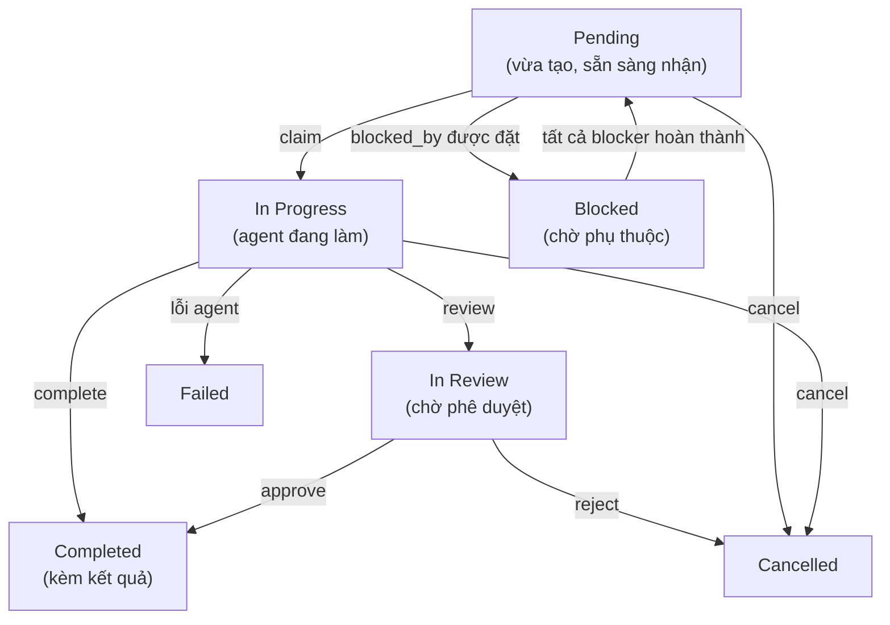
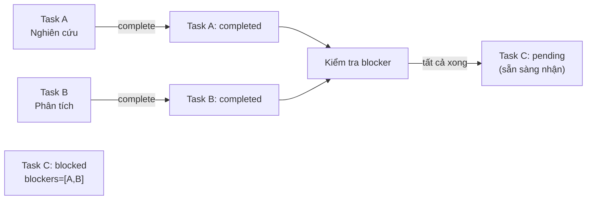

> Bản dịch từ [English version](#teams-task-board)

# Task Board

Task board là công cụ theo dõi công việc chung mà tất cả thành viên team đều có thể truy cập. Task có thể được tạo với mức độ ưu tiên, phụ thuộc, và ràng buộc blocking. Member nhận task đang chờ, làm việc độc lập, và đánh dấu hoàn thành kèm kết quả.

## Vòng đời Task



## Tool Cốt lõi: `team_tasks`

Tất cả thành viên team truy cập task board qua tool `team_tasks`. Các hành động có sẵn:

| Hành động | Tham số bắt buộc | Mô tả |
|--------|-----------------|-------------|
| `list` | `action` | Hiển thị task đang hoạt động (phân trang: tối đa 20) |
| `get` | `action`, `task_id` | Lấy chi tiết đầy đủ của task kèm comment, sự kiện, tệp đính kèm (kết quả: giới hạn 8.000 ký tự) |
| `create` | `action`, `subject` | Tạo task mới (chỉ lead); tùy chọn: `description`, `priority`, `blocked_by`, `require_approval` |
| `claim` | `action`, `task_id` | Nhận task đang chờ theo kiểu atomic |
| `complete` | `action`, `task_id`, `result` | Đánh dấu task hoàn thành kèm tóm tắt kết quả |
| `cancel` | `action`, `task_id` | Hủy task (chỉ lead); tùy chọn: `text` (lý do) |
| `search` | `action`, `query` | Tìm kiếm full-text trên subject + description |

> **Hành động Team v2** (yêu cầu phiên bản team 2):

| Hành động | Tham số bắt buộc | Mô tả |
|--------|-----------------|-------------|
| `review` | `action`, `task_id` | Gửi task đang xử lý để review (chỉ owner) |
| `approve` | `action`, `task_id` | Phê duyệt task đang review (chỉ lead) |
| `reject` | `action`, `task_id` | Từ chối task đang review (chỉ lead); tùy chọn: `text` (lý do) |
| `comment` | `action`, `task_id`, `text` | Thêm bình luận vào task |
| `progress` | `action`, `task_id`, `percent` | Cập nhật tiến độ 0-100 (chỉ owner); tùy chọn: `text` (mô tả bước) |
| `update` | `action`, `task_id` | Cập nhật subject hoặc description của task (chỉ lead) |
| `attach` | `action`, `task_id`, `file_id` | Đính kèm file workspace vào task |
| `await_reply` | `action`, `task_id`, `text` | Đặt nhắc nhở follow-up (chỉ owner) |
| `clear_followup` | `action`, `task_id` | Xóa nhắc nhở follow-up (owner hoặc lead) |

## Tạo Task

**Lead tạo task** cho member thực hiện:

```json
{
  "action": "create",
  "subject": "Trích xuất điểm chính từ bài nghiên cứu",
  "description": "Đọc PDF và tóm tắt các phát hiện chính dưới dạng bullet point",
  "priority": 10,
  "blocked_by": []
}
```

**Phản hồi**:
```
Task created: Trích xuất điểm chính từ bài nghiên cứu (id=<uuid>, identifier=TSK-1, status=pending)
```

Trường `identifier` (ví dụ: `TSK-1`) là tham chiếu ngắn dễ đọc được tạo từ tiền tố tên team và số thứ tự task.

**Với phụ thuộc** (blocked_by):

```json
{
  "action": "create",
  "subject": "Viết tóm tắt",
  "priority": 5,
  "blocked_by": ["<first-task-uuid>"]
}
```

Task này giữ trạng thái `blocked` cho đến khi task đầu tiên `completed`. Khi bạn hoàn thành blocker, task này tự động chuyển sang `pending` và có thể nhận.

**Với yêu cầu phê duyệt** (require_approval):

```json
{
  "action": "create",
  "subject": "Deploy lên production",
  "require_approval": true
}
```

Task bắt đầu ở trạng thái `in_review` và phải được phê duyệt trước khi trở thành `pending`.

## Nhận & Hoàn thành Task

**Member nhận task đang chờ**:

```json
{
  "action": "claim",
  "task_id": "550e8400-e29b-41d4-a716-446655440000"
}
```

**Nhận theo kiểu atomic**: Database đảm bảo chỉ một agent thành công. Nếu hai agent cùng nhận một task, một nhận được `claimed successfully`; agent kia nhận `failed to claim task` (người khác đã nhanh hơn).

**Member hoàn thành task**:

```json
{
  "action": "complete",
  "task_id": "550e8400-e29b-41d4-a716-446655440000",
  "result": "Đã trích xuất 12 phát hiện chính:\n1. Giả thuyết chính được xác nhận\n2. Dữ liệu cho thấy..."
}
```

**Tự động nhận**: Bạn có thể bỏ qua bước claim. Gọi `complete` trên task đang chờ sẽ tự động nhận nó (một API call thay vì hai).

> **Lưu ý**: Delegate agent không thể gọi `complete` trực tiếp — kết quả của chúng được tự động hoàn thành khi delegation kết thúc.

## Phụ thuộc Task & Tự động Mở khóa

Khi bạn tạo task với `blocked_by: [task_A, task_B]`:
- Trạng thái task được đặt là `blocked`
- Task không thể nhận được
- Khi **tất cả** blocker đều `completed`, task tự động chuyển sang `pending`
- Member được thông báo task đã sẵn sàng



## Liệt kê & Tìm kiếm

**Liệt kê task đang hoạt động** (mặc định):

```json
{
  "action": "list"
}
```

**Phản hồi**:
```json
{
  "tasks": [
    {
      "id": "550e8400-e29b-41d4-a716-446655440000",
      "subject": "Trích xuất điểm chính",
      "description": "Đọc PDF và tóm tắt...",
      "status": "pending",
      "priority": 10,
      "owner_agent_id": null,
      "created_at": "2025-03-08T10:00:00Z"
    }
  ],
  "count": 1
}
```

**Lọc theo trạng thái**:

```json
{
  "action": "list",
  "status": "all"
}
```

Các giá trị `status` hợp lệ:

| Giá trị | Trả về |
|---------|--------|
| `""` (mặc định) | Task đang hoạt động: pending, in_progress, blocked |
| `"completed"` | Task đã hoàn thành và đã hủy |
| `"in_review"` | Task đang chờ phê duyệt |
| `"all"` | Tất cả task bất kể trạng thái |

**Tìm kiếm** task cụ thể:

```json
{
  "action": "search",
  "query": "bài nghiên cứu"
}
```

Kết quả hiển thị snippet (tối đa 500 ký tự) của kết quả đầy đủ. Dùng `action=get` để xem kết quả hoàn chỉnh.

## Ưu tiên & Sắp xếp

Task được sắp xếp theo priority (cao nhất trước), sau đó theo thời gian tạo. Priority cao hơn = được đẩy lên đầu danh sách:

```json
{
  "action": "create",
  "subject": "Cần sửa gấp",
  "priority": 100
}
```

## Phạm vi Người dùng

Quyền truy cập khác nhau theo channel:

- **Delegate/system channel**: Xem tất cả task của team
- **End user**: Chỉ xem task mà họ kích hoạt (lọc theo user ID)

Kết quả bị cắt ngắn:
- `action=list`: Kết quả không hiển thị (dùng `get` để xem đầy đủ)
- `action=get`: Tối đa 8.000 ký tự
- `action=search`: Snippet 500 ký tự

## Xem Chi tiết Đầy đủ của Task

```json
{
  "action": "get",
  "task_id": "550e8400-e29b-41d4-a716-446655440000"
}
```

**Phản hồi** bao gồm:
- Toàn bộ metadata của task (bao gồm `identifier`, `task_number`, `progress_percent`)
- Văn bản kết quả đầy đủ (cắt ngắn ở 8.000 ký tự nếu cần)
- Key của agent sở hữu
- Timestamps
- Comment, sự kiện kiểm toán và tệp đính kèm (nếu có)

## Hủy Task

**Lead hủy task**:

```json
{
  "action": "cancel",
  "task_id": "550e8400-e29b-41d4-a716-446655440000",
  "text": "Yêu cầu người dùng đã thay đổi, không còn cần thiết"
}
```

Lưu ý: lý do hủy được truyền qua tham số `text` (không phải `reason`).

**Điều gì xảy ra**:
- Trạng thái task → `cancelled`
- Nếu có delegation đang chạy cho task này, nó bị dừng ngay lập tức
- Các task phụ thuộc (có `blocked_by` trỏ đến đây) được mở khóa

## Thực hành Tốt nhất

1. **Tạo task trước**: Luôn tạo task trước khi delegate công việc (chỉ lead)
2. **Dùng priority**: Đặt priority theo mức độ khẩn cấp (100 = khẩn cấp, 10 = cao, 0 = bình thường)
3. **Thêm phụ thuộc**: Liên kết các task liên quan với `blocked_by` để đảm bảo thứ tự
4. **Thêm context**: Viết mô tả rõ ràng để member biết cần làm gì
5. **Kiểm tra trước khi nhận**: Dùng `list` để xem có gì trước khi claim

<!-- goclaw-source: 57754a5 | cập nhật: 2026-03-18 -->
